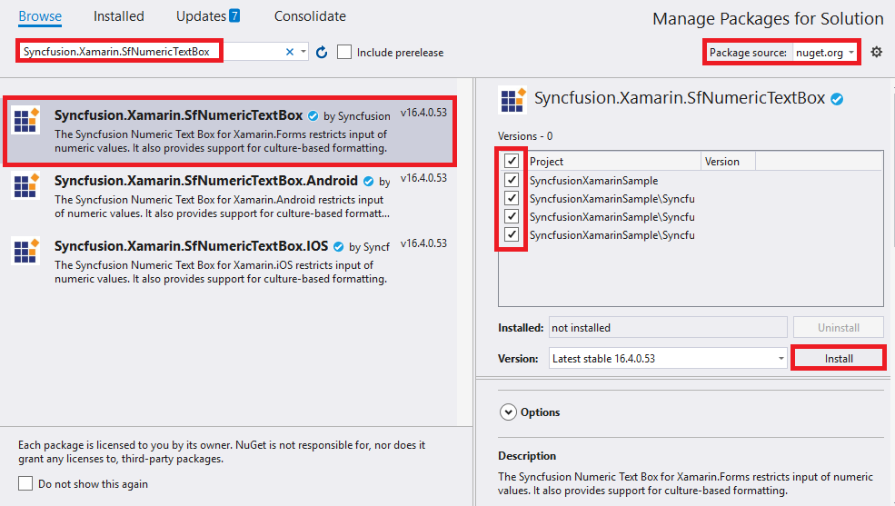

# Getting Started with Xamarin.Forms SfNumericTextBox

This section explains you the steps to configure a SfNumericTextBox control in a real-time scenario and also provides a walk-through on some of the customization features available in SfNumericTextBox control.

## Assembly deployment

After installing [Essential Studio for Xamarin](https://www.syncfusion.com/downloads/xamarin), you can find all the required assemblies in the installation folders, {Syncfusion Essential Studio Installed location} \Essential Studio\\{Version #}\Xamarin\lib.

E.g.: C:\Program Files (x86) \Syncfusion\Essential Studio\19.1.0.54\Xamarin\lib

N> Assemblies can be found in unzipped package location(Documents/Syncfusion/{Version #}/Xamarin/lib) in Mac.

## Adding SfNumericTextBox reference

You can add SfNumericTextBox reference using one of the following methods:

**Method 1: Adding SfNumericTextBox reference from nuget.org**

Syncfusion Xamarin components are available in [nuget.org](https://www.nuget.org/). To add SfNumericTextBox to your project, open the NuGet package manager in Visual Studio, search for [Syncfusion.Xamarin.SfNumericTextBox](https://www.nuget.org/packages/Syncfusion.Xamarin.SfNumericTextBox), and then install it.

N> Install the same version of SfNumericTextBox NuGet in all the projects.

**Method 2: Adding SfNumericTextBox reference from toolbox**

Syncfusion also provides Xamarin Toolbox. Using this toolbox, you can drag the SfNumericTextBox control to the XAML page. It will automatically install the required NuGet packages and add the namespace to the page. To install Syncfusion Xamarin Toolbox, refer to [Toolbox](https://help.syncfusion.com/xamarin/utility#toolbox).

**Method 3: Adding SfNumericTextBox assemblies manually from the installed location**

If you prefer to manually reference the assemblies instead referencing from NuGet, add the following assemblies in respective projects.

Location: {Installed location}/{version}/Xamarin/lib

<table>
<tr>
<td>PCL</td>
<td>Syncfusion.SfNumericTextBox.XForms.dll Syncfusion.Core.XForms.dll Syncfusion.Licensing.dll </td>
</tr>
<tr>
<td>Android</td>
<td>Syncfusion.SfNumericTextBox.Android.dll Syncfusion.SfNumericTextBox.XForms.Android.dll Syncfusion.SfNumericTextBox.XForms.dll Syncfusion.Core.XForms.dll Syncfusion.Core.XForms.Android.dll Syncfusion.Licensing.dll </td>
</tr>
<tr>
<td>iOS</td>
<td>Syncfusion.SfNumericTextBox.iOS.dll Syncfusion.SfNumericTextBox.XForms.iOS.dll Syncfusion.SfNumericTextBox.XForms.dll Syncfusion.Core.XForms.dll Syncfusion.Core.XForms.iOS.dll Syncfusion.Licensing.dll </td>
</tr>
<tr>
<td>UWP</td>
<td>Syncfusion.SfInput.UWP.dll Syncfusion.SfShared.UWP.dll Syncfusion.SfNumericTextBox.XForms.UWP.dll Syncfusion.SfNumericTextBox.XForms.dll Syncfusion.Core.XForms.dll Syncfusion.Core.XForms.UWP.dll Syncfusion.Licensing.dll </td>
</tr>
</table>

N> To know more about obtaining our components, refer to these links for [Mac](https://help.syncfusion.com/xamarin/introduction/download-and-installation/mac/) and [Windows](https://help.syncfusion.com/xamarin/introduction/download-and-installation/windows/).

I> Starting with v16.2.0.x, if you reference Syncfusion assemblies from the trial setup or from the NuGet feed, you also have to include a license key in your projects. Please refer to [Syncfusion license key](https://help.syncfusion.com/common/essential-studio/licensing/license-key/) to know about registering Syncfusion license key in your Xamarin application to use our components.

## Launching the SfNumericTextBox on each platform

To use SfNumericTextBox inside an application, each platform application must initialize the SfNumericTextBox renderer. This initialization step varies from platform to platform and is discussed in the following sections.

N> If you are adding the references from toolbox, below steps are not needed.

### Android and  UWP

The Android and UWP launches the SfNumericTextBox without any initialization and is enough to only initialize the Xamarin.Forms Framework to launch the application

### iOS

To launch SfNumericTextBox in iOS, need to create an instance of SfNumericTextBoxRenderer in FinishedLaunching overridden method of AppDelegate class in iOS Project as shown below.



public override bool FinishedLaunching(UIApplication app, NSDictionary options)
{
	global::Xamarin.Forms.Forms.Init();

	new SfNumericTextBoxRenderer();

	LoadApplication(new App());

	return base.FinishedLaunching(app, options);
}



### ReleaseMode issue in UWP platform

There is a known Framework issue in UWP platform. The custom controls will not render when deployed the application in Release Mode.

The above problem can be resolved by initializing the SfNumericTextBox assemblies in Main.xaml.cs in UWP project as like in below code snippet.



// In App.xaml.cs

protected override void OnLaunched(LaunchActivatedEventArgs e)
{
…

	rootFrame.NavigationFailed += OnNavigationFailed;
		
	// you'll need to add `using System.Reflection;`
	List<Assembly> assembliesToInclude = new List<Assembly>();

	//Now, add all the assemblies your app uses
	assembliesToInclude.Add(typeof(SfNumericTextBoxRenderer).GetTypeInfo().Assembly);

	// replaces Xamarin.Forms.Forms.Init(e);        
	Xamarin.Forms.Forms.Init(e, assembliesToInclude);
		
…     



## Create a Simple SfNumericTextBox 

The SfNumericTextBox control is configured entirely in C# code or by using XAML markup. The following steps explain on how to create a SfNumericTextBox and configure its elements,

* Adding namespace for the added assemblies. 





	xmlns:syncfusion="clr-namespace:Syncfusion.SfNumericTextBox.XForms;assembly=Syncfusion.SfNumericTextBox.XForms"





	using Syncfusion.SfNumericTextBox.XForms;





* Now add the SfNumericTextBox control with a required optimal name by using the included namespace.





<?xml version="1.0" encoding="utf-8"?>
<ContentPage xmlns="http://xamarin.com/schemas/2014/forms" xmlns:x="http://schemas.microsoft.com/winfx/2009/xaml" xmlns:local="clr-namespace:GettingStarted" 
		xmlns:syncfusion="clr-namespace:Syncfusion.SfNumericTextBox.XForms;assembly=Syncfusion.SfNumericTextBox.XForms"
		x:Class="GettingStarted.NumericControlPage">
  <ContentPage.Content>
     <syncfusion:SfNumericTextBox x:Name="numericTextBox" />	
	</ContentPage.Content>
	
</ContentPage>





using Syncfusion.SfNumericTextBox.XForms;
using Xamarin.Forms;

namespace GettingStarted
{
public partial class NumericControlPage : ContentPage
    {
        public NumericControlPage()
        {
            InitializeComponent();

            SfNumericTextBox numericTextBox = new SfNumericTextBox();
            this.Content = numericTextBox;
        }
    }
}





## Display Customization

### Setting and Reading Value

`Value` property is used to set and read the value presented by the SfNumericTextBox. 





	<syncfusion:SfNumericTextBox x:Name="numericTextBox" Value="123.45" />
	




SfNumericTextBox numericTextBox=new SfNumericTextBox();
numericTextBox.Value = 123.45;
this.Content = numericTextBox;





## Restrict editing

You can restrict the dynamic editing of the numeric entry using the [`IsReadOnly`](https://help.syncfusion.com/cr/xamarin/Syncfusion.SfNumericTextBox.XForms.SfNumericTextBox.html#Syncfusion_SfNumericTextBox_XForms_SfNumericTextBox_IsReadOnly) property. But you can change the control text programmatically by using the bindable  [`Value`](https://help.syncfusion.com/cr/xamarin/Syncfusion.SfNumericTextBox.XForms.SfNumericTextBox.html#Syncfusion_SfNumericTextBox_XForms_SfNumericTextBox_Value) property of the numeric entry.
	
## Visual states

The [SfNumericTextBox](https://help.syncfusion.com/cr/xamarin/Syncfusion.SfNumericTextBox.XForms.html) has been customized based on the [VisualStates](https://docs.microsoft.com/en-us/xamarin/xamarin-forms/user-interface/visual-state-manager). 

The [SfNumericTextBox](https://help.syncfusion.com/cr/xamarin/Syncfusion.SfNumericTextBox.XForms.html) control has the following three basic visual states:

* Normal
* Focused
* Disabled

N> The focused visual state is only available in Android and iOS platforms.





    <StackLayout HorizontalOptions="Center" VerticalOptions="Center">
        <numeric:SfNumericTextBox x:Name="numericTextBox" WidthRequest="100" Value="50"/>

        <VisualStateManager.VisualStateGroups>
            <VisualStateGroup x:Name="CommonStates">
                <VisualState x:Name="Normal">
                    <VisualState.Setters>
                        <Setter Property="BackgroundColor" Value="White" />
                    </VisualState.Setters>
                </VisualState>
                <VisualState x:Name="Disabled">
                    <VisualState.Setters>
                        <Setter Property="BackgroundColor" Value="DarkGray" />
                    </VisualState.Setters>
                </VisualState>
                <VisualState x:Name="Focused">
                    <VisualState.Setters>
                        <Setter Property="BackgroundColor" Value="Yellow" />
                    </VisualState.Setters>
                </VisualState>
            </VisualStateGroup>
        </VisualStateManager.VisualStateGroups>
    </StackLayout>





            StackLayout stackLayout = new StackLayout
            {
                HorizontalOptions = LayoutOptions.Center,
                VerticalOptions = LayoutOptions.Center
            };
            SfNumericTextBox button = new SfNumericTextBox
            {
                Value = 50,
                WidthRequest = 100
            };

            VisualStateGroupList visualStateGroupList = new VisualStateGroupList();

            VisualStateGroup commonStateGroup = new VisualStateGroup();
            VisualState normalState = new VisualState
            {
                Name = "Normal"
            };
            normalState.Setters.Add(new Setter { Property = SfNumericTextBox.BackgroundColorProperty, Value = Color.White });

            VisualState disabledState = new VisualState
            {
                Name = "Disabled"
            };
            disabledState.Setters.Add(new Setter { Property = SfNumericTextBox.BackgroundColorProperty, Value = Color.DarkGray });

            VisualState fousedState = new VisualState
            {
                Name = "Focused"
            };
            fousedState.Setters.Add(new Setter { Property = SfNumericTextBox.BackgroundColorProperty, Value = Color.Yellow });

            commonStateGroup.States.Add(normalState);
            commonStateGroup.States.Add(disabledState);
            commonStateGroup.States.Add(fousedState);
            visualStateGroupList.Add(commonStateGroup);

            VisualStateManager.SetVisualStateGroups(button, visualStateGroupList);

            stackLayout.Children.Add(button);
            this.Content = stackLayout;





**Normal visual state**

**Disabled visual state**

**Focused visual state**

You can find the complete getting started sample from this [link.](https://github.com/SyncfusionExamples/Getting-Started-Xamarin-Textbox)

## See also

[How to disable the clear button in SfNumericTextBox]( https://www.syncfusion.com/kb/11874/how-to-disable-the-clear-button-in-numeric-textbox-in-xamarin-forms)

[How to change the SfNumericTextBox style using its visual states]( https://www.syncfusion.com/kb/11785/how-to-change-the-xamarin-forms-numeric-textbox-style-using-its-visual-states)

[How to define and apply a common style for SfNumericTextBox]( https://www.syncfusion.com/kb/11670/how-to-define-and-apply-a-common-style-for-sfnumerictextbox-in-xamarin-forms)

[How to resolve the issue with decimal point and minus key on Samsung devices in SfNumericTextBox](https://www.syncfusion.com/kb/10419/how-to-resolve-the-issue-with-decimal-point-and-minus-key-on-samsung-devices-in) 

[How to create SfNumericTextBox sample in Xamarin.Forms.Android platform](https://www.syncfusion.com/kb/7632/how-to-create-numerictextbox-sample-in-xamarin-forms-android-platform)

[How to create a SfNumericTextBox control sample using Xaml](https://www.syncfusion.com/kb/7631/how-to-create-a-numerictextbox-control-sample-using-xaml)

[How to create SfNumericTextBox sample in Xamarin.Forms.UWP platform](https://www.syncfusion.com/kb/7591/how-to-create-numerictextbox-sample-in-xamarin-forms-uwp-platform)

[How to create SfNumericTextBox sample in Xamarin.Forms.iOS platform](https://www.syncfusion.com/kb/7590/how-to-create-numerictextbox-sample-in-xamarin-forms-ios-platform)

[How to bind the values of SfNumericTextBox with an Entry control in Xamarin.Forms](https://www.syncfusion.com/kb/7588/how-to-bind-the-values-of-numerictextbox-with-an-entry-control-in-xamarin-forms)

[How to bind two SfNumericTextBox in Xamarin.Forms](https://www.syncfusion.com/kb/7584/how-to-bind-two-numerictextboxes-in-xamarin-forms)

[What are the assemblies needed for SfNumericTextBox and how to add reference](https://www.syncfusion.com/kb/7583/what-are-the-assemblies-needed-for-numerictextbox-and-how-to-add-reference)

[How to bind value in SfNumericTextBox](https://www.syncfusion.com/kb/7064/how-to-bind-value-in-numerictextbox)
