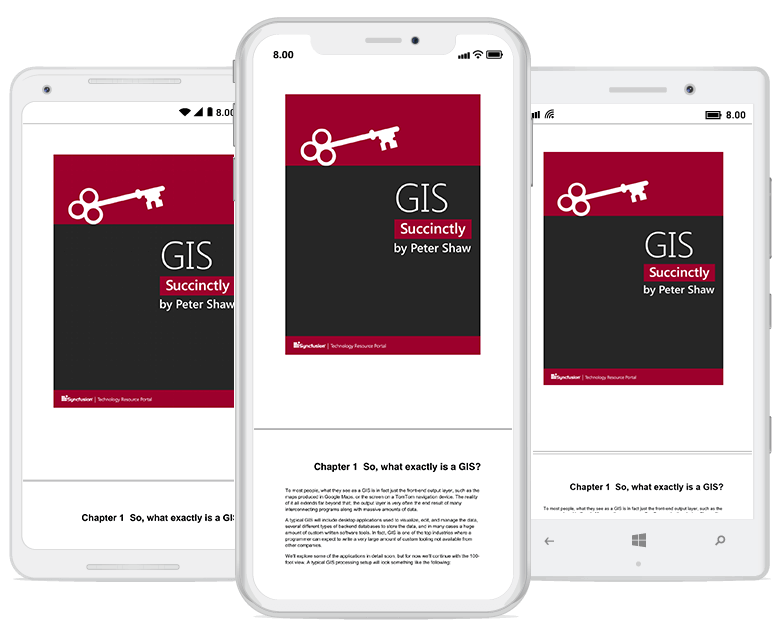

# Working with built-in toolbar

The SfPdfViewer has a built-in toolbar that has provisions to perform majority of the operations in the PDF Viewer and that can be disabled or enabled. You  can disable the built-in toolbar and develop your own toolbar.

## How to disable/enable built-in toolbar

By default, the built-in toolbar will be enabled. It can be disabled by setting the Toolbar.Enabled property of PDF Viewer to false.




<ContentPage xmlns="http://xamarin.com/schemas/2014/forms"
             xmlns:x="http://schemas.microsoft.com/winfx/2009/xaml"
             xmlns:local="clr-namespace: PdfViewerGettingStarted "
             xmlns:syncfusion ="clr-namespace:Syncfusion.SfPdfViewer.XForms;assembly=Syncfusion.SfPdfViewer.XForms"
             x:Class=" PdfViewerGettingStarted.MainPage">

  <ContentPage.Resources>
        <ResourceDictionary>
            <syncfusion:Toolbar x:Key="ToolbarSettings">
                <syncfusion:Toolbar.Enabled>false
                </syncfusion:Toolbar.Enabled>
            </syncfusion:Toolbar>
        </ResourceDictionary>
    </ContentPage.Resources>

    <ContentPage.Content>
        <syncfusion:SfPdfViewer x:Name="pdfViewerControl" Toolbar = "{StaticResource ToolbarSettings}"/>
    </ContentPage.Content>

</ContentPage>







pdfViewerControl.Toolbar.Enabled = false;




The toolbar can be enabled by setting the Toolbar.Enabled property to true.




<ContentPage xmlns="http://xamarin.com/schemas/2014/forms"
             xmlns:x="http://schemas.microsoft.com/winfx/2009/xaml"
             xmlns:local="clr-namespace: PdfViewerGettingStarted "
             xmlns:syncfusion ="clr-namespace:Syncfusion.SfPdfViewer.XForms;assembly=Syncfusion.SfPdfViewer.XForms"
             x:Class=" PdfViewerGettingStarted.MainPage">

  <ContentPage.Resources>
        <ResourceDictionary>
            <syncfusion:Toolbar x:Key="ToolbarSettings">
                <syncfusion:Toolbar.Enabled>true
                </syncfusion:Toolbar.Enabled>
            </syncfusion:Toolbar>
        </ResourceDictionary>
    </ContentPage.Resources>

    <ContentPage.Content>
        <syncfusion:SfPdfViewer x:Name="pdfViewerControl" Toolbar = "{StaticResource ToolbarSettings}"/>
    </ContentPage.Content>

</ContentPage>







pdfViewerControl.Toolbar.Enabled = true;




N>By default, the built-in toolbar of SfPdfViewer is always visible.

## How to disable/enable bookmark

By default, the bookmark button will be enabled. It can be disabled by setting the `BookmarkNavigationEnabled` property of PDF Viewer to false.  




<ContentPage xmlns="http://xamarin.com/schemas/2014/forms"
             xmlns:x="http://schemas.microsoft.com/winfx/2009/xaml"
             xmlns:local="clr-namespace: PdfViewerGettingStarted "
             xmlns:syncfusion ="clr-namespace:Syncfusion.SfPdfViewer.XForms;assembly=Syncfusion.SfPdfViewer.XForms"
             x:Class=" PdfViewerGettingStarted.MainPage">

    <ContentPage.Content>
        <syncfusion:SfPdfViewer x:Name="pdfViewerControl" BookmarkNavigationEnabled="False"/>
    </ContentPage.Content>

</ContentPage>          







//Bookmark feature is disabled
pdfViewerControl. BookmarkNavigationEnabled = false;             




## How to show/hide the toolbar items in built-in toolbar

The built-in toolbar in PdfViewer includes various items to perform operations such as navigation (bookmark, hyperlink and table of contents) and reviewing the PDF files with different annotation tools. These toolbar items can be hidden and customized as per the requirement.

The items in the toolbar is shown or hidden using the following API.




//Show/Hide the toolbar item(s)
pdfViewerControl.Toolbar.SetToolbarItemVisibility(string itemName, bool isVisible);             




For an example, the following code snippet explains how to hide the `Save` button from the built-in toolbar.




//Hides the 'Save' button
pdfViewerControl.Toolbar.SetToolbarItemVisibility(“save”, false);        




Similarly, the other items can be hidden by mentioning the appropriate key names. Find the key names of all the toolbar items from the following table:

<table>

<tr>
<th>Toolbar Item Name</th>
<th>Key Name</th>
</tr>

<tr>
<td>Page view mode button</td>
<td>_page-view-mode_</td>
</tr>

<tr>
<td>Continuous page view mode button</td>
<td>_continuous-pages_</td>
</tr>

<tr>
<td>Single page view mode button</td>
<td>_page-by-page_</td>
</tr>

<tr>
<td>Bookmark button</td>
<td>_bookmark_</td>
</tr>

<tr>
<td>Page number entry</td>
<td>_page-entry_</td>
</tr>

<tr>
<td>Page count label</td>
<td>_page-count_</td>
</tr>

<tr>
<td>Previous page button</td>
<td>_previous-page_</td>
</tr>

<tr>
<td>Next page button</td>
<td>_next-page_</td>
</tr>

<tr>
<td>Search button</td>
<td>_search_</td>
</tr>

<tr>
<td>Search back button</td>
<td>_search-back_</td>
</tr>

<tr>
<td>Search Bar</td>
<td>_search-bar_</td>
</tr>

<tr>
<td>Clear/Cancel search button</td>
<td>_search-clear_</td>
</tr>

<tr>
<td>Search next button</td>
<td>_search-next_</td>
</tr>

<tr>
<td>Search previous button</td>
<td>_search-previous_</td>
</tr>

<tr>
<td>Search instances label</td>
<td>_search-instances_</td>
</tr>

<tr>
<td>More options button</td>
<td>_more-options_</td>
</tr>

<tr>
<td>Undo button</td>
<td>_undo_</td>
</tr>

<tr>
<td>Redo button</td>
<td>_redo_</td>
</tr>

<tr>
<td>Save button</td>
<td>_save_</td>
</tr>

<tr>
<td>Print button</td>
<td>_print_</td>
</tr>

<tr>
<td>Annotation button</td>
<td>_annotation_</td>
</tr>

<tr>
<td>Annotation back button</td>
<td>_annotation-back_</td>
</tr>

<tr>
<td>Text markups annotation button</td>
<td>_text-markups_</td>
</tr>

<tr>
<td>Text markups back button</td>
<td>_text-markups-back_</td>
</tr>

<tr>
<td>Text highlight button</td>
<td>_text-highlight_</td>
</tr>

<tr>
<td>Text underline button</td>
<td>_text-underline_</td>
</tr>

<tr>
<td>Text strikethrough button</td>
<td>_text-strikethrough_</td>
</tr>

<tr>
<td>Shapes annotation button</td>
<td>_shapes_</td>
</tr>

<tr>
<td>Shapes back button</td>
<td>_shapes-back_</td>
</tr>

<tr>
<td>Rectangle shape button</td>
<td>_rectangle_</td>
</tr>

<tr>
<td>Ellipse shape button</td>
<td>_ellipse_</td>
</tr>

<tr>
<td>Line shape button</td>
<td>_line_</td>
</tr>

<tr>
<td>Arrow shape button</td>
<td>_arrow_</td>
</tr>

<tr>
<td>Ink annotation button</td>
<td>_ink_</td>
</tr>

<tr>
<td>Ink undo button</td>
<td>_undo-ink_</td>
</tr>

<tr>
<td>Ink redo button</td>
<td>_redo-ink_</td>
</tr>

<tr>
<td>Ink confirmation button</td>
<td>_done_</td>
</tr>

<tr>
<td>Free text annotation button</td>
<td>_free-text_</td>
</tr>

<tr>
<td>Signature button</td>
<td>_signature_</td>
</tr>

<tr>
<td>Selected annotation button</td>
<td>_selected-annotation_</td>
</tr>

<tr>
<td>Edited annotation button</td>
<td>_edited-annotation_</td>
</tr>

<tr>
<td>Selected annotation back button</td>
<td>_selected-annotation-back_</td>
</tr>

<tr>
<td>Edited annotation back button</td>
<td>_edited-annotation-back_</td>
</tr>

<tr>
<td>Selected annotation color button</td>
<td>_selected-annotation-color_</td>
</tr>

<tr>
<td>Edited annotation color button</td>
<td>_edited-annotation-color_</td>
</tr>

<tr>
<td>Magenta color button</td>
<td>_magenta_</td>
</tr>

<tr>
<td>Black color button</td>
<td>_black_</td>
</tr>

<tr>
<td>Red color button</td>
<td>_red_</td>
</tr>

<tr>
<td>Green color button</td>
<td>_green_</td>
</tr>

<tr>
<td>Yellow color button</td>
<td>_yellow_</td>
</tr>

<tr>
<td>Blue color button</td>
<td>_blue_</td>
</tr>

<tr>
<td>Cyan color button</td>
<td>_cyan_</td>
</tr>

<tr>
<td>Color opacity button</td>
<td>_opacity_</td>
</tr>

<tr>
<td>Color opacity slider</td>
<td>_opacity-slider_</td>
</tr>

<tr>
<td>Font size button</td>
<td>_font-size_</td>
</tr>

<tr>
<td>Font size label</td>
<td>_font-label_</td>
</tr>

<tr>
<td>Font range slider</td>
<td>_font-range-slider_</td>
</tr>

<tr>
<td>Selected annotation thickness button</td>
<td>_selected-annotation-thickness_</td>
</tr>

<tr>
<td>Edited annotation thickness button</td>
<td>_edited-annotation-thickness_</td>
</tr>

<tr>
<td>First thickness button</td>
<td>_1pt-thickness_</td>
</tr>

<tr>
<td>Second thickness button</td>
<td>_3pt-thickness_</td>
</tr>

<tr>
<td>Third thickness button</td>
<td>_5pt-thickness_</td>
</tr>

<tr>
<td>Fourth thickness button</td>
<td>_7pt-thickness_</td>
</tr>

<tr>
<td>Fifth thickness button</td>
<td>_9pt-thickness_</td>
</tr>

<tr>
<td>Edited annotation font size button</td>
<td>_edited-annotation-font-size_</td>
</tr>

<tr>
<td>Edited annotation modify free text button</td>
<td>_edited-annotation-modify-free-text_</td>
</tr>

<tr>
<td>Edited annotation delete button</td>
<td>_edited-annotation-delete_</td>
</tr>

</table>