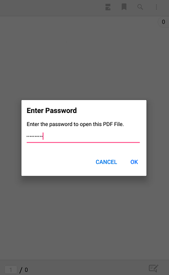

# Loading password-protected PDFs

Password protected PDFs can be loaded using the `LoadDocument(Stream pdfStream, string password)` method. 




string password = "PASSWORD";
pdfViewerControl.LoadDocument(pdfStream, password);




In the above code snippet, `pdfStream` is the Stream instance read from the encrypted PDF and `password` is the key with which the PDF is encrypted. 

## Loading password-protected PDF asynchronously

[Xamarin PDF Viewer](https://www.syncfusion.com/xamarin-ui-controls/xamarin-pdf-viewer) allows you to load the PDF document from the specified stream with password asynchronously using the `LoadDocumentAsync` method. You can also cancel the asynchronous PDF loading when it is in progress.




pdfViewerControl.LoadDocumentAsync(documentStream, password, cancellationTokenSource);




In the above code sample, `documentStream` is the Stream instance read from the encrypted PDF, and the `password` is the key with that the PDF is encrypted, and the `cancellationTokenSource` enables you to cancel the asynchronous PDF loading.

For canceling the asynchronous PDF loading and detecting the cancellation when it occurred, refer the `Loading a PDF asynchronously` section of [Getting Started](https://help.syncfusion.com/xamarin/pdf-viewer/getting-started).

## Handling invalid passwords

If the password provided with the `LoadDocument(Stream pdfStream, string password)` is invalid, then the `PasswordErrorOccurred` event is raised. The `Title` property of the `PasswordErrorOccurredEventArgs` parameter helps identify whether the event raised due to invalid password. In that case the `Title` property will read "Error loading encrypted PDF document". 




pdfViewerControl.PasswordErrorOccurred += PdfViewerControl_PasswordErrorOccurred;
private void PdfViewerControl_PasswordErrorOccurred(object sender, PasswordErrorOccurredEventArgs args)
{
	//Get the details regarding the password error occurred. 
    string title = args.Title;
    string description = args.Description;
}




N>The event will also be raised when an encrypted PDF is loaded without providing a password using the `LoadDocument(Stream pdfStream)` overload.  

## Enable or disable the password protected view

The PDF viewer has a built-in view for entering the password of encrypted PDF document before display. 

** Password UI View **

The users can enable or disable the password UI view based on their requirement. The password UI view can be disabled by setting the `IsPasswordViewEnabled` API to false. The default value of this API is true. The code snippet for disabling the view is as follows, 


  
  
//Disable the display of password UI view
pdfViewer.IsPasswordViewEnabled = false;



### Detecting the cancel operation of password view

The event `PasswordViewCancelButtonClicked` will be raised when the user cancels the password entering process.



pdfViewer.PasswordViewCancelButtonClicked += PdfViewer_PasswordViewCancelButtonClicked;

      

N>You can also explore our [Xamarin.Forms PDF Viewer example](https://github.com/syncfusion/xamarin-demos/tree/master/Forms/PdfViewer) to knows the functionalities of each feature.