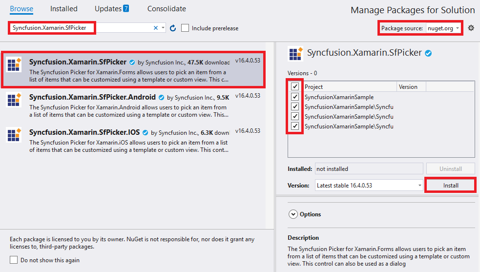
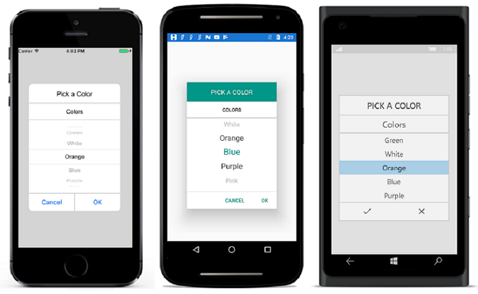

# Getting Started with Xamarin Picker(SfPicker)

This section explains the steps required to configure a picker control in a real-time scenario, and provides a walk-through on some of the customization features available in picker control.

## Assembly deployment

After installing [Essential Studio for Xamarin](https://www.syncfusion.com/downloads/xamarin), you can find all the required assemblies in the installation folders, {Syncfusion Essential Studio Installed location} \Essential Studio\16.x.x.x\Xamarin\lib

Eg: C:\Program Files (x86) \Syncfusion\Essential Studio\16.1.0.24\Xamarin\lib

N> Assemblies can be found in unzipped package location in Mac.

## Adding SfPicker reference

You can add SfPicker reference using one of the following methods:

**Method 1: Adding SfPicker reference from nuget.org**

Syncfusion Xamarin components are available in [nuget.org](https://www.nuget.org/). To add SfPicker to your project, open the NuGet package manager in Visual Studio, search for [Syncfusion.Xamarin.SfPicker](https://www.nuget.org/packages/Syncfusion.Xamarin.SfPicker), and then install it.

N> Install the same version of SfPicker NuGet in all the projects.

**Method 2: Adding SfPicker reference from toolbox**

Syncfusion also provides Xamarin Toolbox. Using this toolbox, you can drag the SfPicker control to the XAML page. It will automatically install the required NuGet packages and add the namespace to the page. To install Syncfusion Xamarin Toolbox, refer to [Toolbox](https://help.syncfusion.com/xamarin/utility#toolbox).

**Method 3: Adding SfPicker assemblies manually from the installed location**

If you prefer to manually reference the assemblies instead referencing from NuGet, add the following assemblies in respective projects.

Location: {Installed location}/{version}/Xamarin/lib

<table>
<tr>
<td>PCL</td>
<td>Syncfusion.SfPicker.XForms.dll Syncfusion.Core.XForms.dll Syncfusion.Licensing.dll </td>
</tr>
<tr>
<td>Android</td>
<td>Syncfusion.SfPicker.Android.dll Syncfusion.SfPicker.XForms.Android.dll Syncfusion.SfPicker.XForms.dll Syncfusion.Core.XForms.dll Syncfusion.Core.XForms.Android.dll Syncfusion.Licensing.dll </td>
</tr>
<tr>
<td>iOS</td>
<td>Syncfusion.SfPicker.iOS.dll Syncfusion.SfPicker.XForms.iOS.dll Syncfusion.SfPicker.XForms.dll Syncfusion.Core.XForms.dll Syncfusion.Core.XForms.iOS.dll Syncfusion.Licensing.dll </td>
</tr>
<tr>
<td>UWP</td>
<td>Syncfusion.SfInput.UWP.dll Syncfusion.SfShared.UWP.dll Syncfusion.SfPicker.XForms.UWP.dll Syncfusion.SfPicker.XForms.dll Syncfusion.Core.XForms.dll Syncfusion.Core.XForms.UWP.dll Syncfusion.Licensing.dll </td>
</tr>
</table>

N> To know more about obtaining our components, refer to these links for [Mac](https://help.syncfusion.com/xamarin/introduction/download-and-installation/mac/) and [Windows](https://help.syncfusion.com/xamarin/introduction/download-and-installation/windows/).

I> Starting with v16.2.0.x, if you reference Syncfusion assemblies from the trial setup or from the NuGet feed, you also have to include a license key in your projects. Please refer to [Syncfusion license key](https://help.syncfusion.com/common/essential-studio/licensing/license-key/) to know about registering Syncfusion license key in your Xamarin application to use our components.

## Initialize picker on each platform

To use picker in Xamarin application, each platform project must initialize the picker renderer. These initializing steps vary from platform to platform, and it is discussed in the following sections.

### Android

The Android launches the picker without any initialization, and it is enough to only initialize the Xamarin.Forms Framework to launch the application.

N> If you are adding the references from toolbox, this step is not needed.

### iOS

To launch the picker in iOS, call the `SfPickerRenderer.Init()` in the FinishedLaunching overridden method of the `AppDelegate` class after the Xamarin.Forms Framework has been initialized and before the LoadApplication is called as demonstrated in the following code example.



public override bool FinishedLaunching(UIApplication app, NSDictionary options)

{

…

global::Xamarin.Forms.Forms.Init ();

SfPickerRenderer.Init();

LoadApplication (new App ());

…

}


### Universal Windows Platform (UWP)

To launch the picker in UWP, call the `SfPickerRenderer.Init()` in the `MainPage` constructor before the `LoadApplication` is called as demonstrated in the following code example.



public MainPage()

{

…

SfPickerRenderer.Init();

LoadApplication (new App ());

…

}


### ReleaseMode issue in UWP platform

There is a known Framework issue in UWP platform. The custom controls will not render when deployed application is in Release Mode.

The above issues can be resolved by initializing the picker assemblies in `App.xaml.cs` in UWP project as shown in the following code snippet.


// In App.xaml.cs

protected override void OnLaunched(LaunchActivatedEventArgs e)

{

…

rootFrame.NavigationFailed += OnNavigationFailed;

// you'll need to add `using System.Reflection;`

List<Assembly> assembliesToInclude = new List<Assembly>();

//Now, add all the assemblies your app uses

assembliesToInclude.Add(typeof(SfPickerRenderer).GetTypeInfo().Assembly);

// replaces Xamarin.Forms.Forms.Init(e);        

Xamarin.Forms.Forms.Init(e, assembliesToInclude);

…     

}


### Create a simple picker

This section explains how to create a simple picker control and configure it. picker can be configured by using XAML or C# code. 

### Create a Xamarin.Forms project 

Create a new blank project (Xamarin.Forms portable) by using Visual Studio or Xamarin Studio for Xamarin.Forms. 

### Adding picker in Xamarin.Forms project

1. Add the required assembly reference in PCL, and other renderer projects as discussed in **Adding** **picker** **reference** section.
2. Add picker control's two way XAML or C#.
* XAML Page
  * Set SfPicker control namespace as `xmlns:syncfusion="clr- namespace:Syncfusion.SfPicker.XForms;assembly=Syncfusion.SfPicker.XForms”` in XAML Content page.
  * Set the SfPicker control in content property of contentPage.
* C# Page
  * Import SfPicker control namespace as `using Syncfusion.SfPicker.XForms;` in C# ContentPage.
  * Create a new SfPicker instance in ContentPage constructor, and assign SfPicker instance to ContentPage content property.



<?xml version="1.0" encoding="utf-8" ?>

<ContentPage xmlns="http://xamarin.com/schemas/2014/forms" xmlns:syncfusion="clr-namespace:Syncfusion.SfPicker.XForms;assembly=Syncfusion.SfPicker.XForms"

xmlns:x="http://schemas.microsoft.com/winfx/2009/xaml"

x:Class="GettingStarted.PickerSample">

<ContentPage.Content>

<syncfusion:SfPicker x:Name="picker" />

</ContentPage.Content>

</ContentPage>





using Syncfusion.SfPicker.XForms;

using Xamarin.Forms;

using Xamarin.Forms.Xaml;

namespace GettingStarted

{

[XamlCompilation(XamlCompilationOptions.Compile)]

public partial class PickerSample : ContentPage

{

SfPicker picker;

public PickerSample()

{

InitializeComponent();

picker = new SfPicker();

this.Content = picker;

}

}

}




### Set header to the picker

The picker control allows you to the define header text by setting the `SfPicker.HeaderText`, and enable SfPicker header by setting `SfPicker.ShowHeader` property to true. Default value of `SfPicker.ShowHeader` is true.




<syncfusion:SfPicker x:Name="picker" HeaderText="Select a Color" />





picker.HeaderText = "Select a Color";




### Adding picker items 

picker control is a data bounded control. Hence, you must create collection of data’s and bind it to picker control.

* Create a simple Observable Collection with string type of data for the picker 



public class ColorInfo

{

private ObservableCollection<string> _color;

public ObservableCollection<string> Colors

{

get { return _color; }

set { _color = value; }

}

public ColorInfo()

{

Colors = new ObservableCollection<string>();

Colors.Add("Red");

Colors.Add("Green");

Colors.Add("Yellow");

Colors.Add("Blue");

Colors.Add("SkyBlue");

Colors.Add("Orange");

Colors.Add("Gray");

Colors.Add("Pink");

}

}


* Bind the Collection to picker

picker control allows you to bind collection of data by setting the `SfPicker.ItemsSource` property. You can bind the collection of data in both XAML or C#.




<?xml version="1.0" encoding="utf-8" ?>

<ContentPage

x:Class="GettingStarted.PickerSample"

xmlns="http://xamarin.com/schemas/2014/forms"

xmlns:x="http://schemas.microsoft.com/winfx/2009/xaml"

xmlns:local="clr-namespace:GettingStarted"

xmlns:syncfusion="clr-namespace:Syncfusion.SfPicker.XForms;assembly=Syncfusion.SfPicker.XForms">

<ContentPage.BindingContext>

<local:ColorInfo />

</ContentPage.BindingContext>

<ContentPage.Content>

<syncfusion:SfPicker

x:Name="picker"

HeaderText="Select a Color"

ItemsSource="{Binding Colors}" />

</ContentPage.Content>

</ContentPage>





ColorInfo info = new ColorInfo();

picker.ItemsSource = info.Colors;




### Set title to the items 

picker control allows you to define title to the picker items by setting `SfPicker.ColumnHeaderText` and enable title of the picker items by setting `SfPicker.ShowColumnHeader` property to true. Default value of `SfPicker.ShowColumnHeader` is false.




<syncfusion:SfPicker

x:Name="picker"

ColumnHeaderText="Color"

ShowColumnHeader="True" />





picker.ColumnHeaderText = "Color";

picker.ShowColumnHeader = true;




### Enable validation button in footer

In picker control, validation buttons (OK and Cancel)can be enabled by setting `SfPicker.ShowFooter` property to true. Default value of `SfPicker.ShowFooter` property is false




<syncfusion:SfPicker

x:Name="picker"

ShowFooter="True" />



  

picker.ShowFooter = true;




### Open as dialog

 picker can be rendered as a dialog by setting the`SfPicker.PickerMode` property to Dialog. Default value of `SfPicker.PickerMode` property is Default. 




<syncfusion:SfPicker x:Name="picker" PickerMode="Dialog" />





picker.PickerMode = PickerMode.Dialog;




The picker can be opened programmatically by setting  `SfPicker.IsOpen` property to true. Default value of `SfPicker.IsOpen` is false.

Note: This property is automatically changed to false when you close the dialog by clicking outside of dialog.




<syncfusion:SfPicker

x:Name="picker"

IsOpen="True" 

PickerMode="Dialog" />





picker.IsOpen = true;




The following screenshot illustrates the output of above code.

We have attached sample for reference. You can download the sample from the following link.

Sample link:[GettingStarted](http://www.syncfusion.com/downloads/support/directtrac/general/ze/Picker_GettingStarted-1178342958)