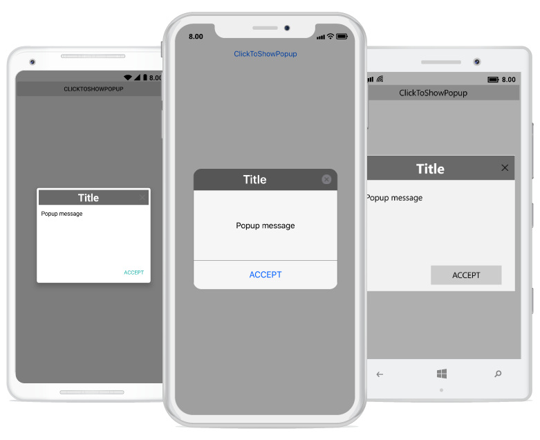
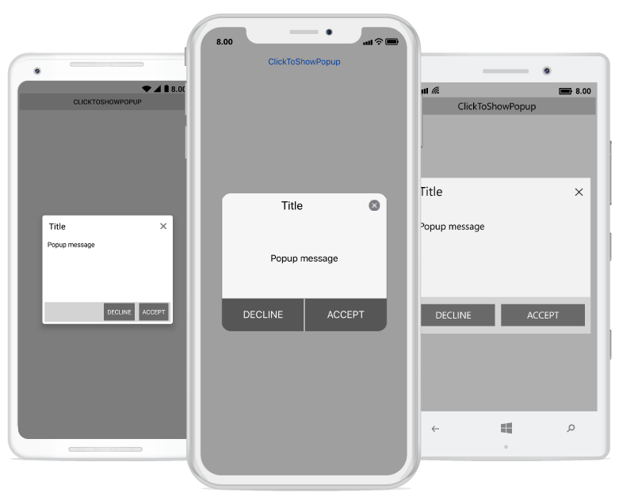
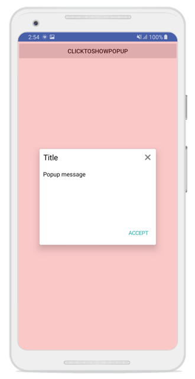

---
layout: post
title: Styles | SfPopupLayout |Xamarin | Syncfusion
description: Style customization options available in Xamarin.Forms PopupLayout.
platform: Xamarin
control: SfPopupLayout
documentation: ug
--- 

# Styles

The SfPopupLayout applies style to all of its elements by using the [SfPopupLayout.PopupView.PopupStyle](https://help.syncfusion.com/cr/cref_files/xamarin/Syncfusion.SfPopupLayout.XForms~Syncfusion.XForms.PopupLayout.PopupView~PopupStyle.html) property.

## Styling popup header

The SfPopupLayout allows customizing the header elements with various header customizations as follows:

<table>
<tr>
<th> Property </th>
<th> Description </th>
</tr>
<tr>
<td> {{'[SfPopupLayout.PopupView.PopupStyle.HeaderBackgroundColor](https://help.syncfusion.com/cr/cref_files/xamarin/Syncfusion.SfPopupLayout.XForms~Syncfusion.XForms.PopupLayout.PopupStyle~HeaderBackgroundColor.html)'| markdownify }} </td>
<td>  Gets or sets the background color for the header.</td>
</tr>
<tr>
<td> {{'[SfPopupLayout.PopupView.PopupStyle.HeaderFontAttribute](https://help.syncfusion.com/cr/cref_files/xamarin/Syncfusion.SfPopupLayout.XForms~Syncfusion.XForms.PopupLayout.PopupStyle~HeaderFontAttribute.html)'| markdownify }} </td>
<td>  Gets or sets the font attribute for the header title.</td>
</tr>
<tr>
<td> {{'[SfPopupLayout.PopupView.PopupStyle.HeaderFontFamily](https://help.syncfusion.com/cr/cref_files/xamarin/Syncfusion.SfPopupLayout.XForms~Syncfusion.XForms.PopupLayout.PopupStyle~HeaderFontFamily.html)'| markdownify }} </td>
<td>  Gets or sets the font style for the header title.</td>
</tr>
<tr>
<td> {{'[SfPopupLayout.PopupView.PopupStyle.HeaderFontSize](https://help.syncfusion.com/cr/cref_files/xamarin/Syncfusion.SfPopupLayout.XForms~Syncfusion.XForms.PopupLayout.PopupStyle~HeaderFontSize.html)'| markdownify }} </td>
<td> Gets or sets the font size for the header title.</td>
</tr>
<tr>
<td> {{'[SfPopupLayout.PopupView.PopupStyle.HeaderTextAlignment](https://help.syncfusion.com/cr/cref_files/xamarin/Syncfusion.SfPopupLayout.XForms~Syncfusion.XForms.PopupLayout.PopupStyle~HeaderTextAlignment.html)'| markdownify }} </td>
<td>  Gets or sets the text alignment for the header.</td>
</tr>
<tr>
<td> {{'[SfPopupLayout.PopupView.PopupStyle.HeaderTextColor](https://help.syncfusion.com/cr/cref_files/xamarin/Syncfusion.SfPopupLayout.XForms~Syncfusion.XForms.PopupLayout.PopupStyle~HeaderTextColor.html)'| markdownify }} </td>
<td>  Gets or sets the text color to be applied for the header title.</td>
</tr>
</table>

Refer to the following code example for customizing the header elements.





<sfPopup:SfPopupLayout x:Name="popUpLayout">
    <sfPopup:SfPopupLayout.PopupView>
        <sfPopup:PopupView>
            <sfPopup:PopupView.PopupStyle>
                <sfPopup:PopupStyle HeaderBackgroundColor="DimGray"
                                    HeaderFontAttribute="Bold"
                                    HeaderFontFamily="Helvetica-Bold"
                                    HeaderFontSize="25"
                                    HeaderTextAlignment="Center"
                                    HeaderTextColor="White"/>
            </sfPopup:PopupView.PopupStyle>
        </sfPopup:PopupView>
    </sfPopup:SfPopupLayout.PopupView>
</sfPopup:SfPopupLayout>





//MainPage.cs

public MainPage()
{
    ....
    InitializeComponent();
    popupLayout.PopupView.PopupStyle.HeaderBackgroundColor = Color.FromRgb(105,105,105);
    popupLayout.PopupView.PopupStyle.HeaderFontAttribute = FontAttributes.Bold;
    popupLayout.PopupView.PopupStyle.HeaderFontFamily = "Helvetica-Bold";
    popupLayout.PopupView.PopupStyle.HeaderFontSize = 25;
    popupLayout.PopupView.PopupStyle.HeaderTextAlignment = TextAlignment.Center;
    popupLayout.PopupView.PopupStyle.HeaderTextColor = Color.White;
    ....
}





Executing the above codes renders the following output in iOS, Android and Windows Phone devices respectively.

## Styling popup footer

The SfPopupLayout allows customizing the footer elements with various footer customizations as follows:

<table>
<tr>
<th> Property </th>
<th> Description </th>
</tr>
<tr>
<td> {{'[SfPopupLayout.PopupView.PopupStyle.FooterBackgroundColor](https://help.syncfusion.com/cr/cref_files/xamarin/Syncfusion.SfPopupLayout.XForms~Syncfusion.XForms.PopupLayout.PopupStyle~FooterBackgroundColor.html)'| markdownify }} </td>
<td>  Gets or sets the background color for the footer.</td>
</tr>
<tr>
<td> {{'[SfPopupLayout.PopupView.PopupStyle.AcceptButtonBackgroundColor](https://help.syncfusion.com/cr/cref_files/xamarin/Syncfusion.SfPopupLayout.XForms~Syncfusion.XForms.PopupLayout.PopupStyle~AcceptButtonBackgroundColor.html)'| markdownify }} </td>
<td>  Gets or sets the background color for the Accept button in the footer.</td>
</tr>
<tr>
<td> {{'[SfPopupLayout.PopupView.PopupStyle.AcceptButtonTextColor](https://help.syncfusion.com/cr/cref_files/xamarin/Syncfusion.SfPopupLayout.XForms~Syncfusion.XForms.PopupLayout.PopupStyle~AcceptButtonTextColor.html)'| markdownify }} </td>
<td>  Gets or sets the foreground color for the Accept button in the footer.</td>
</tr>
<tr>
<td> {{'[SfPopupLayout.PopupView.PopupStyle.DeclineButtonBackgroundColor](https://help.syncfusion.com/cr/cref_files/xamarin/Syncfusion.SfPopupLayout.XForms~Syncfusion.XForms.PopupLayout.PopupStyle~DeclineButtonBackgroundColor.html)'| markdownify }} </td>
<td> Gets or sets the background color for the Decline button in the footer.</td>
</tr>
<tr>
<td> {{'[SfPopupLayout.PopupView.PopupStyle.DeclineButtonTextColor](https://help.syncfusion.com/cr/cref_files/xamarin/Syncfusion.SfPopupLayout.XForms~Syncfusion.XForms.PopupLayout.PopupStyle~DeclineButtonTextColor.html)'| markdownify }} </td>
<td>  Gets or sets the foreground color for the Decline button in the footer.</td>
</tr>
</table>

Refer to the following code example for customizing the footer elements.





<sfPopup:SfPopupLayout x:Name="popUpLayout">
    <sfPopup:SfPopupLayout.PopupView>
        <sfPopup:PopupView AppearanceMode="TwoButton">
                <sfPopup:PopupView.PopupStyle>
                    <sfPopup:PopupStyle FooterBackgroundColor="LightGray"
                                        AcceptButtonBackgroundColor ="DimGray"
                                        AcceptButtonTextColor="White"
                                        DeclineButtonBackgroundColor="DimGray"
                                        DeclineButtonTextColor="White"
                                        />
                </sfPopup:PopupView.PopupStyle>
            </sfPopup:PopupView>
    </sfPopup:SfPopupLayout.PopupView>
</sfPopup:SfPopupLayout>





//MainPage.cs

public MainPage()
{
    ....
    InitializeComponent();

    // Setting the AppearanceMode as TwoButton
    popupLayout.PopupView.AppearanceMode = Syncfusion.XForms.PopupLayout.AppearanceMode.TwoButton;

    // Footer customization
    popupLayout.PopupView.PopupStyle.FooterBackgroundColor = Color.LightGray;
    popupLayout.PopupView.PopupStyle.AcceptButtonBackgroundColor = Color.FromRgb(105, 105, 105);
    popupLayout.PopupView.PopupStyle.AcceptButtonTextColor = Color.White;
    popupLayout.PopupView.PopupStyle.DeclineButtonBackgroundColor = Color.FromRgb(105, 105, 105);
    popupLayout.PopupView.PopupStyle.DeclineButtonTextColor = Color.White;
    ....
}





Executing the above codes renders the following output in iOS, Android and Windows Phone devices respectively.

## Border customization

The SfPopupLayout allows customizing the border appearance with various border customizations as follows:

<table>
<tr>
<th> Property </th>
<th> Description </th>
</tr>
<tr>
<td> {{'[SfPopupLayout.PopupView.PopupStyle.BorderColor](https://help.syncfusion.com/cr/cref_files/xamarin/Syncfusion.SfPopupLayout.XForms~Syncfusion.XForms.PopupLayout.PopupStyle~BorderColor.html)'| markdownify }} </td>
<td>  Gets or sets the border color for the PopupView.</td>
</tr>
<tr>
<td> {{'[SfPopupLayout.PopupView.PopupStyle.BorderThickness](https://help.syncfusion.com/cr/cref_files/xamarin/Syncfusion.SfPopupLayout.XForms~Syncfusion.XForms.PopupLayout.PopupStyle~BorderThickness.html)'| markdownify }} </td>
<td>  Gets or sets the border thickness for the PopupView.</td>
</tr>
<tr>
<td> {{'[SfPopupLayout.PopupView.PopupStyle.CornerRadius](https://help.syncfusion.com/cr/cref_files/xamarin/Syncfusion.SfPopupLayout.XForms~Syncfusion.XForms.PopupLayout.PopupStyle~CornerRadius.html)'| markdownify }} </td>
<td>  Gets or sets the corner radius for the PopupView.</td>
</tr>
</table>

Refer to the following code example for customizing the border elements.





<sfPopup:SfPopupLayout x:Name="popUpLayout">
    <sfPopup:SfPopupLayout.PopupView>
        <sfPopup:PopupView>
            <sfPopup:PopupView.PopupStyle>
                <sfPopup:PopupStyle BorderColor="LightBlue"
                                    BorderThickness="3"
                                    CornerRadius="5"
                                    />
            </sfPopup:PopupView.PopupStyle>
        </sfPopup:PopupView>
    </sfPopup:SfPopupLayout.PopupView>
<sfPopup:SfPopupLayout>





//MainPage.cs

public MainPage()
{
    ....
    InitializeComponent();
    popupLayout.PopupView.PopupStyle.BorderColor = Color.LightBlue;
    popupLayout.PopupView.PopupStyle.BorderThickness = 3;
    popupLayout.PopupView.PopupStyle.CornerRadius = 5;
    ....
}





Executing the above codes renders the following output in iOS, Android and Windows Phone devices respectively.

## Styling overlay background

The SfPopupLayout allows to customize the opacity and the background color of overlay using the `SfPopupLayout.PopupView.PopupStyle.OverlayOpacity` and `SfPopupLayout.PopupView.PopupStyle.OverlayColor` properties, respectively.

Refer to the following code example for customizing the overlay opacity and the background color.




        <sfPopup:SfPopupLayout x:Name="popUpLayout">
            <sfPopup:SfPopupLayout.PopupView>
                <sfPopup:PopupView>
                    <sfPopup:PopupView.PopupStyle>
                        <sfPopup:PopupStyle OverlayColor="Red" OverlayOpacity="0.2">
                        </sfPopup:PopupStyle>
                    </sfPopup:PopupView.PopupStyle>
                </sfPopup:PopupView>
            </sfPopup:SfPopupLayout.PopupView>
			</sfPopup:SfPopupLayout>




		    popUpLayout.PopupView.PopupStyle.OverlayColor = Color.Red;
            popUpLayout.PopupView.PopupStyle.OverlayOpacity = 0.2;





Executing the above codes renders the following output in Android devices.

