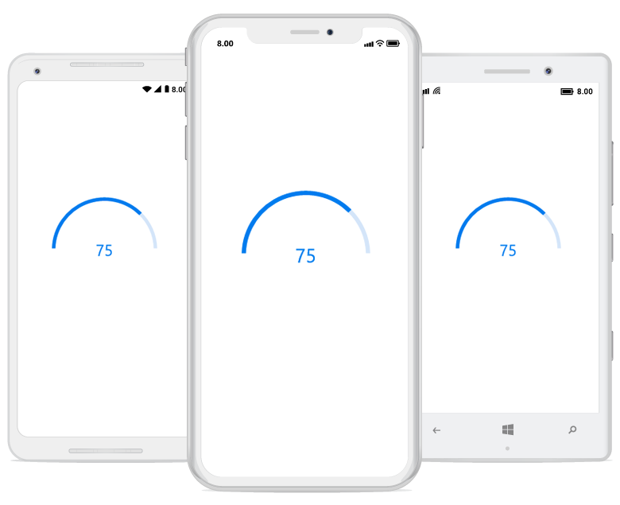
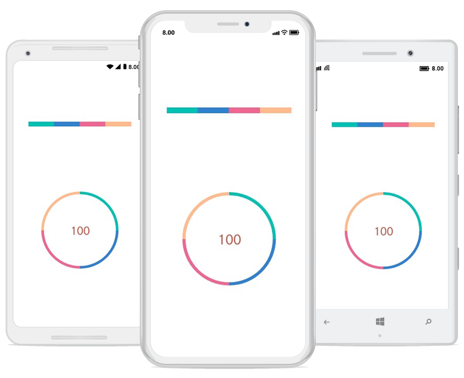
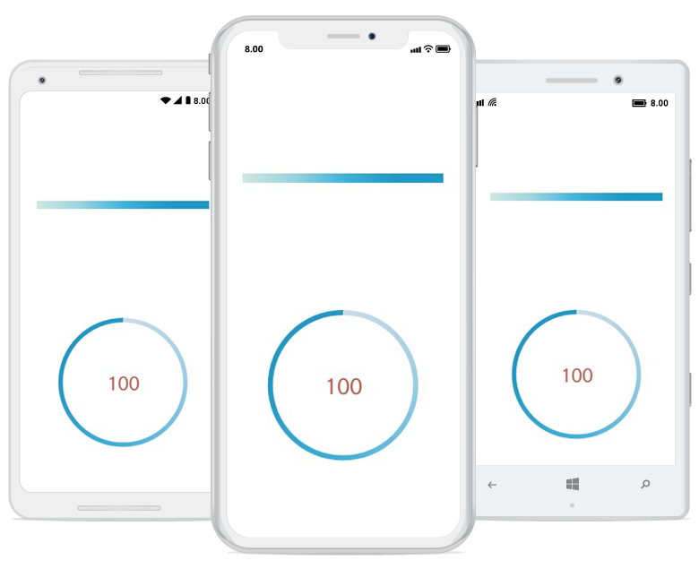
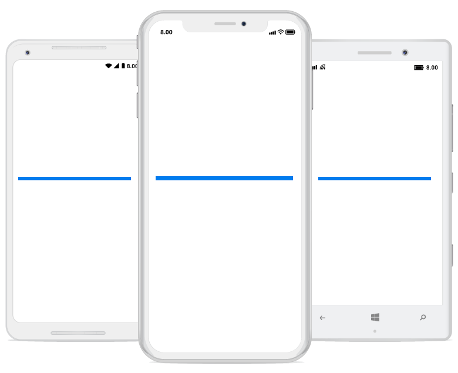
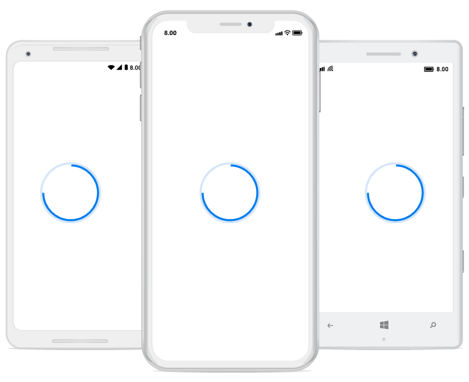
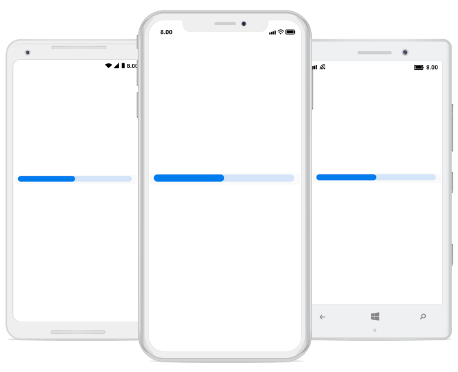
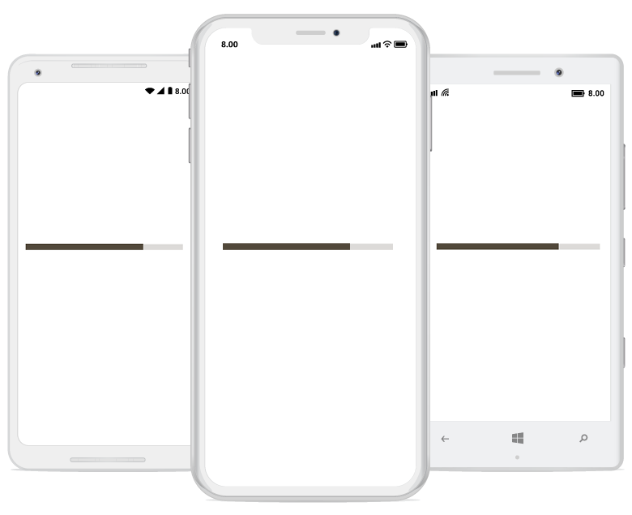
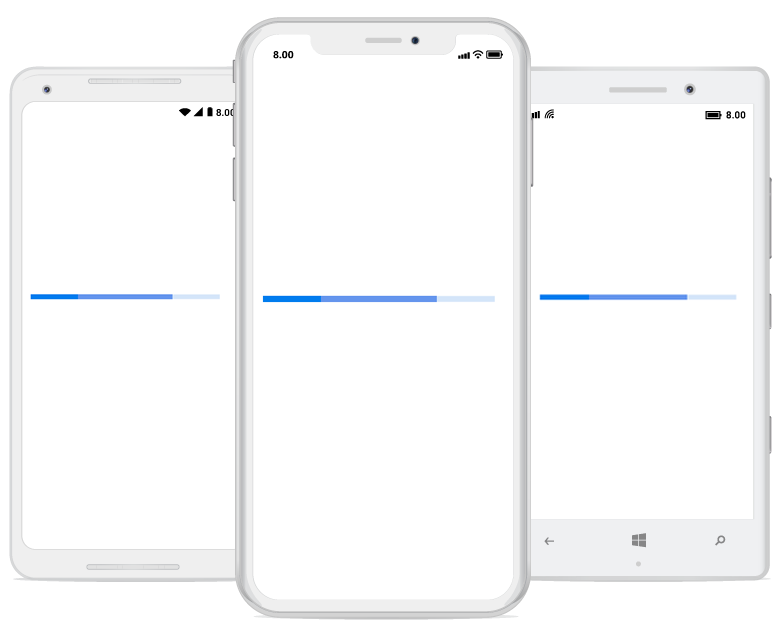

# Appearance

## Angle

The appearance of the circular progress bar can be customized to semi-circle, arc, etc. The start and end angles can be customized using the [`StartAngle`](https://help.syncfusion.com/cr/cref_files/xamarin/Syncfusion.SfProgressBar.XForms~Syncfusion.XForms.ProgressBar.SfCircularProgressBar~StartAngle.html) and [`EndAngle`](https://help.syncfusion.com/cr/cref_files/xamarin/Syncfusion.SfProgressBar.XForms~Syncfusion.XForms.ProgressBar.SfCircularProgressBar~EndAngle.html) properties. 

The following code sample demonstrates how to change the appearance of the circular progress bar to semi-circle.

 



<progressBar:SfCircularProgressBar x:Name="CircularProgressBar" Progress="75" StartAngle="180" EndAngle="360" />





SfCircularProgressBar circularProgressBar = new SfCircularProgressBar();

circularProgressBar.Progress = 75;

circularProgressBar.StartAngle = 180;

circularProgressBar.EndAngle = 360;



 

## Range colors

You can visualize the multiple ranges with different colors that are mapped to each range to enhance the readability of progress. 

The colors can be mapped to the specific ranges using the [`RangeColors`](https://help.syncfusion.com/cr/cref_files/xamarin/Syncfusion.SfProgressBar.XForms~Syncfusion.XForms.ProgressBar.ProgressBarBase~RangeColors.html) property, which holds a collection of [`RangeColor`](https://help.syncfusion.com/cr/cref_files/xamarin/Syncfusion.SfProgressBar.XForms~Syncfusion.XForms.ProgressBar.RangeColor.html). 

The following properties in the [`RangeColor`](https://help.syncfusion.com/cr/cref_files/xamarin/Syncfusion.SfProgressBar.XForms~Syncfusion.XForms.ProgressBar.RangeColor.html) are used to map the colors to a range:

* [`Color`](https://help.syncfusion.com/cr/cref_files/xamarin/Syncfusion.SfProgressBar.XForms~Syncfusion.XForms.ProgressBar.RangeColor~Color.html): Represents the color to the specified range.
* [`Start`](https://help.syncfusion.com/cr/cref_files/xamarin/Syncfusion.SfProgressBar.XForms~Syncfusion.XForms.ProgressBar.RangeColor~Start.html): Represents the start range of the color.
* [`End`](https://help.syncfusion.com/cr/cref_files/xamarin/Syncfusion.SfProgressBar.XForms~Syncfusion.XForms.ProgressBar.RangeColor~End.html): Represents the end range of the color.
* [`IsGradient`](https://help.syncfusion.com/cr/cref_files/xamarin/Syncfusion.SfProgressBar.XForms~Syncfusion.XForms.ProgressBar.RangeColor~IsGradient.html): Represents whether the gradient effect is applied to the color.

The following code sample demonstrates how to map the solid color range in the progress bar.

 



<!--Using linear progress bar-->

<progressBar:SfLinearProgressBar Progress="100">

 <progressBar:SfLinearProgressBar.RangeColors>

   <progressBar:RangeColorCollection>

      <progressBar:RangeColor Color="#00bdaf" Start="0" End="25"/>

      <progressBar:RangeColor Color="#2f7ecc" Start="25" End="50"/>

      <progressBar:RangeColor Color="#e9648e" Start="50" End="75"/>

      <progressBar:RangeColor Color="#fbb78a" Start="75" End="100"/>

    </progressBar:RangeColorCollection>

   </progressBar:SfLinearProgressBar.RangeColors>

</progressBar:SfLinearProgressBar>

<!--Using circular progress bar-->

<progressBar:SfCircularProgressBar Progress="100" ProgressColor="#FF90a84e">

 <progressBar:SfCircularProgressBar.RangeColors>

   <progressBar:RangeColorCollection>

      <progressBar:RangeColor Color="#00bdaf" Start="0" End="25"/>

      <progressBar:RangeColor Color="#2f7ecc" Start="25" End="50"/>

      <progressBar:RangeColor Color="#e9648e" Start="50" End="75"/>

      <progressBar:RangeColor Color="#fbb78a" Start="75" End="100"/>

    </progressBar:RangeColorCollection>

   </progressBar:SfCircularProgressBar.RangeColors>

</progressBar:SfCircularProgressBar>





// Using linear progress bar.

SfLinearProgressBar linearProgressBar = new SfLinearProgressBar();

linearProgressBar.Progress = 100;

linearProgressBar.RangeColors.Add(new RangeColor() { Color = Color.FromHex("00bdaf"), Start = 0, End = 25 });

linearProgressBar.RangeColors.Add(new RangeColor() { Color = Color.FromHex("2f7ecc"), Start = 25, End = 50 });

linearProgressBar.RangeColors.Add(new RangeColor() { Color = Color.FromHex("e9648e"), Start = 50, End = 75 });

linearProgressBar.RangeColors.Add(new RangeColor() { Color = Color.FromHex("fbb78a"), Start = 75, End = 100 });

// Using circular progress bar.

SfCircularProgressBar circularProgressBar = new SfCircularProgressBar();

circularProgressBar.Progress = 100;

circularProgressBar.ProgressColor = Color.FromHex("FF90a84e");

circularProgressBar.RangeColors.Add(new RangeColor() { Color = Color.FromHex("00bdaf"), Start = 0, End = 25 });

circularProgressBar.RangeColors.Add(new RangeColor() { Color = Color.FromHex("2f7ecc"), Start = 25, End = 50 });

circularProgressBar.RangeColors.Add(new RangeColor() { Color = Color.FromHex("e9648e"), Start = 50, End = 75 });

circularProgressBar.RangeColors.Add(new RangeColor() { Color = Color.FromHex("fbb78a"), Start = 75, End = 100 });



 

The following code sample demonstrates how to apply gradient transition effect to the range colors in the linear progress bar.

 



<progressBar:SfLinearProgressBar Progress="100" >

   <progressBar:SfLinearProgressBar.RangeColors>

     <progressBar:RangeColorCollection>

        <progressBar:RangeColor IsGradient="True" Color="#88A0D9EF" Start="0" End="25"/>

        <progressBar:RangeColor IsGradient="True" Color="#AA62C1E5" Start="25" End="50"/>

        <progressBar:RangeColor IsGradient="True" Color="#DD20A7DB" Start="50" End="75"/>

        <progressBar:RangeColor IsGradient="True" Color="#FF1C96C5" Start="75" End="100"/>

   </progressBar:RangeColorCollection>

  </progressBar:SfLinearProgressBar.RangeColors>

</progressBar:SfLinearProgressBar>

<progressBar:SfCircularProgressBar Progress="100" ProgressColor="#FF90a84e">

   <progressBar:SfCircularProgressBar.RangeColors>

     <progressBar:RangeColorCollection>

        <progressBar:RangeColor IsGradient="True" Color="#88A0D9EF" Start="0" End="25"/>

        <progressBar:RangeColor IsGradient="True" Color="#AA62C1E5" Start="25" End="50"/>

        <progressBar:RangeColor IsGradient="True" Color="#DD20A7DB" Start="50" End="75"/>

        <progressBar:RangeColor IsGradient="True" Color="#FF1C96C5" Start="75" End="100"/>

   </progressBar:RangeColorCollection>

  </progressBar:SfCircularProgressBar.RangeColors>

</progressBar:SfCircularProgressBar>





// Using linear progress bar.

SfLinearProgressBar linearProgressBar = new SfLinearProgressBar();

linearProgressBar.Progress = 100;

linearProgressBar.RangeColors.Add(

new RangeColor() { Color = Color.FromHex("88A0D9EF"), IsGradient = true, Start = 0 , End = 25 });

linearProgressBar.RangeColors.Add(

new RangeColor() { Color = Color.FromHex("AA62C1E5"), IsGradient = true, Start = 25, End = 50 });

linearProgressBar.RangeColors.Add(

new RangeColor() { Color = Color.FromHex("DD20A7DB"), IsGradient = true, Start = 50, End = 75 });

linearProgressBar.RangeColors.Add(

new RangeColor() { Color = Color.FromHex("FF1C96C5"), IsGradient = true, Start = 75, End = 100 });

// Using circular progress bar.

SfCircularProgressBar circularProgressBar = new SfCircularProgressBar();

circularProgressBar.Progress = 100;

circularProgressBar.ProgressColor = Color.FromHex("FF90a84e");

circularProgressBar.RangeColors.Add(

new RangeColor() { Color = Color.FromHex("88A0D9EF"), IsGradient = true, Start = 0 , End = 25 });

circularProgressBar.RangeColors.Add(

new RangeColor() { Color = Color.FromHex("AA62C1E5"), IsGradient = true, Start = 25, End = 50 });

circularProgressBar.RangeColors.Add(

new RangeColor() { Color = Color.FromHex("DD20A7DB"), IsGradient = true, Start = 50, End = 75 });

circularProgressBar.RangeColors.Add(

new RangeColor() { Color = Color.FromHex("FF1C96C5"), IsGradient = true, Start = 75, End = 100 });



 

## Thickness

**Linear progress bar**

In the linear progress bar, the height of the track and padding of the progress indicator can be customized using the [`TrackHeight`](https://help.syncfusion.com/cr/cref_files/xamarin/Syncfusion.SfProgressBar.XForms~Syncfusion.XForms.ProgressBar.SfLinearProgressBar~TrackHeight.html) and [`Padding`](https://help.syncfusion.com/cr/cref_files/xamarin/Syncfusion.SfProgressBar.XForms~Syncfusion.XForms.ProgressBar.SfLinearProgressBar~Padding.html) properties, respectively.

 


<progressBar:SfLinearProgressBar Progress="100" TrackHeight="10" Padding="2">

</progressBar:SfLinearProgressBar>




SfLinearProgressBar linearProgressBar = new SfLinearProgressBar();

linearProgressBar.Progress = 100;

linearProgressBar.TrackHeight = 10;

linearProgressBar.Padding = 2;



 

**Circular progress bar**

The following properties are used to customize the appearance of the circular progress bar:

* [`IndicatorOuterRadius`](https://help.syncfusion.com/cr/cref_files/xamarin/Syncfusion.SfProgressBar.XForms~Syncfusion.XForms.ProgressBar.SfCircularProgressBar~IndicatorOuterRadius.html): Defines the outer radius of the progress indicator.
* [`IndicatorInnerRadius`](https://help.syncfusion.com/cr/cref_files/xamarin/Syncfusion.SfProgressBar.XForms~Syncfusion.XForms.ProgressBar.SfCircularProgressBar~IndicatorInnerRadius.html): Defines the inner radius of the progress indicator.
* [`TrackOuterRadius`](https://help.syncfusion.com/cr/cref_files/xamarin/Syncfusion.SfProgressBar.XForms~Syncfusion.XForms.ProgressBar.SfCircularProgressBar~TrackOuterRadius.html): Defines the outer radius of the track indicator.
* [`TrackInnerRadius`](https://help.syncfusion.com/cr/cref_files/xamarin/Syncfusion.SfProgressBar.XForms~Syncfusion.XForms.ProgressBar.SfCircularProgressBar~TrackInnerRadius.html): Defines the inner radius of the track indicator.

The following code sample demonstrates how to customize the appearance of circular progress bar.

 



<!--Circular progress bar with radius customization -->

<progressBar:SfCircularProgressBar x:Name="TrackOutsideProgressBar" Grid.Column="0" Grid.Row="0"
                                   Progress="75" Margin="0,10,0,0" IndicatorOuterRadius="0.7" 
                                   IndicatorInnerRadius="0.65" ShowProgressValue="False">
</progressBar:SfCircularProgressBar>       




SfCircularProgressBar trackOutsideProgressBar = new SfCircularProgressBar();

trackOutsideProgressBar.Progress = 75;

trackOutsideProgressBar.IndicatorOuterRadius = 0.7;

trackOutsideProgressBar.IndicatorInnerRadius = 0.65;

trackOutsideProgressBar.ShowProgressValue = false;



 

## Corner radius

The [`CornerRadius`](https://help.syncfusion.com/cr/cref_files/xamarin/Syncfusion.SfProgressBar.XForms~Syncfusion.XForms.ProgressBar.SfLinearProgressBar~CornerRadius.html) property is used to customize the rounded edges in the linear progress bar as demonstrated in the following code sample.

 


<progressBar:SfLinearProgressBar Progress="50" TrackHeight="10" CornerRadius="10">

</progressBar:SfLinearProgressBar>





SfLinearProgressBar linearProgressBar = new SfLinearProgressBar();

linearProgressBar.Progress = 50;

linearProgressBar.CornerRadius = 10;



 

## Color customization

The following properties are used to customize the color in the progress bar:

* [`ProgressColor`](https://help.syncfusion.com/cr/cref_files/xamarin/Syncfusion.SfProgressBar.XForms~Syncfusion.XForms.ProgressBar.ProgressBarBase~ProgressColor.html): Represents the color of the progress indicator.
* [`TrackColor`](https://help.syncfusion.com/cr/cref_files/xamarin/Syncfusion.SfProgressBar.XForms~Syncfusion.XForms.ProgressBar.ProgressBarBase~TrackColor.html): Represents the color of the track indicator.

The following code sample demonstrates the color customization in progress and track indicator.

 


<progressBar:SfLinearProgressBar Progress="75" TrackColor="#3351483a" ProgressColor="#FF51483a">

</progressBar:SfLinearProgressBar>




SfLinearProgressBar linearProgressBar = new SfLinearProgressBar();

linearProgressBar.Progress = 75;

linearProgressBar.ProgressColor = Color.FromHex("FF51483a");

linearProgressBar.TrackColor = Color.FromHex("3351483a");



 

The linear progress bar provides support to customize the color for the secondary progress bar using the [`SecondaryProgressColor`](https://help.syncfusion.com/cr/cref_files/xamarin/Syncfusion.SfProgressBar.XForms~Syncfusion.XForms.ProgressBar.SfLinearProgressBar~SecondaryProgressColor.html) property as demonstrated in the following code sample.

 


<progressBar:SfLinearProgressBar Progress="25" SecondaryProgress="75" SecondaryProgressColor="CornflowerBlue"></progressBar:SfLinearProgressBar>



SfLinearProgressBar linearProgressBar = new SfLinearProgressBar();

linearProgressBar.Progress = 25;

linearProgressBar.SecondaryProgress = 75;

linearProgressBar.SecondaryProgressColor = Color.CornflowerBlue;



 

