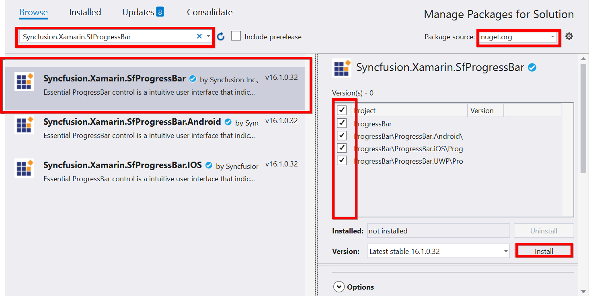
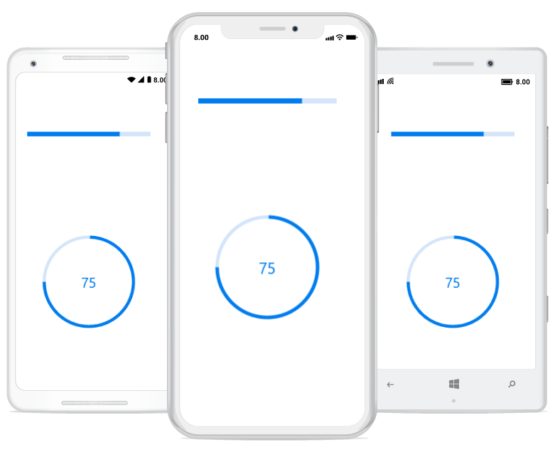

# Getting Started

This section explains the steps required to work with progress bar in Xamarin.Forms.

## Assembly deployment

After installing Essential Studio for Xamarin, find all the required assemblies in the installation folders {Syncfusion Essential Studio Installed location}\Essential Studio\{{ site.releaseversion }}\Xamarin\lib.

Eg: C:\Program Files (x86)\Syncfusion\Essential Studio\{{ site.releaseversion }}\Xamarin\lib.

N> Assemblies can be found in an unzipped package location in Mac.

### Adding SfProgressBar Reference

Syncfusion Xamarin components are available in [nuget.org](https://www.nuget.org/). To add SfProgressBar to your project, open the NuGet package manager in Visual Studio, and search for [Syncfusion.Xamarin.SfProgressBar](https://www.nuget.org/packages/Syncfusion.Xamarin.SfProgressBar/), and then install it.

To know more about obtaining our components, refer to these links: [Mac](https://help.syncfusion.com/xamarin/introduction/download-and-installation/mac) and [Windows](https://help.syncfusion.com/xamarin/introduction/download-and-installation/windows). Also, if you prefer to manually refer the assemblies instead of NuGet, refer to this [link](https://help.syncfusion.com/xamarin/introduction/control-dependencies#progress-bar) to know about the dependent assemblies for SfProgressBar.

N> When there is a mismatch between the Syncfusion NuGet packages among the projects, `System.IO.FileLoadException` will occur. To overcome this exception, install the same version of the SfProgressBar assemblies in all the projects. 

## Launching the SfProgressBar on each platform

To use the SfProgressBar inside an application, each platform application must initialize the SfLinearProgressBarRenderer or SfCircularProgressBarRenderer renderer. This initialization step varies from platform to platform and is discussed in the following sections:

### Android

The Android launches the SfProgressBar without any initialization and is enough to only initialize the Xamarin.Forms Framework to launch the application.

### iOS

To launch the SfProgressBar in iOS, call the `SfLinearProgressBarRenderer.Init()` or`SfCircularProgressBarRenderer.Init()` in the `FinishedLaunching` overridden method of the AppDelegate class after the Xamarin.Forms Framework initialization and before the LoadApplication is called as demonstrated in the following code example:


public override bool FinishedLaunching(UIApplication app, NSDictionary options)
{
    …
  global::Xamarin.Forms.Forms.Init();
  
  //Using linear progress bar.           
  SfLinearProgressBarRenderer.Init();

  //Using circular progress bar.
  SfCircularProgressBarRenderer.Init();

  LoadApplication(new App());
    …
}
 

### Universal Windows Platform (UWP)

To launch the SfProgressBar in UWP, intialize the `SfLinearProgressRenderer()` or `SfCircularProgressBarRenderer()` in the `MainPage` constructor before the LoadApplication is called as demonstrated in the following code example.


public MainPage()
{
    …
    // Add the below line if you are using SfLinearProgressBar. 
       new Syncfusion.XForms.UWP.ProgressBar.SfLinearProgressRenderer();
  
    // Add the below line if you are using SfCircularProgressBar.                
    new Syncfusion.XForms.UWP.ProgressBar.SfCircularProgressBarRenderer();
    LoadApplication (new App ());
    …
}



### Release mode issue in UWP platform

The known Framework issue in UWP platform is the custom controls will not render when deployed the application in `Release Mode`. It can be resolved by initializing the SfProgressBar assemblies in `App.xaml.cs` in UWP project as in the following code snippet.


// In App.xaml.cs

protected override void OnLaunched(LaunchActivatedEventArgs e)
{
    …
           if (rootFrame == null)
            {
                List<Assembly> assembliesToInclude = new List<Assembly>();
  
                // Add the below line if you are using SfLinearProgressBar. 
                assembliesToInclude.Add(typeof(Syncfusion.XForms.UWP.ProgressBar.SfLinearProgressRenderer).GetTypeInfo().Assembly);
  
                // Add the below line if you are using SfCircularProgressBar.               
                assembliesToInclude.Add(typeof(Syncfusion.XForms.UWP.ProgressBar.SfCircularProgressBarRenderer).GetTypeInfo().Assembly);
                Xamarin.Forms.Forms.Init(e, assembliesToInclude);
            }        
    …     
}


## Initialize the progress bar

Import the progress bar namespace as shown in the following codes in your respective page,

 

 
xmlns:progressBar="clr-namespace:Syncfusion.XForms.ProgressBar;assembly=Syncfusion.SfProgressBar.XForms"



 

using Syncfusion.XForms.ProgressBar;



 

There are two variants of progress bar: SfLinearProgressBar and SfCircularProgressBar. Each render the progress in its own shape such as rectangle and circle respectively. Initialize both the progress bar with a progress value using Progress property as shown in the following code snippet.

 

 
<!--Using linear progress bar-->
<progressBar:SfLinearProgressBar Progress="75"/>

<!--Using circular progress bar-->
<progressBar:SfCircularProgressBar Progress="75"/>


 

// Using linear progress bar. 
SfLinearProgressBar linearProgressBar = new SfLinearProgressBar { Progress = 75 };

// Using circular progress bar.
SfCircularProgressBar circularProgressBar = new SfCircularProgressBar { Progress = 75 };



 

N>By default, the value of progress should be specified between 0 and 100. If you need to specify progress value between 0 and 1, you should specify Minimum property to 0 and Maximum property to 1.

Run the project, and check if you get following output to make sure that you have configured your project properly to add the progress bar.

## Enable indeterminate state

When the progress of a task cannot be shown determinately, you can enable indeterminate state using [IsIndeterminate](https://help.syncfusion.com/cr/cref_files/xamarin/sfprogressbar/Syncfusion.SfProgressBar.XForms~Syncfusion.XForms.ProgressBar.ProgressBarBase~IsIndeterminate.html) property to let user know that some progress is happening in the background.

 

 

<!--Using linear progress bar-->
<progressBar:SfLinearProgressBar IsIndeterminate="True"/>

<!--Using circular progress bar-->
<progressBar:SfCircularProgressBar IsIndeterminate="True"/>



 

// Using linear progress bar.
SfLinearProgressBar linearProgressBar = new SfLinearProgressBar { IsIndeterminate = true };

// Using circular progress bar.
SfCircularProgressBar circularProgressBar = new SfCircularProgressBar { IsIndeterminate = true };


 

## Enable segments

To visualize the progress of a multiple sequential task, split the progress bar into the multiple segments by defining the [SegmentCount](https://help.syncfusion.com/cr/cref_files/xamarin/sfprogressbar/Syncfusion.SfProgressBar.XForms~Syncfusion.XForms.ProgressBar.ProgressBarBase~SegmentCount.html) property as shown in the following code.

 

 
<!--Using linear progress bar-->
<progressBar:SfLinearProgressBar SegmentCount="4" Progress="75"/>

<!--Using circular progress bar-->
<progressBar:SfCircularProgressBar SegmentCount="4" Progress="75"/>


 

// Using linear progress bar.
SfLinearProgressBar linearProgressBar = new SfLinearProgressBar { Progress = 75, SegmentCount = 4 };

// Using circular progress bar.
SfCircularProgressBar circularProgressBar = new SfCircularProgressBar { Progress = 75, SegmentCount = 4 };


 

## Apply colors

You can customize the color of the progress indicator and track by defining the [ProgressColor](https://help.syncfusion.com/cr/cref_files/xamarin/sfprogressbar/Syncfusion.SfProgressBar.XForms~Syncfusion.XForms.ProgressBar.ProgressBarBase~ProgressColor.html) and [TrackColor](https://help.syncfusion.com/cr/cref_files/xamarin/sfprogressbar/Syncfusion.SfProgressBar.XForms~Syncfusion.XForms.ProgressBar.ProgressBarBase~TrackColor.html) properties respectively.

 

 

<!--Using linear progress bar-->
<progressBar:SfLinearProgressBar Progress="75" TrackColor="#33ffbe06" ProgressColor="#FFffbe06"/>
<progressBar:SfLinearProgressBar Progress="75"  TrackColor="#3351483a" ProgressColor="#FF51483a"/>

<!--Using circular progress bar-->
 <progressBar:SfCircularProgressBar Progress="75" TrackColor="#33c15244" ProgressColor="#FFc15244"/>
<progressBar:SfCircularProgressBar Progress="75" TrackColor="#3390a84e" ProgressColor="#FF90a84e"/>


 

// Using linear progress bar.
SfLinearProgressBar linearProgressBar = new SfLinearProgressBar{Progress = 75,TrackColor = Color.FromHex("#33ffbe06"),ProgressColor = Color.FromHex("#FFffbe06")};
SfLinearProgressBar sfLinearProgressBar = new SfLinearProgressBar{Progress = 75,TrackColor = Color.FromHex("#3351483a"),ProgressColor = Color.FromHex("#FF51483a")};

// Using circular progress bar.
SfCircularProgressBar circularProgressBar = new SfCircularProgressBar{Progress = 75,TrackColor = Color.FromHex("#33c15244"),ProgressColor = Color.FromHex("#FFc15244")};
SfCircularProgressBar sfCircularProgressBar = new SfCircularProgressBar{Progress = 75,TrackColor = Color.FromHex("#3390a84e"),ProgressColor = Color.FromHex("#FF90a84e")};


 

You can find the complete getting started sample from this [link](http://www.syncfusion.com/downloads/support/directtrac/general/ze/ProgressBar-929614915.zip).
