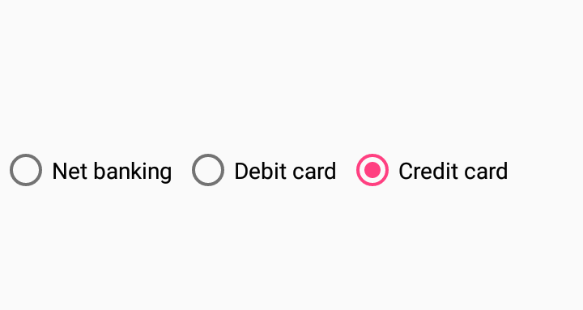

# Grouping support in SfRadioGroup

## Group Key

The [`GroupKey`](https://help.syncfusion.com/cr/cref_files/xamarin/Syncfusion.Buttons.XForms~Syncfusion.XForms.Buttons.SfRadioButton~GroupKey.html) in [`SfRadioButton`](https://help.syncfusion.com/cr/xamarin/Syncfusion.Buttons.XForms~Syncfusion.XForms.Buttons.SfRadioButton.html) allows you to group a set of radio buttons present inside any layout. By grouping in this way, you can select only one radio button that comes under same [`GroupKey`](https://help.syncfusion.com/cr/cref_files/xamarin/Syncfusion.Buttons.XForms~Syncfusion.XForms.Buttons.SfRadioButton~GroupKey.html) at a time.

* [`CheckedItem`](https://help.syncfusion.com/cr/cref_files/xamarin/Syncfusion.Buttons.XForms~Syncfusion.XForms.Buttons.SfRadioGroupKey~CheckedItem.html) - Gets the current checked item from radio group.




<ContentPage.Resources>
    <syncfusion:SfRadioGroupKey x:Key="carBrand" />
</ContentPage.Resources>

<FlexLayout Wrap="Wrap" AlignItems="Start" AlignContent="Start">
    <syncfusion:SfRadioButton Text="Honda" GroupKey="{StaticResource carBrand}"/>
    <syncfusion:SfRadioButton Text="Hyundai" GroupKey="{StaticResource carBrand}"/>
    <syncfusion:SfRadioButton Text="Volkswagen" GroupKey="{StaticResource carBrand}"/>
    <syncfusion:SfRadioButton Text="Toyota" GroupKey="{StaticResource carBrand}"/>
    <syncfusion:SfRadioButton Text="Volvo" GroupKey="{StaticResource carBrand}"/>
</FlexLayout>




SfRadioGroupKey carBrand = new SfRadioGroupKey();

SfRadioButton honda = new SfRadioButton(){Text = "Honda", GroupKey = carBrand};
SfRadioButton hyundai = new SfRadioButton(){Text = "Hyundai", GroupKey = carBrand};
SfRadioButton volkswagen = new SfRadioButton(){Text = "Volkswagen", GroupKey = carBrand};
SfRadioButton toyota = new SfRadioButton(){Text = "Toyota", GroupKey = carBrand};
SfRadioButton volvo = new SfRadioButton(){Text = "Volvo", GroupKey = carBrand};

FlexLayout flexLayout = new FlexLayout()
{
    Wrap = FlexWrap.Wrap,
    AlignContent = FlexAlignContent.Start,
    AlignItems = FlexAlignItems.Start
};
flexLayout.Children.Add(honda);
flexLayout.Children.Add(hyundai);
flexLayout.Children.Add(volkswagen);
flexLayout.Children.Add(toyota);
flexLayout.Children.Add(volvo);




### CheckedChanged event

The [`CheckedChanged`](https://help.syncfusion.com/cr/cref_files/xamarin/Syncfusion.Buttons.XForms~Syncfusion.XForms.Buttons.SfRadioGroupKey~CheckedChanged_EV.html) event of [`SfRadioGroupKey`](https://help.syncfusion.com/cr/cref_files/xamarin/Syncfusion.Buttons.XForms~Syncfusion.XForms.Buttons.SfRadioGroupKey.html) occurs when a checked item is changed. The argument contains the following information:

* [`PreviousItem`](https://help.syncfusion.com/cr/cref_files/xamarin/Syncfusion.Buttons.XForms~Syncfusion.XForms.Buttons.CheckedChangedEventArgs~PreviousItem.html) – Gets the previously checked radio button from group.
* [`CurrentItem`](https://help.syncfusion.com/cr/cref_files/xamarin/Syncfusion.Buttons.XForms~Syncfusion.XForms.Buttons.CheckedChangedEventArgs~CurrentItem.html) – Gets the currently checked radio button from group.

## SfRadioGroup

[`SfRadioGroup`](https://help.syncfusion.com/cr/xamarin/Syncfusion.Buttons.XForms~Syncfusion.XForms.Buttons.SfRadioGroup.html) is a container that contains a set of radio buttons. When you select a radio button in a radio group, all other items will be deselected automatically. At a time, you can select only one radio button from the same radio group. It also contains the [`CheckedChanged`](https://help.syncfusion.com/cr/cref_files/xamarin/Syncfusion.Buttons.XForms~Syncfusion.XForms.Buttons.SfRadioGroup~CheckedChanged_EV.html) event and the [`CheckedItem`](https://help.syncfusion.com/cr/cref_files/xamarin/Syncfusion.Buttons.XForms~Syncfusion.XForms.Buttons.SfRadioGroup~CheckedItem.html) property.




<syncfusion:SfRadioGroup>
    <syncfusion:SfRadioButton Text="Net banking" />
    <syncfusion:SfRadioButton Text="Debit card" />
    <syncfusion:SfRadioButton Text="Credit card" />
</syncfusion:SfRadioGroup>




SfRadioGroup radioGroup = new SfRadioGroup();
SfRadioButton netBanking = new SfRadioButton() {Text = "Net banking"};
SfRadioButton debitCard = new SfRadioButton() {Text = "Debit card"};
SfRadioButton creditCard = new SfRadioButton() {Text = "Credit card"};

radioGroup.Children.Add(netBanking);
radioGroup.Children.Add(debitCard);
radioGroup.Children.Add(creditCard);




### Orientation in SfRadioGroup

`SfRadioGroup` supports horizontal and vertical orientations. By default, SfRadioGroup is rendered with vertical orientation. You can the change the orientation by using the `Orientation` property.




<SyncfusionButton:SfRadioGroup Orientation="Horizontal">
    <SyncfusionButton:SfRadioButton Text="Net banking" />
    <SyncfusionButton:SfRadioButton Text="Debit card" />
    <SyncfusionButton:SfRadioButton Text="Credit card" />
</SyncfusionButton:SfRadioGroup>




SfRadioGroup radioGroup = new SfRadioGroup(){Orientation = StackOrientation.Horizontal};
SfRadioButton netBanking = new SfRadioButton() {Text = "Net banking"};
SfRadioButton debitCard = new SfRadioButton() {Text = "Debit card"};
SfRadioButton creditCard = new SfRadioButton() {Text = "Credit card"};

radioGroup.Children.Add(netBanking);
radioGroup.Children.Add(debitCard);
radioGroup.Children.Add(creditCard);




