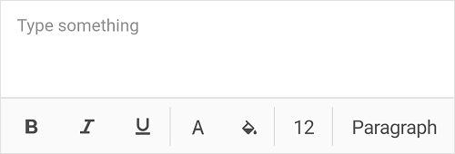

# Customization of Rich Text Editor

The Xamarin Rich Text Editor control provides support for customizing the toolbar items and toolbar appearance.

## ToolbarOptions

The [`ToolbarOptions`](https://help.syncfusion.com/cr/xamarin/Syncfusion.SfRichTextEditor.XForms~Syncfusion.XForms.RichTextEditor.SfRichTextEditor~ToolbarOptions.html) property of [`SfRichTextEditor`](https://help.syncfusion.com/cr/xamarin/Syncfusion.SfRichTextEditor.XForms~Syncfusion.XForms.RichTextEditor.SfRichTextEditor.html) is used to change the toolbar items presented in the toolbar. The following different toolbar items are available in [`SfRichTextEditor`](https://help.syncfusion.com/cr/xamarin/Syncfusion.SfRichTextEditor.XForms~Syncfusion.XForms.RichTextEditor.SfRichTextEditor.html):

* `Alignment`	
* `Bold`
* `BulletList`	
* `ClearFormat`
* `DecreaseIndent`
* `FontColor`
* `FontSize`
* `HighlightColor`
* `Hyperlink`
* `IncreaseIndent`
* `Italic`
* `NumberList`
* `ParagraphFormat`
* `Redo`
* `Underline`
* `Undo`
* `All` - default

 

 

<richtexteditor:SfRichTextEditor x:Name="richtexteditor" VerticalOptions="FillAndExpand" ToolbarOptions="Bold,FontColor,NumberList" Text= "The Xamarin Rich Text Editor control is a WYSIWYG editor that provides a great user experience for composing or editing rich text content from your Xamarin.Forms applications." />
       



 
richtexteditor = new SfRichTextEditor()
{
	VerticalOptions = LayoutOptions.FillAndExpand,
	ToolbarOptions = ToolbarOptions.Bold| ToolbarOptions.FontColor| ToolbarOptions.NumberList,
	Text = "The Xamarin Rich Text Editor control is a WYSIWYG editor that provides a great user experience for composing or editing rich text content from your Xamarin.Forms applications.",
};
this.Content = richtexteditor;




## Customizing toolbar

The appearance of the toolbar can be customized. The [`BackgroundColor`](https://help.syncfusion.com/cr/cref_files/xamarin/Syncfusion.SfRichTextEditor.XForms~Syncfusion.XForms.RichTextEditor.ToolbarSettings~BackgroundColor.html), [`TextColor`](https://help.syncfusion.com/cr/cref_files/xamarin/Syncfusion.SfRichTextEditor.XForms~Syncfusion.XForms.RichTextEditor.ToolbarSettings~TextColor.html), and [`ToolbarBackgroundColor`](https://help.syncfusion.com/cr/cref_files/xamarin/Syncfusion.SfRichTextEditor.XForms~Syncfusion.XForms.RichTextEditor.ToolbarSettings~ToolbarBackgroundColor.html) properties helps to change the background color, text color of toolbar item, and background color of toolbar respectively. The following code example explains how to customize the toolbar appearance.

 

 
<richtexteditor:SfRichTextEditor x:Name="richtexteditor" VerticalOptions="FillAndExpand">
    <richtexteditor:SfRichTextEditor.ToolbarSettings>
        <richtexteditor:ToolbarSettings BackgroundColor="Orange" ToolbarBackgroundColor="DarkBlue" TextColor="DarkBlue"/>
    </richtexteditor:SfRichTextEditor.ToolbarSettings>
</richtexteditor:SfRichTextEditor>      


 
richtexteditor = new SfRichTextEditor();
richtexteditor.VerticalOptions = LayoutOptions.FillAndExpand;
richtexteditor.ToolbarSettings.BackgroundColor = Color.Orange;
richtexteditor.ToolbarSettings.TextColor = Color.DarkBlue;
richtexteditor.ToolbarSettings.ToolbarBackgroundColor = Color.DarkBlue;
this.Content = richtexteditor;




## Placeholder

Specifies the placeholder for the RichTextEditor’s content, which is displayed when the RichTextEditor text is empty. The following code example explains how to set a placeholder for Rich Text Editor.

 

 
<StackLayout>
	<richtexteditor:SfRichTextEditor VerticalOptions="FillAndExpand" PlaceHolder="Type something"/>
</StackLayout>   


 
richtexteditor = new SfRichTextEditor();
richtexteditor.VerticalOptions = LayoutOptions.FillAndExpand;
richtexteditor.PlaceHolder="Type something";
this.Content = richtexteditor;




## Read-only support

Rich Text Editor provides read-only support, which allows the users to restrict editing. Rich Text Editor can be used as HTML Viewer using this feature. The following code example explains how to set read-only mode in Rich Text Editor.

 

 
<StackLayout>
   <richtexteditor:SfRichTextEditor VerticalOptions="FillAndExpand" ReadOnly="True" />
</StackLayout>   


 
richtexteditor = new SfRichTextEditor();
richtexteditor.VerticalOptions = LayoutOptions.FillAndExpand;
richtexteditor.ReadOnly=true;
this.Content = richtexteditor;


