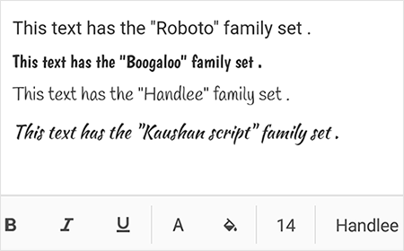

# Font Customization in Xamarin Rich Text Editor(SfRichTextEditor)

The SfRichTextEditor allows you to use TTF fonts in the Rich Text Editor content. The font can be included in the `SfRichTextEditor` using the [`FontButtonCommand`](https://help.syncfusion.com/cr/cref_files/xamarin/Syncfusion.SfRichTextEditor.XForms~Syncfusion.XForms.RichTextEditor.SfRichTextEditor~FontButtonCommand.html) property or the [`FontButtonClicked`](https://help.syncfusion.com/cr/cref_files/xamarin/Syncfusion.SfRichTextEditor.XForms~Syncfusion.XForms.RichTextEditor.SfRichTextEditor~FontButtonClicked_EV.html) event.

## FontButtonCommand command

The following code example shows how to include fonts in Rich Text Editor using the `FontButtonCommand` property.


 

<ContentPage.BindingContext>
<ContentPage.BindingContext>
    <local:ViewModel/>
</ContentPage.BindingContext>
<ContentPage.Content>
    <StackLayout>
        <richtexteditor:SfRichTextEditor x:Name="rte" VerticalOptions="FillAndExpand" FontButtonCommand="{Binding FontButtonCommand}"/>
    </StackLayout>
</ContentPage.Content>




public partial class MainPage : ContentPage
{
    public MainPage()
    {
        InitializeComponent();
    }
}

/// 

/// Represents a view model class of the application
/// 

public class ViewModel : INotifyPropertyChanged
{
    Stream boogalooFontStream, handleeFontStream, kaushanFontStream, pinyonFontStream;
    /// 

    /// Font button command property to be executed when font button is pressed
    /// 

    public ICommand FontButtonCommand { get; set; }

    public ViewModel()
    {
        Assembly assembly = typeof(MainPage).GetTypeInfo().Assembly;
        boogalooFontStream = assembly.GetManifestResourceStream("Sample.Fonts.Boogaloo.ttf");
        handleeFontStream = assembly.GetManifestResourceStream("Sample.Fonts.Handlee.ttf");
        kaushanFontStream = assembly.GetManifestResourceStream("Sample.Fonts.Kaushan Script.ttf");
        pinyonFontStream = assembly.GetManifestResourceStream("Sample.Fonts.Pinyon Script.ttf");
        FontButtonCommand = new Command<object>(LoadFonts);
    }

    /// 

    /// Load the fonts to the font event args
    /// 

    /// <param name="obj"></param>
    void LoadFonts(object obj)
    {
        FontButtonClickedEventArgs fontEventArgs = (obj as FontButtonClickedEventArgs);
        if (!fontEventArgs.FontStreamCollection.ContainsKey("Boogaloo"))
            fontEventArgs.FontStreamCollection.Add("Boogaloo", boogalooFontStream);
        if (!fontEventArgs.FontStreamCollection.ContainsKey("Handlee"))
            fontEventArgs.FontStreamCollection.Add("Handlee", handleeFontStream);
        if (!fontEventArgs.FontStreamCollection.ContainsKey("Kaushan Script"))
            fontEventArgs.FontStreamCollection.Add("Kaushan Script", kaushanFontStream);
        if (!fontEventArgs.FontStreamCollection.ContainsKey("Pinyon Script"))
            fontEventArgs.FontStreamCollection.Add("Pinyon Script", pinyonFontStream);
    }
    /// 

    ///  Property changed event of the NotifyPropertyChanged interface
    /// 

    public event PropertyChangedEventHandler PropertyChanged;

    /// 

    /// Property changed raise method of the NotifyPropertyChanged interface
    /// 

    /// <param name="propertyname">Property that has been changed</param>
    public void RaisePropertyChange([CallerMemberName] string propertyname = null)
    {
        if (PropertyChanged != null)
        {
            PropertyChanged(this, new PropertyChangedEventArgs(propertyname));
        }
    }
}



You can download the sample [here](https://www.syncfusion.com/downloads/support/directtrac/general/ze/Font_Family-1369712876).

## FontButtonClicked Event

The following code example shows how to include fonts in Rich Text Editor using the `FontButtonClicked` event.

 

 
<ContentPage.Content>
    <StackLayout>
        <richtexteditor:SfRichTextEditor x:Name="rte" VerticalOptions="FillAndExpand" FontButtonClicked="rte_FontButtonClicked"/>
    </StackLayout>
</ContentPage.Content>


 
public partial class MainPage : ContentPage
{
    Stream boogalooFontStream, handleeFontStream, kaushanFontStream, pinyonFontStream;
    public MainPage()
    {
        InitializeComponent();
        Assembly assembly = typeof(MainPage).GetTypeInfo().Assembly;
        boogalooFontStream = assembly.GetManifestResourceStream("Sample.Fonts.Boogaloo.ttf");
        handleeFontStream = assembly.GetManifestResourceStream("Sample.Fonts.Handlee.ttf");
        kaushanFontStream = assembly.GetManifestResourceStream("Sample.Fonts.Kaushan Script.ttf");
        pinyonFontStream = assembly.GetManifestResourceStream("Sample.Fonts.Pinyon Script.ttf");
    }

    private void rte_FontButtonClicked(object sender, FontButtonClickedEventArgs e)
    {
        if (!e.FontStreamCollection.ContainsKey("Boogaloo"))
            e.FontStreamCollection.Add("Boogaloo", boogalooFontStream);
        if (!e.FontStreamCollection.ContainsKey("Handlee"))
            e.FontStreamCollection.Add("Handlee", handleeFontStream);
        if (!e.FontStreamCollection.ContainsKey("Kaushan Script"))
            e.FontStreamCollection.Add("Kaushan Script", kaushanFontStream);
        if (!e.FontStreamCollection.ContainsKey("Pinyon Script"))
            e.FontStreamCollection.Add("Pinyon Script", pinyonFontStream);
    }
}



## DefaultFont

The SfRichTextEditor provides support to modify the default font used in the Rich text editor control. The default font of the Rich Text Editor can be changed using the [`DefaultFont`](https://help.syncfusion.com/cr/cref_files/xamarin/Syncfusion.SfRichTextEditor.XForms~Syncfusion.XForms.RichTextEditor.SfRichTextEditor~DefaultFont.html) property.

N> The DefaultFont property accepts fonts as Embedded source, System Font Name, or Base64 TTF string.

 

 

<ContentPage.Content>
    <StackLayout>
        <richtexteditor:SfRichTextEditor x:Name="rte" DefaultFont="monospace" VerticalOptions="FillAndExpand"/>
    </StackLayout>
</ContentPage.Content>
 


 
richtexteditor = new SfRichTextEditor()
{
    VerticalOptions = LayoutOptions.FillAndExpand,
    DefaultFont = "monospace"
};
this.Content = richtexteditor;



## DefaultFontSize

The SfRichTextEditor provides support to modify the default font size used in the Rich text editor control.The default font size of the Rich Text Editor can be changed using the DefaultFontSize property.

 

 

<ContentPage.Content>
    <StackLayout>
        <richtexteditor:SfRichTextEditor x:Name="rte" DefaultFontSize="20" VerticalOptions="FillAndExpand"/>
    </StackLayout>
</ContentPage.Content>
 


 
richtexteditor = new SfRichTextEditor()
{
    VerticalOptions = LayoutOptions.FillAndExpand,
    DefaultFontSize = "20"
};
this.Content = richtexteditor;



## DefaultFontColor

The SfRichTextEditor provides support to modify the default font color used in the Rich text editor control.The default font color of the Rich Text Editor can be changed using the DefaultFontColor property.

 

 

<ContentPage.Content>
    <StackLayout>
        <richtexteditor:SfRichTextEditor x:Name="rte" DefaultFontColor="Blue" VerticalOptions="FillAndExpand"/>
    </StackLayout>
</ContentPage.Content>
 


 
richtexteditor = new SfRichTextEditor()
{
    VerticalOptions = LayoutOptions.FillAndExpand,
    DefaultFontColor = "Blue"
};
this.Content = richtexteditor;

