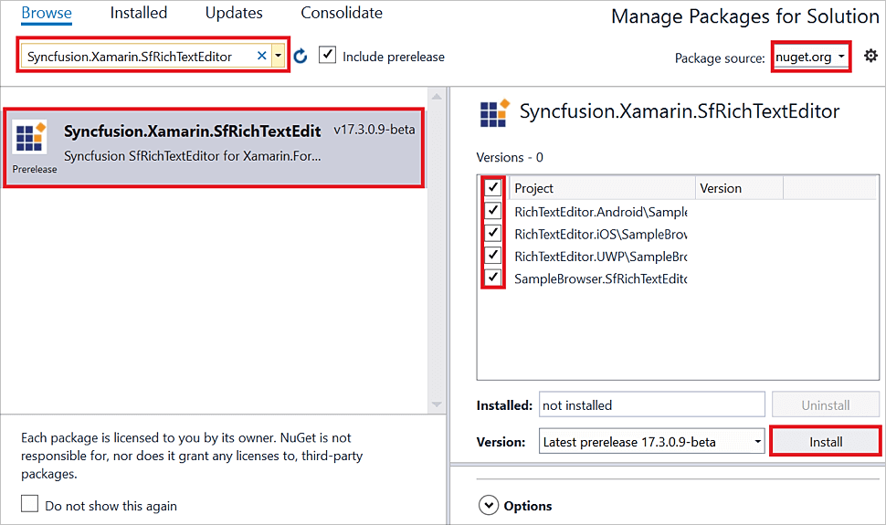

# Getting Started with Xamarin RichTextEditor (SfRichTextEditor)

This section explains the steps required to work with the Rich Text Editor control for Xamarin.Forms.

## Assembly deployment

After installing [Essential Studio for Xamarin](https://www.syncfusion.com/downloads/xamarin), you can find all the required assemblies in the installation folders, {Syncfusion Essential Studio Installed location} \Essential Studio\16.x.x.x\Xamarin\lib

Eg: C:\Program Files (x86) \Syncfusion\Essential Studio\16.1.0.24\Xamarin\lib

N> Assemblies can be found in unzipped package location in Mac.

## Adding SfRichTextEditor reference

You can add Rich Text Editor reference using one of the following methods:

**Method 1: Adding SfRichTextEditor reference from nuget.org**

Syncfusion Xamarin components are available in [nuget.org](https://www.nuget.org/). To add Rich Text Editor to your project, open the NuGet package manager in Visual Studio, search for [Syncfusion.Xamarin.SfRichTextEditor](https://www.nuget.org/packages/Syncfusion.Xamarin.SfRichTextEditor) and then install it.

N> Install the same version of SfRichTextEditor NuGet in all the projects.

**Method 2: Adding SfRichTextEditor reference from toolbox**

Syncfusion also provides Xamarin Toolbox. Using this toolbox, you can drag the Rich Text Editor control to the XAML page. It will automatically install the required NuGet packages and add the namespace to the page. To install Syncfusion Xamarin Toolbox, refer to [Toolbox](https://help.syncfusion.com/xamarin/utility#toolbox).

**Method 3: Adding SfRichTextEditor assemblies manually from the installed location**

If you prefer to manually reference the assemblies instead referencing from the NuGet, add the following assemblies in respective projects.

Location: {Installed location}/{version}/Xamarin/lib

<table>
<tr>
<td>PCL</td>
<td>Syncfusion.SfRichTextEditor.XForms.dll Syncfusion.Core.XForms.dll Syncfusion.Licensing.dll </td>
</tr>
<tr>
<td>Android</td>
<td>Syncfusion.SfRichTextEditor.XForms.Android.dll Syncfusion.SfRichTextEditor.XForms.dll Syncfusion.Core.XForms.dll Syncfusion.Core.XForms.Android.dll Syncfusion.Licensing.dll </td>
</tr>
<tr>
<td>iOS</td>
<td>Syncfusion.SfRichTextEditor.XForms.iOS.dll Syncfusion.SfRichTextEditor.XForms.dll Syncfusion.Core.XForms.dll Syncfusion.Core.XForms.iOS.dll Syncfusion.Licensing.dll </td>
</tr>
<tr>
<td>UWP</td>
<td>Syncfusion.SfRichTextEditor.XForms.UWP.dll Syncfusion.SfRichTextEditor.XForms.dll Syncfusion.Core.XForms.dll Syncfusion.Core.XForms.UWP.dll Syncfusion.Licensing.dll </td>
</tr>
</table>

N> To learn more about obtaining Syncfusion components, refer to [Mac](https://help.syncfusion.com/xamarin/introduction/download-and-installation/mac/) and [Windows](https://help.syncfusion.com/xamarin/introduction/download-and-installation/windows/).

I> Starting with v16.2.0.x, if you reference Syncfusion assemblies from the trial setup or from the NuGet feed, you also have to include a license key in your projects. Refer to the [Syncfusion license key](https://help.syncfusion.com/common/essential-studio/licensing/license-key/) to learn about registering Syncfusion license key in your Xamarin application to use Syncfusion components.

## Launching the application on each platform with Rich Text Editor

To use the Rich Text Editor in an application, each platform requires some additional configurations. The configurations vary from platform to platform and is discussed in the following sections:

N> If you are adding the references from toolbox, this step is not required.

### iOS

To launch the Rich Text Editor in iOS, call the 'SfRichTextEditorRenderer.Init()' in the FinishedLaunching overridden method of the AppDelegate class after the Xamarin.Forms framework has been initialized and before the LoadApplication is called as demonstrated in the following code sample.

 

public override bool FinishedLaunching(UIApplication app, NSDictionary options) 
{ 
    … 
    global::Xamarin.Forms.Forms.Init();

    // Add the below line for using SfRichTextEditor.
    Syncfusion.XForms.iOS.RichTextEditor.SfRichTextEditorRenderer.Init();

    LoadApplication(new App()); 
    …
}



### Universal Windows Platform (UWP)

To launch the Rich Text Editor in UWP, initialize the Rich Text Editor assemblies in App.xaml.cs in UWP project as demonstrated in the following code samples. This is required to deploy the application with Rich Text Editor in `Release` mode in UWP platform.

 

// In App.xaml.cs 
protected override void OnLaunched(LaunchActivatedEventArgs e)
{ 
   … 
   if (rootFrame == null) 
   { 
      List<Assembly> assembliesToInclude = new List<Assembly>();

      // Add the below line for using SfRichTextEditor.
      assembliesToInclude.Add(typeof(Syncfusion.XForms.UWP.RichTextEditor.SfRichTextEditorRenderer).GetTypeInfo().Assembly);

      // Add the below line for using SfButton.
      assembliesToInclude.Add(typeof(Syncfusion.XForms.UWP.Buttons.SfButtonRenderer).GetTypeInfo().Assembly);

      // Add the below line for using SfComboBox.
      assembliesToInclude.Add(typeof(Syncfusion.XForms.UWP.ComboBox.SfComboBoxRenderer).GetTypeInfo().Assembly);

      // Add the below line for using SfBorder.
      assembliesToInclude.Add(typeof(Syncfusion.XForms.UWP.Border.SfBorderRenderer).GetTypeInfo().Assembly);

      Xamarin.Forms.Forms.Init(e, assembliesToInclude); 
   } 
… 
}



### Android

The [SetSoftInputMode](https://developer.android.com/reference/android/view/Window#setSoftInputMode(int)) method need to be invoked in `OnCreate` method of `MainActivity` class  to resize the Rich Text Editor control when it is focused so that both editor and toolbar are visible.

 

// In MainActivity.cs 
protected override void OnCreate(Bundle savedInstanceState)
{
    TabLayoutResource = Resource.Layout.Tabbar;
    ToolbarResource = Resource.Layout.Toolbar;

    base.OnCreate(savedInstanceState);

    Xamarin.Essentials.Platform.Init(this, savedInstanceState);
    global::Xamarin.Forms.Forms.Init(this, savedInstanceState);

    LoadApplication(new App());

    Window.SetSoftInputMode(Android.Views.SoftInput.AdjustResize);
}


## Initializing the Rich Text Editor

Import the Rich Text Editor namespace as demonstrated in the following code sample in your respective page.

 

 

xmlns:richtexteditor="clr-namespace:Syncfusion.XForms.RichTextEditor;assembly=Syncfusion.SfRichTextEditor.XForms"



 

using Syncfusion.XForms.RichTextEditor;



 

Then, initialize the SfRichTextEditor as shown in the following code:

 

 

<StackLayout>
   <richtexteditor:SfRichTextEditor VerticalOptions="FillAndExpand" Text= "The rich text editor component is WYSIWYG editor that provides the best user experience to create and update the content" />
</StackLayout>



 

public MainPage()
{
    InitializeComponent();

    StackLayout stack = new StackLayout();

    SfRichTextEditor editor = new SfRichTextEditor
    {
       VerticalOptions = LayoutOptions.FillAndExpand,
       Text = "The rich text editor component is WYSIWYG editor that provides the best user experience to create and update the content"
    };

    stack.Children.Add(editor);
    this.Content = stack;
}



 

N> SfRichTextEditor is implemented in a WebView. So, the SfRichTextEditor should not be nested inside a ScrollView as mentioned [here](https://docs.microsoft.com/en-us/xamarin/xamarin-forms/user-interface/layouts/scroll-view#usage).

The complete Getting Started sample is available in this [link](https://www.syncfusion.com/downloads/support/directtrac/general/ze/RTE-206415396.zip)