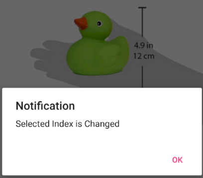
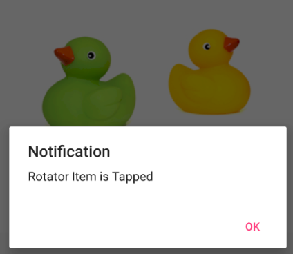

# Events in Xamarin Rotator (SfRotator)

## Selection Changed

The SelectionChanged event is used to notify when the selection is changed by swiping or dynamically setting the SelectedIndex property of SfRotator.

## ItemTapped

The ItemTapped event will be triggered whenever tapping the item.





<?xml version="1.0" encoding="utf-8" ?>
<ContentPage xmlns="http://xamarin.com/schemas/2014/forms"
             xmlns:x="http://schemas.microsoft.com/winfx/2009/xaml"
             xmlns:local="clr-namespace:Rotator"
             xmlns:rotator="clr-namespace:Syncfusion.SfRotator.XForms;assembly=Syncfusion.SfRotator.XForms"
             x:Class="Rotator.MainPage">
    <rotator:SfRotator.BindingContext>
        <local:RotatorViewModel/>
    </rotator:SfRotator.BindingContext>
    <ContentPage.Content>
        <Grid HorizontalOptions="FillAndExpand" VerticalOptions="Fill">
            <rotator:SfRotator x:Name="rotator" 
                               ItemTapped="Rotator_ItemTapped"
                               SelectedIndexChanged="Rotator_SelectedIndexChanged"
                        ItemsSource="{Binding ImageCollection}" 
                        VerticalOptions="Start">
                <rotator:SfRotator.ItemTemplate>
                    <DataTemplate>
                        <StackLayout>
                            <Image Source="{Binding Image}" />
                        </StackLayout>
                    </DataTemplate>
                </rotator:SfRotator.ItemTemplate>
            </rotator:SfRotator>
        </Grid>
    </ContentPage.Content>
</ContentPage>





using Syncfusion.SfRotator.XForms;
using System;
using System.Collections.Generic;
using System.Linq;
using System.Text;
using System.Threading.Tasks;
using Xamarin.Forms;

namespace Rotator
{
    public partial class MainPage : ContentPage
    {

        public MainPage()
        {
            InitializeComponent();
            SfRotator rotator = new SfRotator();
            rotator.ItemTapped += Rotator_ItemTapped;
            rotator.SelectedIndexChanged += Rotator_SelectedIndexChanged;

        }

        private void Rotator_ItemTapped(object sender, EventArgs e)
        {
            DisplayAlert("Notification", "Rotator Item is Tapped", "Ok");
        }

        private void Rotator_SelectedIndexChanged(object sender, SelectedIndexChangedEventArgs e)
        {
            DisplayAlert("Notification", "Selected Index is Changed", "Ok");
        }
    }

    public class RotatorModel
    {
        public RotatorModel(string imageString)
        {
            Image = imageString;
        }
        private String _image;
        public String Image
        {
            get { return _image; }
            set { _image = value; }
        }
    }
}

RotatorViewModel Class:

using System;
using System.Collections.Generic;
using System.Collections.ObjectModel;
using System.Text;

namespace Rotator
{
    public class RotatorViewModel
    {
        public RotatorViewModel()
        {
            ImageCollection.Add(new RotatorModel("movie1.png"));
            ImageCollection.Add(new RotatorModel("image1.png"));
            ImageCollection.Add(new RotatorModel("movie3.png"));
            ImageCollection.Add(new RotatorModel("movie4.png"));
            ImageCollection.Add(new RotatorModel("movie5.png"));
        }

        private ObservableCollection<RotatorModel> imageCollection = new ObservableCollection<RotatorModel>();
        public ObservableCollection<RotatorModel> ImageCollection
        {
            get { return imageCollection; }
            set { imageCollection = value; }
        }
    }
}





The following screenshot illustrates the output of above code.

   

