---

layout: post
title: Customize WeekView at Syncfusion SfSchedule for Xamarin.Forms
description: Learn how to Customize the schedule WeekView in SfSchedule control in Xamarin.Forms
platform: xamarin
control: SfSchedule
documentation: ug

---

# WeekView

WeekView is to view all days of a particular week. Appointments will be arranged based on the dates on the week in respective timeslots.

## ViewHeader Appearance
You can customize the default appearance of view header in [WeekView](https://help.syncfusion.com/cr/cref_files/xamarin/Syncfusion.SfSchedule.XForms~Syncfusion.SfSchedule.XForms.ScheduleView.html) by using [ViewHeaderStyle](https://help.syncfusion.com/cr/cref_files/xamarin/Syncfusion.SfSchedule.XForms~Syncfusion.SfSchedule.XForms.ViewHeaderStyle.html) property of [SfSchedule](https://help.syncfusion.com/cr/cref_files/xamarin/Syncfusion.SfSchedule.XForms~Syncfusion.SfSchedule.XForms.SfSchedule.html).



<schedule:SfSchedule x:Name="schedule" ScheduleView ="WeekView">
	<schedule:SfSchedule.ViewHeaderStyle>
		<schedule:ViewHeaderStyle
				BackgroundColor="#009688" 
				DayTextColor="#FFFFFF" 
				DateTextColor="#FFFFFF" 
				DayFontFamily="Arial" 
				DateFontFamily="Arial">
		</schedule:ViewHeaderStyle>
	</schedule:SfSchedule.ViewHeaderStyle>
</schedule:SfSchedule> 


//Create new instance of Schedule
SfSchedule schedule = new SfSchedule();
schedule.ScheduleView = ScheduleView.WeekView;
//Customize the schedule view header
ViewHeaderStyle viewHeaderStyle = new ViewHeaderStyle();
viewHeaderStyle.BackgroundColor = Color.FromHex("#009688");
viewHeaderStyle.DayTextColor = Color.FromHex("#FFFFFF");
viewHeaderStyle.DateTextColor = Color.FromHex("#FFFFFF");
viewHeaderStyle.DayFontFamily = "Arial";
viewHeaderStyle.DateFontFamily = "Arial";
schedule.ViewHeaderStyle = viewHeaderStyle;



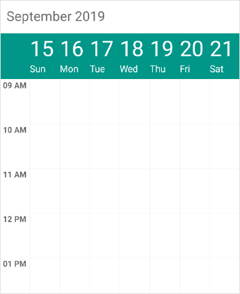

>**NOTE**
FontAttributes and FontFamily are native to the platform. Custom font and the font which are not available in the specified platform will not be applied.
    
You can customize the height of the ViewHeader in `WeekView` by setting [ViewHeaderHeight](https://help.syncfusion.com/cr/cref_files/xamarin/Syncfusion.SfSchedule.XForms~Syncfusion.SfSchedule.XForms.SfSchedule~ViewHeaderHeight.html) property of `SfSchedule`.



<schedule:SfSchedule x:Name="schedule" ScheduleView ="WeekView" ViewHeaderHeight="50" />


schedule.ScheduleView = ScheduleView.WeekView;
schedule.ViewHeaderHeight = 50;



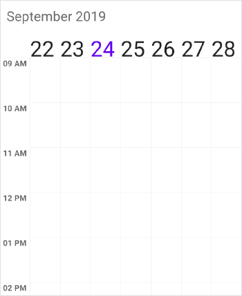

### Customize Font Appearance

you can change the appearance of Font by setting the  [DayFontFamily](http://help.syncfusion.com/cr/cref_files/xamarin/Syncfusion.SfSchedule.XForms~Syncfusion.SfSchedule.XForms.ViewHeaderStyle~DayFontFamilyProperty.html) and [DateFontFamily](http://help.syncfusion.com/cr/cref_files/xamarin/Syncfusion.SfSchedule.XForms~Syncfusion.SfSchedule.XForms.ViewHeaderStyle~DateFontFamilyProperty.html) property of [ViewHeaderStyle](https://help.syncfusion.com/xamarin/sfschedule/dayview#viewheader-appearance) property in Schedule.



<schedule:ViewHeaderStyle.DayFontFamily>
	 <OnPlatform x:TypeArguments="x:String" iOS="Lobster-Regular" Android="Lobster-Regular.ttf" WinPhone="Assets/Lobster-Regular.ttf#Lobster" />
</schedule:ViewHeaderStyle.DayFontFamily>
<schedule:ViewHeaderStyle.DateFontFamily>
	 <OnPlatform x:TypeArguments="x:String" iOS="Lobster-Regular" Android="Lobster-Regular.ttf" WinPhone="Assets/Lobster-Regular.ttf#Lobster" />
</schedule:ViewHeaderStyle.DateFontFamily>


viewHeaderStyle.DayFontFamily = Device.OnPlatform("Lobster-Regular", "Lobster-Regular.ttf", "Assets/Lobster-Regular.ttf#Lobster");
viewHeaderStyle.DateFontFamily = Device.OnPlatform("Lobster-Regular", "Lobster-Regular.ttf", "Assets/Lobster-Regular.ttf#Lobster");



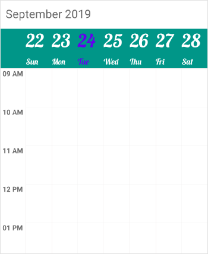

Refer [this](https://help.syncfusion.com/xamarin/sfschedule/monthview#custom-font-setting-in-xamarinforms-android) to configure the custom fonts in Xamarin.Forms.

### ViewHeader Date Format
You can customize the date and day format of `SfSchedule` ViewHeader by using [DateFormat](https://help.syncfusion.com/cr/cref_files/xamarin/Syncfusion.SfSchedule.XForms~Syncfusion.SfSchedule.XForms.WeekLabelSettings~DateFormat.html) and [DayFormat](https://help.syncfusion.com/cr/cref_files/xamarin/Syncfusion.SfSchedule.XForms~Syncfusion.SfSchedule.XForms.WeekLabelSettings~DayFormat.html) properties of `WeekLabelSettings`



<schedule:SfSchedule>
	<schedule:SfSchedule.WeekViewSettings>
		<schedule:WeekViewSettings>
			<schedule:WeekViewSettings.WeekLabelSettings>
				<schedule:WeekLabelSettings DateFormat=“dd”>
					<schedule:WeekLabelSettings.DayFormat>
						<OnPlatform x:TypeArguments="x:String" iOS="EEEE" Android="EEEE" WinPhone="dddd" />
					</schedule:WeekLabelSettings.DayFormat>
				</schedule:WeekLabelSettings>
			</schedule:WeekViewSettings.WeekLabelSettings>
		</schedule:WeekViewSettings>
	</schedule:SfSchedule.WeekViewSettings>
</schedule:SfSchedule>


schedule.ScheduleView = ScheduleView.WeekView;
//Creating new instance of WeekViewSettings
WeekViewSettings weekViewSettings = new WeekViewSettings();
//Creating new instance of WeekLabelSettings
WeekLabelSettings weekLabelSettings = new WeekLabelSettings();
//Customizing date format
weekLabelSettings.DateFormat = "dd";
weekLabelSettings.DayFormat = Device.OnPlatform("EEEE", "EEEE", "dddd");
weekViewSettings.WeekLabelSettings = weekLabelSettings;
schedule.WeekViewSettings = weekViewSettings;



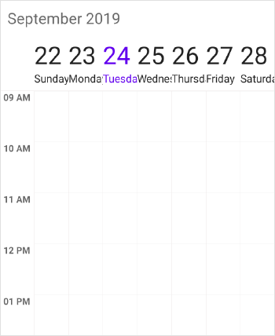

### ViewHeader Tapped Event
You can handle single tap action of ViewHeader by using [ViewHeaderTapped](http://help.syncfusion.com/cr/cref_files/xamarin/Syncfusion.SfSchedule.XForms~Syncfusion.SfSchedule.XForms.SfSchedule~ViewHeaderTapped_EV.html) event of `SfSchedule`. This event will be triggered when the ViewHeader is Tapped. This event contains [ViewHeaderTappedEventArgs](http://help.syncfusion.com/cr/cref_files/xamarin/Syncfusion.SfSchedule.XForms~Syncfusion.SfSchedule.XForms.ViewHeaderTappedEventArgs.html) argument which holds [DateTime](https://help.syncfusion.com/cr/cref_files/xamarin/Syncfusion.SfSchedule.XForms~Syncfusion.SfSchedule.XForms.ViewHeaderTappedEventArgs~Datetime.html) details in it.



<schedule:SfSchedule x:Name="schedule"
                     ScheduleView="WeekView"
                     ViewHeaderTapped="Handle_ViewHeaderTapped">
</schedule:SfSchedule>


//Creating  new instance of Schedule
SfSchedule schedule = new SfSchedule();
schedule.ScheduleView = ScheduleView.WeekView;
schedule.ViewHeaderTapped += Handle_ViewHeaderTapped;





private void Handle_ViewHeaderTapped(object sender, ViewHeaderTappedEventArgs e)
{
    var dateTime = e.DateTime;
}



## Change Time Interval
You can customize the interval of timeslots in `WeekView` by setting [TimeInterval](https://help.syncfusion.com/cr/cref_files/xamarin/Syncfusion.SfSchedule.XForms~Syncfusion.SfSchedule.XForms.SfSchedule~TimeInterval.html)  property of `SfSchedule`.



<schedule:SfSchedule x:Name="schedule" ScheduleView="WeekView" TimeInterval="180"/>


schedule.ScheduleView = ScheduleView.WeekView;
schedule.TimeInterval = 180;



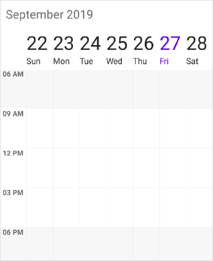

>**NOTE**
If you modify the `TimeInterval` value (in minutes), you need to change the time labels format by setting the `TimeFormat` value as "hh:mm". By default, TimeFormat value is `"hh a"`. You can refer [here](https://help.syncfusion.com/xamarin/sfschedule/weekview#time-label-formatting) for changing TimeFormat value.

## Change Time Interval Height
You can customize the interval height of timeslots in `WeekView` by setting [TimeIntervalHeight](https://help.syncfusion.com/cr/cref_files/xamarin/Syncfusion.SfSchedule.XForms~Syncfusion.SfSchedule.XForms.SfSchedule~TimeIntervalHeight.html)  property of `SfSchedule`.



<schedule:SfSchedule  x:Name="schedule"  ScheduleView="WeekView" TimeIntervalHeight="180"/>


schedule.ScheduleView = ScheduleView.WeekView;
schedule.TimeIntervalHeight = 180;



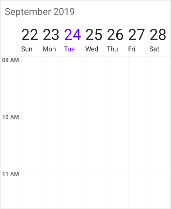

### Full screen scheduler
Schedule time interval height can be adjusted based on screen height by changing the value of `TimeIntervalHeight` property to -1. It will auto-fit to the screen height and width.



<schedule:SfSchedule  x:Name="schedule"  ScheduleView="WeekView" TimeIntervalHeight="-1"/>


schedule.ScheduleView = ScheduleView.WeekView;
schedule.TimeIntervalHeight = -1;



## Change Working hours

Working hours in `WeekView` of Schedule control will be differentiated with non-working hours by separate color. By default, working hours will be between 09 to 18. You can customize the working hours by setting [WorkStartHour](https://help.syncfusion.com/cr/cref_files/xamarin/Syncfusion.SfSchedule.XForms~Syncfusion.SfSchedule.XForms.WeekViewSettings~WorkStartHour.html) and [WorkEndHour](https://help.syncfusion.com/cr/cref_files/xamarin/Syncfusion.SfSchedule.XForms~Syncfusion.SfSchedule.XForms.WeekViewSettings~WorkEndHour.html) properties of   [WeekViewSettings](https://help.syncfusion.com/cr/cref_files/xamarin/Syncfusion.SfSchedule.XForms~Syncfusion.SfSchedule.XForms.SfSchedule~WeekViewSettings.html). You can also customize the working hours along with minutes by setting double value which will be converted to time.



<schedule:SfSchedule x:Name="schedule" ScheduleView="WeekView">
    <schedule:SfSchedule.WeekViewSettings>
        <!--setting working hours properties -->
        <schedule:WeekViewSettings
            WorkStartHour="11.5"
            WorkEndHour="17.5">
            <schedule:WeekViewSettings.WeekLabelSettings>
                <schedule:WeekLabelSettings TimeFormat="hh:mm" />
            </schedule:WeekViewSettings.WeekLabelSettings>
        </schedule:WeekViewSettings>
    </schedule:SfSchedule.WeekViewSettings>
</schedule:SfSchedule>


schedule.ScheduleView = ScheduleView.WeekView;
//Create new instance of WeekViewSettings
WeekViewSettings weekViewSettings = new WeekViewSettings();
WeekLabelSettings weekLabelSettings = new WeekLabelSettings();
weekLabelSettings.TimeFormat = "hh:mm";
weekViewSettings.WorkStartHour = 11.5;
weekViewSettings.WorkEndHour = 14.5;
weekViewSettings.WeekLabelSettings = weekLabelSettings;
schedule.WeekViewSettings = weekViewSettings;



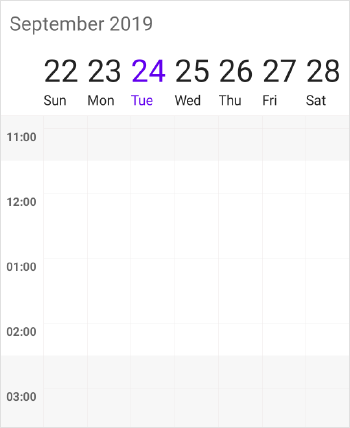

>**NOTE**
No need to specify the decimal point values for `WorkStartHour` and `WorkEndHour`, if you don’t want to set the minutes.

## Changing StartHour and EndHour

Default value for [StartHour](https://help.syncfusion.com/cr/cref_files/xamarin/Syncfusion.SfSchedule.XForms~Syncfusion.SfSchedule.XForms.WeekViewSettings~StartHour.html) and [EndHour](https://help.syncfusion.com/cr/cref_files/xamarin/Syncfusion.SfSchedule.XForms~Syncfusion.SfSchedule.XForms.WeekViewSettings~EndHour.html) value is 0 to 24 to show all the time slots in `WeekView`. You need to set [StartHour](https://help.syncfusion.com/cr/cref_files/xamarin/Syncfusion.SfSchedule.XForms~Syncfusion.SfSchedule.XForms.WeekViewSettings~StartHour.html) and [EndHour](https://help.syncfusion.com/cr/cref_files/xamarin/Syncfusion.SfSchedule.XForms~Syncfusion.SfSchedule.XForms.WeekViewSettings~EndHour.html) property of `WeekView`, to show only the required time duration for end users. You can also set `StartHour` and `EndHour` in double value which will be converted to time to show required time duration in minutes.



<schedule:SfSchedule x:Name="schedule" ScheduleView="WeekView">
    <schedule:SfSchedule.WeekViewSettings>
        <!--setting working hours properties -->
        <schedule:WeekViewSettings
            StartHour="07.5"
            EndHour="18.5">
            <schedule:WeekViewSettings.WeekLabelSettings>
                <schedule:WeekLabelSettings TimeFormat="hh:mm" />
            </schedule:WeekViewSettings.WeekLabelSettings>
        </schedule:WeekViewSettings>
    </schedule:SfSchedule.WeekViewSettings>
</schedule:SfSchedule>


schedule.ScheduleView = ScheduleView.WeekView;
//Create new instance of WeekViewSettings
WeekViewSettings weekViewSettings = new WeekViewSettings();
WeekLabelSettings weekLabelSettings = new WeekLabelSettings();
weekLabelSettings.TimeFormat = "hh:mm";
weekViewSettings.StartHour = 07.5;
weekViewSettings.EndHour = 18.5;
weekViewSettings.WeekLabelSettings = weekLabelSettings;
schedule.WeekViewSettings = weekViewSettings;



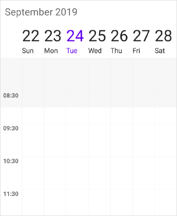

>**NOTE**
* `StartHour` must be greater than or equal to 0 and `EndHour` must be lesser than or equal to 24, otherwise `InvalidDataException` will be thrown.
* `EndHour` value must be greater than `StartHour`, otherwise `InvalidDataException` will be thrown.
* Schedule UI such as Appointments and NonAccessibleBlocks which does not fall within the `StartHour` and `EndHour` will not be visible and if it falls partially, it will be clipped.
* No need to specify the decimal point values for `StartHour` and `EndHour`, if you don’t want to set the minutes.
* The number of time slots will be calculated based on total minutes of a day and time interval (total minutes of a day ((start hour - end hour) * 60) / time interval).
* If custom `TimeInterval` is given, then the number of time slots calculated based on given `TimeInterval` should result in integer value (total minutes % `TimeInterval` = 0), otherwise next immediate time interval that result in integer value when divide total minutes of a day will be considered. For example, if `TimeInterval`="135” (2 Hours 15 minutes) and total minutes = 1440 (24 Hours per day), then `TimeInterval` will be changed to "144” (1440%144=0) by considering (total minutes % TimeInterval = 0); it will return integer value for time slots rendering.
* If the custom `StartHour` and `EndHour` are given, then the number of time slots calculated based on given `StartHour` and `EndHour` should result in integer value, otherwise next immediate `TimeInterval` will be considered until the result is integer value. For example, if `StartHour` is 9 (09:00AM), `EndHour` is 18.25 (06:15 PM), `TimeInterval` is 30 minutes, and total minutes = 555 ((18.25-9)*60), then the `TimeInterval` will be changed to "37” (555%37=0) by considering (total minutes % `TimeInterval` = 0); it will return integer value for time slots rendering.

## Timeslot Appearance
You can customize the appearance of timeslots in `WeekView`.

 * [Timeslot customization in Work hours](#timeslot-customization-in-work-hours)
* [Timeslot customization in Non Working hours](#timeslot-customization-in-non-working-hours)

### Timeslot customization in Work hours

You can customize the appearance of the working hour timeslots by its color using[TimeSlotColor](https://help.syncfusion.com/cr/cref_files/xamarin/Syncfusion.SfSchedule.XForms~Syncfusion.SfSchedule.XForms.WeekViewSettings~TimeSlotColor.html) ,[TimeSlotBorderColor](https://help.syncfusion.com/cr/cref_files/xamarin/Syncfusion.SfSchedule.XForms~Syncfusion.SfSchedule.XForms.WeekViewSettings~TimeSlotBorderColor.html), [VerticalLineStrokeWidth](https://help.syncfusion.com/cr/cref_files/xamarin/Syncfusion.SfSchedule.XForms~Syncfusion.SfSchedule.XForms.WeekViewSettings~VerticalLineStrokeWidth.html), [VerticalLineColor](https://help.syncfusion.com/cr/cref_files/xamarin/Syncfusion.SfSchedule.XForms~Syncfusion.SfSchedule.XForms.WeekViewSettings~VerticalLineColor.html) and [TimeSlotBorderStrokeWidth](https://help.syncfusion.com/cr/cref_files/xamarin/Syncfusion.SfSchedule.XForms~Syncfusion.SfSchedule.XForms.WeekViewSettings~TimeSlotBorderStrokeWidth.html) properties of`WeekViewSettings`.



<schedule:SfSchedule x:Name="schedule" ScheduleView="WeekView">
	<schedule:SfSchedule.WeekViewSettings>
	  <!--setting week view settings properties -->
	  <schedule:WeekViewSettings
		  TimeSlotColor="#fcf3c9"
		  TimeSlotBorderColor="#fceb9f"
		  TimeSlotBorderStrokeWidth="5"
		  VerticalLineStrokeWidth="5"
		  VerticalLineColor="LightGray">
	  </schedule:WeekViewSettings>
	</schedule:SfSchedule.WeekViewSettings>
</schedule:SfSchedule> 


schedule.ScheduleView = ScheduleView.WeekView;
//Create new instance of WeekViewSettings
WeekViewSettings weekViewSettings = new WeekViewSettings();
weekViewSettings.TimeSlotBorderColor = Color.FromHex("#fceb9f") ;
weekViewSettings.VerticalLineColor = Color.LightGray;
weekViewSettings.TimeSlotColor = Color.FromHex("#fcf3c9");
weekViewSettings.TimeSlotBorderStrokeWidth = 5;
weekViewSettings.VerticalLineStrokeWidth = 5;
schedule.WeekViewSettings = weekViewSettings;



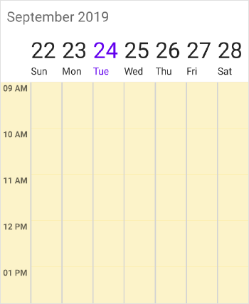

### Timeslot customization in Non Working hours

You can customize the appearance of the non-working hour timeslots by its color using [NonWorkingHoursTimeSlotBorderColor](https://help.syncfusion.com/cr/cref_files/xamarin/Syncfusion.SfSchedule.XForms~Syncfusion.SfSchedule.XForms.WeekViewSettings~NonWorkingHoursTimeSlotBorderColor.html), [NonWorkingHoursTimeSlotColor](https://help.syncfusion.com/cr/cref_files/xamarin/Syncfusion.SfSchedule.XForms~Syncfusion.SfSchedule.XForms.WeekViewSettings~NonWorkingHoursTimeSlotColor.html), `VerticalLineStrokeWidth`, `VerticalLineColor` and `TimeSlotBorderStrokeWidth` properties of `WeekViewSettings`.



<schedule:SfSchedule x:Name="schedule" ScheduleView="WeekView">
	<schedule:SfSchedule.WeekViewSettings>
	  <!--setting week view settings properties -->
		<schedule:WeekViewSettings
			NonWorkingHoursTimeSlotColor="#fcf3c9"
			NonWorkingHoursTimeSlotBorderColor="#fceb9f"
			TimeSlotBorderStrokeWidth="5"
			VerticalLineStrokeWidth="5" 
			VerticalLineColor="LightGray">
		</schedule:WeekViewSettings>
	</schedule:SfSchedule.WeekViewSettings>
</schedule:SfSchedule> 


schedule.ScheduleView = ScheduleView.WeekView;
//Create new instance of WeekViewSettings
WeekViewSettings weekViewSettings = new WeekViewSettings();
weekViewSettings.NonWorkingHoursTimeSlotBorderColor = Color.FromHex("#fceb9f");
weekViewSettings.VerticalLineColor = Color.LightGray;
weekViewSettings.NonWorkingHoursTimeSlotColor = Color.FromHex("#fcf3c9");
weekViewSettings.TimeSlotBorderStrokeWidth = 5;
weekViewSettings.VerticalLineStrokeWidth = 5;
schedule.WeekViewSettings = weekViewSettings;



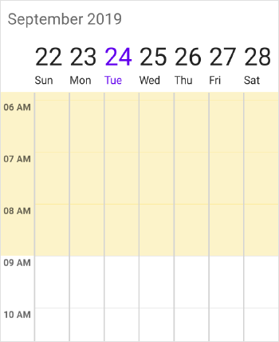

>**NOTE**
`TimeSlotBorderStrokeWidth`and ` VerticalLineStrokeWidth` properties are common to both Working hours and Non-Working hour time slot customization.

## Non-Accessible timeslots

You can restrict or allocate certain timeslot as Non-accessible blocks by using[NonAccessibleBlocks](https://help.syncfusion.com/cr/cref_files/xamarin/Syncfusion.SfSchedule.XForms~Syncfusion.SfSchedule.XForms.WeekViewSettings~NonAccessibleBlocks.html) of `WeekViewSettings` so that you can allocate those timeslots for predefined events/activities like Lunch hour.



<schedule:SfSchedule x:Name="schedule" ScheduleView="WeekView">
	<!--setting non-accessing blocks-->
	<schedule:SfSchedule.WeekViewSettings>
		<schedule:WeekViewSettings>
			<schedule:WeekViewSettings.NonAccessibleBlocks>
				<schedule:NonAccessibleBlock 
					 StartTime="13"
					 EndTime="14"  
					 Text="LUNCH"
					 Color="Black" />
			</schedule:WeekViewSettings.NonAccessibleBlocks>
		</schedule:WeekViewSettings>
	</schedule:SfSchedule.WeekViewSettings>
</schedule:SfSchedule>  


schedule.ScheduleView = ScheduleView.WeekView;
//Create new instance of NonAccessibleBlock
NonAccessibleBlock nonAccessibleBlock = new NonAccessibleBlock();
//Create new instance of NonAccessibleBlocksCollection
NonAccessibleBlocksCollection nonAccessibleBlocksCollection = new NonAccessibleBlocksCollection();
WeekViewSettings weekViewSettings = new WeekViewSettings();
nonAccessibleBlock.StartTime = 13;
nonAccessibleBlock.EndTime = 14;
nonAccessibleBlock.Text = "LUNCH";
nonAccessibleBlock.Color = Color.Black;
nonAccessibleBlocksCollection.Add(nonAccessibleBlock);
weekViewSettings.NonAccessibleBlocks = nonAccessibleBlocksCollection;
schedule.WeekViewSettings = weekViewSettings;



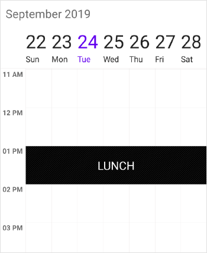

>**NOTE**
Selection and related events will not be working in this blocks.

## Change first day of week
By default, schedule control will be rendered with Sunday as the first day of the week, it can be customized to any day of the week by using[FirstDayOfWeek](https://help.syncfusion.com/cr/cref_files/xamarin/Syncfusion.SfSchedule.XForms~Syncfusion.SfSchedule.XForms.SfSchedule~FirstDayOfWeek.html) property of `SfSchedule`.



<schedule:SfSchedule x:Name="schedule" ScheduleView="WeekView"        FirstDayOfWeek="3"/>


schedule.ScheduleView = ScheduleView.WeekView;
schedule.FirstDayOfWeek = 3;



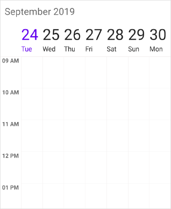

## Time Label Formatting

You can customize the format for the labels which are mentioning the time, by setting [TimeFormat](https://help.syncfusion.com/cr/cref_files/xamarin/Syncfusion.SfSchedule.XForms~Syncfusion.SfSchedule.XForms.WeekLabelSettings~TimeFormat.html) property of [WeekLabelSettings](https://help.syncfusion.com/cr/cref_files/xamarin/Syncfusion.SfSchedule.XForms~Syncfusion.SfSchedule.XForms.WeekViewSettings~WeekLabelSettings.html) in `WeekViewSettings`.



schedule.ScheduleView = ScheduleView.WeekView;
WeekViewSettings weekViewSettings = new WeekViewSettings();
WeekLabelSettings weekLabelSettings = new WeekLabelSettings();
weekLabelSettings.TimeFormat = "hh mm";
weekViewSettings.WeekLabelSettings = weekLabelSettings;
schedule.WeekViewSettings = weekViewSettings;



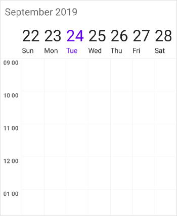

## Time Label Appearance

You can customize the color for the labels which are mentioning the time, by setting [TimeLabelColor](https://help.syncfusion.com/cr/cref_files/xamarin/Syncfusion.SfSchedule.XForms~Syncfusion.SfSchedule.XForms.WeekLabelSettings~TimeLabelColor.html) property of `WeekLabelSettings` in `WeekViewSettings`.



schedule.ScheduleView = ScheduleView.WeekView;
//Create new instance of WeekViewSettings
WeekViewSettings weekViewSettings = new WeekViewSettings();
//Create new instance of WeekLabelSettings
WeekLabelSettings weekLabelSettings = new WeekLabelSettings();
weekLabelSettings.TimeLabelColor = Color.FromHex("#8282ff");
weekViewSettings.WeekLabelSettings = weekLabelSettings;
schedule.WeekViewSettings = weekViewSettings;



## Time Label Size

You can customize the size of the labels which are mentioning the time, by setting [TimeLabelSize](https://help.syncfusion.com/cr/cref_files/xamarin/Syncfusion.SfSchedule.XForms~Syncfusion.SfSchedule.XForms.WeekLabelSettings~TimeLabelSize.html) property of `WeekLabelSettings` in `WeekViewSettings`.



schedule.ScheduleView = ScheduleView.WeekView;
//Create new instance of WeekViewSettings
WeekViewSettings weekViewSettings = new WeekViewSettings();
//Create new instance of WeekLabelSettings
WeekLabelSettings weekLabelSettings = new WeekLabelSettings();
//Customizing the size of the time label
weekLabelSettings.TimeLabelSize = 15;
weekViewSettings.WeekLabelSettings = weekLabelSettings;
schedule.WeekViewSettings = weekViewSettings;



## Time ruler size Customization

You can customize the size of time ruler in `WeekView` by setting the [TimeRulerSize](http://help.syncfusion.com/cr/cref_files/xamarin/Syncfusion.SfSchedule.XForms~Syncfusion.SfSchedule.XForms.WeekViewSettings~TimeRulerSize.html) property in `WeekViewSettings`.



schedule.ScheduleView = ScheduleView.WeekView;
WeekViewSettings weekViewSettings = new WeekViewSettings();
wayViewSettings.TimeRulerSize = 0;
schedule.WeekViewSettings = weekViewSettings;



## Selection
You can customize the default appearance of selection UI in the timeslots.

* [Selection customization using style](#selection-customization-using-style)
* [Selection customization using custom View](#selection-customization-using-custom-view)
* [Programmatic selection](#programmatic-selection)

### Selection customization using style
You can customize the timeslot selection by using [SelectionStyle](https://help.syncfusion.com/cr/cref_files/xamarin/Syncfusion.SfSchedule.XForms~Syncfusion.SfSchedule.XForms.SfSchedule~SelectionStyle.html) property of `SfSchedule`.



<schedule:SfSchedule x:Name="schedule" ScheduleView="WeekView">
	<schedule:SfSchedule.SelectionStyle>
		  <schedule:SelectionStyle 
			  BackgroundColor="Blue"
			  BorderColor="Black"
			  BorderThickness="5" 
			  BorderCornerRadius="5">
		  </schedule:SelectionStyle>
	</schedule:SfSchedule.SelectionStyle>
</schedule:SfSchedule> 


schedule.ScheduleView = ScheduleView.WeekView;
//Create new instance of SelectionStyle
SelectionStyle selectionStyle = new SelectionStyle();
selectionStyle.BackgroundColor = Color.Blue;
selectionStyle.BorderColor = Color.Black;
selectionStyle.BorderThickness = 5;
selectionStyle.BorderCornerRadius = 5;
schedule.SelectionStyle = selectionStyle;



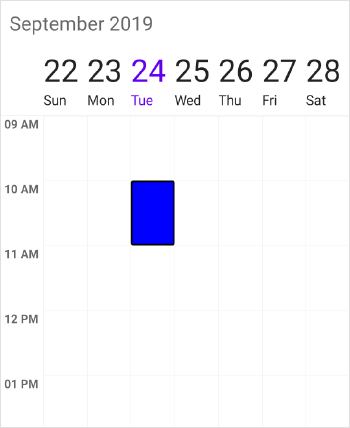

### Selection customization using custom View
You can replace the default selection UI with your custom view by setting [SelectionView](https://help.syncfusion.com/cr/cref_files/xamarin/Syncfusion.SfSchedule.XForms~Syncfusion.SfSchedule.XForms.SfSchedule~SelectionView.html) property of `SfSchedule`.



<schedule:SfSchedule x:Name="schedule" ScheduleView="WeekView">
  <schedule:SfSchedule.SelectionView>
	   <Button 
		   BackgroundColor="#FF9800" 
		   Text="+NewEvent" 
		   TextColor="White"/>
  </schedule:SfSchedule.SelectionView>
</schedule:SfSchedule>


schedule.ScheduleView = ScheduleView.WeekView;
//Add the CustomView
Button customView = new Button();
customView.Text = "+NewEvent";
customView.BackgroundColor = Color.FromHex("#FF9800");
customView.TextColor = Color.White;
schedule.SelectionView = customView;



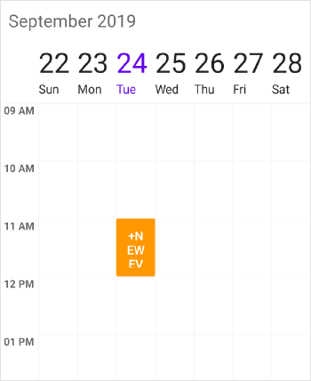

### Programmatic selection
You can programmatically select the specific timeslot by setting corresponding date and time value to [SelectedDate](https://help.syncfusion.com/cr/cref_files/xamarin/Syncfusion.SfSchedule.XForms~Syncfusion.SfSchedule.XForms.SfSchedule~SelectedDate.html) property of `SfSchedule`. By default, it is null.



// Setting a date and time to select
schedule.SelectedDate = new DateTime(2017, 10, 04, 10, 0, 0);



You can clear the selection by setting [SelectedDate](https://help.syncfusion.com/cr/cref_files/xamarin/Syncfusion.SfSchedule.XForms~Syncfusion.SfSchedule.XForms.SfSchedule~SelectedDate.html) as null.



// Setting null value to deselect
schedule.SelectedDate = null;



You can download the entire source code of this demo for Xamarin.Forms from here [Date_Selection](http://www.syncfusion.com/downloads/support/directtrac/general/ze/Date_Selection1072247797.zip)

>**NOTE**
* `SfSchedule` does not support multiple selection.
* `SfSchedule` supports two-way binding of `SelectedDate` property.

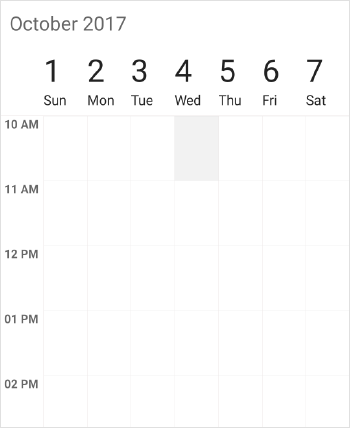

