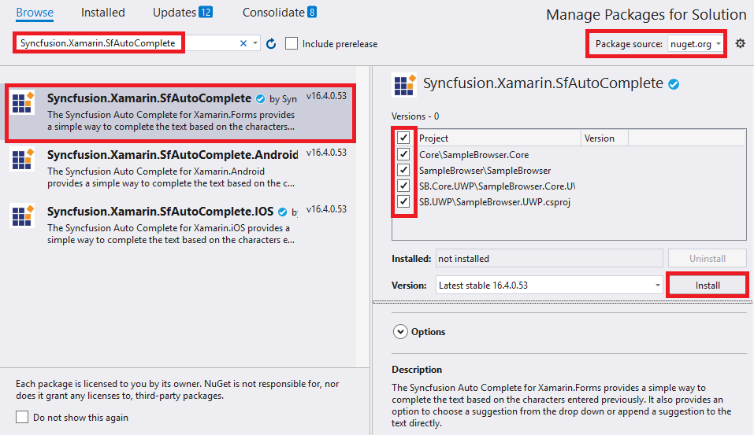
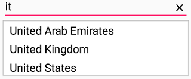

# Getting Started

This section explains the steps to create AutoComplete, populate it with data and filter the suggestions. This section covers only the minimal features that are needed to get started with the AutoComplete.

## Adding SfAutoComplete reference

You can add SfAutoComplete reference using one of the following methods:

**Method 1: Adding SfAutoComplete reference from nuget.org**

Syncfusion Xamarin components are available in [nuget.org](https://www.nuget.org/). To add SfAutoComplete to your project, open the NuGet package manager in Visual Studio, search for [Syncfusion.Xamarin.SfAutoComplete](https://www.nuget.org/packages/Syncfusion.Xamarin.SfAutoComplete), and then install it.

N> Install the same version of SfAutoComplete NuGet in all the projects.

**Method 2: Adding SfAutoComplete reference from toolbox**

Syncfusion also provides Xamarin Toolbox. Using this toolbox, you can drag the SfAutoComplete control to the XAML page. It will automatically install the required NuGet packages and add the namespace to the page. To install Syncfusion Xamarin Toolbox, refer to [Toolbox](https://help.syncfusion.com/xamarin/utility#toolbox).

**Method 3: Adding SfAutoComplete assemblies manually from the installed location**

If you prefer to manually reference the assemblies instead referencing from NuGet, add the following assemblies in respective projects.

Location: {Installed location}/{version}/Xamarin/lib

<table>
<tr>
<td>PCL</td>
<td>Syncfusion.SfAutoComplete.XForms.dll Syncfusion.Core.XForms.dll Syncfusion.Licensing.dll </td>
</tr>
<tr>
<td>Android</td>
<td>Syncfusion.SfAutoComplete.Android.dll Syncfusion.SfAutoComplete.XForms.Android.dll Syncfusion.SfAutoComplete.XForms.dll Syncfusion.Core.XForms.dll Syncfusion.Core.XForms.Android.dll Syncfusion.Licensing.dll </td>
</tr>
<tr>
<td>iOS</td>
<td>Syncfusion.SfAutoComplete.iOS.dll Syncfusion.SfAutoComplete.XForms.iOS.dll Syncfusion.SfAutoComplete.XForms.dll Syncfusion.Core.XForms.dll Syncfusion.Core.XForms.iOS.dll Syncfusion.Licensing.dll </td>
</tr>
<tr>
<td>UWP</td>
<td>Syncfusion.SfInput.UWP.dll Syncfusion.SfShared.UWP.dll Syncfusion.SfAutoComplete.XForms.UWP.dll Syncfusion.SfAutoComplete.XForms.dll Syncfusion.Core.XForms.dll Syncfusion.Core.XForms.UWP.dll Syncfusion.Licensing.dll </td>
</tr>
</table>

N> To know more about obtaining our components, refer to these links for [Mac](https://help.syncfusion.com/xamarin/introduction/download-and-installation/mac/) and [Windows](https://help.syncfusion.com/xamarin/introduction/download-and-installation/windows/).

I> Starting with v16.2.0.x, if you reference Syncfusion assemblies from the trial setup or from the NuGet feed, you also have to include a license key in your projects. Please refer to [Syncfusion license key](https://help.syncfusion.com/common/essential-studio/licensing/license-key/) to know about registering Syncfusion license key in your Xamarin application to use our components.

### Additional Step for iOS

N> If you are adding the references from toolbox, this step is not needed.

Create an instance of `SfAutoCompleteRenderer` in FinishedLaunching overridden method of an AppDelegate class in iOS project as shown below:



public override bool FinishedLaunching(UIApplication app, NSDictionary options)
{
new Syncfusion.SfAutoComplete.XForms.iOS.SfAutoCompleteRenderer();

global::Xamarin.Forms.Forms.Init();

LoadApplication(new App());

return base.FinishedLaunching(app, options);
}	



### Additional Step for UWP

This step is required only if the application is deployed in Release mode with .NET native tool chain enabled and it is for resolving the known Framework issue “Custom controls not rendering in Release mode” in UWP platform. Initializing the SfAutoComplete assembly at OnLaunched overridden method of the App class in UWP project is the suggested workaround. And the code example is shown below:



protected override void OnLaunched(LaunchActivatedEventArgs e)
{
#if DEBUG
if (System.Diagnostics.Debugger.IsAttached)
{
	this.DebugSettings.EnableFrameRateCounter = true;
}
#endif

Frame rootFrame = Window.Current.Content as Frame; 
if (rootFrame == null)
{
	rootFrame = new Frame();
	rootFrame.NavigationFailed += OnNavigationFailed;                
	List<System.Reflection.Assembly> assembliesToInclude = new List<System.Reflection.Assembly>();
	// Add all the renderer assemblies your app uses 
	assembliesToInclude.Add(typeof(Syncfusion.SfAutoComplete.XForms.UWP.SfAutoCompleteRenderer).GetTypeInfo().Assembly);
	// Replace the Xamarin.Forms.Forms.Init(e);        
	Xamarin.Forms.Forms.Init(e, assembliesToInclude);
	if (e.PreviousExecutionState == ApplicationExecutionState.Terminated)
	{
		//TODO: Load state from previously suspended application
	}
	// Place the frame in the current Window
	Window.Current.Content = rootFrame;
}
if (rootFrame.Content == null)
{
	// When the navigation stack isn't restored navigate to the first page,
	// configuring the new page by passing required information as a navigation
	// parameter
	rootFrame.Navigate(typeof(MainPage), e.Arguments);
}
// Ensure the current window is active
Window.Current.Activate();
}



## Initializing AutoComplete 

Import the SfAutoComplete namespace in respective Page as shown below:





xmlns:autocomplete="clr-namespace:Syncfusion.SfAutoComplete.XForms;assembly=Syncfusion.SfAutoComplete.XForms"





using Syncfusion.SfAutoComplete.XForms;





Then initialize an empty autocomplete as shown below,





<StackLayout VerticalOptions="Start" HorizontalOptions="Start" Padding="30">
	<autocomplete:SfAutoComplete HeightRequest="40" x:Name="autoComplete"/>
</StackLayout>
	




StackLayout layout = new StackLayout()
{ 
VerticalOptions = LayoutOptions.Start, 
HorizontalOptions = LayoutOptions.Start,
Padding = new Thickness(30) 
};
SfAutoComplete autoComplete = new SfAutoComplete() 
{
HeightRequest = 40 
};
layout.Children.Add(autoComplete);
Content = layout;





## Populating AutoComplete with Data

Now, let us create a simple list of country names and set it as the `DataSource` of AutoComplete.





<StackLayout VerticalOptions="Start" HorizontalOptions="Start" Padding="30">
	<autocomplete:SfAutoComplete HeightRequest="40" x:Name="autoComplete"/>
</StackLayout>
	




List<String> countryNames = new List<String>();
countryNames.Add("Uganda");
countryNames.Add("Ukraine");
countryNames.Add("Canada");
countryNames.Add("United Arab Emirates");
countryNames.Add("France");
countryNames.Add("United Kingdom");
countryNames.Add("China");
countryNames.Add("United States");
countryNames.Add("Japan");
autoComplete.DataSource = countryNames;





Refer [this](https://help.syncfusion.com/xamarin/sfautocomplete/populating-data) link to learn more about the options available in SfAutoComplete to populate data.

## Configuring filter options

By default, items are filtered in “StartsWith” case insensitive mode and the suggestions are displayed in a drop down popup. Autocomplete can now filter suggestions.

Here in this example, let us configure it to “Contains” case sensitive filter mode. This can be achieved by setting `SuggestionMode` property.
 




<StackLayout VerticalOptions="Start" HorizontalOptions="Start" Padding="30">
	<autocomplete:SfAutoComplete HeightRequest="40" x:Name="autoComplete" SuggestionMode="ContainsWithCaseSensitive"/>
</StackLayout> 





List<String> countryNames = new List<String>();
countryNames.Add("Uganda");
countryNames.Add("Ukraine");
countryNames.Add("Canada");
countryNames.Add("United Arab Emirates");
countryNames.Add("France");
countryNames.Add("United Kingdom");
countryNames.Add("China");
countryNames.Add("United States");
countryNames.Add("Japan");
autoComplete.DataSource = countryNames;
autoComplete.SuggestionMode = Syncfusion.SfAutoComplete.XForms.SuggestionMode.ContainsWithCaseSensitive;





Refer [this](https://help.syncfusion.com/xamarin/sfautocomplete/autocomplete-filtering-options) link to learn more about the options available in SfAutoComplete to filter suggestions.

The complete Getting Started sample is available in [this](http://www.syncfusion.com/downloads/support/directtrac/general/ze/AutoComplete312348434.zip) link.