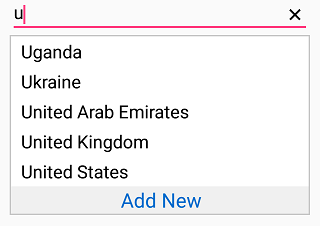

# Header and Footer

We can provide Header and Footer view in the suggestion list in SfAutoComplete by enabling `ShowDropDownHeaderView` and `ShowDropDownFooterView`. 

## Header Content

We can provide Header Content at the top of the AutoComplete's Suggestion box. `DropDownHeaderView` property is used to set the content of the header. The following code example illustrate how to set Header content in SfAutoComplete.





 <StackLayout VerticalOptions="Start" HorizontalOptions="Start" Padding="30">
    <auto:SfAutoComplete HeightRequest="40" x:Name="autoComplete"> 
             <auto:SfAutoComplete.DropDownHeaderView>
                <StackLayout BackgroundColor="#f0f0f0" >
                 <Label  x:Name="label2" FontSize="20" VerticalTextAlignment="Center" HorizontalOptions="Center" VerticalOptions="Center" TextColor="#006bcd" Text="Search"  />
                </StackLayout>
                </auto:SfAutoComplete.DropDownHeaderView>
				 </auto:SfAutoComplete>
 </StackLayout>                  





        List<String> countryNames = new List<String>();
            countryNames.Add("Uganda");
            countryNames.Add("Ukraine");
            countryNames.Add("United Arab Emirates");
            countryNames.Add("United Kingdom");
            countryNames.Add("United States");
            autoComplete.DataSource = countryNames;
            autoComplete.ShowDropDownHeaderView = true;
		    autoComplete.DropDownHeaderViewHeight = 50;





## Header Height

The height of the Header in the SfAutoComplete can be adjusted by the property `DropDownHeaderViewHeight`.





<StackLayout VerticalOptions="Start" HorizontalOptions="Start" Padding="30">
<auto:SfAutoComplete HeightRequest="40" x:Name="autoComplete"  DropDownHeaderViewHeight="50"> 
			<auto:SfAutoComplete.DropDownHeaderView>
			<StackLayout BackgroundColor="#f0f0f0" >
				<Label  x:Name="label2" FontSize="20" VerticalTextAlignment="Center" HorizontalOptions="Center" VerticalOptions="Center" TextColor="#006bcd" Text="Search"  />
			</StackLayout>
			</auto:SfAutoComplete.DropDownHeaderView>
				</auto:SfAutoComplete>
</StackLayout>                  





        List<String> countryNames = new List<String>();
            countryNames.Add("Uganda");
            countryNames.Add("Ukraine");
            countryNames.Add("United Arab Emirates");
            countryNames.Add("United Kingdom");
            countryNames.Add("United States");
            autoComplete.DataSource = countryNames;
            autoComplete.ShowDropDownHeaderView = true;





## Footer Content

We can provide Footer Content at the bottom of the AutoComplete's Suggestion box. `DropDownFooterView` property is used to set the content of the footer. The following code example illustrate how to set Footer content in SfAutoComplete.





<StackLayout VerticalOptions="Start" HorizontalOptions="Start" Padding="30">
<auto:SfAutoComplete HeightRequest="40" x:Name="autoComplete"> 
			<auto:SfAutoComplete.DropDownFooterView>
			<StackLayout BackgroundColor="#f0f0f0" >
				<Label Text="Add New Contact" BackgroundColor="#f0f0f0"           TextColor="#006bcd" VerticalTextAlignment="Center" VerticalOptions="Center" HorizontalTextAlignment="Center"
				FontSize="20"/>
			</StackLayout>
			</auto:SfAutoComplete.DropDownFooterView>
				</auto:SfAutoComplete>
</StackLayout>                  





        List<String> countryNames = new List<String>();
            countryNames.Add("Uganda");
            countryNames.Add("Ukraine");
            countryNames.Add("United Arab Emirates");
            countryNames.Add("United Kingdom");
            countryNames.Add("United States");
            autoComplete.DataSource = countryNames;
            autoComplete.ShowDropDownFooterView = true;
		    autoComplete.DropDownFooterViewHeight = 50;





## Footer Height

The height of the Header in the SfAutoComplete can be adjusted by the property `DropDownFooterViewHeight`.





 <StackLayout VerticalOptions="Start" HorizontalOptions="Start" Padding="30">
    <auto:SfAutoComplete HeightRequest="40" x:Name="autoComplete"  DropDownFooterViewHeight="50"> 
             <auto:SfAutoComplete.DropDownFooterView>
                <StackLayout BackgroundColor="#f0f0f0" >
                 <Label  x:Name="label2" FontSize="20" VerticalTextAlignment="Center" HorizontalOptions="Center" VerticalOptions="Center" TextColor="#006bcd" Text="Search"  />
                </StackLayout>
                </auto:SfAutoComplete.DropDownFooterView>
				 </auto:SfAutoComplete>
 </StackLayout>                  





        List<String> countryNames = new List<String>();
            countryNames.Add("Uganda");
            countryNames.Add("Ukraine");
            countryNames.Add("United Arab Emirates");
            countryNames.Add("United Kingdom");
            countryNames.Add("United States");
            autoComplete.DataSource = countryNames;
            autoComplete.ShowDropDownFooterView = true;





