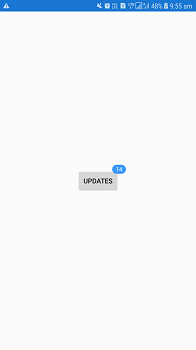

---
layout: post
title: Getting Started with Syncfusion BadgeView control for Xamarin.Forms
description: A quick tour about Syncfusion badgeview control in Xamarin.Forms platform
platform: xamarin
control: SfBadgeView
documentation: ug
---

# Getting Started

This section explains the steps required to configure the badgeview control and customize its elements.

## Adding SfBadgeView reference

Syncfusion components for Xamarin.Forms are available in [nuget.org](https://www.nuget.org/). To add badgeview to your project, open the NuGet package manager in Visual Studio, search for [syncfusion.xamarin.sfbadgeview](https://www.nuget.org/packages/Syncfusion.Xamarin.SfBadgeView), and then install it.

To learn more about obtaining our components, refer to these links for [Mac](https://help.syncfusion.com/xamarin/introduction/download-and-installation/mac) and [Windows](https://help.syncfusion.com/xamarin/introduction/download-and-installation/windows). If you prefer to manually reference the assemblies instead of using NuGet, refer to this [documentation](https://help.syncfusion.com/xamarin/introduction/control-dependencies#sfmaps) to learn about the dependent assemblies.

I> After adding the reference, an additional step is required for iOS and UWP projects. Create an instance of the `SfBadgeViewRenderer` in iOS and UWP projects as described in this [KB article.](https://www.syncfusion.com/kb/8603).

I> For UWP alone, one more additional step is required if the project is built-in release mode with .NET Native tool chain enabled. You can refer to this [KB article](https://www.syncfusion.com/kb/8604) for more details.

## Adding namespace

Add the following namespace.





xmlns:badge ="clr-namespace:Syncfusion.XForms.BadgeView;assembly=Syncfusion.SfBadgeView.XForms"





using Syncfusion.XForms.BadgeView;





## Initializing badge view

Create an instance for the badgeview control, and add it as content.





    <badge:SfBadgeView>
            
    </badge:SfBadgeView>





    SfBadgeView sfBadgeView = new SfBadgeView();

    this.Content = sfBadgeView;
	




## Adding badgetext

You can add a text using [`BadgeText`]() property to the badge.





    <badge:SfBadgeView BadgeText="14">
            
    </badge:SfBadgeView>





    SfBadgeView sfBadgeView = new SfBadgeView();

    sfBadgeView.BadgeText = "14";

    this.Content = sfBadgeView;





## Adding content

You can add an image, button and label to the badge using [`Content`]() property.





    <badge:SfBadgeView>

    <badge:SfBadgeView.Content>

     <Button Text="Updates" />

    </badge:SfBadgeView.Content>
            
    </badge:SfBadgeView>




	
    SfBadgeView sfBadgeView = new SfBadgeView();

    Button button = new Button();

    button.Text = "Updates";

    sfBadgeView.Content = button;

    this.Content = sfBadgeView;


 


## Adding badge type

You can change the colors of the badge using [`BadgeType`]() property. The badge supports the following 8 different essential colors for various situations:

 * Dark

 * Error

 * Info

 * Light

 * None

 * Primary

 * Secondary

 * Success

 * Warning





    <badge:SfBadgeView>

            <badge:SfBadgeView.BadgeSettings>

                <badge:BadgeSetting BadgeType="Info"/>

            </badge:SfBadgeView.BadgeSettings>
            
    </badge:SfBadgeView>          




	
            SfBadgeView sfBadgeView = new SfBadgeView();

            BadgeSetting badgeSetting = new BadgeSetting();

            badgeSetting.BadgeType = BadgeType.Info;

            sfBadgeView.BadgeSettings = badgeSetting;

            this.Content = sfBadgeView; 





## Adding badge position

The default position of the notification is `TopRight`. But, the position can be changed to the `TopLeft`, `BottomLeft` and `BottomRight` using [`BadgePosition`] property.





    <badge:SfBadgeView>

            <badge:SfBadgeView.BadgeSettings>

                <badge:BadgeSetting BadgePosition="TopRight" />

            </badge:SfBadgeView.BadgeSettings>
            
    </badge:SfBadgeView>       




	
            SfBadgeView sfBadgeView = new SfBadgeView();

            BadgeSetting badgeSetting = new BadgeSetting();

            badgeSetting.BadgePosition = BadgePosition.TopRight;

            sfBadgeView.BadgeSettings = badgeSetting;

            this.Content = sfBadgeView;




 
## Adding badge icon

You can change the badge icon using [`BadgeIcon`]() property. Badge supports the following types of [`BadgeIcon`]():

* Add

* Available

* Away

* Busy

* Delete 

* Dot

* None

* Prohibit1

* Prohibit2 





    <badge:SfBadgeView>

            <badge:SfBadgeView.BadgeSettings>

                <badge:BadgeSetting BadgeIcon="None"/>

            </badge:SfBadgeView.BadgeSettings>
            
    </badge:SfBadgeView>>




	
           SfBadgeView sfBadgeView = new SfBadgeView();

            BadgeSetting badgeSetting = new BadgeSetting();

            badgeSetting.BadgeIcon = BadgeIcon.None;

            sfBadgeView.BadgeSettings = badgeSetting;

           this.Content = sfBadgeView; 





The following code sample gives you the complete code for badgeview with badge types and text.





    <?xml version="1.0" encoding="utf-8" ?>

    <ContentPage xmlns="http://xamarin.com/schemas/2014/forms"

             xmlns:x="http://schemas.microsoft.com/winfx/2009/xaml"

             xmlns:local="clr-namespace:GettingStarted"

             x:Class="GettingStarted.MainPage"

             xmlns:badge ="clr-namespace:Syncfusion.XForms.BadgeView;assembly=Syncfusion.SfBadgeView.XForms">

     <ContentPage.Content>

        <badge:SfBadgeView BadgeText="14">
            
            <badge:SfBadgeView.Content>
                
                <Button Text="Updates" />
                
            </badge:SfBadgeView.Content>

            <badge:SfBadgeView.BadgeSettings>

                <badge:BadgeSetting BadgeType="Info" BadgePosition="TopRight"  BadgeIcon="None"/>

            </badge:SfBadgeView.BadgeSettings>
            
         </badge:SfBadgeView>
        
    </ContentPage.Content>

    </ContentPage>





using System;

using System.Collections.Generic;

using System.Linq;

using System.Text;

using System.Threading.Tasks;

using Xamarin.Forms;

using Syncfusion.XForms.BadgeView;

namespace GettingStarted
{
	public partial class MainPage : ContentPage
	{
		public MainPage()
		{
			InitializeComponent();

            SfBadgeView sfBadgeView = new SfBadgeView();

            sfBadgeView.BadgeText = "14";

            Button button = new Button();

            button.Text = "Updates";

            sfBadgeView.Content = button;

            BadgeSetting badgeSetting = new BadgeSetting();

            badgeSetting.BadgeType = BadgeType.Info;

            badgeSetting.BadgePosition = BadgePosition.TopRight;

            badgeSetting.BadgeIcon = BadgeIcon.p;

            sfBadgeView.BadgeSettings = badgeSetting;

           this.Content = sfBadgeView;
		}
	}
}





The following screenshot illustrates the result of the above code sample.

 

You can download the complete [Getting started]() sample.