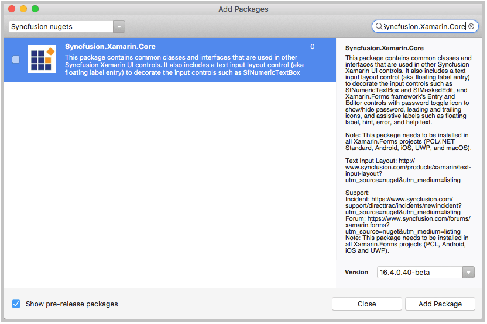

# Getting Started

This section provides an overview for working with the SfBorder control for Xamarin.Forms and explains the entire process of creating a real-world application.

### Adding SfBorder reference

Syncfusion components for Xamarin.Forms are available in [nuget.org](https://www.nuget.org). To add the text input layout control to your project, open the NuGet package manager in Visual Studio, search for [Syncfusion.Xamarin.Core](https://www.nuget.org/packages/Syncfusion.Xamarin.Core), and then install it.

To learn more about obtaining our components, refer to these links for [Mac](https://help.syncfusion.com/xamarin/introduction/download-and-installation/mac) and [Windows](https://help.syncfusion.com/xamarin/introduction/download-and-installation/windows).

N> Install the same version of the core NuGet in all the projects. The text input layout control will be available in core NuGet from v16.3.0.x onwards.

I> From v16.2.0.x, you have to include a license key in your project if you reference Syncfusion assemblies from the trial setup or NuGet feed. Please refer to this [documentation](https://help.syncfusion.com/common/essential-studio/licensing/license-key) to learn about registering Syncfusion license key in your Xamarin applications and using our components.

## Launching an application on each platform with SfBorder.

To use the SfBorder control inside an application, each platform application must initialize the SfBorder renderer. This initialization step varies from platform to platform and is discussed in the following sections:

### Android

Android launches the SfBorder without any initialization, and it is enough to only initialize the Xamarin.Forms Framework to launch the application.

### iOS

To launch the SfBorder in iOS, call the `SfBorderRenderer.Init()` in the `FinishedLaunching` overridden method of the AppDelegate class after the Xamarin.Forms Framework has been initialized and before the LoadApplication is called, as demonstrated in the following code example.


public override bool FinishedLaunching(UIApplication app, NSDictionary options)
{
    …
    global::Xamarin.Forms.Forms.Init ();
    Syncfusion.XForms.iOS.Border.SfBorderRenderer.Init();
    LoadApplication (new App ());
    …
}
 

### Universal Windows Platform (UWP)

To launch SfBorder in UWP, call `SfBorderRenderer.Init()` in the `MainPage` constructor before the LoadApplication is called, as demonstrated in the following code example.


public MainPage()
{
    …
    Syncfusion.XForms.UWP.Border.SfBorderRenderer.Init();
    LoadApplication (new App ());
    …
}


### Release mode issue in UWP platform

The known Framework issue in UWP platform is that the custom controls will not be rendered when deployed an application in `Release Mode`. It can be resolved by initializing the SfBorder assemblies in the `App.xaml.cs` file in the UWP project, as demonstrated in the following code example.


// In App.xaml.cs

protected override void OnLaunched(LaunchActivatedEventArgs e)
    {
        …
    	    rootFrame.NavigationFailed += OnNavigationFailed;
    
        // you'll need to add `using System.Reflection;`
        List<Assembly> assembliesToInclude = new List<Assembly>();
    
        //Now, add all the assemblies your app uses                 
        assembliesToInclude.Add(typeof(Syncfusion.XForms.UWP.Border.SfBorderRenderer).GetTypeInfo().Assembly);
    
        // replaces Xamarin.Forms.Forms.Init(e);        
        Xamarin.Forms.Forms.Init(e, assembliesToInclude);	
        …     
    }



## Creating a project

Create a new BlankApp (Xamarin.Forms.Portable) application in Xamarin Studio or Visual Studio for Xamarin.Forms.

1. Add the required assembly references to the pcl and renderer projects as discussed in the [Assembly deployment](#assembly-deployment) section.

2. Import the SfBorder control namespace as `xmlns:border="clr-namespace:Syncfusion.XForms.Border;assembly=Syncfusion.Core.XForms"` in XAML page.

3. Set the SfBorder control as content to the ContentPage.




<StackLayout>     
<Grid>
<border:SfBorder WidthRequest="80"
 HeightRequest="30"
 CornerRadius="20"
 VerticalOptions="Center"
 HorizontalOptions="Center"
 BorderColor="Red"
 BorderWidth="3">
<Label Text="Rose" 
 TextColor="Black" BackgroundColor="#ffb6c1"
 Font="15" WidthRequest="80" HeightRequest="30" VerticalOptions="Center"
 HorizontalOptions="Center" HorizontalTextAlignment="Center" VerticalTextAlignment="Center"/>
</border:SfBorder>
</Grid>
</StackLayout>




using System;
using Syncfusion.XForms.Border;
using Xamarin.Forms;

namespace BorderGettingStarted
{
    public partial class MainPage : ContentPage
    {
        public MainPage()
        {
            InitializeComponent();
            StackLayout stack = new StackLayout();
            Grid mainGrid = new Grid();
            RowDefinition firstRow = new RowDefinition();
            firstRow.Height = 70;
            mainGrid.RowDefinitions.Add(firstRow);
            
            SfBorder border = new SfBorder();
            border.HeightRequest = 30;
            border.CornerRadius = 20;
            border.VerticalOptions = LayoutOptions.Start;
            border.HorizontalOptions = LayoutOptions.Center;
            border.BorderColor = Color.Red;
            border.BorderWidth = 3;
            Grid.SetRow(border, 0);
            Label label = new Label();
            label.Text = "Rose";
            label.TextColor = Color.Black;
            label.BackgroundColor = Color.FromHex("#ffb6c1");
            label.FontSize = 15;
            label.WidthRequest = 80;
            label.HeightRequest = 30;
            label.VerticalOptions = LayoutOptions.Center;
            label.HorizontalOptions = LayoutOptions.Center;
            label.HorizontalTextAlignment = TextAlignment.Center;
            label.VerticalTextAlignment = TextAlignment.Center;
            border.Content = label;
            mainGrid.Children.Add(border);
            stack.Children.Add(mainGrid);
            this.Content = stack;
        }
    }
}
 



