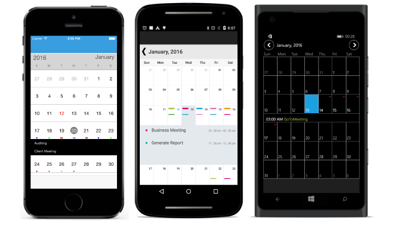

# Create Appointments

This section explains the programmatic creation of appointments in SfCalendar control.

## Programmatic Creation

SfCalendar control has an built-in capability to display the events based on the calendar events collection provided to `DataSource` property. For events to be listed for a particular day, enable the inline feature in month view cell.

The default UI of the inline view with events will be like list of events with a Gray background

Inline event support can be toggled on / off with `ShowInLineEvent` property.
    
    



	<Calendar:SfCalendar  x:Name="calendar" ShowInlineEvents="true" />


    

	
	sfcalendar.ShowInLineEvents=true;
	



	
N> The Inline function will be available only in MonthView with Single selection mode.
	
### Adding Events using Collection

Calendar Events collection can be provided to SfCalendar using the following steps. `CalendarEventCollection` is a class, which holds the details about the events to be rendered in calendar. 

`CalendarInlineEvent` has some basic properties such as `StartTime`, `EndTime` and `Subject`.




	<Calendar:SfCalendar VerticalOptions="FillAndExpand"  ShowInlineEvents="true" x:Name="calendar" ViewMode="MonthView" >
		<CalendarSample:SfCalendar.DataSource>
			<CalendarSample:CalendarInlineEvent Color="Fuchsia" Subject="Go To Meeting" StartTime="2016,7,7" EndTime="2016,7,7"/>
		</CalendarSample:SfCalendar.DataSource>
	</Calendar:SfCalendar>




		   
    CalendarInlineEvent events=new CalendarInlineEvent();
	events.StartTime=new DateTime(2016,1,1);
	events.EndTime=new DateTime(2016,1,1);
	events.Subject="Go to Meeting";

	CalendarEventCollection collection = new CalendarEventCollection();
	collection.Add(events);
	calendar.DataSource = collection;
		   




	

	
