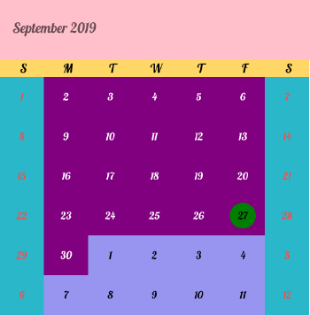
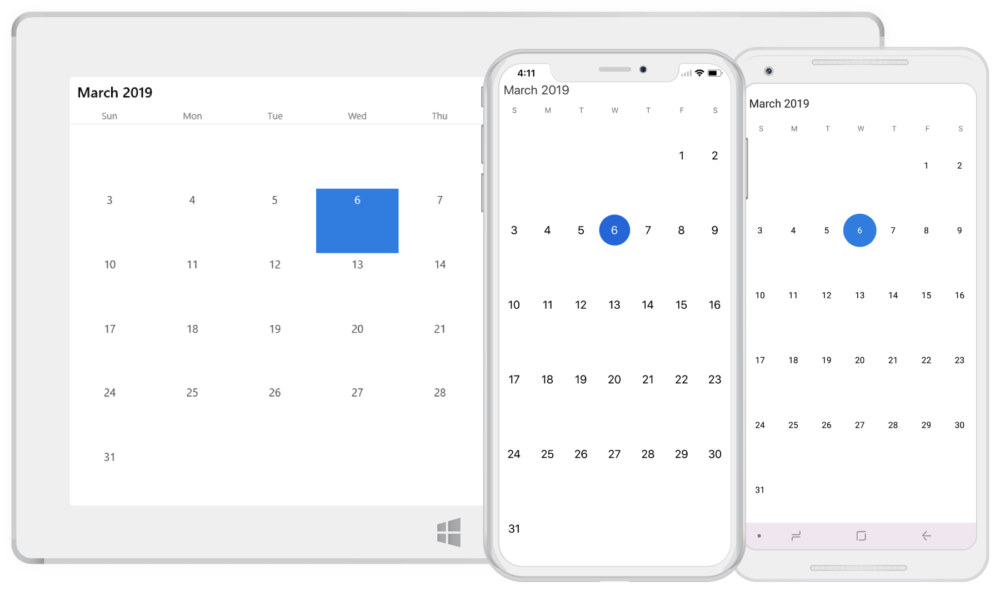

# View of SfCalendar

`SfCalendar` control provides two types of views to display dates such as month view and year view. It can be assigned to the `SfCalendar` control by using [ViewMode](https://help.syncfusion.com/cr/xamarin/Syncfusion.SfCalendar.XForms~Syncfusion.SfCalendar.XForms.SfCalendar~ViewMode.html) property.Based on the user’s preference `SfCalendar` can be viewed in any of the available two types.

N> By default SfCalendar control is assigned with month view. 

## MonthView

This displays entire dates of a particular month, by default current month will be displayed on loading. The current date is provided with separate color different from the rest of the dates color in a month. The events availability will be denoted within the cell based on its duration.

The dates in month view can be selected by three ways such as single, multiple and range which can be modified using [SelectionMode](https://help.syncfusion.com/cr/xamarin/Syncfusion.SfCalendar.XForms~Syncfusion.SfCalendar.XForms.SfCalendar~SelectionMode.html)

### Customization of SfCalendar's dates in MonthView

We can customize the calendar view in monthView mode by using [MonthViewSettings](https://help.syncfusion.com/cr/xamarin/Syncfusion.SfCalendar.XForms~Syncfusion.SfCalendar.XForms.MonthViewSettings.html). 

* Current day text color can be modified using [TodayTextColor](https://help.syncfusion.com/cr/xamarin/Syncfusion.SfCalendar.XForms~Syncfusion.SfCalendar.XForms.MonthViewSettings~TodayTextColor.html).

* It also has API [MonthLabelSettings](https://help.syncfusion.com/cr/xamarin/Syncfusion.SfCalendar.XForms~Syncfusion.SfCalendar.XForms.MonthLabelSettings.html) to change the date text size, day text size and format options.

* The background color of the inline view can be modified using [InlineBackgroundColor](https://help.syncfusion.com/cr/xamarin/Syncfusion.SfCalendar.XForms~Syncfusion.SfCalendar.XForms.MonthViewSettings~InlineBackgroundColor.html) property.

* The BlackOutDate color can be modified with [BlackOutColor](https://help.syncfusion.com/cr/xamarin/Syncfusion.SfCalendar.XForms~Syncfusion.SfCalendar.XForms.MonthViewSettings~BlackoutColor.html) property.





<syncfusion:SfCalendar x:Name="calendar">
            <syncfusion:SfCalendar.MonthViewSettings>
                  <syncfusion:MonthViewSettings 
                        CurrentMonthBackgroundColor="#800080"
                        CurrentMonthTextColor="#ffffff"
                        PreviousMonthBackgroundColor="#9895F0"
                        PreviousMonthTextColor="#000000"
                        DateSelectionColor="#ffffff"
                        SelectedDayTextColor="#000000"
                        >
                     <syncfusion:MonthViewSettings.MonthLabelSettings>  
                       <syncfusion:MonthLabelSettings
                         DateFormat="dd"
                         DayFormat="EEE"
                         DayLabelSize="20"
                         DateLabelSize="12"
                         />
                     </syncfusion:MonthViewSettings.MonthLabelSettings>
                </syncfusion:MonthViewSettings>
           </syncfusion:SfCalendar.MonthViewSettings>
</syncfusion:SfCalendar>  




	
SfCalendar calendar = new SfCalendar();    
MonthLabelSettings labelSettings = new MonthLabelSettings();
labelSettings.DateFormat = "dd";
labelSettings.DayLabelSize = 20;
labelSettings.DayFormat = "EEE";
labelSettings.DateLabelSize = 12;

MonthViewSettings monthViewSettings = new MonthViewSettings();
monthViewSettings.CurrentMonthBackgroundColor = Color.FromHex("#800080");
monthViewSettings.CurrentMonthTextColor = Color.FromHex("#ffffff");
monthViewSettings.PreviousMonthBackgroundColor = Color.FromHex("#9895F0");
monthViewSettings.PreviousMonthTextColor = Color.FromHex("#000000");
monthViewSettings.DateSelectionColor = Color.FromHex("#ffffff");
monthViewSettings.SelectedDayTextColor = Color.FromHex("#000000");

monthViewSettings.MonthLabelSettings = labelSettings;
calendar.MonthViewSettings = monthViewSettings;
this.Content = calendar;
	




N> Similar way there are many settings available to modify Text and Background colors of month view in `MonthViewSettings` class.

### Hide trailing and leading dates

The `SfCalendar` allows you hide the days of the next month and previous month in calendar to enhance the appearance. This can be achieved by enabling the `ShowLeadingAndTrailingDays` property. The following code demonstrates how to hide the leading and trailing dates in calendar.





<syncfusion:SfCalendar  x:Name="calendar" ViewMode="MonthView" ShowLeadingAndTrailingDays = "true"/>





SfCalendar calendar = new SfCalendar();
calendar.ViewMode = ViewMode.MonthView;
calendar.ShowLeadingAndTrailingDays = true;
this.Content = calendar;
 




N>
* The OnMonthCellLoaded event is triggered for the current month dates only.
* The VisibleDates count in the MonthChanged event depends on the current month dates only.

## YearView

This displays entire dates/month of a particular year, by default current year will be displayed on loading. The Years can be changed by swiping back and forth or [Forward](https://help.syncfusion.com/cr/xamarin/Syncfusion.SfCalendar.XForms~Syncfusion.SfCalendar.XForms.SfCalendar~Forward.html) and [Backward](https://help.syncfusion.com/cr/xamarin/Syncfusion.SfCalendar.XForms~Syncfusion.SfCalendar.XForms.SfCalendar~Backward.html) methods. The Months can be navigated quickly by selecting on the particular month in year view.





<syncfusion:SfCalendar  x:Name="calendar" ViewMode="YearView"/>





SfCalendar calendar = new SfCalendar();
calendar.ViewMode=ViewMode.YearView;
this.Content = calendar;
 



 

### Customization of SfCalendar's dates in YearView

We can customize the calendar view in yearView mode by using [YearViewSettings](https://help.syncfusion.com/cr/xamarin/Syncfusion.SfCalendar.XForms~Syncfusion.SfCalendar.XForms.YearViewSettings.html). 

*  date text color can be modified using [DateTextColor](https://help.syncfusion.com/cr/xamarin/Syncfusion.SfCalendar.XForms~Syncfusion.SfCalendar.XForms.YearViewSettings~DateTextColor.html).

* We can also customize the header, monthLayout in yearView 's textColor and background color.





<syncfusion:SfCalendar x:Name="calendar">
             <syncfusion:SfCalendar.YearViewSettings>
                    <syncfusion:YearViewSettings 
                        LayoutBackground="#ffe4b5"
                        DateTextColor="#E6E6FA"
                        HeaderBackground="#8B4513"
                        YearHeaderTextColor="#FFFFFF"
                    />
                </syncfusion:SfCalendar.YearViewSettings>
</syncfusion:SfCalendar>    




	
SfCalendar calendar = new SfCalendar();        
YearViewSettings yearViewSettings = new YearViewSettings();
yearViewSettings.LayoutBackground = Color.FromHex("#ffe4b5");
yearViewSettings.DateTextColor = Color.FromHex("#E6E6FA");
yearViewSettings.HeaderBackground = Color.FromHex("#8B4513");
yearViewSettings.YearHeaderTextColor = Color.FromHex("#FFFFFF");
calendar.YearViewSettings = yearViewSettings;
this.Content = calendar;





