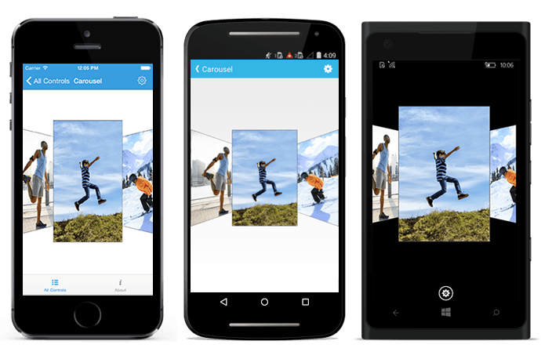

# Getting Started

This section explains how to showcase a Gallery of photos along with a Title using SfCarousel Control.

## Referencing Essential Studio components in your solution

If you had acquired Essential Studio components through the Xamarin component store interface from within your IDE, then after adding the components to your Xamarin.iOS, Xamarin.Android and Windows Phone projects through the Component manager, you will still need to manually reference the PCL (Portable Class Library) assemblies in the Xamarin.Forms PCL project in your solution. You can do this by manually adding the relevant PCL assembly references to your PCL project contained in the following path inside of your solution folder.

Components/syncfusionessentialstudio-version/lib/pcl/

Alternatively if you had downloaded Essential Studio from Syncfusion.com or through the Xamarin store web interface then all assembly references need to be added manually.

After installing Essential Studio for Xamarin, all the required assemblies can be found in the installation folders, typically

{Syncfusion Installed location}\Essential Studio\syncfusionessentialstudio-version\lib

Eg: C:\Program Files (x86)\Syncfusion\Essential Studio\{{ site.releaseversion }}\lib

Or after downloading through the Xamarin store web interface, all the required assemblies can be found in the below folder

{Download location}\syncfusionessentialstudio-version\lib

You can then add the assembly references to the respective projects as shown below.

### PCL 

pcl\Syncfusion.SfCarousel.XForms.dll

### Android 

android\Syncfusion.SfCarousel.Android.dll
android\Syncfusion.SfCarousel.XForms.Android.dll
android\Syncfusion.SfCarousel.XForms.dll
Xamarin.Android.Support.v17.Leanback (from NuGet Packages)
	
### iOS 

iOS-unified\Syncfusion.SfCarousel.iOS.dll
iOS-unified\Syncfusion.SfCarousel.XForms.iOS.dll
iOS-unified\Syncfusion.SfCarousel.XForms.dll

### Windows Phone 8

wp8\Syncfusion.SfCarousel.WP8.dll
wp8\Syncfusion.SfCarousel.XForms.dll
wp8\Syncfusion.SfCarousel.XForms.WinPhone.dll

### Windows Phone 8.1

wp81\Syncfusion.SfCarousel.WP.dll
wp81\Syncfusion.SfCarousel.XForms.dll
wp81\Syncfusion.SfCarousel.XForms.WinPhone.dll

### WinRT 

winrt\Syncfusion.SfCarousel.WinRT.dll
winrt\Syncfusion.SfCarousel.XForms.dll
winrt\Syncfusion.SfCarousel.XForms.WinRT.dll

### UWP

uwp\Syncfusion.SfCarousel.UWP.dll
uwp\Syncfusion.SfCarousel.XForms.dll
uwp\Syncfusion.SfCarousel.XForms.UWP.dll

Currently an additional step is required for Windows Phone, Windows Phone 8.1 and iOS projects. We need to create an instance of the carousel custom renderer as shown below. 

Create an instance of SfCarouselRenderer in MainPage constructor of the Windows Phone and Windows Phone 8.1  project as shown 





public MainPage()
{
    new SfCarouselRenderer();
}





Create an instance of SfCarouselRenderer in FinishedLaunching overridden method of AppDelegate class in iOS Project as shown below.





public override bool FinishedLaunching(UIApplication app, NSDictionary options)
{
    new SfCarouselRenderer ();
}	





## Add SfCarousel

The SfCarousel control is configured entirely in C# code or by using XAML markup. The following steps explain on how to create a SfCarousel and configure its elements,

* Adding namespace for the added assemblies. 





	using Syncfusion.SfCarousel.XForms;





	<xmlns:carousel="clr-namespace:Syncfusion.SfCarousel.XForms;assembly=Syncfusion.SfCarousel.XForms"/>





* Now add the SfCarousel control with a required optimal name by using the included namespace.





	SfCarousel carousel=new SfCarousel();
	this.Content=carousel;





	<ContentPage.Content>

		<carousel:SfCarousel x:Name="carousel"/>
	
	</ContentPage.Content>
	




## Add Carousel Items

SfCarousel items can be populated with a collection of image data. This collection includes Arrays, Lists and DataTables. An example to populate image collection as carousel items as follows

* Create a model view which holds image data



	 public class CarouselModel
	{
		public CarouselModel(string imagestr)
		{
			Image = imagestr;
		}
		private string _image;

		public string Image
		{
			get { return _image; }
			set { _image = value; }
		}
	}



* Populate carousel items collection in Viewmodel with the image data. The below code works when the images are placed within the application folder for Android,iOS and UWP with build action AndroidResource,BundledResource and Content respectively.



	public class CarouselViewModel
	{
		public CarouselViewModel()
		{
			ImageCollection.Add(new CarouselModel("image1.png"));
			ImageCollection.Add(new CarouselModel("image2.png"));
			ImageCollection.Add(new CarouselModel("image3.png"));
			ImageCollection.Add(new CarouselModel("image4.png"));
			ImageCollection.Add(new CarouselModel("image5.png"));
		}
		private List<CarouselModel> imageCollection = new List<CarouselModel>();

		public List<CarouselModel> ImageCollection
		{
			get { return imageCollection; }
			set { imageCollection = value; }
		}
	}


* `ItemTemplate` property of SfCarousel control is used to customize the contents of SfCarousel items and the data source collection has been bound to it.



	<ContentPage.Resources>
    	<ResourceDictionary>
     	 	<DataTemplate x:Key="itemTemplate">
       	 		<Image Source="{Binding Image}" 
					Aspect="AspectFit"/>
      		</DataTemplate>
    	</ResourceDictionary>
 	 </ContentPage.Resources>

	<ContentPage.Content>
		<carousel:SfCarousel x:Name="carousel"  ItemTemplate="{StaticResource itemTemplate}" DataSource="{Binding ImageCollection}"   HeightRequest="400" WidthRequest="800" />	
	</ContentPage.Content>



* Finally set the `BindingContext` for the items collection in code behind.



	carousel.BindingContext = new CarouselViewModel();



## Set Gap between Items

Set the Offset property to specify the distance between the items in SfCarousel panel. The items can be populated as described [above](#add-carousel-Items)





	SfCarousel carousel = new SfCarousel();
	carousel.SelectedIndex=2;
	carousel.Offset=20;





	<carousel:SfCarousel x:Name="carousel" SelectedIndex="2" Offset="20"/>
	




## Tilt Non Selected Items

Set the `RotationAngle` property to decide the angle in which items should be rotated. The items can be populated as described [above](#add-carousel-Items)





	SfCarousel carousel = new SfCarousel();
	carousel.Offset=20;
	carousel.RotationAngle = 45;





	<carousel:SfCarousel x:Name="carousel" Offset="20" RotationAngle="45" />
	




## Set Desire Item to be Selected

`SelectedIndex` property sets the Selected Item index value of SfCarousel control to bring the particular item to center of the screen. The items can be populated as described [above](#add-carousel-Items)





	SfCarousel carousel = new SfCarousel();
	carousel.SelectedIndex=2;





	<carousel:SfCarousel x:Name="carousel" SelectedIndex="2" />
	




N> The `SelectedIndex` property will be 0 by default

