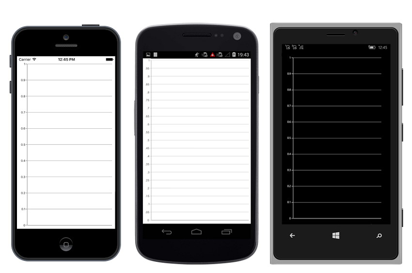

# Getting Started

This section explains you the steps required to populate the Chart with data, title, add data labels and tooltips to the Chart. This section covers only the minimal features that you need to know to get started with the Chart.

## Adding Chart Reference

Refer this [article](https://help.syncfusion.com/xamarin/introduction/download-and-installation) to know how to obtain and reference Essential Studio components in your solution; then refer [this](https://help.syncfusion.com/xamarin/introduction/control-dependencies) link to know about the assemblies required for adding Chart to your project.

N> After adding the reference, currently, an additional step is required for iOS and UWP projects. We need to create an instance of the SfChartRenderer as shown in this [KB article.](https://www.syncfusion.com/kb/7144/how-to-resolve-sfchart-not-rendering-issue-in-ios-and-uwp)

## Initialize Chart

Import the SfChart namespace as shown below in your respective Page,

 

 

using Syncfusion.SfChart.XForms;



 

xmlns:chart="clr-namespace:Syncfusion.SfChart.XForms;assembly=Syncfusion.SfChart.XForms" 



 

Then initialize an empty chart with two axes as shown below,

 

 
SfChart chart = new SfChart();

 //Initializing Primary Axis
CategoryAxis primaryAxis = new CategoryAxis();

chart.PrimaryAxis = primaryAxis;

//Initializing Secondary Axis
NumericalAxis secondaryAxis  =  new NumericalAxis  ();

chart.SecondaryAxis = secondaryAxis;

this.Content = chart;


 
<chart:SfChart>

    <chart:SfChart.PrimaryAxis>

        <chart:CategoryAxis>

            <chart:CategoryAxis></chart:CategoryAxis>  

        </chart:CategoryAxis>

    </chart:SfChart.PrimaryAxis>

    <chart:SfChart.SecondaryAxis>

        <chart:NumericalAxis>

            <chart:NumericalAxis></chart:NumericalAxis>   

        </chart:NumericalAxis>

    </chart:SfChart.SecondaryAxis>
		  
</chart:SfChart>


 

Run the project and check if you get following output to make sure you have configured your project properly to add SfChart.

## Initialize view model

Now, let us define a simple data model that represents a data point in SfChart.


public class Model   
{   
    public string Name { get; set; }

    public double Height { get; set; }
}
 

Next, create a view model class and initialize a list of Model objects as shown below,


public class ViewModel  
{
      public List<Model> Data { get; set; }      

      public ViewModel()       
      {
            Data = new List<Model>()
            {
                new Model { Name = "David", Height = 180 },
                new Model { Name = "Michael", Height = 170 },
                new Model { Name = "Steve", Height = 160 },
                new Model { Name = "Joel", Height = 182 }
            }; 
       }
 }
 

Set the ViewModel instance as the BindingContext of your Page; this is done to bind properties of ViewModel to SfChart.
 
N> Add namespace of ViewModel class in your XAML page if you prefer to set BindingContext in XAML.

 

 
this.BindingContext = new ViewModel();


 
<ContentPage xmlns="http://xamarin.com/schemas/2014/forms"

             xmlns:x="http://schemas.microsoft.com/winfx/2009/xaml"

             x:Class="ChartDemo.MainPage"

             xmlns:chart="clr-namespace:Syncfusion.SfChart.XForms;assembly=Syncfusion.SfChart.XForms"

             xmlns:local="clr-namespace:ChartDemo"> 
   
<ContentPage.BindingContext>
       
	<local:ViewModel></local:ViewModel>
   
</ContentPage.BindingContext>
 
</ContentPage>


 

## Populate Chart with data

As we are going to visualize the comparison of heights in the data model, add ColumnSeries to SfChart.Series property, and then bind the Data property of the above ViewModel to the ColumnSeries.ItemsSource property as shown below.

N> You need to set XBindingPath and YBindingPath properties, so that SfChart would fetch values from the respective properties in the data model to plot the series.

   


//Initializing primary axis
CategoryAxis primaryAxis = new CategoryAxis();

primaryAxis.Title.Text = "Name";

chart.PrimaryAxis = primaryAxis;

//Initializing secondary Axis
NumericalAxis secondaryAxis = new NumericalAxis();

secondaryAxis.Title.Text = "Height (in cm)";

chart.SecondaryAxis = secondaryAxis;

//Initializing column series
ColumnSeries series = new ColumnSeries();

series.SetBinding(ChartSeries.ItemsSourceProperty, "Data");

series.XBindingPath = "Name";

series.YBindingPath = "Height";

chart.Series.Add(series);



<chart:SfChart>
   
   <chart:SfChart.PrimaryAxis>
    
        <chart:CategoryAxis>

            <chart:CategoryAxis.Title>

                  <chart:ChartAxisTitle Text=”Name”> </chart:ChartAxisTitle>

            </chart:CategoryAxis.Title>

         </chart:CategoryAxis>
   
   </chart:SfChart.PrimaryAxis>

   <chart:SfChart.SecondaryAxis>
  
       <chart:NumericalAxis>
            
           <chart:NumericalAxis.Title>
           
                 <chart:ChartAxisTitle Text="Height (in cm)"></chart:ChartAxisTitle>
           
          </chart:NumericalAxis.Title>      
       
      </chart:NumericalAxis>   

     </chart:SfChart.SecondaryAxis>
    
      <chart:SfChart.Series>
              
         <chart:ColumnSeries ItemsSource="{Binding Data}" XBindingPath="Name" YBindingPath="Height">
		 
		 </chart:ColumnSeries>
    
      </chart:SfChart.Series>

 </chart:SfChart> 


 

## Add Title

You can add title to chart to provide quick information to the user about the data being plotted in the chart. You can set title using [SfChart.Title](https://help.syncfusion.com/cr/cref_files/xamarin/sfchart/Syncfusion.SfChart.XForms~Syncfusion.SfChart.XForms.SfChart~Title.html) property as shown below.

 

 
chart.Title.Text = "Chart";



<chart:SfChart>

	...

   <chart:SfChart.Title>

        <chart:ChartTitle Text="Chart"/>  

   </chart:SfChart.Title>

	...

</chart:SfChart>


  

Refer this [link](https://help.syncfusion.com/xamarin/sfchart/charttitle) to learn more about the options available in SfChart to customize chart title.

## Enable data labels

You can add data labels to improve the readability of the chart. This can be achieved using [ChartSeries.DataMarkers](https://help.syncfusion.com/cr/cref_files/xamarin/sfchart/Syncfusion.SfChart.XForms~Syncfusion.SfChart.XForms.ChartSeries~DataMarker.html) property as shown below.

 

 
series.DataMarker = new ChartDataMarker();



<chart:SfChart>

	...

        <chart:ColumnSeries>

	     <chart:ColumnSeries.DataMarker>

		 <chart:ChartDataMarker/>

	     </chart:ColumnSeries.DataMarker>

       </chart:ColumnSeries>

	...

</chart:SfChart>


  

Refer this [link](https://help.syncfusion.com/xamarin/sfchart/datamarker) to learn more about the options available in SfChart to customize data markers.

## Enable legend

You can enable legend using [SfChart.Legend](https://help.syncfusion.com/cr/cref_files/xamarin/sfchart/Syncfusion.SfChart.XForms~Syncfusion.SfChart.XForms.SfChart~Legend.html) property as shown below,

 

 
chart.Legend = new ChartLegend (); 



<chart:SfChart>

	...

    <chart:SfChart.Legend>

        <chart:ChartLegend/>

    </chart:SfChart.Legend>

    ...

</chart:SfChart>


  

Additionally, you need to set label for each series using [ChartSeries.Label](https://help.syncfusion.com/cr/cref_files/xamarin/sfchart/Syncfusion.SfChart.XForms~Syncfusion.SfChart.XForms.ChartSeries~Label.html) property, which will be displayed in corresponding legend.

 

 
series.Label = "Heights";



<chart:SfChart>

	...

      <chart:SfChart.Series>
              
         <chart:ColumnSeries Label="Heights" ItemsSource="{Binding Data}" XBindingPath="Name" YBindingPath="Height">
		 
		 </chart:ColumnSeries>

	...

</chart:SfChart>


  

Refer this [link](https://help.syncfusion.com/xamarin/sfchart/legend) to learn more about the options available in SfChart to customize legend.

## Enable tooltip

Tooltips are used to show information about the segment, when you tap on the segment. You can enable tooltip by setting [ChartSeries.EnableTooltip](https://help.syncfusion.com/cr/cref_files/xamarin/sfchart/Syncfusion.SfChart.XForms~Syncfusion.SfChart.XForms.ChartSeries~EnableTooltip.html) property to true.

 

 
series.EnableTooltip = true;



<chart:SfChart>

	...

   <chart:SfChart.Series>
       
        <chart:ColumnSeries ItemsSource="{Binding Data}" XBindingPath="Name" YBindingPath="Height" EnableTooltip ="True">
		
		</chart:ColumnSeries>
   
   </chart:SfChart.Series>

	...

 </chart:SfChart> 




Refer this [link](https://help.syncfusion.com/xamarin/sfchart/tooltip) to learn more about the options available in SfChart to customize tooltip.

## Information

You can find the complete getting started sample from this [link.](http://files2.syncfusion.com/Xamarin.Forms/Samples/Chart_GettingStarted.zip)

