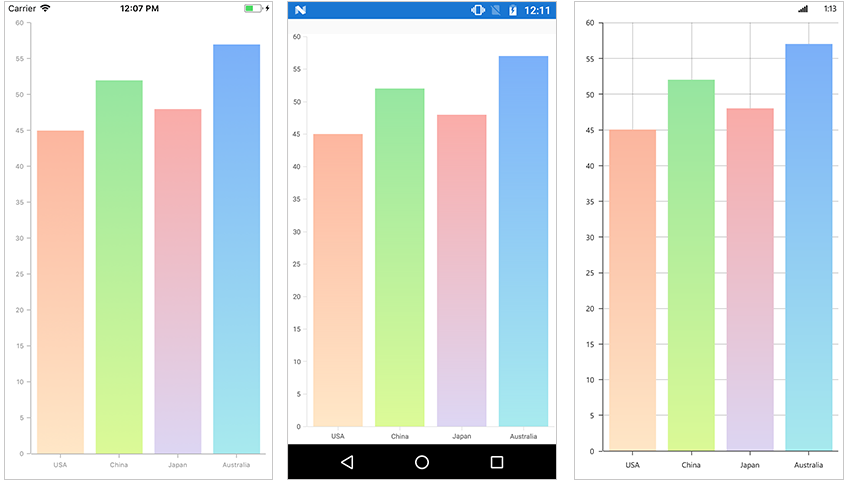
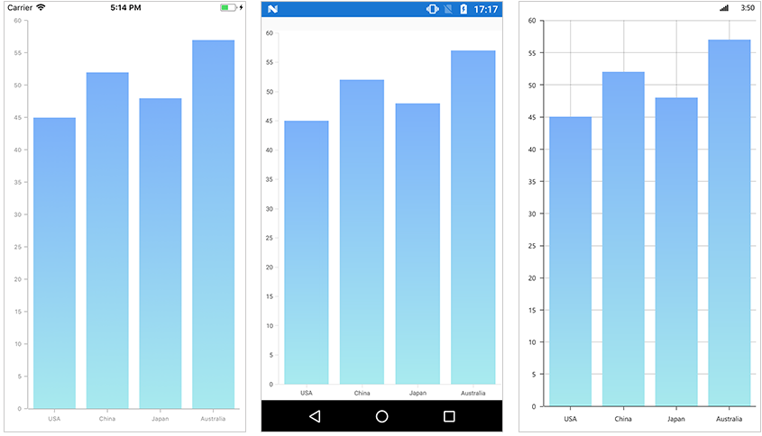

# Color Palette

## Apply palette for Chart

[`ColorModel`](http://help.syncfusion.com/cr/cref_files/xamarin/sfchart/Syncfusion.SfChart.XForms~Syncfusion.SfChart.XForms.ChartColorModel.html) property of [`SfChart`](http://help.syncfusion.com/cr/cref_files/xamarin/sfchart/Syncfusion.SfChart.XForms~Syncfusion.SfChart.XForms.SfChart.html) is used to define the colors for each series. [`ColorModel`](http://help.syncfusion.com/cr/cref_files/xamarin/sfchart/Syncfusion.SfChart.XForms~Syncfusion.SfChart.XForms.ChartColorModel.html) contains the following color palettes.

**Predefined Palettes**

Currently, Chart supports only [`Metro`](https://help.syncfusion.com/cr/cref_files/xamarin/sfchart/Syncfusion.SfChart.XForms~Syncfusion.SfChart.XForms.ChartColorPalette.html) palette and it is the default palette for [`SfChart`](https://help.syncfusion.com/cr/cref_files/xamarin/sfchart/Syncfusion.SfChart.XForms~Syncfusion.SfChart.XForms.SfChart.html). The following screenshot shows the default appearance of multiple series.

**Custom Palette**

Chart will use the colors from [`CustomBrushes`](http://help.syncfusion.com/cr/cref_files/xamarin/sfchart/Syncfusion.SfChart.XForms~Syncfusion.SfChart.XForms.ChartColorModel~CustomBrushes.html) property if [`ColorModel.Palette`](http://help.syncfusion.com/cr/cref_files/xamarin/sfchart/Syncfusion.SfChart.XForms~Syncfusion.SfChart.XForms.ChartColorModel~Palette.html) is set to [`Custom`](http://help.syncfusion.com/cr/cref_files/xamarin/sfchart/Syncfusion.SfChart.XForms~Syncfusion.SfChart.XForms.ChartColorPalette.html).

Following code illustrates how to set the custom colors.

 



<ContentPage.Resources>
    <ResourceDictionary>
        <chart:ChartColorCollection x:Key="Colors">
            <Color>Red</Color>
            <Color>Gray</Color>
            <Color>Blue</Color>
            <Color>Maroon</Color>
            <Color>Pink</Color>
        </chart:ChartColorCollection>
    </ResourceDictionary>
</ContentPage.Resources>

<chart:SfChart>
    <chart:SfChart.ColorModel>
        <chart:ChartColorModel Palette="Custom" CustomBrushes="{StaticResource Colors}"/>
    </chart:SfChart.ColorModel>

    ...
</chart:SfChart>





SfChart chart = new SfChart()
{
     ColorModel = new ChartColorModel()
     {
         Palette = ChartColorPalette.Custom,
         CustomBrushes = new ChartColorCollection()
         {
             Color.Red,
             Color.Gray,
             Color.Blue,
             Color.Maroon,
             Color.Pink,
         }
     },
	 ...
}; 





**None Palette**

[`None`](https://help.syncfusion.com/cr/cref_files/xamarin/sfchart/Syncfusion.SfChart.XForms~Syncfusion.SfChart.XForms.ChartColorPalette.html) palette will not apply any color to the series. So in order to define the color for any series, you can use the [`Color`](https://help.syncfusion.com/cr/cref_files/xamarin/sfchart/Syncfusion.SfChart.XForms~Syncfusion.SfChart.XForms.ChartSeries~Color.html) property or the [`ColorModel`](http://help.syncfusion.com/cr/cref_files/xamarin/sfchart/Syncfusion.SfChart.XForms~Syncfusion.SfChart.XForms.ChartColorModel.html) property of [`ChartSeries`](https://help.syncfusion.com/cr/cref_files/xamarin/sfchart/Syncfusion.SfChart.XForms~Syncfusion.SfChart.XForms.ChartSeries.html) (The ColorModel of Series will be explained later in this document).

## Apply palette for Series

[`ColorModel`](http://help.syncfusion.com/cr/cref_files/xamarin/sfchart/Syncfusion.SfChart.XForms~Syncfusion.SfChart.XForms.ChartColorModel.html) property of [`ChartSeries`](http://help.syncfusion.com/cr/cref_files/xamarin/sfchart/Syncfusion.SfChart.XForms~Syncfusion.SfChart.XForms.ChartSeries.html) is used to define the colors for each data point. Following palettes are used to define the colors.

**Predefined Palettes**

Currently, Chart supports only [`Metro`](https://help.syncfusion.com/cr/cref_files/xamarin/sfchart/Syncfusion.SfChart.XForms~Syncfusion.SfChart.XForms.ChartColorPalette.html) palette.

 



<chart:SfChart>
...

	<chart:ColumnSeries ItemsSource ="{Binding Data}" XBindingPath="Country" YBindingPath="Value">

		<chart:ColumnSeries.ColorModel>

			<chart:ChartColorModel Palette="Metro"/>

		</chart:ColumnSeries.ColorModel>

	</chart:ColumnSeries>

</chart:SfChart>





SfChart chart = new SfChart();
...

ColumnSeries columnSeries = new ColumnSeries() { 

	ItemsSource = Data, 
	XBindingPath = "Country", 
	YBindingPath = "Value" 
	
};

columnSeries.ColorModel.Palette = ChartColorPalette.Metro;

chart.Series.Add(columnSeries);





**Custom Palette**

### CustomBrushes
Series will use the colors from [`CustomBrushes`](https://help.syncfusion.com/cr/cref_files/xamarin/sfchart/Syncfusion.SfChart.XForms~Syncfusion.SfChart.XForms.ChartColorModel~CustomBrushes.html) property if the [`ColorModel.Palette`](https://help.syncfusion.com/cr/cref_files/xamarin/sfchart/Syncfusion.SfChart.XForms~Syncfusion.SfChart.XForms.ChartColorModel~Palette.html) property of series is set to [`Custom`](https://help.syncfusion.com/cr/cref_files/xamarin/sfchart/Syncfusion.SfChart.XForms~Syncfusion.SfChart.XForms.ChartColorPalette.html).

Following code illustrates how to set the custom colors.

 



<ContentPage.Resources>
    <ResourceDictionary>
        <chart:ChartColorCollection x:Key="Colors">
             <Color>Red</Color>
             <Color>Gray</Color>
             <Color>Blue</Color>
             <Color>Maroon</Color>
             <Color>Pink</Color>
        </chart:ChartColorCollection>
    </ResourceDictionary>
</ContentPage.Resources>

<chart:SfChart>
    ...
    <chart:SfChart.Series>
        <chart:ColumnSeries ItemsSource="{Binding Data}" XBindingPath="Name" YBindingPath="Height">
            <chart:ColumnSeries.ColorModel>
                <chart:ChartColorModel Palette="Custom" CustomBrushes="{StaticResource Colors}"/>
            </chart:ColumnSeries.ColorModel>
        </chart:ColumnSeries>
    </chart:SfChart.Series>
</chart:SfChart>





SfChart chart = new SfChart()
{
    ...
    Series =
    {
       new ColumnSeries()
       {
             ItemsSource = viewModel.Data,
             XBindingPath = "Name",
             YBindingPath = "Height",
             ColorModel = new ChartColorModel()
             {
                 Palette = ChartColorPalette.Custom,
                 CustomBrushes = new ChartColorCollection()
                 {
                    Color.Red,
                    Color.Gray,
                    Color.Blue,
                    Color.Maroon,
                    Color.Pink,
                 }
             }
        }
    }
};





## Gradient Colors

The [`CustomGradientColors`](https://help.syncfusion.com/cr/cref_files/xamarin/sfchart/Syncfusion.SfChart.XForms~Syncfusion.SfChart.XForms.ChartColorModel~CustomGradientColors.html) property of [`ChartColorModel`](https://help.syncfusion.com/cr/cref_files/xamarin/sfchart/Syncfusion.SfChart.XForms~Syncfusion.SfChart.XForms.ChartColorModel.html) is used to define the gradient colors, the colors from this property is used for series or chart if the [`Palette`](https://help.syncfusion.com/cr/cref_files/xamarin/sfchart/Syncfusion.SfChart.XForms~Syncfusion.SfChart.XForms.ChartColorModel~Palette.html) property of ChartColorModel is [`Custom`](https://help.syncfusion.com/cr/cref_files/xamarin/sfchart/Syncfusion.SfChart.XForms~Syncfusion.SfChart.XForms.ChartColorPalette.html) and the [`CustomBrushes`](https://help.syncfusion.com/cr/cref_files/xamarin/sfchart/Syncfusion.SfChart.XForms~Syncfusion.SfChart.XForms.ChartColorModel~CustomBrushes.html) property is null. The following properties are used to define the gradient color for the chart.

The [`StartPoint`](https://help.syncfusion.com/cr/cref_files/xamarin/sfchart/Syncfusion.SfChart.XForms~Syncfusion.SfChart.XForms.ChartGradientColor~StartPoint.html) and [`EndPoint`](https://help.syncfusion.com/cr/cref_files/xamarin/sfchart/Syncfusion.SfChart.XForms~Syncfusion.SfChart.XForms.ChartGradientColor~EndPoint.html)  properties of [`ChartGradientColor`](https://help.syncfusion.com/cr/cref_files/xamarin/sfchart/Syncfusion.SfChart.XForms~Syncfusion.SfChart.XForms.ChartGradientColor.html) is used to configure the direction of gradient color, [`GradientStops`](https://help.syncfusion.com/cr/cref_files/xamarin/sfchart/Syncfusion.SfChart.XForms~Syncfusion.SfChart.XForms.ChartGradientColor~GradientStops.html)  property is used to set the color based on the offset.

The [`Color`](https://help.syncfusion.com/cr/cref_files/xamarin/sfchart/Syncfusion.SfChart.XForms~Syncfusion.SfChart.XForms.ChartGradientStop~Color.html) and [`Offset`](https://help.syncfusion.com/cr/cref_files/xamarin/sfchart/Syncfusion.SfChart.XForms~Syncfusion.SfChart.XForms.ChartGradientStop~Color.html)  properties of [`ChartGradientStop`](https://help.syncfusion.com/cr/cref_files/xamarin/sfchart/Syncfusion.SfChart.XForms~Syncfusion.SfChart.XForms.ChartGradientStop.html) is used to configure the color and offset position of each color. 

Following code snippets and screenshot illustrates how to apply the gradient color to the chart series.

 



 <chart:ColumnSeries.ColorModel>
          <chart:ChartColorModel Palette="Custom">
            <chart:ChartColorModel.CustomGradientColors>
              <chart:ChartGradientColor StartPoint="0.5,1" EndPoint="0.5, 0">
                <chart:ChartGradientColor.GradientStops>
                  <chart:ChartGradientStop Color="#FFE7C7" Offset= "0"/>
                  <chart:ChartGradientStop Color="#FCB69F" Offset= "1"/>
                </chart:ChartGradientColor.GradientStops>
              </chart:ChartGradientColor>
              <chart:ChartGradientColor StartPoint="0.5,1" EndPoint="0.5, 0">
                <chart:ChartGradientColor.GradientStops>
                  <chart:ChartGradientStop Color="#DCFA97" Offset= "0"/>
                  <chart:ChartGradientStop Color="#96E6A1" Offset= "1"/>
                </chart:ChartGradientColor.GradientStops>
              </chart:ChartGradientColor>
              <chart:ChartGradientColor StartPoint="0.5,1" EndPoint="0.5, 0">
                <chart:ChartGradientColor.GradientStops>
                  <chart:ChartGradientStop Color="#DDD6F3" Offset= "0"/>
                  <chart:ChartGradientStop Color="#FAACA8" Offset= "1"/>
                </chart:ChartGradientColor.GradientStops>
              </chart:ChartGradientColor>
              <chart:ChartGradientColor StartPoint="0.5,1" EndPoint="0.5, 0">
                <chart:ChartGradientColor.GradientStops>
                  <chart:ChartGradientStop Color="#A8EAEE" Offset= "0"/>
                  <chart:ChartGradientStop Color="#7BB0F9" Offset= "1"/>
                </chart:ChartGradientColor.GradientStops>
              </chart:ChartGradientColor>
            </chart:ChartColorModel.CustomGradientColors>
          </chart:ChartColorModel>
    </chart:ColumnSeries.ColorModel>





           series.ColorModel.Palette = ChartColorPalette.Custom;

            ChartGradientColor gradientColor1 = new ChartGradientColor() { StartPoint = new Point(0.5, 1), EndPoint = new Point(0.5, 0) };
            ChartGradientStop stop1 = new ChartGradientStop() { Color = Color.FromHex("#FFE7C7"), Offset = 0 };
            ChartGradientStop stop2 = new ChartGradientStop() { Color = Color.FromHex("FCB69F"), Offset = 1 };
            gradientColor1.GradientStops.Add(stop1);
            gradientColor1.GradientStops.Add(stop2);

            ChartGradientColor gradientColor2 = new ChartGradientColor() { StartPoint = new Point(0.5, 1), EndPoint = new Point(0.5, 0) };
            ChartGradientStop stop21 = new ChartGradientStop() { Color = Color.FromHex("#DCFA97"), Offset = 0 };
            ChartGradientStop stop22 = new ChartGradientStop() { Color = Color.FromHex("#96E6A1"), Offset = 1 };
            gradientColor2.GradientStops.Add(stop21);
            gradientColor2.GradientStops.Add(stop22);

            ChartGradientColor gradientColor3 = new ChartGradientColor() { StartPoint = new Point(0.5, 1), EndPoint = new Point(0.5, 0) };
            ChartGradientStop stop31 = new ChartGradientStop() { Color = Color.FromHex("#DDD6F3"), Offset = 0 };
            ChartGradientStop stop32 = new ChartGradientStop() { Color = Color.FromHex("#FAACA8"), Offset = 1 };
            gradientColor3.GradientStops.Add(stop31);
            gradientColor3.GradientStops.Add(stop32);

            ChartGradientColor gradientColor4 = new ChartGradientColor() { StartPoint = new Point(0.5, 1), EndPoint = new Point(0.5, 0) };
            ChartGradientStop stop41 = new ChartGradientStop() { Color = Color.FromHex("#A8EAEE"), Offset = 0 };
            ChartGradientStop stop42 = new ChartGradientStop() { Color = Color.FromHex("#7BB0F9"), Offset = 1 };
            gradientColor3.GradientStops.Add(stop41);
            gradientColor3.GradientStops.Add(stop42);

            ChartGradientColorCollection gradientColors = new ChartGradientColorCollection()
            {
                gradientColor1,
                gradientColor2,
                gradientColor3,
                gradientColor4
            };
 
            series.ColorModel.CustomGradientColors = gradientColors;





Following code snippet and screenshot illustrates how to apply the gradient color to the chart area.

 



 <chart:SfChart.ColorModel>
      <chart:ChartColorModel Palette="Custom">
        <chart:ChartColorModel.CustomGradientColors>
          <chart:ChartGradientColor StartPoint="0.5,1" EndPoint="0.5,0">
            <chart:ChartGradientColor.GradientStops>
              <chart:ChartGradientStop Color="#FFE7C7" Offset= "0"/>
              <chart:ChartGradientStop Color="#FCB69F" Offset= "1"/>
            </chart:ChartGradientColor.GradientStops>
          </chart:ChartGradientColor>
        </chart:ChartColorModel.CustomGradientColors>
      </chart:ChartColorModel>
    </chart:SfChart.ColorModel>





    chart.ColorModel.Palette = ChartColorPalette.Custom;
 
    ChartGradientColor gradientColor = new ChartGradientColor() { StartPoint = new Point(0.5, 1), EndPoint = new Point(0.5, 0) };
    ChartGradientStop stop1 = new ChartGradientStop() { Color = Color.FromHex("#FFE7C7"), Offset = 0 };
    ChartGradientStop stop2 = new ChartGradientStop() { Color = Color.FromHex("#FCB69F"), Offset = 1 };
    gradientColor.GradientStops.Add(stop1);
    gradientColor.GradientStops.Add(stop2);

    chart.ColorModel.CustomGradientColors.Add(gradientColor);





**None Palette**

[`None`](https://help.syncfusion.com/cr/cref_files/xamarin/sfchart/Syncfusion.SfChart.XForms~Syncfusion.SfChart.XForms.ChartColorPalette.html) palette will not apply any color to the data points. So in order to define the color for the data points, you can use the [`Color`](http://help.syncfusion.com/cr/cref_files/xamarin/sfchart/Syncfusion.SfChart.XForms~Syncfusion.SfChart.XForms.ChartSeries~ColorProperty.html) property of [`ChartSeries`](http://help.syncfusion.com/cr/cref_files/xamarin/sfchart/Syncfusion.SfChart.XForms~Syncfusion.SfChart.XForms.ChartSeries.html).