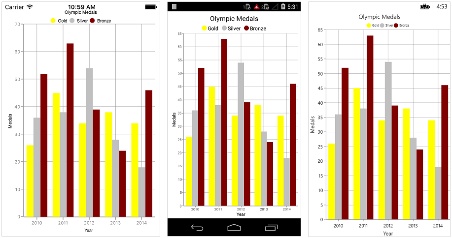
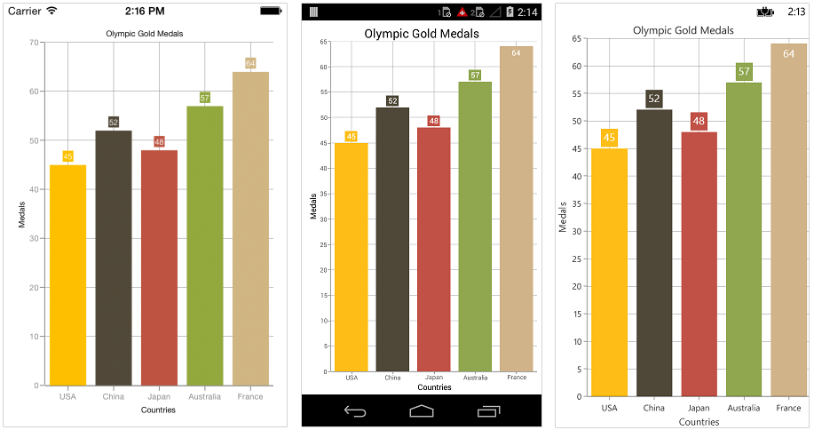
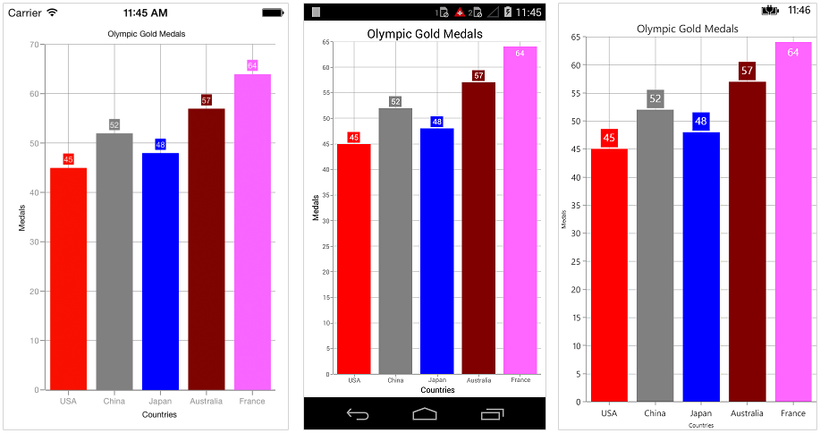

# Color Palette

## Apply palette for chart

The [`ColorModel`](http://help.syncfusion.com/cr/cref_files/xamarin/sfchart/Syncfusion.SfChart.XForms~Syncfusion.SfChart.XForms.ChartColorModel.html) property of [`SfChart`](http://help.syncfusion.com/cr/cref_files/xamarin/sfchart/Syncfusion.SfChart.XForms~Syncfusion.SfChart.XForms.SfChart.html) is used to define the colors for each series. The `ColorModel` property contains the following color palettes:

**Predefined palettes**

Currently, chart supports only the Metro palette and it is the default palette. The following screenshot illustrates the default appearance of multiple series.

**Custom palette**

Chart uses the colors from the [`CustomBrushes`](http://help.syncfusion.com/cr/cref_files/xamarin/sfchart/Syncfusion.SfChart.XForms~Syncfusion.SfChart.XForms.ChartColorModel~CustomBrushes.html) property if the [`ColorModel.Palette`](http://help.syncfusion.com/cr/cref_files/xamarin/sfchart/Syncfusion.SfChart.XForms~Syncfusion.SfChart.XForms.ChartColorModel~Palette.html) is set to [`Custom`](http://help.syncfusion.com/cr/cref_files/xamarin/sfchart/Syncfusion.SfChart.XForms~Syncfusion.SfChart.XForms.ChartColorPalette.html).

The following code illustrates how to set the custom colors.

 



<ContentPage.Resources>
    <ResourceDictionary>
        <chart:ChartColorCollection x:Key="Colors">
            <Color>Red</Color>
            <Color>Gray</Color>
            <Color>Blue</Color>
            <Color>Maroon</Color>
            <Color>Pink</Color>
        </chart:ChartColorCollection>
    </ResourceDictionary>
</ContentPage.Resources>

<chart:SfChart>
    <chart:SfChart.ColorModel>
        <chart:ChartColorModel Palette="Custom" CustomBrushes="{StaticResource Colors}"/>
    </chart:SfChart.ColorModel>

    ...
</chart:SfChart>





SfChart chart = new SfChart()
{
     ColorModel = new ChartColorModel()
     {
         Palette = ChartColorPalette.Custom,
         CustomBrushes = new ChartColorCollection()
         {
             Color.Red,
             Color.Gray,
             Color.Blue,
             Color.Maroon,
             Color.Pink,
         }
     },
	 ...
}; 





**None palette**

None palette does not apply any color to the series. So, in order to define the color for any series, use the `Color` or `ColorModel` property of `ChartSeries` (the `ColorModel` property of series will be explained later in this document).

## Apply palette for series

The [`ColorModel`](http://help.syncfusion.com/cr/cref_files/xamarin/sfchart/Syncfusion.SfChart.XForms~Syncfusion.SfChart.XForms.ChartColorModel.html) property of [`ChartSeries`](http://help.syncfusion.com/cr/cref_files/xamarin/sfchart/Syncfusion.SfChart.XForms~Syncfusion.SfChart.XForms.ChartSeries.html) is used to define the colors for each data point. The following palettes are used to define the colors.

**Predefined palettes**

Currently, chart supports only the Metro palette.

 



<chart:SfChart>
...

	<chart:ColumnSeries ItemsSource ="{Binding Data}" XBindingPath="Country" YBindingPath="Value">

		<chart:ColumnSeries.ColorModel>

			<chart:ChartColorModel Palette="Metro"/>

		</chart:ColumnSeries.ColorModel>

	</chart:ColumnSeries>

</chart:SfChart>





SfChart chart = new SfChart();
...

ColumnSeries columnSeries = new ColumnSeries() { 

	ItemsSource = Data, 
	XBindingPath = "Country", 
	YBindingPath = "Value" 
	
};

columnSeries.ColorModel.Palette = ChartColorPalette.Metro;

chart.Series.Add(columnSeries);





**Custom palette**

Series uses the colors from the `CustomBrushes` property if the `ColorModel.Palette` property of series is set to `Custom`.

The following code illustrates how to set the custom colors.

 



<ContentPage.Resources>
    <ResourceDictionary>
        <chart:ChartColorCollection x:Key="Colors">
             <Color>Red</Color>
             <Color>Gray</Color>
             <Color>Blue</Color>
             <Color>Maroon</Color>
             <Color>Pink</Color>
        </chart:ChartColorCollection>
    </ResourceDictionary>
</ContentPage.Resources>

<chart:SfChart>
    ...
    <chart:SfChart.Series>
        <chart:ColumnSeries ItemsSource="{Binding Data}" XBindingPath="Name" YBindingPath="Height">
            <chart:ColumnSeries.ColorModel>
                <chart:ChartColorModel Palette="Custom" CustomBrushes="{StaticResource Colors}"/>
            </chart:ColumnSeries.ColorModel>
        </chart:ColumnSeries>
    </chart:SfChart.Series>
</chart:SfChart>





SfChart chart = new SfChart()
{
    ...
    Series =
    {
       new ColumnSeries()
       {
             ItemsSource = viewModel.Data,
             XBindingPath = "Name",
             YBindingPath = "Height",
             ColorModel = new ChartColorModel()
             {
                 Palette = ChartColorPalette.Custom,
                 CustomBrushes = new ChartColorCollection()
                 {
                    Color.Red,
                    Color.Gray,
                    Color.Blue,
                    Color.Maroon,
                    Color.Pink,
                 }
             }
        }
    }
};





**None palette**

None palette does not apply any color to the data points. So, in order to define the color for data points, use the [`Color`](http://help.syncfusion.com/cr/cref_files/xamarin/sfchart/Syncfusion.SfChart.XForms~Syncfusion.SfChart.XForms.ChartSeries~ColorProperty.html) property of [`ChartSeries`](http://help.syncfusion.com/cr/cref_files/xamarin/sfchart/Syncfusion.SfChart.XForms~Syncfusion.SfChart.XForms.ChartSeries.html).