# Axis

Charts typically have two axes, a vertical (y) axis and a horizontal (x) axis, that are used to measure and categorize data.

A vertical(y) axis always supports numerical scale, and a horizontal(x) axis supports the following types of scales:

* Category
* Numeric
* Date-time
* Logarithmic

## Category axis

A category axis displays text labels instead of numbers. 

 



<chart:SfChart.PrimaryAxis >

	<chart:CategoryAxis />

</chart:SfChart.PrimaryAxis>





chart.PrimaryAxis = new CategoryAxis();





### Placing labels between ticks

On the category axis, labels can be placed between ticks by setting the [`LabelPlacement`](http://help.syncfusion.com/cr/cref_files/xamarin/sfchart/Syncfusion.SfChart.XForms~Syncfusion.SfChart.XForms.CategoryAxis~LabelPlacement.html) property to the [`BetweenTicks`](http://help.syncfusion.com/cr/cref_files/xamarin/sfchart/Syncfusion.SfChart.XForms~Syncfusion.SfChart.XForms.LabelPlacement.html). The default value of the [`LabelPlacement`](http://help.syncfusion.com/cr/cref_files/xamarin/sfchart/Syncfusion.SfChart.XForms~Syncfusion.SfChart.XForms.CategoryAxis~LabelPlacement.html) property is [`OnTicks`](http://help.syncfusion.com/cr/cref_files/xamarin/sfchart/Syncfusion.SfChart.XForms~Syncfusion.SfChart.XForms.LabelPlacement.html), i.e., labels will be placed on the ticks by default.

 



<chart:SfChart.PrimaryAxis >

	<chart:CategoryAxis LabelPlacement="BetweenTicks"/>

</chart:SfChart.PrimaryAxis>





chart.PrimaryAxis = new CategoryAxis() { LabelPlacement = LabelPlacement.BetweenTicks };





### Displaying labels after fixed interval

To display labels after a fixed interval n, set the [`Interval`](http://help.syncfusion.com/cr/cref_files/xamarin/sfchart/Syncfusion.SfChart.XForms~Syncfusion.SfChart.XForms.CategoryAxis~Interval.html) property of [`ChartAxis`](https://help.syncfusion.com/cr/cref_files/xamarin/sfchart/Syncfusion.SfChart.XForms~Syncfusion.SfChart.XForms.ChartAxis.html) to n. Since the default value of interval is 1, all the labels will be displayed.

 



<chart:SfChart.PrimaryAxis >

	<chart:CategoryAxis Interval="2" LabelPlacement="BetweenTicks"/>

</chart:SfChart.PrimaryAxis>





chart.PrimaryAxis = new CategoryAxis() { Interval = 2, LabelPlacement = LabelPlacement.BetweenTicks };





## Numeric axis

A numeric axis supports numerical scale and displays numbers as labels. 

 



<chart:SfChart.PrimaryAxis >

	<chart:NumericalAxis/>

</chart:SfChart.PrimaryAxis>





chart.PrimaryAxis = new NumericalAxis();





### Customizing numeric range

To customize the range of an axis, use the [`Minimum`](http://help.syncfusion.com/cr/cref_files/xamarin/sfchart/Syncfusion.SfChart.XForms~Syncfusion.SfChart.XForms.NumericalAxis~Minimum.html) and [`Maximum`](http://help.syncfusion.com/cr/cref_files/xamarin/sfchart/Syncfusion.SfChart.XForms~Syncfusion.SfChart.XForms.NumericalAxis~Maximum.html) properties of the [`NumericalAxis`](http://help.syncfusion.com/cr/cref_files/xamarin/sfchart/Syncfusion.SfChart.XForms~Syncfusion.SfChart.XForms.NumericalAxis.html). By default, the appropriate range will be calculated automatically based on the provided data.

 



<chart:SfChart.SecondaryAxis >

	<chart:NumericalAxis Minimum="10" Maximum="50"/>

</chart:SfChart.SecondaryAxis >





chart.SecondaryAxis = new NumericalAxis() { Minimum = 10, Maximum = 50 };





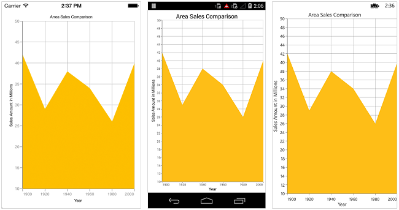

### Customizing numeric intervals

An axis interval can be customized using the [`Interval`](http://help.syncfusion.com/cr/cref_files/xamarin/sfchart/Syncfusion.SfChart.XForms~Syncfusion.SfChart.XForms.NumericalAxis~Interval.html) property of [`ChartAxis`](https://help.syncfusion.com/cr/cref_files/xamarin/sfchart/Syncfusion.SfChart.XForms~Syncfusion.SfChart.XForms.ChartAxis.html). By default, the appropriate interval will be calculated based on the minimum and maximum values of provided data.

 



<chart:SfChart.SecondaryAxis >

	<chart:NumericalAxis Interval="10"/>

</chart:SfChart.SecondaryAxis >





chart.SecondaryAxis = new NumericalAxis() { Interval = 10 };





### Apply padding to the range

Padding can be applied to the minimum and maximum values of an axis range by using the [`RangePadding`](http://help.syncfusion.com/cr/cref_files/xamarin/sfchart/Syncfusion.SfChart.XForms~Syncfusion.SfChart.XForms.NumericalAxis~RangePadding.html) property. Numeric axis supports the following types of padding:

* None
* Round
* Additional
* Normal

**None**

When the value of the [`RangePadding`](http://help.syncfusion.com/cr/cref_files/xamarin/sfchart/Syncfusion.SfChart.XForms~Syncfusion.SfChart.XForms.NumericalAxis~RangePadding.html) property is [`None`](http://help.syncfusion.com/cr/cref_files/xamarin/sfchart/Syncfusion.SfChart.XForms~Syncfusion.SfChart.XForms.NumericalPadding.html), padding can not be applied to the axis. This is also the default value for the [`RangePadding`](http://help.syncfusion.com/cr/cref_files/xamarin/sfchart/Syncfusion.SfChart.XForms~Syncfusion.SfChart.XForms.NumericalAxis~RangePadding.html) for horizontal axis.

 



<chart:SfChart.SecondaryAxis>

	<chart:NumericalAxis RangePadding="None"/>

</chart:SfChart.SecondaryAxis>





chart.SecondaryAxis = new NumericalAxis() { RangePadding = NumericalPadding.None };





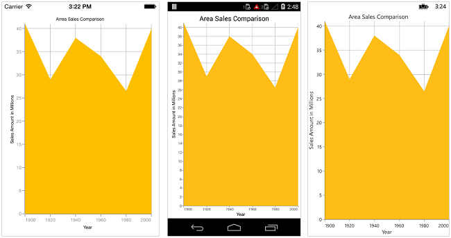

**Round**

When the value of the [`RangePadding`](http://help.syncfusion.com/cr/cref_files/xamarin/sfchart/Syncfusion.SfChart.XForms~Syncfusion.SfChart.XForms.NumericalAxis~RangePadding.html) property is [`Round`](http://help.syncfusion.com/cr/cref_files/xamarin/sfchart/Syncfusion.SfChart.XForms~Syncfusion.SfChart.XForms.NumericalPadding.html), the axis range will be rounded to the nearest possible value and divided by the interval.

 



<chart:SfChart.SecondaryAxis>

	<chart:NumericalAxis RangePadding="Round"/>

</chart:SfChart.SecondaryAxis>





chart.SecondaryAxis = new NumericalAxis() { RangePadding = NumericalPadding.Round };





**Additional**

When the value of the [`RangePadding`](http://help.syncfusion.com/cr/cref_files/xamarin/sfchart/Syncfusion.SfChart.XForms~Syncfusion.SfChart.XForms.NumericalAxis~RangePadding.html) property is [`Additional`](http://help.syncfusion.com/cr/cref_files/xamarin/sfchart/Syncfusion.SfChart.XForms~Syncfusion.SfChart.XForms.NumericalPadding.html), the axis range will be rounded, and an interval of the axis will be added as padding to the minimum and maximum values of the range.

 



<chart:SfChart.SecondaryAxis>

	<chart:NumericalAxis RangePadding="Additional"/>

</chart:SfChart.SecondaryAxis>





chart.SecondaryAxis = new NumericalAxis() { RangePadding = NumericalPadding.Additional };





**Normal**

When the value of the [`RangePadding`](http://help.syncfusion.com/cr/cref_files/xamarin/sfchart/Syncfusion.SfChart.XForms~Syncfusion.SfChart.XForms.NumericalAxis~RangePadding.html) property is [`Normal`](http://help.syncfusion.com/cr/cref_files/xamarin/sfchart/Syncfusion.SfChart.XForms~Syncfusion.SfChart.XForms.NumericalPadding.html), the appropriate range will be calculated for the axis based on the readability of the data. This is also the default value for the vertical axis.

 



<chart:SfChart.SecondaryAxis>

	<chart:NumericalAxis RangePadding="Normal"/>

</chart:SfChart.SecondaryAxis>





chart.SecondaryAxis = new NumericalAxis() { RangePadding = NumericalPadding.Normal };





## Date-time axis

Date-time axis supports date-time scale and displays date-time values as axis labels in a specified format. 

 



<chart:SfChart.PrimaryAxis >

	<chart:DateTimeAxis/>

</chart:SfChart.PrimaryAxis>





chart.PrimaryAxis = new DateTimeAxis();





### Customizing date-time range

To customize the range of an axis, use the [`Minimum`](http://help.syncfusion.com/cr/cref_files/xamarin/sfchart/Syncfusion.SfChart.XForms~Syncfusion.SfChart.XForms.DateTimeAxis~Minimum.html) and [`Maximum`](http://help.syncfusion.com/cr/cref_files/xamarin/sfchart/Syncfusion.SfChart.XForms~Syncfusion.SfChart.XForms.DateTimeAxis~Maximum.html) properties of the [`DateTimeAxis`](http://help.syncfusion.com/cr/cref_files/xamarin/sfchart/Syncfusion.SfChart.XForms~Syncfusion.SfChart.XForms.DateTimeAxis.html). By default, the appropriate range will be calculated automatically based on the provided data.

 



Namespace:

xmlns:sys="clr-namespace:System;assembly=mscorlib"
...
<chart:SfChart.PrimaryAxis  >

	<chart:DateTimeAxis>

		<chart:DateTimeAxis.Minimum>

			<sys:DateTime x:FactoryMethod="Parse">

				<x:Arguments>

					<x:String>Jan 1 2010</x:String>

				</x:Arguments>

			</sys:DateTime>

		</chart:DateTimeAxis.Minimum>

		<chart:DateTimeAxis.Maximum>

			<sys:DateTime x:FactoryMethod="Parse">

				<x:Arguments>

					<x:String>Dec 30 2015</x:String>

				</x:Arguments>

			</sys:DateTime>

		</chart:DateTimeAxis.Maximum>

	</chart:DateTimeAxis>

</chart:SfChart.PrimaryAxis>





chart.PrimaryAxis = new DateTimeAxis() { 

	Minimum = new DateTime(2010, 1, 1), 
	Maximum = new DateTime(2015, 12, 30) 
	
};





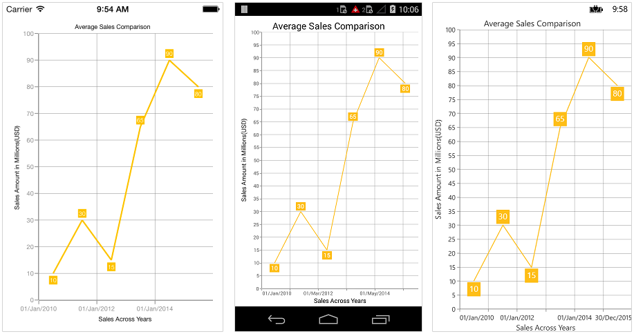

### Date-time intervals

Date-time intervals can be customized using the [`Interval`](http://help.syncfusion.com/cr/cref_files/xamarin/sfchart/Syncfusion.SfChart.XForms~Syncfusion.SfChart.XForms.DateTimeAxis~Interval.html) and [`IntervalType`](http://help.syncfusion.com/cr/cref_files/xamarin/sfchart/Syncfusion.SfChart.XForms~Syncfusion.SfChart.XForms.DateTimeAxis~IntervalType.html) properties of the [`DateTimeAxis`](http://help.syncfusion.com/cr/cref_files/xamarin/sfchart/Syncfusion.SfChart.XForms~Syncfusion.SfChart.XForms.DateTimeAxis.html). For example, setting the [`Interval`](http://help.syncfusion.com/cr/cref_files/xamarin/sfchart/Syncfusion.SfChart.XForms~Syncfusion.SfChart.XForms.DateTimeAxis~Interval.html) to 2 and the [`IntervalType`](http://help.syncfusion.com/cr/cref_files/xamarin/sfchart/Syncfusion.SfChart.XForms~Syncfusion.SfChart.XForms.DateTimeAxis~IntervalType.html) to [`Years`](http://help.syncfusion.com/cr/cref_files/xamarin/sfchart/Syncfusion.SfChart.XForms~Syncfusion.SfChart.XForms.DateTimeIntervalType.html) will consider 2 years as interval.

Chart supports the following types of intervals for a date-time axis:

* Years
* Months
* Days
* Hours
* Minutes
* Seconds
* Milliseconds

 



<chart:SfChart.PrimaryAxis>

	<chart:DateTimeAxis IntervalType="Months">

		<chart:DateTimeAxis.Interval>

			<Double>6</Double>

		</chart:DateTimeAxis.Interval>

	</chart:DateTimeAxis>

</chart:SfChart.PrimaryAxis>





chart.PrimaryAxis = new DateTimeAxis() { 

	IntervalType = DateTimeIntervalType.Months, 
	Interval = 6 
	
};





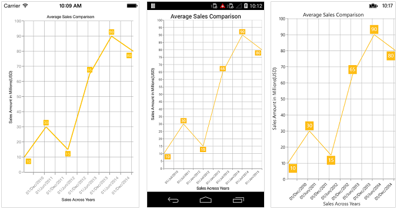

### Apply padding to range

Padding can be applied to the minimum and maximum values of a range by using the [`RangePadding`](http://help.syncfusion.com/cr/cref_files/xamarin/sfchart/Syncfusion.SfChart.XForms~Syncfusion.SfChart.XForms.DateTimeAxis~RangePadding.html) property. Date-time axis supports the following types of padding:

* None
* Round
* Additional

**None**

When the value of the [`RangePadding`](http://help.syncfusion.com/cr/cref_files/xamarin/sfchart/Syncfusion.SfChart.XForms~Syncfusion.SfChart.XForms.DateTimeAxis~RangePadding.html) property is [`None`](http://help.syncfusion.com/cr/cref_files/xamarin/sfchart/Syncfusion.SfChart.XForms~Syncfusion.SfChart.XForms.DateTimeRangePadding.html), padding can not be applied to the axis. This is also the default value for the [`RangePadding`](http://help.syncfusion.com/cr/cref_files/xamarin/sfchart/Syncfusion.SfChart.XForms~Syncfusion.SfChart.XForms.DateTimeAxis~RangePadding.html) property.

 



<chart:SfChart.PrimaryAxis>

	<chart:DateTimeAxis RangePadding="None"/>

</chart:SfChart.PrimaryAxis >





chart.PrimaryAxis = new DateTimeAxis() { RangePadding = DateTimeRangePadding.None };





**Round**

When the value of the [`RangePadding`](http://help.syncfusion.com/cr/cref_files/xamarin/sfchart/Syncfusion.SfChart.XForms~Syncfusion.SfChart.XForms.DateTimeAxis~RangePadding.html) property is [`Round`](http://help.syncfusion.com/cr/cref_files/xamarin/sfchart/Syncfusion.SfChart.XForms~Syncfusion.SfChart.XForms.DateTimeRangePadding.html), the axis range will be rounded to the nearest possible date-time value.

 



<chart:SfChart.PrimaryAxis >

	<chart:DateTimeAxis RangePadding="Round"/>

</chart:SfChart.PrimaryAxis >





chart.PrimaryAxis = new DateTimeAxis() { RangePadding = DateTimeRangePadding.Round };





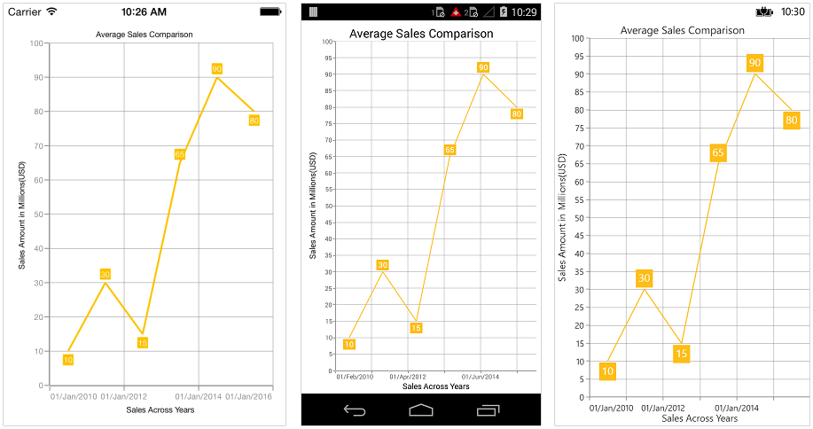

**Additional**

When the value of the [`RangePadding`](http://help.syncfusion.com/cr/cref_files/xamarin/sfchart/Syncfusion.SfChart.XForms~Syncfusion.SfChart.XForms.DateTimeAxis~RangePadding.html) property is [`Additional`](http://help.syncfusion.com/cr/cref_files/xamarin/sfchart/Syncfusion.SfChart.XForms~Syncfusion.SfChart.XForms.DateTimeRangePadding.html), the range will be rounded, and a date-time interval of the axis will be added as padding to the minimum and maximum values of the range.

 



<chart:SfChart.PrimaryAxis >

	<chart:DateTimeAxis RangePadding="Additional"/>

</chart:SfChart.PrimaryAxis >





chart.PrimaryAxis = new DateTimeAxis() { RangePadding = DateTimeRangePadding.Additional };





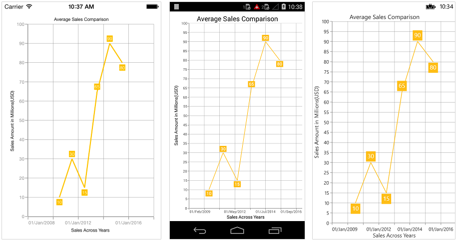

## Logarithmic axis

A logarithmic axis supports a logarithmic scale and displays numbers as axis labels.

 



<chart:SfChart.SecondaryAxis>

	<chart:LogarithmicAxis />

</chart:SfChart.SecondaryAxis>





chart.SecondaryAxis = new LogarithmicAxis (); 





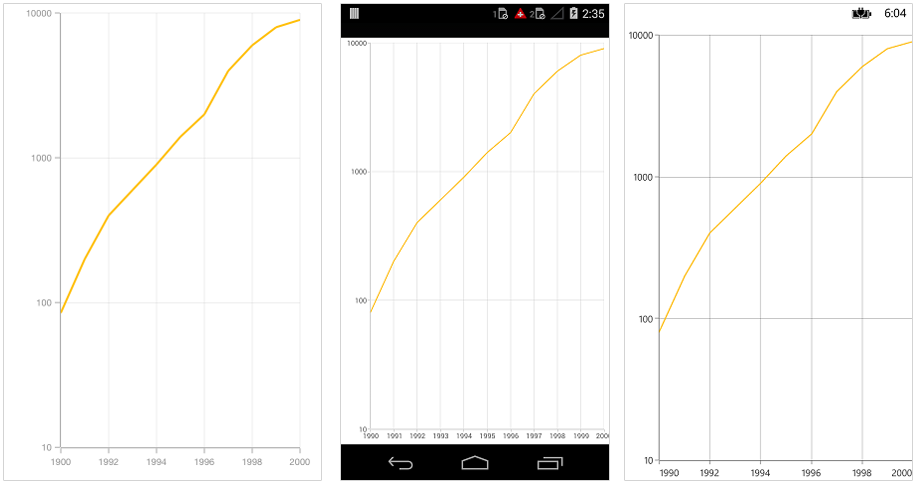

### Customizing the logarithmic range

To customize the range of log axis, use the [`Minimum`](http://help.syncfusion.com/cr/cref_files/xamarin/sfchart/Syncfusion.SfChart.XForms~Syncfusion.SfChart.XForms.LogarithmicAxis~MinimumProperty.html) and [`Maximum`](http://help.syncfusion.com/cr/cref_files/xamarin/sfchart/Syncfusion.SfChart.XForms~Syncfusion.SfChart.XForms.LogarithmicAxis~MaximumProperty.html) properties of the [`LogarithmicAxis`](http://help.syncfusion.com/cr/cref_files/xamarin/sfchart/Syncfusion.SfChart.XForms~Syncfusion.SfChart.XForms.LogarithmicAxis.html). By default, the appropriate range will be calculated automatically based on the provided data.

 



<chart:SfChart.SecondaryAxis>

	<chart:LogarithmicAxis >
	
		<chart:LogarithmicAxis.Minimum>
			<x:Double>100</x:Double>
		</chart:LogarithmicAxis.Minimum>
		
		<chart:LogarithmicAxis.Maximum>
			<x:Double>10000</x:Double>
		</chart:LogarithmicAxis.Maximum>
		
	</chart:LogarithmicAxis>
	
</chart:SfChart.SecondaryAxis>





chart.SecondaryAxis = new LogarithmicAxis() { 

	Minimum = 100, 
	Maximum = 10000 

};





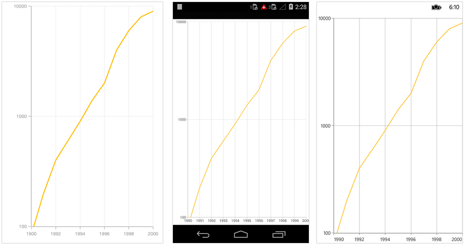

### Customizing the logarithmic base

To customize the log base value, use the [`LogarithmicBase`](http://help.syncfusion.com/cr/cref_files/xamarin/sfchart/Syncfusion.SfChart.XForms~Syncfusion.SfChart.XForms.LogarithmicAxis~LogarithmicBaseProperty.html) property.

 



<chart:SfChart.SecondaryAxis>

	<chart:LogarithmicAxis LogarithmicBase="2" />

</chart:SfChart.SecondaryAxis>	





chart.SecondaryAxis = new LogarithmicAxis() { LogarithmicBase = 2 };





## Common axis features

Features such as axis title, labels, grid lines, and tick lines are common to all the axes. Each feature has been explained in this section.

### Axis visibility

Axis visibility can be controlled using the [`IsVisible`](http://help.syncfusion.com/cr/cref_files/xamarin/sfchart/Syncfusion.SfChart.XForms~Syncfusion.SfChart.XForms.ChartAxis~IsVisible.html) property of the axis. The default value of the [`IsVisible`](http://help.syncfusion.com/cr/cref_files/xamarin/sfchart/Syncfusion.SfChart.XForms~Syncfusion.SfChart.XForms.ChartAxis~IsVisible.html) property is `True`.

 



<chart:SfChart.SecondaryAxis>

	<chart:NumericalAxis IsVisible="False"/>

</chart:SfChart.SecondaryAxis >





chart.SecondaryAxis.IsVisible = false;





### Axis title

The [`Title`](http://help.syncfusion.com/cr/cref_files/xamarin/sfchart/Syncfusion.SfChart.XForms~Syncfusion.SfChart.XForms.ChartAxis~Title.html) property in axis provides options to customize the text and font of axis title. Axis does not display the title by default. The title can be customized using the following properties:

* [`Text`](http://help.syncfusion.com/cr/cref_files/xamarin/sfchart/Syncfusion.SfChart.XForms~Syncfusion.SfChart.XForms.ChartAxisTitle~Text.html)—Used to set a title for axis.
* [`TextColor`](http://help.syncfusion.com/cr/cref_files/xamarin/sfchart/Syncfusion.SfChart.XForms~Syncfusion.SfChart.XForms.ChartAxisTitle~TextColor.html)—Used to change the color of the label.
* [`BackgroundColor`](http://help.syncfusion.com/cr/cref_files/xamarin/sfchart/Syncfusion.SfChart.XForms~Syncfusion.SfChart.XForms.ChartAxisTitle~BackgroundColor.html)—Used to change the background color of the label.
* [`BorderColor`](http://help.syncfusion.com/cr/cref_files/xamarin/sfchart/Syncfusion.SfChart.XForms~Syncfusion.SfChart.XForms.ChartAxisTitle~BorderColor.html)—Used to change the border color.
* [`BorderWidth`](http://help.syncfusion.com/cr/cref_files/xamarin/sfchart/Syncfusion.SfChart.XForms~Syncfusion.SfChart.XForms.ChartAxisTitle~BorderWidth.html)—Used to change the width of the border.
* [`Font`](http://help.syncfusion.com/cr/cref_files/xamarin/sfchart/Syncfusion.SfChart.XForms~Syncfusion.SfChart.XForms.ChartAxisTitle~Font.html)—Used to change the text size, font family, and font weight.
* [`Margin`](http://help.syncfusion.com/cr/cref_files/xamarin/sfchart/Syncfusion.SfChart.XForms~Syncfusion.SfChart.XForms.ChartAxisTitle~Margin.html)—Used to change the margin size for labels.

The following code snippet illustrates how to enable and customize the axis title.

 



<chart:SfChart.PrimaryAxis>

	<chart:CategoryAxis  >

		<chart:CategoryAxis.Title>

			<chart:ChartAxisTitle Text="Month" TextColor="Blue" Font="Bold,20"/>

		</chart:CategoryAxis.Title>

	</chart:CategoryAxis  >

</chart:SfChart.PrimaryAxis >





chart.PrimaryAxis.Title.Text = "Month";

chart.PrimaryAxis.Title.TextColor = Color.Blue;

chart.PrimaryAxis.Title.Font = Font.SystemFontOfSize(20, FontAttributes.Bold);





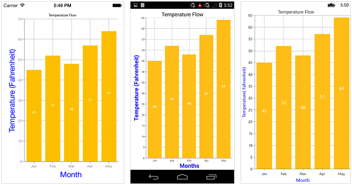

### Axis label rotation

The [`LabelRotationAngle`](http://help.syncfusion.com/cr/cref_files/xamarin/sfchart/Syncfusion.SfChart.XForms~Syncfusion.SfChart.XForms.ChartAxis~LabelRotationAngle.html) property of an axis can be used to rotate the position of the axis labels. The default value of the [`LabelRotationAngle`](http://help.syncfusion.com/cr/cref_files/xamarin/sfchart/Syncfusion.SfChart.XForms~Syncfusion.SfChart.XForms.ChartAxis~LabelRotationAngle.html) property is 0d.

 



<chart:SfChart.PrimaryAxis> 
       
       <chart:CategoryAxis LabelRotationAngle="-45"/>       
    
</chart:SfChart.PrimaryAxis> 





CategoryAxis categoryAxis = new CategoryAxis(); 
  
categoryAxis.LabelRotationAngle = -45; 
  
chart.PrimaryAxis = categoryAxis; 





### Axis line customization

Chart provides support to customize the style of an axis line by defining the [`AxisLineStyle`](http://help.syncfusion.com/cr/cref_files/xamarin/sfchart/Syncfusion.SfChart.XForms~Syncfusion.SfChart.XForms.ChartAxis~AxisLineStyle.html) property as shown in the following code snippet:

* [`StrokeColor`](http://help.syncfusion.com/cr/cref_files/xamarin/sfchart/Syncfusion.SfChart.XForms~Syncfusion.SfChart.XForms.ChartLineStyle~StrokeColor.html)—Used to change the stroke color of an axis line.
* [`StrokeWidth`](http://help.syncfusion.com/cr/cref_files/xamarin/sfchart/Syncfusion.SfChart.XForms~Syncfusion.SfChart.XForms.ChartLineStyle~StrokeWidth.html)—Used to change the stroke width of an axis line.
* [`StrokeDashArray`](http://help.syncfusion.com/cr/cref_files/xamarin/sfchart/Syncfusion.SfChart.XForms~Syncfusion.SfChart.XForms.ChartLineStyle~StrokeDashArray.html)—Used to render an axis line series with dashes.

 



<chart:SfChart.PrimaryAxis>

    <chart:DateTimeAxis>

        <chart:DateTimeAxis.AxisLineStyle>

            <chart:ChartLineStyle StrokeWidth ="10" StrokeColor="Red">

                <chart:ChartLineStyle.StrokeDashArray>

                    <x:Array Type="{x:Type x:Double}">

                        <sys:Double>5</sys:Double>

                        <sys:Double>6</sys:Double>

                    </x:Array>

                </chart:ChartLineStyle.StrokeDashArray>

            </chart:ChartLineStyle>

        </chart:DateTimeAxis.AxisLineStyle>

    </chart:DateTimeAxis>

</chart:SfChart.PrimaryAxis>





CategoryAxis primaryAxis = new CategoryAxis();

ChartLineStyle axisLineStyle = new ChartLineStyle();

axisLineStyle.StrokeColor = Color.Red;

axisLineStyle.StrokeWidth = 10;

axisLineStyle.StrokeDashArray = new double[2] { 5,6 };

primaryAxis.AxisLineStyle = axisLineStyle;

chart.PrimaryAxis = primaryAxis;





### Label customization

The [`LabelStyle`](http://help.syncfusion.com/cr/cref_files/xamarin/sfchart/Syncfusion.SfChart.XForms~Syncfusion.SfChart.XForms.ChartAxis~LabelStyle.html) property of an axis provides options to customize the font family, color, size, and font weight of the axis labels. The axis labels can be customized using the following properties:

* [`TextColor`](http://help.syncfusion.com/cr/cref_files/xamarin/sfchart/Syncfusion.SfChart.XForms~Syncfusion.SfChart.XForms.ChartLabelStyle~TextColor.html)—Used to change the color of the labels.
* [`BackgroundColor`](http://help.syncfusion.com/cr/cref_files/xamarin/sfchart/Syncfusion.SfChart.XForms~Syncfusion.SfChart.XForms.ChartLabelStyle~BackgroundColor.html)—Used to change the background color of the label.
* [`BorderColor`](http://help.syncfusion.com/cr/cref_files/xamarin/sfchart/Syncfusion.SfChart.XForms~Syncfusion.SfChart.XForms.ChartLabelStyle~BorderColor.html)—Used to change the border color.
* [`BorderThickness`](http://help.syncfusion.com/cr/cref_files/xamarin/sfchart/Syncfusion.SfChart.XForms~Syncfusion.SfChart.XForms.ChartLabelStyle~BorderThickness.html)—Used to change the thickness of the border.
* [`Font`](http://help.syncfusion.com/cr/cref_files/xamarin/sfchart/Syncfusion.SfChart.XForms~Syncfusion.SfChart.XForms.ChartLabelStyle~Font.html)—Used to change the text size, font family, and font weight.
* [`Margin`](http://help.syncfusion.com/cr/cref_files/xamarin/sfchart/Syncfusion.SfChart.XForms~Syncfusion.SfChart.XForms.ChartLabelStyle~Margin.html)—Used to change the margin size of the labels.

 



<chart:SfChart.PrimaryAxis>

	<chart:CategoryAxis >

		<chart:CategoryAxis.LabelStyle>

			<chart:ChartAxisLabelStyle TextColor="Red" Font="Bold,20"/>

		</chart:CategoryAxis.LabelStyle>

	</chart:CategoryAxis>

</chart:SfChart.PrimaryAxis>





chart.PrimaryAxis.LabelStyle.Font = Font.SystemFontOfSize(20, FontAttributes.Bold);

chart.PrimaryAxis.LabelStyle.TextColor = Color.Red;





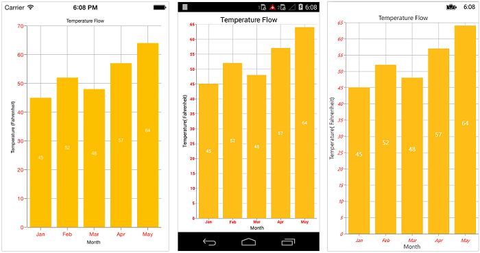

### Label and tick positioning

Axis labels and ticks can be positioned inside or outside the chart area by using the [`LabelStyle.LabelsPosition`](http://help.syncfusion.com/cr/cref_files/xamarin/sfchart/Syncfusion.SfChart.XForms~Syncfusion.SfChart.XForms.ChartAxisLabelStyle~LabelsPositionProperty.html) and [`TickPosition`](http://help.syncfusion.com/cr/cref_files/xamarin/sfchart/Syncfusion.SfChart.XForms~Syncfusion.SfChart.XForms.ChartAxis~TickPosition.html) properties of `ChartAxis`. By default, labels and ticks can be positioned outside the chart area.

 



<chart:SfChart.PrimaryAxis >

	<chart:DateTimeAxis TickPosition="Inside">

		<chart:DateTimeAxis.LabelStyle>

			<chart:ChartAxisLabelStyle LabelsPosition="Inside"/>
		
		</chart:DateTimeAxis.LabelStyle>

	</chart:DateTimeAxis>

</chart:SfChart.PrimaryAxis >





chart.PrimaryAxis.LabelStyle.LabelsPosition = AxisElementPosition.Inside;

chart.PrimaryAxis.TickPosition = AxisElementPosition.Inside;





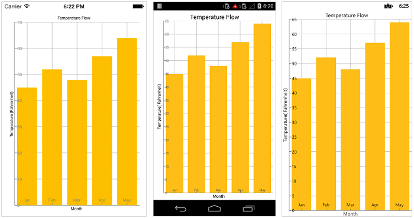

### Edge labels placement

Labels with long text at the edges of an axis may appear partially outside the chart. The [`EdgeLabelsDrawingMode`](http://help.syncfusion.com/cr/cref_files/xamarin/sfchart/Syncfusion.SfChart.XForms~Syncfusion.SfChart.XForms.ChartAxis~EdgeLabelsDrawingMode.html) property is used to avoid the partial appearance of labels at the corners.

 



<chart:CategoryAxis EdgeLabelsDrawingMode="Shift"/>





chart.PrimaryAxis.EdgeLabelsDrawingMode = EdgeLabelsDrawingMode.Shift;





### Grid lines customization

The [`ShowMajorGridLines`](http://help.syncfusion.com/cr/cref_files/xamarin/sfchart/Syncfusion.SfChart.XForms~Syncfusion.SfChart.XForms.ChartAxis~ShowMajorGridLines.html) and [`ShowMinorGridLines`](http://help.syncfusion.com/cr/cref_files/xamarin/sfchart/Syncfusion.SfChart.XForms~Syncfusion.SfChart.XForms.RangeAxisBase~ShowMinorGridLines.html) properties are used to control the visibility of grid lines. The [`MajorGridLineStyle`](http://help.syncfusion.com/cr/cref_files/xamarin/sfchart/Syncfusion.SfChart.XForms~Syncfusion.SfChart.XForms.ChartAxis~MajorGridLineStyle.html) and [`MinorGridLineStyle`](http://help.syncfusion.com/cr/cref_files/xamarin/sfchart/Syncfusion.SfChart.XForms~Syncfusion.SfChart.XForms.RangeAxisBase~MinorGridLineStyleProperty.html) properties are used to customize the major and minor grid lines of an axis, respectively. They provide options to change the width, dashes, and color of the grid lines. By default, minor grid lines will not be visible. 

 



<chart:SfChart.SecondaryAxis >

	<chart:NumericalAxis ShowMajorGridLines="True" ShowMinorGridLines="True" 
						 MinorTicksPerInterval="1"/>

</chart:SfChart.SecondaryAxis >





chart. SecondaryAxis = new NumericalAxis ()

{

	ShowMajorGridLines = true,

	ShowMinorGridLines = true,

	MinorTicksPerInterval = 1

};





### Tick lines customization

The [`MajorTickStyle`](http://help.syncfusion.com/cr/cref_files/xamarin/sfchart/Syncfusion.SfChart.XForms~Syncfusion.SfChart.XForms.ChartAxis~MajorTickStyle.html) and [`MinorTickStyle`](http://help.syncfusion.com/cr/cref_files/xamarin/sfchart/Syncfusion.SfChart.XForms~Syncfusion.SfChart.XForms.RangeAxisBase~MinorTickStyle.html) properties are used to customize the major and minor tick lines of an axis, respectively. They provide options to change the width, size, color, and visibility of the tick lines. By default, minor tick lines will not be visible.

 



<chart:SfChart.SecondaryAxis >

	<chart:NumericalAxis ShowMinorGridLines="True" MinorTicksPerInterval="1">

		<chart:NumericalAxis.MajorTickStyle >

			<chart:ChartAxisTickStyle TickSize="7" StrokeColor="Blue" StrokeWidth="3"/>

		</chart:NumericalAxis.MajorTickStyle>

		<chart:NumericalAxis.MinorTickStyle>

			<chart:ChartAxisTickStyle TickSize="5" StrokeColor="Green" StrokeWidth="2"/>

		</chart:NumericalAxis.MinorTickStyle>

	<chart:NumericalAxis/>

</chart:SfChart.SecondaryAxis >





NumericalAxis numerical = new NumericalAxis();

numerical.MajorTickStyle.TickSize = 7;

numerical.MajorTickStyle.StrokeWidth = 3;

numerical.MajorTickStyle.StrokeColor = Color.Red;

numerical.ShowMinorGridLines = true;

numerical.MinorTicksPerInterval = 1;

numerical.MinorTickStyle.TickSize = 5;

numerical.MinorTickStyle.StrokeWidth = 2;

numerical.MinorTickStyle.StrokeColor = Color.Green;

chart.SecondaryAxis = numerical;





### Inversing axis

An axis can be inversed using the [`IsInversed`](http://help.syncfusion.com/cr/cref_files/xamarin/sfchart/Syncfusion.SfChart.XForms~Syncfusion.SfChart.XForms.ChartAxis~IsInversed.html) property. The default value of the [`IsInversed`](http://help.syncfusion.com/cr/cref_files/xamarin/sfchart/Syncfusion.SfChart.XForms~Syncfusion.SfChart.XForms.ChartAxis~IsInversed.html) property is `False`.

 



<chart:SfChart.SecondaryAxis >

	<chart:NumericalAxis IsInversed="True">

</chart:SfChart.SecondaryAxis >





chart.SecondaryAxis.IsInversed = true;





### Placing axes at the opposite side

The [`OpposedPosition`](http://help.syncfusion.com/cr/cref_files/xamarin/sfchart/Syncfusion.SfChart.XForms~Syncfusion.SfChart.XForms.ChartAxis~OpposedPosition.html) property of an axis can be used to place the axis at the opposite side of its default position. The default value of the [`OpposedPosition`](http://help.syncfusion.com/cr/cref_files/xamarin/sfchart/Syncfusion.SfChart.XForms~Syncfusion.SfChart.XForms.ChartAxis~OpposedPosition.html) property is `False`. 

 



<chart:SfChart.SecondaryAxis >

	<chart:NumericalAxis OpposedPosition="True">

</chart:SfChart.SecondaryAxis >





chart.SecondaryAxis.OpposedPosition = true;





### Maximum number of labels per 100 pixels

By default, a maximum of three labels can be displayed for each 100 pixels in an axis. The maximum number of labels present within a 100-pixel length can be customized using the [`MaximumLabels`](http://help.syncfusion.com/cr/cref_files/xamarin/sfchart/Syncfusion.SfChart.XForms~Syncfusion.SfChart.XForms.ChartAxis~MaximumLabelsProperty.html) property of an axis. This property is applicable only for automatic range calculation, and will not be applicable if you set a value for the [`Interval`](http://help.syncfusion.com/cr/cref_files/xamarin/sfchart/Syncfusion.SfChart.XForms~Syncfusion.SfChart.XForms.NumericalAxis~Interval.html) property of an axis.

 



<chart:SfChart.SecondaryAxis >

	<chart:NumericalAxis MaximumLabels="5"/>

</chart:SfChart.SecondaryAxis >





Chart.SecondaryAxis.MaximumLabels = 5;





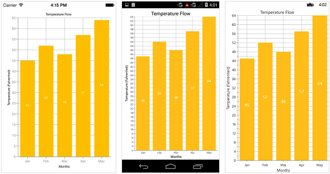

### AutoScrollingDelta

The [`AutoScrollingDelta`](https://help.syncfusion.com/cr/cref_files/xamarin/sfchart/Syncfusion.SfChart.XForms~Syncfusion.SfChart.XForms.ChartAxis~AutoScrollingDelta.html) property is used to ensure that a specified range of data is always visible in the chart. This always shows the recently added data points at the end. Scrolling will be reset to the end of the range whenever a new point is added. 

By adding the [`ChartZoomPanBehavior`](https://help.syncfusion.com/cr/cref_files/xamarin/sfchart/Syncfusion.SfChart.XForms~Syncfusion.SfChart.XForms.ChartZoomPanBehavior.html) property to the chart, you can scroll to see the previous datapoints.

### AutoScrollingDeltaType

In [`DateTimeAxis`](https://help.syncfusion.com/cr/cref_files/xamarin/sfchart/Syncfusion.SfChart.XForms~Syncfusion.SfChart.XForms.DateTimeAxis.html), you can apply auto scrolling delta values in years, months, days, hours, minutes, seconds, and milliseconds by setting the [`AutoScrollingDeltaType`](https://help.syncfusion.com/cr/cref_files/xamarin/sfchart/Syncfusion.SfChart.XForms~Syncfusion.SfChart.XForms.DateTimeAxis~AutoScrollingDeltaType.html) property.

 



<chart:SfChart.PrimaryAxis>

    <chart:DateTimeAxis AutoScrollingDelta="3" AutoScrollingDeltaType="Days">

</chart:SfChart.PrimaryAxis>





chart.PrimaryAxis = new DateTimeAxis()
{
      AutoScrollingDelta = 3,
	  
      AutoScrollingDeltaType = DateTimeDeltaType.Days
};





### AutoScrollingMode

The [`AutoScrollingMode`](https://help.syncfusion.com/cr/cref_files/xamarin/sfchart/Syncfusion.SfChart.XForms~Syncfusion.SfChart.XForms.ChartAxis~AutoScrollingMode.html) property can be used to determine whether the axis should be scrolled from the start position or end position. The default value of [`AutoScrollingMode`](https://help.syncfusion.com/cr/cref_files/xamarin/sfchart/Syncfusion.SfChart.XForms~Syncfusion.SfChart.XForms.ChartAxis~AutoScrollingMode.html) property is [`End`](https://help.syncfusion.com/cr/cref_files/xamarin/sfchart/Syncfusion.SfChart.XForms~Syncfusion.SfChart.XForms.ChartAutoScrollingMode.html).

 



<chart:SfChart.PrimaryAxis>

    <chart:CategoryAxis AutoScrollingDelta = "3" AutoScrollingMode = "Start">

</chart:SfChart.PrimaryAxis>





chart.PrimaryAxis = new DateTimeAxis()
{
      AutoScrollingDelta = 3,
	  
      AutoScrollingMode = ChartAutoScrollingMode.Start
};





## Axis crossing

An axis can be positioned anywhere in the chart area by using the [`CrossesAt`](http://help.syncfusion.com/cr/cref_files/xamarin/sfchart/Syncfusion.SfChart.XForms~Syncfusion.SfChart.XForms.ChartAxis~CrossesAt.html) property. This property specifies where the horizontal axis should intersect or cross the vertical axis or vice-versa. The default value of the [`CrossesAt`](http://help.syncfusion.com/cr/cref_files/xamarin/sfchart/Syncfusion.SfChart.XForms~Syncfusion.SfChart.XForms.ChartAxis~CrossesAt.html) property is null.





<chart:SfChart.PrimaryAxis>

    <chart:CategoryAxis CrossesAt = “0” />

</chart:SfChart.PrimaryAxis>
 
<chart:SfChart.SecondaryAxis>

    <chart:NumericalAxis CrossesAt = “8” />

</chart:SfChart.SecondaryAxis >
 




chart.PrimaryAxis  = new CategoryAxis() { CrossesAt = 0 };

chart.SecondaryAxis =  new NumericalAxis() { CrossesAt  = 8 };





### Crossing date-time axis

For crossing in the date-time horizontal axis, a date object should be provided as value for the [`CrossesAt`](http://help.syncfusion.com/cr/cref_files/xamarin/sfchart/Syncfusion.SfChart.XForms~Syncfusion.SfChart.XForms.ChartAxis~CrossesAt.html) property of the vertical axis.





<chart:SfChart.PrimaryAxis>

    <chart:DateTimeAxis CrossesAt="0" />

</chart:SfChart.PrimaryAxis >
 
<chart:SfChart.SecondaryAxis>

    <chart:NumericalAxis>

        <chart:NumericalAxis.CrossesAt>

            <sys:Datetime x:FactoryMethod = “Parse”>

                <x:Arguments>

                    <x:String>Jan 1 2003</x:String>

                </x:Arguments>

            </sys:Datetime>

        </chart:NumericalAxis.CrossesAt>

    </chart:NumericalAxis>

</chart:SfChart.SecondaryAxis>
 




chart.PrimaryAxis  = new DateTimeAxis() { CrossesAt = 0 };

chart.SecondaryAxis =  new NumericalAxis() { CrossesAt  = new DateTime(2003, 1, 1) };





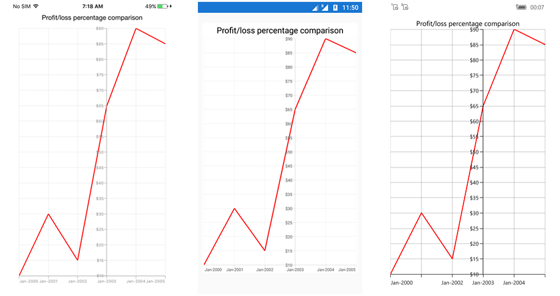

### Positioning the axis elements while crossing

The [`RenderNextToCrossingValue`](http://help.syncfusion.com/cr/cref_files/xamarin/sfchart/Syncfusion.SfChart.XForms~Syncfusion.SfChart.XForms.ChartAxis~RenderNextToCrossingValue.html) property is used to determine whether the crossing axis should be placed at crossing position or not. The default value of the [`RenderNextToCrossingValue`](http://help.syncfusion.com/cr/cref_files/xamarin/sfchart/Syncfusion.SfChart.XForms~Syncfusion.SfChart.XForms.ChartAxis~RenderNextToCrossingValue.html) property is true.





<chart:SfChart.PrimaryAxis>

    <chart:CategoryAxis CrossesAt="0" RenderNextToCrossingValue="False"/>

</chart:SfChart.PrimaryAxis>

<chart:SfChart.SecondaryAxis>

    <chart:NumericalAxis CrossesAt="5" />

</chart:SfChart.SecondaryAxis>
 




chart.PrimaryAxis = new CategoryAxis()
{
    CrossesAt = 0,

    RenderNextToCrossingValue = false
};

chart.SecondaryAxis = new NumericalAxis()
{
    CrossesAt = 5,
};





## Smart axis labels

Axis labels may overlap with each other based on chart dimensions and label size. The [`LabelsIntersectAction`](http://help.syncfusion.com/cr/cref_files/xamarin/sfchart/Syncfusion.SfChart.XForms~Syncfusion.SfChart.XForms.ChartAxis~LabelsIntersectAction.html) property of axis is used to avoid the overlapping of axis labels. The default value of the [`LabelsIntersectAction`](http://help.syncfusion.com/cr/cref_files/xamarin/sfchart/Syncfusion.SfChart.XForms~Syncfusion.SfChart.XForms.ChartAxis~LabelsIntersectAction.html) is [`None`](http://help.syncfusion.com/cr/cref_files/xamarin/sfchart/Syncfusion.SfChart.XForms~Syncfusion.SfChart.XForms.AxisLabelsIntersectAction.html). Other available values of the [`LabelsIntersectAction`](http://help.syncfusion.com/cr/cref_files/xamarin/sfchart/Syncfusion.SfChart.XForms~Syncfusion.SfChart.XForms.ChartAxis~LabelsIntersectAction.html) are [`MultipleRows`](http://help.syncfusion.com/cr/cref_files/xamarin/sfchart/Syncfusion.SfChart.XForms~Syncfusion.SfChart.XForms.AxisLabelsIntersectAction.html) and [`Hide`](http://help.syncfusion.com/cr/cref_files/xamarin/sfchart/Syncfusion.SfChart.XForms~Syncfusion.SfChart.XForms.AxisLabelsIntersectAction.html).

 



<chart:SfChart.PrimaryAxis >

	<chart:CategoryAxis LabelsIntersectAction="MultipleRows"/>

</chart:SfChart.PrimaryAxis >





chart.PrimaryAxis.LabelsIntersectAction = AxisLabelsIntersectAction.MultipleRows;





## Event

**ActualRangeChanged**

This event is triggered when the actual range of the axis is changed. This argument contains the following informations:

* [`ActualMinimum`](http://help.syncfusion.com/cr/cref_files/xamarin/sfchart/Syncfusion.SfChart.XForms~Syncfusion.SfChart.XForms.ActualRangeChangedEventArgs~ActualMinimum.html)—Used to get or set the actual minimum value of the axis.
* [`ActualMaximum`](http://help.syncfusion.com/cr/cref_files/xamarin/sfchart/Syncfusion.SfChart.XForms~Syncfusion.SfChart.XForms.ActualRangeChangedEventArgs~ActualMaximum.html)—Used to get or set the actual maximum value of the axis.
* [`VisibleMinimum`](http://help.syncfusion.com/cr/cref_files/xamarin/sfchart/Syncfusion.SfChart.XForms~Syncfusion.SfChart.XForms.ActualRangeChangedEventArgs~VisibleMinimum.html)—Used to get or set the visible minimum value of the axis.
* [`VisibleMaximum`](http://help.syncfusion.com/cr/cref_files/xamarin/sfchart/Syncfusion.SfChart.XForms~Syncfusion.SfChart.XForms.ActualRangeChangedEventArgs~VisibleMaximum.html)—Used to get or set the visible maximum value of the axis.

N> Actual range and visible range are similar unless the range is changed by specifying the [`ZoomPosition`](http://help.syncfusion.com/cr/cref_files/xamarin/sfchart/Syncfusion.SfChart.XForms~Syncfusion.SfChart.XForms.ChartAxis~ZoomPosition.html) and [`ZoomFactor`](http://help.syncfusion.com/cr/cref_files/xamarin/sfchart/Syncfusion.SfChart.XForms~Syncfusion.SfChart.XForms.ChartAxis~ZoomFactor.html) properties or zooming the chart interactively. Visible range is always a range, which can be seen visually on the screen.

**LabelCreated**

This event is triggered when the axis label is created. This argument contains the following informations:

* [`LabelContent`](http://help.syncfusion.com/cr/cref_files/xamarin/sfchart/Syncfusion.SfChart.XForms~Syncfusion.SfChart.XForms.ChartAxisLabelEventArgs~LabelContent.html)—Used to get or set the axis label content.
* [`Position`](http://help.syncfusion.com/cr/cref_files/xamarin/sfchart/Syncfusion.SfChart.XForms~Syncfusion.SfChart.XForms.ChartAxisLabelEventArgs~Position.html)—Used to get the position of a label.

**LabelClicked**

This event is triggered when the axis label is clicked. This argument contains the following informations:

* [`LabelContent`](https://help.syncfusion.com/cr/cref_files/xamarin/sfchart/Syncfusion.SfChart.XForms~Syncfusion.SfChart.XForms.LabelClickedEventArgs~LabelContent.html)—Used to get or set the axis label content.
* [`Position`](https://help.syncfusion.com/cr/cref_files/xamarin/sfchart/Syncfusion.SfChart.XForms~Syncfusion.SfChart.XForms.LabelClickedEventArgs~Position.html)—Used to get the position of a label.