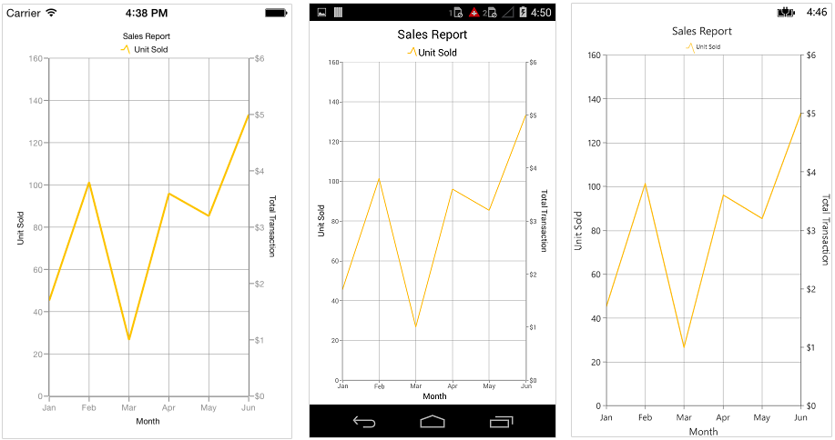

# Chart Series

## Multiple Series

You can add multiple series to `Series` property of `SfChart` class.


[XAML]

<chart:SfChart>
...

	<chart:ColumnSeries ItemsSource ="{Binding Data }" XBindingPath="Country"
	 YBindingPath="Value"/>

	<chart:ColumnSeries ItemsSource ="{Binding Data1}" XBindingPath="Country"
	 YBindingPath="Value"/>

	<chart:ColumnSeries ItemsSource ="{Binding Data2}" XBindingPath="Country"
	 YBindingPath="Value"/>

</chart:SfChart>




[C#]

SfChart chart = new SfChart();
...

ColumnSeries columnSeries = new ColumnSeries() { ItemsSource = Data, XBindingPath = "Country", YBindingPath = "Value" };

ColumnSeries columnSeries1 = new ColumnSeries() { ItemsSource = Data1, XBindingPath = "Country", YBindingPath = "Value" };

ColumnSeries columnSeries2 = new ColumnSeries() { ItemsSource = Data2, XBindingPath = "Country", YBindingPath = "Value" };

chart.Series.Add(columnSeries);

chart.Series.Add(columnSeries1);

chart.Series.Add(columnSeries2);



## Combination Series

`SfChart` allows you to render the combination of different types of series.


[XAML]

<chart:SfChart>
...

	<chart:ColumnSeries ItemsSource ="{Binding Data}" XBindingPath="Month" YBindingPath="Value"/>

	<chart:LineSeries ItemsSource ="{Binding Data1}" XBindingPath="Month" YBindingPath="Value"/>

</chart:SfChart>




[C#]

SfChart chart = new SfChart();

...

ColumnSeries columnSeries = new ColumnSeries() { ItemsSource = Data, XBindingPath = "Month", YBindingPath = "Value" };

LineSeries lineSeries = new LineSeries() { ItemsSource = Data1, XBindingPath = "Month", YBindingPath = "Value" }; 

chart.Series.Add(columnSeries);

chart.Series.Add(lineSeries);



**Limitation of Combination Chart**

* Bar, StackingBar, and StackingBar100 cannot be combined with the other Cartesian type series.
* Cartesian type series cannot be combined with accumulation series (pie, doughnut, funnel, and pyramid).

When the combination of Cartesian and accumulation series types are added to the `Series` property, the series which are similar to the first series will be rendered and other series will be ignored. Following code snippet illustrates this.


[XAML]

<chart:SfChart>
...

	<chart:LineSeries ItemsSource ="{Binding Data}" XBindingPath="Month" YBindingPath="Value"/>

	<chart:PieSeries ItemsSource ="{Binding Data1}" XBindingPath="Month" YBindingPath="Value"/>

</chart:SfChart>




[C#]

SfChart chart = new SfChart();
...

LineSeries lineSeries = new LineSeries() { ItemsSource = Data, XBindingPath = "Month", YBindingPath = "Value" };

PieSeries pieSeries = new PieSeries() { ItemsSource = Data1, XBindingPath = "Month", YBindingPath = "Value" };

chart.Series.Add(lineSeries);

chart.Series.Add(pieSeries);



## Grouping Stacked Series

You can use the `GroupingLabel` property to group the stacked series. Series with same group name are stacked on top of each other.


[XAML]

<chart:SfChart>
...

	<chart:StackingColumnSeries ItemsSource ="{Binding Data1}" GroupingLabel="GruopOne" Label="Google" XBindingPath="Month" YBindingPath="Value"/>

	<chart:StackingColumnSeries ItemsSource ="{Binding Data2}" GroupingLabel="GruopOne" Label="Bing" XBindingPath="Month" YBindingPath="Value"/>

	<chart:StackingColumnSeries ItemsSource ="{Binding Data3}" Label="Yahoo" XBindingPath="Month" YBindingPath="Value"/>

</chart:SfChart>




[C#]

SfChart chart = new SfChart();
...

StackingColumnSeries stackingColumnSeries1 = new StackingColumnSeries() 
{ 
	ItemsSource = Data1, 
	GroupingLabel = "GroupOne",
	Label = "Google",
	XBindingPath = "Month", 
	YBindingPath = "Value" 
};

StackingColumnSeries stackingColumnSeries2 = new StackingColumnSeries() 
{ 
	ItemsSource = Data2, 
	GroupingLabel = "GroupOne",
	Label = "Bing",
	XBindingPath = "Month", 
	YBindingPath = "Value" 
};

StackingColumnSeries stackingColumnSeries3 = new StackingColumnSeries() 
{ 
	ItemsSource = Data3, 
	Label = "Yahoo",
	XBindingPath = "Month", 
	YBindingPath = "Value" 
};

chart.Series.Add(stackingColumnSeries1);
chart.Series.Add(stackingColumnSeries2);
chart.Series.Add(stackingColumnSeries3);



