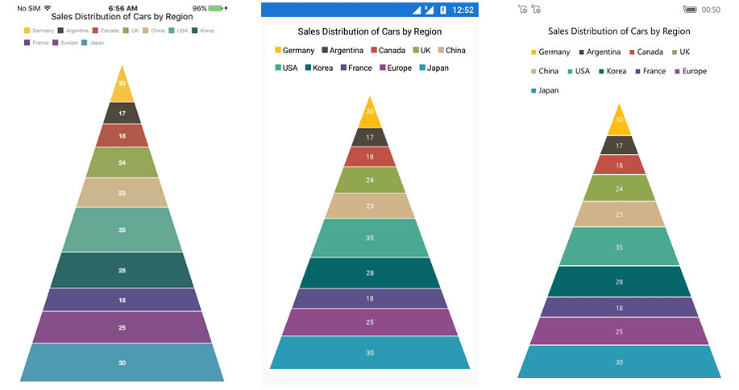

# Legend

Legend contains list of chart series/data points in the chart. The information provided in each legend item helps in identifying the corresponding data series in chart.

Following code example shows how to enable legend in a chart,

 



<chart:SfChart>

	<chart:SfChart.Legend>

		<chart:ChartLegend/>

	</chart:SfChart.Legend>

</chart:SfChart>





chart.Legend = new ChartLegend();





## Customizing Labels

[`Label`](http://help.syncfusion.com/cr/cref_files/xamarin/sfchart/Syncfusion.SfChart.XForms~Syncfusion.SfChart.XForms.ChartSeries~Label.html) property of [`ChartSeries`](http://help.syncfusion.com/cr/cref_files/xamarin/sfchart/Syncfusion.SfChart.XForms~Syncfusion.SfChart.XForms.ChartSeries.html) is used to define the label for the corresponding series legend item. The following properties are used to customize the legend items label appearance.

* [`TextColor`](http://help.syncfusion.com/cr/cref_files/xamarin/sfchart/Syncfusion.SfChart.XForms~Syncfusion.SfChart.XForms.ChartLegendLabelStyle~TextColor.html) – used to change the color of the label.
* [`Font`](http://help.syncfusion.com/cr/cref_files/xamarin/sfchart/Syncfusion.SfChart.XForms~Syncfusion.SfChart.XForms.ChartLegendLabelStyle~Font.html) – used to change the text size, font family and font weight.
* [`Margin`](http://help.syncfusion.com/cr/cref_files/xamarin/sfchart/Syncfusion.SfChart.XForms~Syncfusion.SfChart.XForms.ChartLegendLabelStyle~Margin.html) - used to change the margin size for labels.

 



<chart:SfChart.Legend>

	<chart:ChartLegend>

		<chart:ChartLegend.LabelStyle>

			<chart:ChartLegendLabelStyle TextColor="Blue" Margin="5" Font="Bold,18"/>

		</chart:ChartLegend.LabelStyle>

	</chart:ChartLegend>

</chart:SfChart.Legend>





chart.Legend = new ChartLegend();

chart.Legend.LabelStyle.TextColor = Color.Blue;

chart.Legend.LabelStyle.Font = Font.SystemFontOfSize(18, FontAttributes.Bold);

chart.Legend.LabelStyle.Margin = 5;





## Legend Icons

Legend icons are enabled by default, however, you can control its visibility using [`IsIconVisible`](http://help.syncfusion.com/cr/cref_files/xamarin/sfchart/Syncfusion.SfChart.XForms~Syncfusion.SfChart.XForms.ChartLegend~IsIconVisible.html) property. Also you can specify the icon type using [`LegendIcon`](http://help.syncfusion.com/cr/cref_files/xamarin/sfchart/Syncfusion.SfChart.XForms~Syncfusion.SfChart.XForms.ChartSeries~LegendIconProperty.html#) property in ChartSeries. [`IconWidth`](http://help.syncfusion.com/cr/cref_files/xamarin/sfchart/Syncfusion.SfChart.XForms~Syncfusion.SfChart.XForms.ChartLegend~IconWidthProperty.html) and [`IconHeight`](http://help.syncfusion.com/cr/cref_files/xamarin/sfchart/Syncfusion.SfChart.XForms~Syncfusion.SfChart.XForms.ChartLegend~IconHeightProperty.html#) properties are used to adjust the width and height of the legend icons respectively.

 



<chart:SfChart>

	<chart:SfChart.Legend>

		<chart:ChartLegend IsIconVisible="True" IconHeight="20" IconWidth="20"/>

	</chart:SfChart.Legend>

	<chart:PieSeries ItemsSource ="{Binding Data1}" LegendIcon="SeriesType"/>

</chart:SfChart>





chart.Legend = new ChartLegend();

chart.Legend.IconHeight = 20;

chart.Legend.IconWidth = 20;

chart.Legend.IsIconVisible = true;

pieSeries.LegendIcon = ChartLegendIcon.SeriesType;





## Legend Title

Following properties are used to define and customize the legend title.

* [`Text`](http://help.syncfusion.com/cr/cref_files/xamarin/sfchart/Syncfusion.SfChart.XForms~Syncfusion.SfChart.XForms.ChartTitle~Text.html) – used to change the title text.
* [`TextColor`](http://help.syncfusion.com/cr/cref_files/xamarin/sfchart/Syncfusion.SfChart.XForms~Syncfusion.SfChart.XForms.ChartTitle~TextColor.html) – used to change the color of the title text.
* [`Font`](http://help.syncfusion.com/cr/cref_files/xamarin/sfchart/Syncfusion.SfChart.XForms~Syncfusion.SfChart.XForms.ChartTitle~Font.html) – used to change the text size, font family and font weight of the title.
* [`Margin`](http://help.syncfusion.com/cr/cref_files/xamarin/sfchart/Syncfusion.SfChart.XForms~Syncfusion.SfChart.XForms.ChartTitle~Margin.html) – used to change the margin size for title.
* [`TextAlignment`](http://help.syncfusion.com/cr/cref_files/xamarin/sfchart/Syncfusion.SfChart.XForms~Syncfusion.SfChart.XForms.ChartTitle~TextAlignment.html) – used to change the alignment of the title text, it can be start, end and center.
* [`BackgroundColor`](http://help.syncfusion.com/cr/cref_files/xamarin/sfchart/Syncfusion.SfChart.XForms~Syncfusion.SfChart.XForms.ChartTitle~BackgroundColor.html) – used to change the title background color.
* [`BorderColor`](http://help.syncfusion.com/cr/cref_files/xamarin/sfchart/Syncfusion.SfChart.XForms~Syncfusion.SfChart.XForms.ChartTitle~BorderColor.html) – used to change the border color.
* [`BorderWidth`](http://help.syncfusion.com/cr/cref_files/xamarin/sfchart/Syncfusion.SfChart.XForms~Syncfusion.SfChart.XForms.ChartTitle~BorderWidth.html) – used to adjust the title border width.

 



<chart:SfChart.Legend>

	<chart:ChartLegend>

		<chart:ChartLegend.Title >

			<chart:ChartTitle Text="Years" TextColor="Maroon" TextAlignment="Center" 
							  BackgroundColor="Silver" BorderWidth="3" BorderColor="Blue" Font="Bold,20"/>

			</chart:ChartTitle>

		</chart:ChartLegend.Title>

	</chart:ChartLegend>

</chart:SfChart.Legend>





chart.Legend = new ChartLegend();

chart.Legend.Title.Text = "Year";

chart.Legend.Title.TextColor = Color.Maroon;

chart.Legend.Title.Font = Font.SystemFontOfSize(20, FontAttributes.Bold);

chart.Legend.Title.TextAlignment = TextAlignment.Center;

chart.Legend.Title.BackgroundColor = Color.Silver;

chart.Legend.Title.BorderWidth = 3;

chart.Legend.Title.BorderColor = Color.Blue;





## Toggle the series visibility

You can control the visibility of the series by tapping on the legend item. You can enable this feature by enabling [`ToggleSeriesVisibility`](http://help.syncfusion.com/cr/cref_files/xamarin/sfchart/Syncfusion.SfChart.XForms~Syncfusion.SfChart.XForms.ChartLegend~ToggleSeriesVisibility.html) property.

 



<chart:SfChart>

	<chart:SfChart.Legend>

		<chart:ChartLegend ToggleSeriesVisibility="True"/>

	</chart:SfChart.Legend>

</chart:SfChart>





chart.Legend = new ChartLegend();

chart.Legend.ToggleSeriesVisibility = true;





## Legend item visibility

You can control the visibility of particular series legend item by using the [`IsVisibleOnLegend`](http://help.syncfusion.com/cr/cref_files/xamarin/sfchart/Syncfusion.SfChart.XForms~Syncfusion.SfChart.XForms.ChartSeries~IsVisibleOnLegendProperty.html) property of series. Default value of [`IsVisibleOnLegend`](http://help.syncfusion.com/cr/cref_files/xamarin/sfchart/Syncfusion.SfChart.XForms~Syncfusion.SfChart.XForms.ChartSeries~IsVisibleOnLegendProperty.html) property is True.

 



<chart:ColumnSeries ItemsSource="{Binding ColumnData}" XBindingPath="Name" 
				YBindingPath="Value" IsVisibleOnLegend="true" > 
</chart:ColumnSeries>





ColumnSeries column = new ColumnSeries();

column.XBindingPath = "Name";

column.YBindingPath = "Value";

column.ItemsSource = viewModel.ColumnData;

column.IsVisibleOnLegend = true;





## Legend Wrap

The legend items can be placed in multiple rows by using [`OverflowMode`](http://help.syncfusion.com/cr/cref_files/xamarin/sfchart/Syncfusion.SfChart.XForms~Syncfusion.SfChart.XForms.ChartLegend~OverflowMode.html) property if size of the total legend exceeds the available size. The default value of [`OverflowMode`](http://help.syncfusion.com/cr/cref_files/xamarin/sfchart/Syncfusion.SfChart.XForms~Syncfusion.SfChart.XForms.ChartLegend~OverflowMode.html) property is Scroll.    





<chart:SfChart.Legend>

    <chart:ChartLegend OverflowMode="Wrap"/>

</chart:SfChart.Legend>





chart.Legend = new ChartLegend()
{
    OverflowMode = ChartLegendOverflowMode.Wrap
};





### Legend Width

The legend width can be specified by using [`MaxWidth`](http://help.syncfusion.com/cr/cref_files/xamarin/sfchart/Syncfusion.SfChart.XForms~Syncfusion.SfChart.XForms.ChartLegend~MaxWidth.html) property. This property works only  when the [`OverflowMode`](http://help.syncfusion.com/cr/cref_files/xamarin/sfchart/Syncfusion.SfChart.XForms~Syncfusion.SfChart.XForms.ChartLegend~OverflowMode.html) is Wrap. The default value of [`MaxWidth`](http://help.syncfusion.com/cr/cref_files/xamarin/sfchart/Syncfusion.SfChart.XForms~Syncfusion.SfChart.XForms.ChartLegend~MaxWidth.html) property is double.NAN.





<chart:SfChart>

    <chart:SfChart.Legend>

        <chart:ChartLegend OverflowMode = “Wrap”  MaxWidth = “750” />

    </chart:SfChart.Legend>

</chart:SfChart>





chart.Legend = new ChartLegend()
{
    OverflowMode = ChartLegendOverflowMode.Wrap,

    MaxWidth = 750
};





## Positioning the Legend

You can position the legend anywhere inside the chart. Following properties are used to customize the legend positions.

* [`DockPosition`](http://help.syncfusion.com/cr/cref_files/xamarin/sfchart/Syncfusion.SfChart.XForms~Syncfusion.SfChart.XForms.ChartLegend~DockPosition.html) – used to position the legend relatively. Options available are: Left, Right, Top, Bottom and Floating. If the DockPosition is Floating, you can position the legend using x and y coordinates.
* [`OffsetX`](http://help.syncfusion.com/cr/cref_files/xamarin/sfchart/Syncfusion.SfChart.XForms~Syncfusion.SfChart.XForms.ChartLegend~OffsetX.html) – used to move the legend on x coordinate by the given offset value, this will work only if the dock position is Floating.
* [`OffsetY`](http://help.syncfusion.com/cr/cref_files/xamarin/sfchart/Syncfusion.SfChart.XForms~Syncfusion.SfChart.XForms.ChartLegend~OffsetY.html) - used to move the legend on y coordinate by the given offset value, this will work only if the dock position is Floating.

 



<chart:SfChart>

	<chart:SfChart.Legend>

		<chart:ChartLegend DockPosition="Floating" OffsetX="70" OffsetY="90" 
						   Orientation="Vertical">        

	</chart:SfChart.Legend>           

</chart:SfChart>





chart.Legend = new ChartLegend();

chart.Legend.DockPosition = LegendPlacement.Floating;

chart.Legend.Orientation = ChartOrientation.Vertical;

chart.Legend.OffsetX = 70;

chart.Legend.OffsetY = 90;





