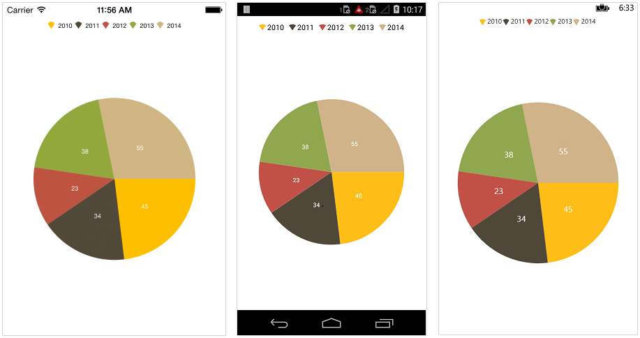
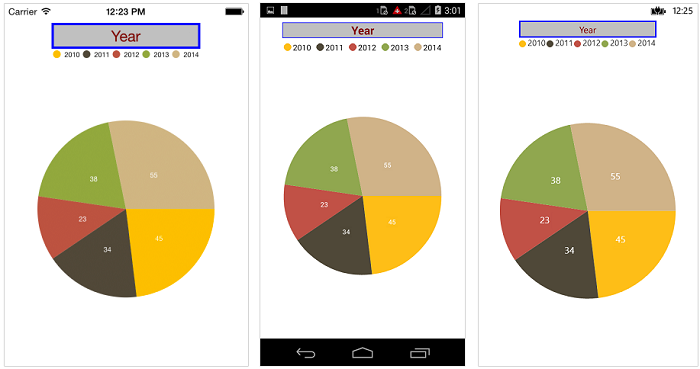
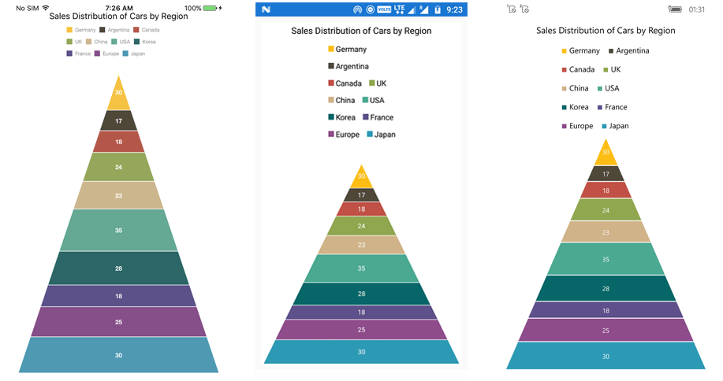

# Legend

A legend contains a list of chart series/data points in chart. The information provided in each legend item helps you to identify the corresponding data series in chart.

The following code example shows how to enable a legend in chart,

 



<chart:SfChart>

	<chart:SfChart.Legend>

		<chart:ChartLegend/>

	</chart:SfChart.Legend>

</chart:SfChart>





chart.Legend = new ChartLegend();





## Customizing labels

The [`Label`](http://help.syncfusion.com/cr/cref_files/xamarin/sfchart/Syncfusion.SfChart.XForms~Syncfusion.SfChart.XForms.ChartSeries~Label.html) property of [`ChartSeries`](http://help.syncfusion.com/cr/cref_files/xamarin/sfchart/Syncfusion.SfChart.XForms~Syncfusion.SfChart.XForms.ChartSeries.html) is used to define the label for the corresponding series legend item. The following properties are used to customize a legend item's label appearance:

* [`TextColor`](http://help.syncfusion.com/cr/cref_files/xamarin/sfchart/Syncfusion.SfChart.XForms~Syncfusion.SfChart.XForms.ChartLegendLabelStyle~TextColor.html)—Used to change the color of the label.
* [`Font`](http://help.syncfusion.com/cr/cref_files/xamarin/sfchart/Syncfusion.SfChart.XForms~Syncfusion.SfChart.XForms.ChartLegendLabelStyle~Font.html)—Used to change the text size, font family, and font weight.
* [`Margin`](http://help.syncfusion.com/cr/cref_files/xamarin/sfchart/Syncfusion.SfChart.XForms~Syncfusion.SfChart.XForms.ChartLegendLabelStyle~Margin.html)—Used to change the margin size for labels.

 



<chart:SfChart.Legend>

	<chart:ChartLegend>

		<chart:ChartLegend.LabelStyle>

			<chart:ChartLegendLabelStyle TextColor="Blue" Margin="5" Font="Bold,18"/>

		</chart:ChartLegend.LabelStyle>

	</chart:ChartLegend>

</chart:SfChart.Legend>





chart.Legend = new ChartLegend();

chart.Legend.LabelStyle.TextColor = Color.Blue;

chart.Legend.LabelStyle.Font = Font.SystemFontOfSize(18, FontAttributes.Bold);

chart.Legend.LabelStyle.Margin = 5;





## Legend icons

Legend icons are enabled by default. You can control its visibility using the [`IsIconVisible`](http://help.syncfusion.com/cr/cref_files/xamarin/sfchart/Syncfusion.SfChart.XForms~Syncfusion.SfChart.XForms.ChartLegend~IsIconVisible.html) property. The icon type also can be specified using the [`LegendIcon`](http://help.syncfusion.com/cr/cref_files/xamarin/sfchart/Syncfusion.SfChart.XForms~Syncfusion.SfChart.XForms.ChartSeries~LegendIconProperty.html#) property in chart series. The [`IconWidth`](http://help.syncfusion.com/cr/cref_files/xamarin/sfchart/Syncfusion.SfChart.XForms~Syncfusion.SfChart.XForms.ChartLegend~IconWidthProperty.html) and [`IconHeight`](http://help.syncfusion.com/cr/cref_files/xamarin/sfchart/Syncfusion.SfChart.XForms~Syncfusion.SfChart.XForms.ChartLegend~IconHeightProperty.html#) properties are used to adjust the width and height of a legend icon respectively.

 



<chart:SfChart>

	<chart:SfChart.Legend>

		<chart:ChartLegend IsIconVisible="True" IconHeight="20" IconWidth="20"/>

	</chart:SfChart.Legend>

	<chart:PieSeries ItemsSource ="{Binding Data1}" LegendIcon="SeriesType"/>

</chart:SfChart>





chart.Legend = new ChartLegend();

chart.Legend.IconHeight = 20;

chart.Legend.IconWidth = 20;

chart.Legend.IsIconVisible = true;

pieSeries.LegendIcon = ChartLegendIcon.SeriesType;





## Legend title

The following properties are used to define and customize the legend title:

* [`Text`](http://help.syncfusion.com/cr/cref_files/xamarin/sfchart/Syncfusion.SfChart.XForms~Syncfusion.SfChart.XForms.ChartTitle~Text.html)—Used to change the text of the title.
* [`TextColor`](http://help.syncfusion.com/cr/cref_files/xamarin/sfchart/Syncfusion.SfChart.XForms~Syncfusion.SfChart.XForms.ChartTitle~TextColor.html)—Used to change the color of the title text.
* [`Font`](http://help.syncfusion.com/cr/cref_files/xamarin/sfchart/Syncfusion.SfChart.XForms~Syncfusion.SfChart.XForms.ChartTitle~Font.html)—Used to change the text size, font family, and font weight of the title.
* [`Margin`](http://help.syncfusion.com/cr/cref_files/xamarin/sfchart/Syncfusion.SfChart.XForms~Syncfusion.SfChart.XForms.ChartTitle~Margin.html)—Used to change the margin size of the title.
* [`TextAlignment`](http://help.syncfusion.com/cr/cref_files/xamarin/sfchart/Syncfusion.SfChart.XForms~Syncfusion.SfChart.XForms.ChartTitle~TextAlignment.html)—Used to change the alignment of the title text; it can be start, end, or center.
* [`BackgroundColor`](http://help.syncfusion.com/cr/cref_files/xamarin/sfchart/Syncfusion.SfChart.XForms~Syncfusion.SfChart.XForms.ChartTitle~BackgroundColor.html)—Used to change the background color of the title.
* [`BorderColor`](http://help.syncfusion.com/cr/cref_files/xamarin/sfchart/Syncfusion.SfChart.XForms~Syncfusion.SfChart.XForms.ChartTitle~BorderColor.html)—Used to change the border color.
* [`BorderWidth`](http://help.syncfusion.com/cr/cref_files/xamarin/sfchart/Syncfusion.SfChart.XForms~Syncfusion.SfChart.XForms.ChartTitle~BorderWidth.html)—Used to adjust the width of the title border.

 



<chart:SfChart.Legend>

	<chart:ChartLegend>

		<chart:ChartLegend.Title >

			<chart:ChartTitle Text="Years" TextColor="Maroon" TextAlignment="Center" 
							  BackgroundColor="Silver" BorderWidth="3" BorderColor="Blue" Font="Bold,20"/>

			</chart:ChartTitle>

		</chart:ChartLegend.Title>

	</chart:ChartLegend>

</chart:SfChart.Legend>





chart.Legend = new ChartLegend();

chart.Legend.Title.Text = "Year";

chart.Legend.Title.TextColor = Color.Maroon;

chart.Legend.Title.Font = Font.SystemFontOfSize(20, FontAttributes.Bold);

chart.Legend.Title.TextAlignment = TextAlignment.Center;

chart.Legend.Title.BackgroundColor = Color.Silver;

chart.Legend.Title.BorderWidth = 3;

chart.Legend.Title.BorderColor = Color.Blue;





## Toggle the series visibility

You can control the visibility of the series by tapping the legend item. You can enable this feature by enabling the [`ToggleSeriesVisibility`](http://help.syncfusion.com/cr/cref_files/xamarin/sfchart/Syncfusion.SfChart.XForms~Syncfusion.SfChart.XForms.ChartLegend~ToggleSeriesVisibility.html) property.

 



<chart:SfChart>

	<chart:SfChart.Legend>

		<chart:ChartLegend ToggleSeriesVisibility="True"/>

	</chart:SfChart.Legend>

</chart:SfChart>





chart.Legend = new ChartLegend();

chart.Legend.ToggleSeriesVisibility = true;





## Legend item visibility

You can control the visibility of a particular series' legend item by using the [`IsVisibleOnLegend`](http://help.syncfusion.com/cr/cref_files/xamarin/sfchart/Syncfusion.SfChart.XForms~Syncfusion.SfChart.XForms.ChartSeries~IsVisibleOnLegendProperty.html) property of series. The default value of [`IsVisibleOnLegend`](http://help.syncfusion.com/cr/cref_files/xamarin/sfchart/Syncfusion.SfChart.XForms~Syncfusion.SfChart.XForms.ChartSeries~IsVisibleOnLegendProperty.html) property is true.

 



<chart:ColumnSeries ItemsSource="{Binding ColumnData}" XBindingPath="Name" 
				YBindingPath="Value" IsVisibleOnLegend="true" > 
</chart:ColumnSeries>





ColumnSeries column = new ColumnSeries();

column.XBindingPath = "Name";

column.YBindingPath = "Value";

column.ItemsSource = viewModel.ColumnData;

column.IsVisibleOnLegend = true;





## Legend wrap

The legend items can be placed in multiple rows by using the [`OverflowMode`](http://help.syncfusion.com/cr/cref_files/xamarin/sfchart/Syncfusion.SfChart.XForms~Syncfusion.SfChart.XForms.ChartLegend~OverflowMode.html) property if size of the total legend exceeds the available size. The default value of this property is Scroll.





<chart:SfChart.Legend>

    <chart:ChartLegend OverflowMode="Wrap"/>

</chart:SfChart.Legend>





chart.Legend = new ChartLegend()
{
    OverflowMode = ChartLegendOverflowMode.Wrap
};





### Legend width

The legend width can be specified by using the [`MaxWidth`](http://help.syncfusion.com/cr/cref_files/xamarin/sfchart/Syncfusion.SfChart.XForms~Syncfusion.SfChart.XForms.ChartLegend~MaxWidth.html) property. This property works only when the [`OverflowMode`](http://help.syncfusion.com/cr/cref_files/xamarin/sfchart/Syncfusion.SfChart.XForms~Syncfusion.SfChart.XForms.ChartLegend~OverflowMode.html) is Wrap. The default value of [`MaxWidth`](http://help.syncfusion.com/cr/cref_files/xamarin/sfchart/Syncfusion.SfChart.XForms~Syncfusion.SfChart.XForms.ChartLegend~MaxWidth.html) property is double.NAN.





<chart:SfChart>

    <chart:SfChart.Legend>

        <chart:ChartLegend OverflowMode = “Wrap”  MaxWidth = “750” />

    </chart:SfChart.Legend>

</chart:SfChart>





chart.Legend = new ChartLegend()
{
    OverflowMode = ChartLegendOverflowMode.Wrap,

    MaxWidth = 750
};





## Positioning the legend

You can position the legend anywhere in the chart. The following properties are used to customize the legend positions:

* [`DockPosition`](http://help.syncfusion.com/cr/cref_files/xamarin/sfchart/Syncfusion.SfChart.XForms~Syncfusion.SfChart.XForms.ChartLegend~DockPosition.html)—Used to position the legend relatively. The options available in this property are Left, Right, Top, Bottom, and Floating. If the DockPosition is Floating, you can position the legend using the x and y coordinates.
* [`OffsetX`](http://help.syncfusion.com/cr/cref_files/xamarin/sfchart/Syncfusion.SfChart.XForms~Syncfusion.SfChart.XForms.ChartLegend~OffsetX.html)—Used to move the legend on x-coordinate by the given offset value; it will work only if the DockPosition is Floating.
* [`OffsetY`](http://help.syncfusion.com/cr/cref_files/xamarin/sfchart/Syncfusion.SfChart.XForms~Syncfusion.SfChart.XForms.ChartLegend~OffsetY.html)—Used to move the legend on y-coordinate by the given offset value; it will work only if the DockPosition is Floating.

 



<chart:SfChart>

	<chart:SfChart.Legend>

		<chart:ChartLegend DockPosition="Floating" OffsetX="70" OffsetY="90" 
						   Orientation="Vertical">        

	</chart:SfChart.Legend>           

</chart:SfChart>





chart.Legend = new ChartLegend();

chart.Legend.DockPosition = LegendPlacement.Floating;

chart.Legend.Orientation = ChartOrientation.Vertical;

chart.Legend.OffsetX = 70;

chart.Legend.OffsetY = 90;





