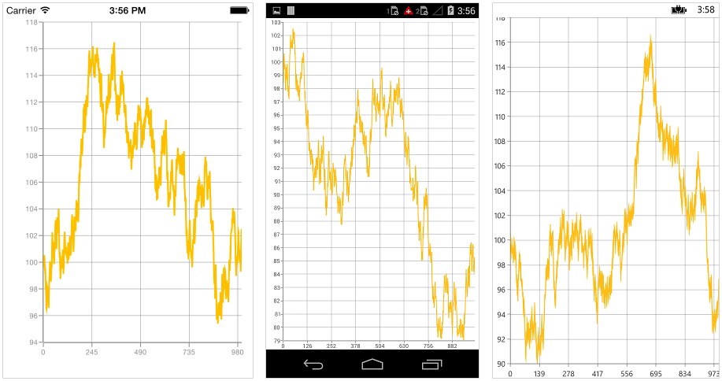

# Performance

When there are large number of points to load in line series, you can use `FastLineSeries` series instead of `LineSeries`. To renderer a fast line chart, create an instance of `FastLineSeries` and add to the `Series` collection property of `SfChart`.


[XAML]

<chart:SfChart>
...

<chart:FastLineSeries ItemsSource ="{Binding Data}" XBindingPath="XValue" YBindingPath="YValue"/>

</chart:SfChart>




[C#]

SfChart chart = new SfChart();
...

FastLineSeries fastLineSeries = new FastLineSeries() 
{ 
	
	ItemsSource = Data, 
	XBindingPath = "XValue", 
	YBindingPath = "YValue"  
	
};

chart.Series.Add(fastLineSeries);



* Instead of enabling data markers and labels when there are large number of data points, you can use **Trackball** to view the point information.