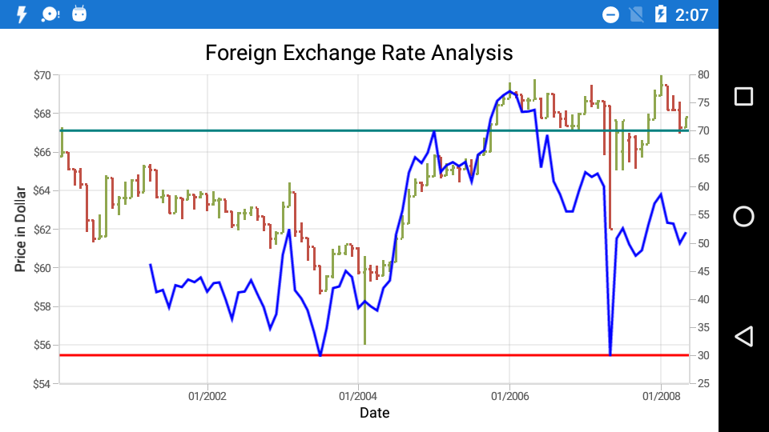
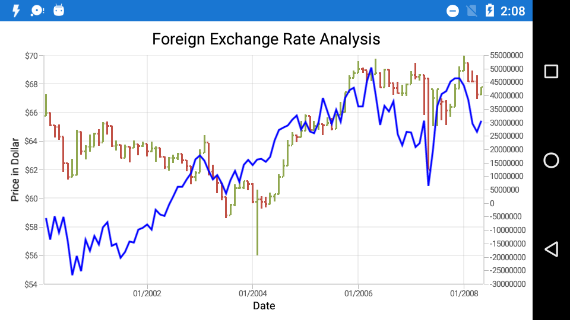

# Technical Indicators

The different types of technical indicators available in chart are follows:

* [`AverageTrueIndicator`](http://help.syncfusion.com/cr/cref_files/xamarin/sfchart/Syncfusion.SfChart.XForms~Syncfusion.SfChart.XForms.AverageTrueIndicator.html)
* [`SimpleMovingAverageIndicator`](http://help.syncfusion.com/cr/cref_files/xamarin/sfchart/Syncfusion.SfChart.XForms~Syncfusion.SfChart.XForms.SimpleMovingAverageIndicator.html)
* [`RSITechnicalIndicator`](http://help.syncfusion.com/cr/cref_files/xamarin/sfchart/Syncfusion.SfChart.XForms~Syncfusion.SfChart.XForms.RSIIndicator.html)
* [`AccumulationDistributionIndicator`](http://help.syncfusion.com/cr/cref_files/xamarin/sfchart/Syncfusion.SfChart.XForms~Syncfusion.SfChart.XForms.AccumulationDistributionIndicator.html)
* [`MomentumIndicator`](http://help.syncfusion.com/cr/cref_files/xamarin/sfchart/Syncfusion.SfChart.XForms~Syncfusion.SfChart.XForms.MomentumIndicator.html) 
* [`StochasticIndicator`](http://help.syncfusion.com/cr/cref_files/xamarin/sfchart/Syncfusion.SfChart.XForms~Syncfusion.SfChart.XForms.StochasticIndicator.html)
* [`ExponentialMovingAverageIndicator`](https://help.syncfusion.com/cr/cref_files/xamarin/sfchart/Syncfusion.SfChart.XForms~Syncfusion.SfChart.XForms.ExponentialMovingAverageIndicator.html)
* [`TriangularMovingAverageIndicator`](http://help.syncfusion.com/cr/cref_files/xamarin/sfchart/Syncfusion.SfChart.XForms~Syncfusion.SfChart.XForms.TriangularMovingAverageIndicator.html)
* [`BollingerBandIndicator`](http://help.syncfusion.com/cr/cref_files/xamarin/sfchart/Syncfusion.SfChart.XForms~Syncfusion.SfChart.XForms.BollingerBandIndicator.html)
* [`MACDIndicator`](http://help.syncfusion.com/cr/cref_files/xamarin/sfchart/Syncfusion.SfChart.XForms~Syncfusion.SfChart.XForms.MACDIndicator.html)

## Adding technical indicators to chart

The following section illustrates how to add technical indicators to chart.

**Initializing indicator**

Create an instance for any technical indicator, and add it to the [`TechnicalIndicators`](https://help.syncfusion.com/cr/cref_files/xamarin/sfchart/Syncfusion.SfChart.XForms~Syncfusion.SfChart.XForms.SfChart~TechnicalIndicators.html) collection.

Here, for an instance, the [`AccumulationDistributionIndicator`](http://help.syncfusion.com/cr/cref_files/xamarin/sfchart/Syncfusion.SfChart.XForms~Syncfusion.SfChart.XForms.AccumulationDistributionIndicator.html) is added.

 



<chart:SfChart>
    ...	
    <chart:SfChart.TechnicalIndicators>
        <chart:AccumulationDistributionIndicator />
    </chart:SfChart.TechnicalIndicators>

</chart:SfChart>





SfChart chart = new SfChart();
...
AccumulationDistributionIndicator indicator= new AccumulationDistributionIndicator();

chart.TechnicalIndicators.Add(indicator);





**Binding data**

Set the items source and binding paths ([`Open`](https://help.syncfusion.com/cr/cref_files/xamarin/sfchart/Syncfusion.SfChart.XForms~Syncfusion.SfChart.XForms.FinancialTechnicalIndicator~Open.html), [`High`](https://help.syncfusion.com/cr/cref_files/xamarin/sfchart/Syncfusion.SfChart.XForms~Syncfusion.SfChart.XForms.FinancialTechnicalIndicator~High.html), [`Low`](https://help.syncfusion.com/cr/cref_files/xamarin/sfchart/Syncfusion.SfChart.XForms~Syncfusion.SfChart.XForms.FinancialTechnicalIndicator~Low.html), [`Close`](https://help.syncfusion.com/cr/cref_files/xamarin/sfchart/Syncfusion.SfChart.XForms~Syncfusion.SfChart.XForms.FinancialTechnicalIndicator~Close.html) and [`XBindingPath`](https://help.syncfusion.com/cr/cref_files/xamarin/sfchart/Syncfusion.SfChart.XForms~Syncfusion.SfChart.XForms.FinancialTechnicalIndicator~XBindingPath.html)) to fetch the values from model.

 



<chart:SfChart>
    ...	
        <chart:SfChart.TechnicalIndicators>
            <chart:AccumulationDistributionIndicator ItemsSource="{Binding TechnicalIndicatorData}" XBindingPath="XValue" Open="Open" High="High" Low="Low" Close="Close" Volume="Volume"/>
        </chart:SfChart.TechnicalIndicators>

</chart:SfChart>





SfChart chart = new SfChart()
{
      ...                
      TechnicalIndicators =
      {
          new AccumulationDistributionIndicator()
          {
              ItemsSource = viewModel.TechnicalIndicatorData,
              XBindingPath = "XValue",
              Open = "Open",
              High = "High",
              Low = "Low",
              Close = "Close"
          }
    }
};





**Binding the ItemsSource of ChartSeries**

Using the [`SeriesName`](http://help.syncfusion.com/cr/cref_files/xamarin/sfchart/Syncfusion.SfChart.XForms~Syncfusion.SfChart.XForms.FinancialTechnicalIndicator~SeriesName.html) property of `FinancialTechnicalIndicator`, you can bind the items source of chart series to technical indicators, including x and y-axes.

 



<chart:SfChart>
    ...	
        <chart:SfChart.Series>
            <chart:HiLoOpenCloseSeries Name="HLOC" ItemsSource="{Binding TechnicalIndicatorData}" XBindingPath="XValue" Open="Open" High="High" Low="Low" Close="Close"/>
        </chart:SfChart.Series>
        <chart:SfChart.TechnicalIndicators>
            <chart:AccumulationDistributionIndicator SeriesName="HLOC"/>
        </chart:SfChart.TechnicalIndicators>

</chart:SfChart>





SfChart chart = new SfChart()
{
    ...        
    Series =
      {
          new HiLoOpenCloseSeries()
          {
              ItemsSource = viewModel.TechnicalIndicatorData,
              XBindingPath = "XValue",
              Open = "Open",
              High = "High",
              Low = "Low",
              Close = "Close",
              Name = "HLOC"
          }
    },

    TechnicalIndicators =
      {
          new AccumulationDistributionIndicator()
          {
              SeriesName = "HLOC"              
          }
    }
};





[`AverageTrueIndicator`](http://help.syncfusion.com/cr/cref_files/xamarin/sfchart/Syncfusion.SfChart.XForms~Syncfusion.SfChart.XForms.AverageTrueIndicator.html), [`SimpleMovingAverageIndicator`](http://help.syncfusion.com/cr/cref_files/xamarin/sfchart/Syncfusion.SfChart.XForms~Syncfusion.SfChart.XForms.SimpleMovingAverageIndicator.html), and [`RSITechnicalIndicator`](http://help.syncfusion.com/cr/cref_files/xamarin/sfchart/Syncfusion.SfChart.XForms~Syncfusion.SfChart.XForms.RSIIndicator.html) have the `Period` and `SignalLineColor` properties as common; the `Period` property indicates the moving average period and the `SignalLineColor` property defines the color for the respective indicator line.

**Adding axis**

The [`XAxis`](http://help.syncfusion.com/cr/cref_files/xamarin/sfchart/Syncfusion.SfChart.XForms~Syncfusion.SfChart.XForms.FinancialTechnicalIndicator~XAxis.html) and [`YAxis`](http://help.syncfusion.com/cr/cref_files/xamarin/sfchart/Syncfusion.SfChart.XForms~Syncfusion.SfChart.XForms.FinancialTechnicalIndicator~YAxis.html) properties of technical indicators are used to set the x and y-axes.

You can define the axis using the following code example.

 



<chart:SfChart>
 ...	
   <chart:SfChart.TechnicalIndicators>
        <chart:AccumulationDistributionIndicator SeriesName="HLOC">
            <chart:AccumulationDistributionIndicator.XAxis>
                <chart:NumericalAxis/>
            </chart:AccumulationDistributionIndicator.XAxis>
         </chart:AccumulationDistributionIndicator>
     </chart:SfChart.TechnicalIndicators>

</chart:SfChart>





SfChart chart = new SfChart()
{
    ...        
    TechnicalIndicators =
      {
          new AccumulationDistributionIndicator()
          {
              SeriesName = "HLOC",
              XAxis = new NumericalAxis()
          }
      }
};





**Animation**

[`SfChart`](http://help.syncfusion.com/cr/cref_files/xamarin/sfchart/Syncfusion.SfChart.XForms~Syncfusion.SfChart.XForms.SfChart.html) provides animation support for technical indicators. Technical indicators will be animated whenever the ItemsSource changes. Animation can be enabled by setting the [`EnableAnimation`](http://help.syncfusion.com/cr/cref_files/xamarin/sfchart/Syncfusion.SfChart.XForms~Syncfusion.SfChart.XForms.FinancialTechnicalIndicator~EnableAnimation.html) property to true. You can also control the duration of the animation using the [`AnimationDuration`](http://help.syncfusion.com/cr/cref_files/xamarin/sfchart/Syncfusion.SfChart.XForms~Syncfusion.SfChart.XForms.FinancialTechnicalIndicator~AnimationDuration.html) property.

 



<chart:SfChart>
 ...	
      <chart:SfChart.TechnicalIndicators>
          <chart:AccumulationDistributionIndicator SeriesName="HLOC" EnableAnimation="True" AnimationDuration="0.8"/>
       </chart:SfChart.TechnicalIndicators>

</chart:SfChart>





SfChart chart = new SfChart()
{
    ...        
    TechnicalIndicators =
      {
          new AccumulationDistributionIndicator()
          {
              SeriesName = "HLOC",
              EnableAnimation = true,
              AnimationDuration = 0.8      
          }
      }
};





## Average true range indicator (ATR)

ATR indicator is a technical analysis volatility indicator. This indicator does not provide an indication of price trend; simply the degree of price volatility. The average true range is an N-day smoothed moving average (SMMA) of the true range values.

You can define the [`AverageTrueIndicator`](http://help.syncfusion.com/cr/cref_files/xamarin/sfchart/Syncfusion.SfChart.XForms~Syncfusion.SfChart.XForms.AverageTrueIndicator.html) using the following code example.

 



<chart:SfChart>
...	
        <chart:SfChart.TechnicalIndicators>
            <chart:AverageTrueIndicator ItemsSource="{Binding TechnicalIndicatorData}" Period="3" XBindingPath="Date" SignalLineColor="Purple" High="High" Low="Low" Open="Open" Close="Close"/>
         </chart:SfChart.TechnicalIndicators>

</chart:SfChart>





SfChart chart = new SfChart()
{
    ...        
    TechnicalIndicators =
      {
          new AverageTrueIndicator()
          {
              Period = 3,
              SignalLineColor = Color.Purple,
              ItemsSource = viewModel.TechnicalIndicatorData,
              XBindingPath = "Date",
              Open = "Open",
              High = "High",
              Low = "Low",
              Close = "Close",
          }
      }
};





The following screenshot illustrates an ATR indicator.

## Simple moving average (SMA) indicator

A SMA indicator is a simple, arithmetic moving average that is calculated by adding the closing price for number of time periods and dividing the total value by the number of time periods.

The following code example demonstrates the usage of [`SimpleMovingAverageIndicator`](http://help.syncfusion.com/cr/cref_files/xamarin/sfchart/Syncfusion.SfChart.XForms~Syncfusion.SfChart.XForms.SimpleMovingAverageIndicator.html).

 



<chart:SfChart>
...	
       <chart:SfChart.TechnicalIndicators>
           <chart:SimpleMovingAverageIndicator ItemsSource="{Binding TechnicalIndicatorData}" Period="14" SignalLineColor="Purple" XBindingPath="XValue" High="High" Low="Low" Open="Open" Close="Close"/> 
        </chart:SfChart.TechnicalIndicators>

</chart:SfChart>





SfChart chart = new SfChart()
{
    ...        
    TechnicalIndicators =
      {
          new SimpleMovingAverageIndicator()
          {
              Period = 14,
              SignalLineColor = Color.Purple,
              ItemsSource = viewModel.TechnicalIndicatorData,
              XBindingPath = "XValue",
              Open = "Open",
              High = "High",
              Low = "Low",
              Close = "Close",
          }
      }
};





The following screenshot illustrates an SMA indicator.

## Relative Strength Index (RSI) indicator

The RSI indicator has additional two lines other than signal line; they indicate the overbought and oversold region.

The [`UpperLineColor`](http://help.syncfusion.com/cr/cref_files/xamarin/sfchart/Syncfusion.SfChart.XForms~Syncfusion.SfChart.XForms.RSIIndicator~UpperLineColor.html) property is used to define the color for the line that indicates overbought region, and the [`LowerLineColor`](http://help.syncfusion.com/cr/cref_files/xamarin/sfchart/Syncfusion.SfChart.XForms~Syncfusion.SfChart.XForms.RSIIndicator~LowerLineColor.html) property is used to define the color for the line that indicates oversold region.

To define the [`RSITechnicalIndicator`](http://help.syncfusion.com/cr/cref_files/xamarin/sfchart/Syncfusion.SfChart.XForms~Syncfusion.SfChart.XForms.RSIIndicator.html), use the following code example.

 



<chart:SfChart>
...	
        <chart:SfChart.TechnicalIndicators>
            <chart:RSIIndicator ItemsSource="{Binding TechnicalIndicatorData}" Period="14" SignalLineColor="Purple" UpperLineColor="Blue" LowerLineColor="Red" XBindingPath="XValue" High="High" Low="Low" Open="Open" Close="Close"/>
        </chart:SfChart.TechnicalIndicators>

</chart:SfChart>





SfChart chart = new SfChart()
{
    ...        
    TechnicalIndicators =
      {
          new RSIIndicator()
          {
              Period = 14,
              SignalLineColor = Color.Purple,
              UpperLineColor = Color.Blue,
              LowerLineColor = Color.Red,
              ItemsSource = viewModel.TechnicalIndicatorData,
              XBindingPath = "XValue",
              Open = "Open",
              High = "High",
              Low = "Low",
              Close = "Close",
          }
      }
};





The following screenshot illustrates an RSI technical indicator.

## Accumulation distribution indicator

Accumulation distribution indicator is a volume-based indicator; it is designed to measure the accumulative flow of money into and out of a security. 

The following code example helps you to add [`AccumulationDistributionIndicator`](http://help.syncfusion.com/cr/cref_files/xamarin/sfchart/Syncfusion.SfChart.XForms~Syncfusion.SfChart.XForms.AccumulationDistributionIndicator.html).

 



<chart:SfChart>
...	
          <chart:SfChart.TechnicalIndicators>
            <chart:AccumulationDistributionIndicator ItemsSource="{Binding TechnicalIndicatorData}" SignalLineColor="Purple" XBindingPath="XValue" Open="Open" High="High" Low="Low" Close="Close" Volume="Volume"/>
        </chart:SfChart.TechnicalIndicators>

</chart:SfChart>





SfChart chart = new SfChart()
{
    ...        
    TechnicalIndicators =
      {
          new AccumulationDistributionIndicator()
          {
              SignalLineColor = Color.Purple,
              ItemsSource = viewModel.TechnicalIndicatorData,
              XBindingPath = "XValue",
              Open = "Open",
              High = "High",
              Low = "Low",
              Close = "Close",
              Volume = "Volume"
          }
      }
};





The following screenshot illustrates an accumulation distribution technical indicator.

