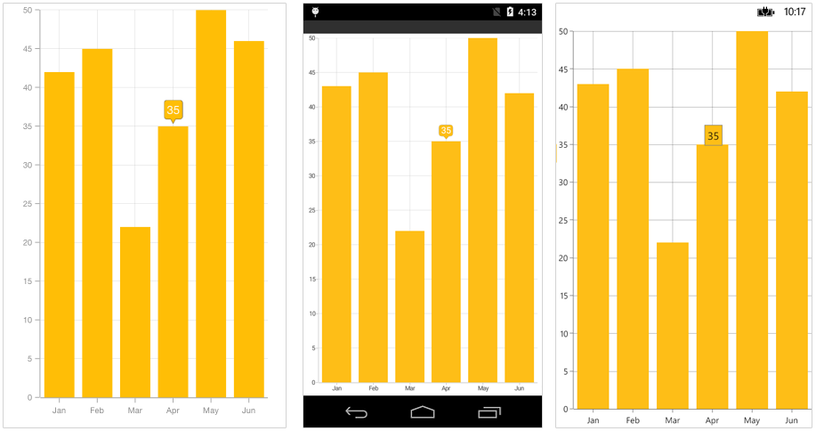

# Tooltip

SfChart provides tooltip support for all series. It is used to show information about the segment, when you tap on the segment. To enable the tooltip, you need to set `EnableTooltip` property as `true`.

 



<chart:SfChart.Series>

	<chart:ColumnSeries ItemsSource="{Binding Data}" XBindingPath="Month" YBindingPath="Value" EnableTooltip="True"/>

</chart:SfChart.Series>





ColumnSeries column = new ColumnSeries ();

column.XBindingPath = "Month";

column.YBindingPath = "Value";

column.ItemsSource = Data;

column.EnableTooltip = true;

chart.Series.Add(column);	





## Customizing appearance

You can customize the tooltip label. For customizing, you need to add an instance of `ChartTooltipBehavior` to the `ChartBehaviors` collection property of SfChart. Following properties are used to customize the tooltip label which are available in `ChartTooltipBehavior`.

* `BorderColor` – used to change the label border color
* `BorderWidth` – used to change the label border width
* `BackgroundColor` – used to change the label background color
* `Margin` – used to change label border thickness
* `TextColor` – used to change the text color
* `Font` – used to change label font size, family and weight
* `LabelFormat` – used to format the label
* `Duration` – used to set the visible duration of label
* `OffsetX` – used to move the label horizontally
* `OffsetY` – used to move the label vertically

 



<chart:SfChart.ChartBehaviors>

	<chart:ChartTooltipBehavior BackgroundColor="Blue" BorderWidth="3" BorderColor="Aqua" TextColor="White" Margin="5" Duration="10" >

		<chart:ChartTooltipBehavior.Font>

			

		</chart:ChartTooltipBehavior.Font>

	</chart:ChartTooltipBehavior>

</chart:SfChart.ChartBehaviors>





SfChart chart = new SfChart();
...

ChartTooltipBehavior tool = new ChartTooltipBehavior();
tool.BackgroundColor = Color.Blue;
tool.BorderWidth = 3;
tool.BorderColor = Color.Aqua;
tool.TextColor = Color.White;
tool.Margin = new Thickness(5, 5, 5, 5);
tool.Duration = 10;
tool.Font = Font.OfSize(“Times New Roman”,15);	
chart.ChartBehaviors.Add(tool);





## Tooltip Template

You can customize the appearance of the tooltip with your own template by using the `TooltipTemplate` property of `Series`.

 



<chart:ColumnSeries ItemsSource="{Binding ColumnData}" EnableTooltip="true" 
XBindingPath="Month" YBindingPath="Value" >
              <chart:ColumnSeries.TooltipTemplate>
                  <DataTemplate>
                      <StackLayout Orientation="Horizontal">
                              <Label Text="Temperature:" />
                              <Label Text="{Binding Value}"/>
                      </StackLayout>
                  </DataTemplate>
              </chart:ColumnSeries.TooltipTemplate>
</chart:ColumnSeries>





ColumnSeries column = new ColumnSeries (); 
column.ItemsSource = viewModel.ColumnData;
column.XBindingPath = "Month";
column.YBindingPath = "Value";
column.EnableTooltip = true;

DataTemplate template = new DataTemplate (() => {
StackLayout stack = new StackLayout(){ Orientation = StackOrientation.Horizontal};
Label ylabel = new Label(){Text="Temperature:"};
Label yValue = new Label();
yValue.SetBinding (Label.TextProperty, "Value");
stack.Children.Add(ylabel);
stack.Children.Add(yValue);
return stack;
});

column.TooltipTemplate = template;
Chart.Series.Add (column);





