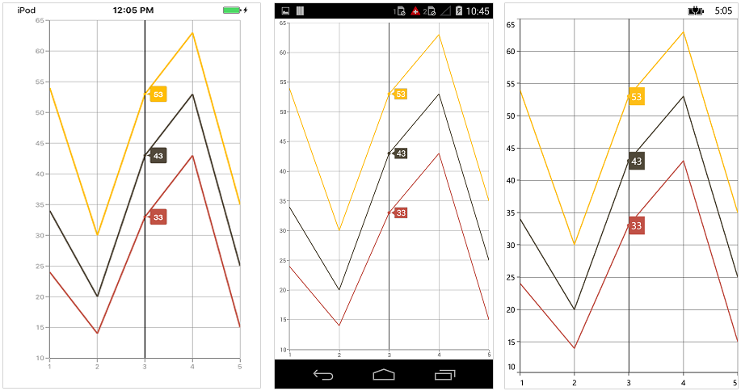

# Trackball

Trackball feature displays the tooltip for the data points that are closer to the point where you touch on the chart area. This feature, especially, can be used instead of data label feature when you cannot show data labels for all data points due to space constraint. To enable this feature, add an instance of `ChartTrackballBehavior` to the `ChartBehaviors` collection property of `SfChart`. Trackball will be activated once you long-press anywhere on the chart area. Once it is activated, it will appear in the UI and move based on your touch movement until you stop touching on the chart.

You can use the following properties to show/hide the line and labels.

* `ShowLabel` – Shows/hides trackball label. Default value is true.

* `ShowLine` – Shows/hides the trackball line. Default value is true.


[XAML]

<chart:SfChart>
...

	<chart:SfChart.ChartBehaviors>

		<chart:ChartTrackballBehavior ShowLabel="True" ShowLine="True"/>

	</chart:SfChart.ChartBehaviors>

</chart:SfChart>




[C#]

SfChart chart = new SfChart();
...

ChartTrackballBehavior trackballBehavior = new ChartTrackballBehavior();

trackballBehavior.ShowLabel = true;

trackballBehavior.ShowLine = true;

chart.ChartBehaviors.Add(trackballBehavior);



## Label Display Mode

`TrackballLabelDisplayMode` property is used to specify whether to display label for all the data points along the vertical line or display only single label. Following are the two options you can set to this property,

* `FloatAllPoints` – Displays label for all the data points along the vertical line.
* `NearestPoint` – Displays label for single data point that is nearer to the touch contact position.


[XAML]

<chart:ChartTrackballBehavior LabelDisplayMode="NearestPoint" ShowLine="False"/>




[C#]

ChartTrackballBehavior trackballBehavior = new ChartTrackballBehavior();

trackballBehavior.ShowLine = false;

trackballBehavior.LabelDisplayMode = TrackballLabelDisplayMode.NearestPoint;



In the following screenshot, trackball label is shown for only single data point,

## Customizing appearance

**Customize Trackball Labels**

Following properties are used to customize the trackball labels.

* `BorderColor` – used to change the label border color.
* `BackgroundColor` – used to change the label background color.
* `BorderThickness` – used to change label border thickness.
* `TextColor` – used to change the text color.
* `Font` – used to change label font size, family and weight.


[XAML]

<chart:SfChart>
...

	<chart:SfChart.ChartBehaviors>

		<chart:ChartTrackballBehavior>

			<chart:ChartTrackballBehavior.LabelStyle>

				<chart:ChartTrackballLabelStyle BorderColor="Maroon" BackgroundColor="Aqua" BorderThickness="2" TextColor="Red">

					<chart:ChartTrackballLabelStyle.Font>

						

					</chart:ChartTrackballLabelStyle.Font>

				</chart:ChartTrackballLabelStyle>

			</chart:ChartTrackballBehavior.LabelStyle>

		</chart:ChartTrackballBehavior>

	</chart:SfChart.ChartBehaviors>

</chart:SfChart>




[C#]

SfChart chart = new SfChart();
...

ChartTrackballBehavior trackBallBehavior = new ChartTrackballBehavior();

trackBallBehavior.LabelStyle.BorderColor = Color.Maroon;

trackBallBehavior.LabelStyle.BorderThickness = 2;

trackBallBehavior.LabelStyle.Font = Font.SystemFontOfSize(18, FontAttributes.Italic);

trackBallBehavior.LabelStyle.BackgroundColor = Color.Aqua;

trackBallBehavior.LabelStyle.TextColor = Color.Red;

chart.ChartBehaviors.Add(trackballBehavior);



**Customize Trackball Marker**

Following properties are used to customize the trackball marker.

* `ShowMarker` – used to enable / disable the marker. Default value is true.
* `BorderColor` – used to change the marker border color.
* `Color` – used to change the marker background color.
* `BorderWidth` – used to change the width of the marker border.
* `Width` – used to change the width of the marker.
* `Height` – used to change the height of the marker.


[XAML]

<chart:SfChart HorizontalOptions="FillAndExpand" VerticalOptions="FillAndExpand">
...

	<chart:SfChart.ChartBehaviors>

		<chart:ChartTrackballBehavior>

			<chart:ChartTrackballBehavior.MarkerStyle>

				<chart:ChartTrackballMarkerStyle BorderColor="Purple" ShowMarker="True" BorderWidth="1" Width="8" Height="8" Color="Green"/>

			</chart:ChartTrackballBehavior.MarkerStyle>

		</chart:ChartTrackballBehavior>

	</chart:SfChart.ChartBehaviors>

</chart:SfChart>




[C#]

SfChart chart = new SfChart();
...

ChartTrackballBehavior trackBallBehavior = new ChartTrackballBehavior();

trackBallBehavior.MarkerStyle.BorderWidth = 1;

trackBallBehavior.MarkerStyle.BorderColor = Color.Purple;

trackBallBehavior.MarkerStyle.Width = 8;

trackBallBehavior.MarkerStyle.Height = 8;

trackBallBehavior.MarkerStyle.Color = Color.Green;

trackBallBehavior.MarkerStyle.ShowMarker = true;

chart.ChartBehaviors.Add(trackballBehavior);



**Customize Trackball Line**

Following properties are used to customize the trackball line.

* `ShowLine` – used to enable / disable the line. Default value is true.
* `StrokeWidth` – used to change the stroke width of the line.
* `StrokeColor` – used to change the stroke color of the line.
* `StrokeDashArray` – Specifies the dashes to be applied on the line.


[XAML]

<chart:SfChart HorizontalOptions="FillAndExpand" VerticalOptions="FillAndExpand">
...

	<chart:SfChart.ChartBehaviors>

		<chart:ChartTrackballBehavior>

			<chart:ChartTrackballBehavior.LineStyle>

				<chart:ChartLineStyle StrokeColor="Blue" StrokeWidth="2"/>

			</chart:ChartTrackballBehavior.LineStyle>

		</chart:ChartTrackballBehavior>

	</chart:SfChart.ChartBehaviors>

</chart:SfChart>




[C#]

SfChart chart = new SfChart();
...

ChartTrackballBehavior trackBallBehavior = new ChartTrackballBehavior();

trackBallBehavior.ShowLine = true;

trackBallBehavior.LineStyle.StrokeWidth = 2;

trackBallBehavior.LineStyle.StrokeColor = Color.Blue;

trackBallBehavior.LineStyle.StrokeDashArray = new double[2] { 2, 3 };

chart.ChartBehaviors.Add(trackballBehavior);



Following screenshot illustrates the customization of trackball elements.

