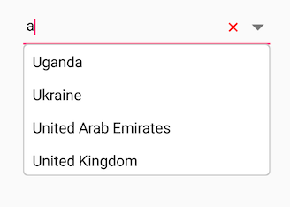
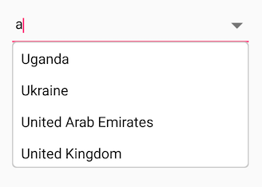
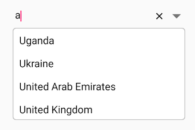
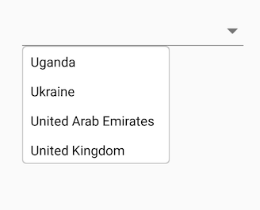
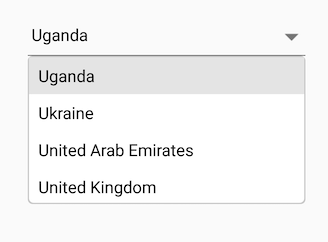
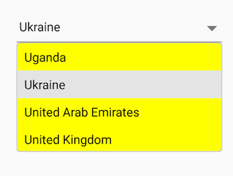
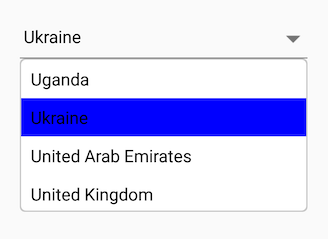

# Customizing ComboBox

The combo box control  provides user friendly customizing options for both entry part and drop-down part. In this section, customizing the entire ComboBox control is explained.

## Customizing the entry

The `TextColor`, `TextSize`, `FontAttributes`, `FontFamily` and `BorderColor` properties are used to customize the foreground color, font size, font attribute, font family and border color of the entry part.

### Text color

The combo box control provides the user to customize the foreground color of the text inside the entry part.

## Text size

The combo box control provides the user to customize the text size of the text inside the entry part using `TextSize` property.

## Font attributes

The combo box control provides the user to customize the font attribute of the text inside the entry part using `FontAttributes` property.

## Font family

The combo box control provides the user to customize the font family of the text inside the entry part using `FontFamily` property.

## Border color

The combo box control provides the user to customize the border color of the entry box using `BorderColor` property.





<StackLayout VerticalOptions="Start" HorizontalOptions="Start" Padding="30">
	<combobox:SfComboBox HeightRequest="45" x:Name="comboBox" Text="Sample text" FontAttributes="Bold" TextColor="#1976d2" TextSize="20" BorderColor="#1976d2"/>
</StackLayout>





StackLayout stackLayout = new StackLayout() 
{ 
	VerticalOptions = LayoutOptions.Start, 
	HorizontalOptions = LayoutOptions.Start,
	Padding = new Thickness(30) 
};

SfComboBox comboBox = new SfComboBox() 
{ 
	HeightRequest = 45,  
	Text = "Sample text", 
	TextColor = Color.FromHex("1976d2"), 
	TextSize = 20, 
	BorderColor = Color.FromHex("1976d2")
	FontAttributes = FontAttributes.Bold
};

stackLayout.Children.Add(comboBox);
this.Content = stackLayout;





### Changing delete button color

The `ClearButtonColor ` property is used to modify the delete button color. The following code example shows changing delete button color. 





<StackLayout VerticalOptions="Start" HorizontalOptions="Start" Padding="30">
        <combobox:SfComboBox HeightRequest="40" x:Name="comboBox" IsEditableMode="True" ClearButtonColor="Red">
            <combobox:SfComboBox.ComboBoxSource>
                <ListCollection:List x:TypeArguments="x:String">
                    <x:String>Uganda</x:String>
                    <x:String>Ukraine</x:String>
                    <x:String>United Arab Emirates</x:String>
                    <x:String>United Kingdom</x:String>
                </ListCollection:List>
            </combobox:SfComboBox.ComboBoxSource>
        </combobox:SfComboBox>
 </StackLayout>





   StackLayout layout = new StackLayout() 
    { 
	     VerticalOptions = LayoutOptions.Start, 
	     HorizontalOptions = LayoutOptions.Start, 
	     Padding = new Thickness(30) 
    }; 

	List<String> countryNames = new List<String>();
	countryNames.Add("Uganda");
	countryNames.Add("Ukraine");
	countryNames.Add("United Arab Emirates");
	countryNames.Add("United Kingdom");
	countryNames.Add("United States");

	SfComboBox comboBox = new SfComboBox();
	comboBox.DataSource = countryNames;
	comboBox.ClearButtonColor = Color.Yellow;
    comboBox.IsEditableMode = true;

    layout.Children.Add(comboBox); 
    Content = layout;





### Changing delete button visibility

The `ShowClearButton ` property is used to modify the visibility of delete button. The following code example shows changing delete button visibility.




<StackLayout VerticalOptions="Start" HorizontalOptions="Start" Padding="30">
        <combobox:SfComboBox HeightRequest="40" x:Name="comboBox" IsEditableMode="True" IsEditableMode="True" ShowClearButton="False">
            <combobox:SfComboBox.ComboBoxSource>
                <ListCollection:List x:TypeArguments="x:String">
                    <x:String>Uganda</x:String>
                    <x:String>Ukraine</x:String>
                    <x:String>United Arab Emirates</x:String>
                    <x:String>United Kingdom</x:String>
                </ListCollection:List>
            </combobox:SfComboBox.ComboBoxSource>
        </combobox:SfComboBox>
 </StackLayout>





   StackLayout layout = new StackLayout() 
    { 
	     VerticalOptions = LayoutOptions.Start, 
	     HorizontalOptions = LayoutOptions.Start, 
	     Padding = new Thickness(30) 
    }; 

	List<String> countryNames = new List<String>();
	countryNames.Add("Uganda");
	countryNames.Add("Ukraine");
	countryNames.Add("United Arab Emirates");
	countryNames.Add("United Kingdom");
	countryNames.Add("United States");

	SfComboBox comboBox = new SfComboBox();
	comboBox.DataSource = countryNames;
	comboBox.ShowClearButton = false;
    comboBox.IsEditableMode = true;

    layout.Children.Add(comboBox); 
    Content = layout;





### Changing border visibility

The `ShowBorder ` property is used to modify the visibility of border. The following code example shows changing border visibility. 





<StackLayout VerticalOptions="Start" HorizontalOptions="Start" Padding="30">
        <combobox:SfComboBox HeightRequest="40" x:Name="comboBox" IsEditableMode="True" IsEditableMode="True" ShowBorder="False">
            <combobox:SfComboBox.ComboBoxSource>
                <ListCollection:List x:TypeArguments="x:String">
                    <x:String>Uganda</x:String>
                    <x:String>Ukraine</x:String>
                    <x:String>United Arab Emirates</x:String>
                    <x:String>United Kingdom</x:String>
                </ListCollection:List>
            </combobox:SfComboBox.ComboBoxSource>
        </combobox:SfComboBox>
 </StackLayout>





   StackLayout layout = new StackLayout() 
    { 
	     VerticalOptions = LayoutOptions.Start, 
	     HorizontalOptions = LayoutOptions.Start, 
	     Padding = new Thickness(30) 
    }; 

	List<String> countryNames = new List<String>();
	countryNames.Add("Uganda");
	countryNames.Add("Ukraine");
	countryNames.Add("United Arab Emirates");
	countryNames.Add("United Kingdom");
	countryNames.Add("United States");

	SfComboBox comboBox = new SfComboBox();
	comboBox.DataSource = countryNames;
	comboBox.ShowBorder = false;
    comboBox.IsEditableMode = true;

    layout.Children.Add(comboBox); 
    Content = layout;





## CustomView for ComboBox

CustomView property has used to provide the custom view instead of entry in ComboBox. It's default height and width has control height and width.





<StackLayout VerticalOptions="Start" HorizontalOptions="Start" Padding="30">
	<combobox:SfComboBox HeightRequest="40" x:Name="comboBox">
		<combobox:SfComboBox.CustomView>
			<Label x:Name="customLabel" HeightRequest="40" Text="ComboBox"  VerticalTextAlignment="Center"/>
		</combobox:SfComboBox.CustomView>
	</combobox:SfComboBox>
</StackLayout>





StackLayout layout = new StackLayout() 
{ 
	VerticalOptions = LayoutOptions.Start, 
	HorizontalOptions = LayoutOptions.Start, 
	Padding = new Thickness(30) 
};	

Label customLabel = new Label();
customLabel.HeightRequest = 40;
customLabel.VerticalTextAlignment = TextAlignment.Center;
customLabel.Text = "ComboBox";

SfComboBox comboBox = new SfComboBox();
comboBox.HeightRequest = 40;
comboBox.DataSource = countryNames;
comboBox.SuggestionBoxPlacement = SuggestionBoxPlacement.Top;
comboBox.CustomView = customLabel; 

layout.Children.Add(comboBox); 
Content = layout;





## Custom template for suggestion items

The `ItemTemplate` property helps to decorate suggestion items with custom templates. The following code explains the steps to add an image to the suggestion list item.




public class Person
{
	private int age;
	public int Age
	{
		get { return age; }
		set { age = value; }
	}

	private string name;
	public string Name
	{
		get { return name; }
		set { name = value; }
	}
}

public class PersonViewModel
{
	private ObservableCollection<Person> personCollection;
	public ObservableCollection<Person> PersonCollection
	{
		get { return personCollection; }
		set { personCollection = value; }
	}

	public PersonViewModel()
	{
		personCollection = new ObservableCollection<Person>();
		personCollection.Add(new Person() { Age = 21, Name = "Aldan" });
		personCollection.Add(new Person() { Age = 25, Name = "Clara" });
		personCollection.Add(new Person() { Age = 23, Name = "Aldrin" });            
		personCollection.Add(new Person() { Age = 25, Name = "Mark" });
		personCollection.Add(new Person() { Age = 25, Name = "Lucas" });
		personCollection.Add(new Person() { Age = 24, Name = "Alan" });
		personCollection.Add(new Person() { Age = 25, Name = "James" });
		personCollection.Add(new Person() { Age = 22, Name = "Aaron" });
	}
}




Now populate this PersonViewModel data in SfComboBox control by binding with [`DataSource`] property. 




<ContentPage xmlns="http://xamarin.com/schemas/2014/forms" 
             xmlns:x="http://schemas.microsoft.com/winfx/2009/xaml" 
             xmlns:combobox="clr-namespace:Syncfusion.XForms.ComboBox;assembly=Syncfusion.SfComboBox.XForms"
             xmlns:local="clr-namespace:NamespaceName"            
             x:Class="NamespaceName.ClassName">
	<ContentPage.BindingContext>
    	    <local:PersonViewModel/>
 	</ContentPage.BindingContext>
     
	<StackLayout VerticalOptions="Start" HorizontalOptions="Start" Padding="30">
		<combobox:SfComboBox HeightRequest="40" x:Name="comboBox" DisplayMemberPath="Name" DataSource="{Binding PersonCollection}">
			<combobox:SfComboBox.ItemTemplate>
				<DataTemplate>
					<StackLayout Orientation="Horizontal">
						<Image Source="User.png" WidthRequest="12"/>
						<Label Text="{Binding Name}" />
					</StackLayout>
				</DataTemplate>
			</combobox:SfComboBox.ItemTemplate>
		</combobox:SfComboBox>
	</StackLayout> 
</ContentPage>





DataTemplate itemTemplate = new DataTemplate(() =>
{
	StackLayout stack;
	Image image;
	Label label;
	stack = new StackLayout();
	stack.Orientation = StackOrientation.Horizontal;
	image = new Image();
	image.Source = (FileImageSource)ImageSource.FromFile("User.png");
	label = new Label();
	label.SetBinding(Label.TextProperty, "Name");
	stack.Children.Add(image);
	stack.Children.Add(label);
	return new ViewCell { View = stack };
});

StackLayout layout = new StackLayout() 
{ 
	VerticalOptions = LayoutOptions.Start, 
	HorizontalOptions = LayoutOptions.Start, 
	Padding = new Thickness(30) 
}; 

SfComboBox comboBox = new ComboBox();
comboBox.HeightRequest = 40;
comboBox.BindingContext = new PersonViewModel();
Binding binding = new Binding("PersonCollection");
binding.Source = this;
binding.Mode = BindingMode.TwoWay;
comboBox.SetBinding(Label.DataSourceProperty,binding);
comboBox.ItemTemplate = itemTemplate;

layout.Children.Add(comboBox); 
Content = layout;





## Customizing the suggestion box

### Changing suggestion item height

The `DropDownItemHeight` property is used to modify the height of suggestion items in drop-down list. The following code example shows changing suggestion item height.





<StackLayout VerticalOptions="Start" HorizontalOptions="Start" Padding="30">
    <combobox:SfComboBox HeightRequest="40" x:Name="comboBox" DropDownItemHeight="50">
        <combobox:SfComboBox.ComboBoxSource>
            <ListCollection:List x:TypeArguments="x:String">
                <x:String> Uganda </x:String>
                <x:String> Ukraine </x:String>
                <x:String> United Arab Emirates </x:String>
                <x:String> United Kingdom </x:String>
            </ListCollection:List>
        </combobox:SfComboBox.ComboBoxSource>
    </combobox:SfComboBox>                
</StackLayout>





    StackLayout layout = new StackLayout() 
    { 
	     VerticalOptions = LayoutOptions.Start, 
	     HorizontalOptions = LayoutOptions.Start, 
	     Padding = new Thickness(30) 
    }; 

    List<String> countryNames = new List<String>();
    countryNames.Add("Uganda");
    countryNames.Add("Ukraine");
    countryNames.Add("United Arab Emirates");
    countryNames.Add("United Kingdom");

    SfComboBox comboBox = new SfComboBox();
    comboBox.DataSource = countryNames;
    comboBox.DropDownItemHeight = 50;

    layout.Children.Add(comboBox); 
    Content = layout;





### Changing suggestion box width

The `DropDownWidth` property is used to modify the width of suggestion box. The following code example shows changing suggestion box width.





<StackLayout VerticalOptions="Start" HorizontalOptions="Start" Padding="30">
        <combobox:SfComboBox HeightRequest="40" x:Name="comboBox" DropDownWidth="300">
            <combobox:SfComboBox.ComboBoxSource>
                <ListCollection:List x:TypeArguments="x:String">
                    <x:String>Uganda</x:String>
                    <x:String>Ukraine</x:String>
                    <x:String>United Arab Emirates</x:String>
                    <x:String>United Kingdom</x:String>
                </ListCollection:List>
            </combobox:SfComboBox.ComboBoxSource>
        </combobox:SfComboBox>
 </StackLayout>





    StackLayout layout = new StackLayout() 
    { 
	     VerticalOptions = LayoutOptions.Start, 
	     HorizontalOptions = LayoutOptions.Start, 
	     Padding = new Thickness(30) 
    }; 

    List<String> countryNames = new List<String>();
    countryNames.Add("Uganda");
    countryNames.Add("Ukraine");
    countryNames.Add("United Arab Emirates");
    countryNames.Add("United Kingdom");
    countryNames.Add("United States");

    SfComboBox comboBox = new SfComboBox();
    comboBox.DataSource = countryNames;
    comboBox.DropDownWidth = 300;

    layout.Children.Add(comboBox); 
    Content = layout;





### Changing suggestion box corner radius

The `DropDownCornerRadius` property is used to modify the corner radius of suggestion box. The following code example shows changing suggestion box corner radius. 





<StackLayout VerticalOptions="Start" HorizontalOptions="Start" Padding="30">
        <combobox:SfComboBox HeightRequest="40" x:Name="comboBox" DropDownCornerRadius="3">
            <combobox:SfComboBox.ComboBoxSource>
                <ListCollection:List x:TypeArguments="x:String">
                    <x:String>Uganda</x:String>
                    <x:String>Ukraine</x:String>
                    <x:String>United Arab Emirates</x:String>
                    <x:String>United Kingdom</x:String>
                </ListCollection:List>
            </combobox:SfComboBox.ComboBoxSource>
        </combobox:SfComboBox>
 </StackLayout>





    StackLayout layout = new StackLayout() 
    { 
        VerticalOptions = LayoutOptions.Start, 
        HorizontalOptions = LayoutOptions.Start, 
        Padding = new Thickness(30) 
    }; 

    List<String> countryNames = new List<String>();
    countryNames.Add("Uganda");
    countryNames.Add("Ukraine");
    countryNames.Add("United Arab Emirates");
    countryNames.Add("United Kingdom");
    countryNames.Add("United States");

    SfComboBox comboBox = new SfComboBox();
    comboBox.DataSource = countryNames;
    comboBox.DropDownCornerRadius = 3;

    layout.Children.Add(comboBox); 
    Content = layout;





### Changing suggestion box Background color

The `DropDownBackgroundColor` property is used to modify the background color of suggestion box. The following code example shows changing suggestion box background color. 





<StackLayout VerticalOptions="Start" HorizontalOptions="Start" Padding="30">
        <combobox:SfComboBox HeightRequest="40" x:Name="comboBox" DropDownBackgroundColor="Yellow">
            <combobox:SfComboBox.ComboBoxSource>
                <ListCollection:List x:TypeArguments="x:String">
                    <x:String>Uganda</x:String>
                    <x:String>Ukraine</x:String>
                    <x:String>United Arab Emirates</x:String>
                    <x:String>United Kingdom</x:String>
                </ListCollection:List>
            </combobox:SfComboBox.ComboBoxSource>
        </combobox:SfComboBox>
 </StackLayout>





   StackLayout layout = new StackLayout() 
    { 
	     VerticalOptions = LayoutOptions.Start, 
	     HorizontalOptions = LayoutOptions.Start, 
	     Padding = new Thickness(30) 
    }; 

    List<String> countryNames = new List<String>();
    countryNames.Add("Uganda");
    countryNames.Add("Ukraine");
    countryNames.Add("United Arab Emirates");
    countryNames.Add("United Kingdom");
    countryNames.Add("United States");

    SfComboBox comboBox = new SfComboBox();
    comboBox.DataSource = countryNames;
    comboBox.DropDownBackgroundColor = Color.Yellow;

    layout.Children.Add(comboBox); 
    Content = layout;





### Customizing suggestion items

Suggestion box items can be customized using the `DropDownItemFontAttributes`, `DropDownItemFontFamily`, `DropDownTextSize` and `DropDownTextColor` properties.





<StackLayout VerticalOptions="Start" HorizontalOptions="Start" Padding="30">
    <combobox:SfComboBox HeightRequest="40" x:Name="comboBox" DropDownTextSize="16" DropDownTextColor="#1976d2">
            <combobox:SfComboBox.ComboBoxSource>
                <ListCollection:List x:TypeArguments="x:String">
                    <x:String> Uganda </x:String>
                    <x:String> Ukraine </x:String>
                    <x:String> United Arab Emirates </x:String>
                    <x:String> United Kingdom </x:String>
                    <x:String> United States </x:String>
                </ListCollection:List>
            </combobox:SfComboBox.ComboBoxSource>
    </combobox:SfComboBox>                
</StackLayout>





    StackLayout layout = new StackLayout() 
    { 
        VerticalOptions = LayoutOptions.Start, 
        HorizontalOptions = LayoutOptions.Start, 
        Padding = new Thickness(30) 
    }; 

    List<String> countryNames = new List<String>();
    countryNames.Add("Uganda");
    countryNames.Add("Ukraine");
    countryNames.Add("United Arab Emirates");
    countryNames.Add("United Kingdom");
    countryNames.Add("United States");

    SfComboBox comboBox = new SfComboBox();
    comboBox.DataSource = countryNames;
    comboBox.DropDownTextColor = Color.FromHex("#1976d2");
    comboBox.DropDownTextSize = 16;

    layout.Children.Add(comboBox); 
    Content = layout;





### Changing selected item color in suggestion box 

The `SelectedDropDownItemColor` property is used to modify text color of selected item in drop down. The following code example shows changing the selected item text color in drop down.





<StackLayout VerticalOptions="Start" HorizontalOptions="Start" Padding="30">
        <combobox:SfComboBox HeightRequest="40" x:Name="comboBox" SelectedDropDownItemColor="Blue">
            <combobox:SfComboBox.ComboBoxSource>
                <ListCollection:List x:TypeArguments="x:String">
                    <x:String>Uganda</x:String>
                    <x:String>Ukraine</x:String>
                    <x:String>United Arab Emirates</x:String>
                    <x:String>United Kingdom</x:String>
                </ListCollection:List>
            </combobox:SfComboBox.ComboBoxSource>
        </combobox:SfComboBox>
 </StackLayout>





    StackLayout layout = new StackLayout() 
    { 
	     VerticalOptions = LayoutOptions.Start, 
	     HorizontalOptions = LayoutOptions.Start, 
	     Padding = new Thickness(30) 
    }; 

    List<String> countryNames = new List<String>();
    countryNames.Add("Uganda");
    countryNames.Add("Ukraine");
    countryNames.Add("United Arab Emirates");
    countryNames.Add("United Kingdom");
    countryNames.Add("United States");

    SfComboBox comboBox = new SfComboBox();
    comboBox.DataSource = countryNames;
    comboBox.SelectedDropDownItemColor = Color.Blue;

    layout.Children.Add(comboBox); 
    Content = layout;





## DropDown button customization

This section explains various DropDown button settings available in SfComboBox control.




<StackLayout VerticalOptions="Start" HorizontalOptions="Start" Padding="30">
    <combobox:SfComboBox HeightRequest="40" x:Name="comboBox">
        <combobox:SfComboBox.ComboBoxSource>
            <ListCollection:List x:TypeArguments="x:String">
                <x:String> Uganda </x:String>
                <x:String> Ukraine </x:String>
                <x:String> United Arab Emirates </x:String>
                <x:String> United Kingdom </x:String>
                <x:String> United States </x:String>
            </ListCollection:List>
        </combobox:SfComboBox.ComboBoxSource>
        <combobox:SfComboBox.DropDownButtonSettings>
     		<combobox:DropDownButtonSettings Width="40" Height="40" FontIcon="" FontSize="16" FontColor="Blue" HighlightedBackgroundColor="Green" BackgroundColor="Red" HighlightFontColor="Red"/>
     	</combobox:SfComboBox.DropDownButtonSettings>
    </combobox:SfComboBox>
</StackLayout>





    StackLayout layout = new StackLayout() 
    { 
	     VerticalOptions = LayoutOptions.Start, 
	     HorizontalOptions = LayoutOptions.Start, 
	     Padding = new Thickness(30) 
    }; 

    List<String> countryNames = new List<String>();
    countryNames.Add("Uganda");
    countryNames.Add("Ukraine");
    countryNames.Add("United Arab Emirates");
    countryNames.Add("United Kingdom");
    countryNames.Add("United States");

    SfComboBox comboBox = new SfComboBox();
    comboBox.DataSource = countryNames;
    DropDownButtonSettings dropDownButtonSettings = new DropDownButtonSettings();
    dropDownButtonSettings.Height = 40;
    dropDownButtonSettings.Width = 40;
    dropDownButtonSettings.FontIcon = "";
    dropDownButtonSettings.FontSize = 16;
    dropDownButtonSettings.FontColor = Color.Blue;
    dropDownButtonSettings.HighlightedBackgroundColor = Color.Green;
    dropDownButtonSettings.BackgroundColor = Color.Red;
    dropDownButtonSettings.HighlightFontColor = Color.Red;

    comboBox.DropDownButtonSettings = dropDownButtonSettings;

    layout.Children.Add(comboBox); 
    Content = layout;





## Watermark

Watermark provides a short note about the type of input to enter in the editor control. Watermarks are visible only if the text is empty. It will reappear if the text is cleared. The following example, explains the usability of watermark that hints users to start with the character “U”.





<StackLayout VerticalOptions="Start" HorizontalOptions="Start" Padding="30">
	<combobox:SfComboBox HeightRequest="40" Watermark="Enter 'U' to filter suggestions" x:Name="comboBox" />
</StackLayout>





    StackLayout layout = new StackLayout() 
    { 
	     VerticalOptions = LayoutOptions.Start, 
	     HorizontalOptions = LayoutOptions.Start, 
	     Padding = new Thickness(30) 
    }; 

    SfComboBox comboBox = new SfComboBox();
    comboBox.Watermark = "Enter 'U' to filter suggestions"; 

    layout.Children.Add(comboBox); 
    Content = layout;





## Changing Watermark Text Color

Text color of watermark can be customized using [`WatermarkColor`] property.





<StackLayout VerticalOptions="Start" HorizontalOptions="Start" Padding="30">
	<combobox:SfComboBox HeightRequest="40" Watermark="Enter some text" WatermarkColor="#1976d2" x:Name="comboBox" />
</StackLayout>





    StackLayout layout = new StackLayout() 
    { 
	     VerticalOptions = LayoutOptions.Start, 
	     HorizontalOptions = LayoutOptions.Start, 
	     Padding = new Thickness(30) 
    }; 

    SfComboBox comboBox = new SfComboBox();
    comboBox.Watermark = "Enter some text"; 
    comboBox.WatermarkColor = Color.FromHex("1976d2");

    layout.Children.Add(comboBox); 
    Content = layout;





