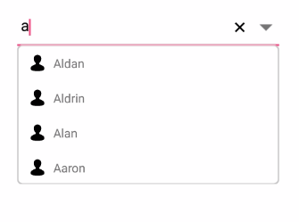

# Customizing ComboBox

ComboBox provides user friendly customizing options for both entry part and drop down part. In this section, customizing entire ComboBox control is explained.

## Customizing the Entry

`TextColor`, `TextSize`, `FontAttributes`, `FontFamily` and `BorderColor` are the properties used to customize the foreground color, font size, font attribute, font family and border color of the entry part.





<StackLayout VerticalOptions="Start" HorizontalOptions="Start" Padding="30">
	<combobox:SfComboBox HeightRequest="45" x:Name="comboBox" Text="Sample text" TextColor="#1976d2" TextSize="20" BorderColor="#1976d2"/>
</StackLayout>





StackLayout stackLayout = new StackLayout() 
{ 
VerticalOptions = LayoutOptions.Start, 
HorizontalOptions = LayoutOptions.Start,
Padding = new Thickness(30) 
};
SfComboBox comboBox = new SfComboBox() 
{ 
HeightRequest = 45,  
Text = "Sample text", 
TextColor = Color.FromHex("1976d2"), 
TextSize = 20, 
BorderColor = Color.FromHex("1976d2")
};
stackLayout.Children.Add(comboBox);
this.Content = stackLayout;





## CustomView for ComboBox

CustomView property has used to provide the custom view instead of entry in ComboBox. It's default height and width has control height and width.





<StackLayout VerticalOptions="Start" HorizontalOptions="Start" Padding="30">
<combobox:SfComboBox HeightRequest="40" x:Name="comboBox">
<combobox:SfComboBox.CustomView>
	<Label x:Name="customLabel" HeightRequest="40" Text="ComboBox"  VerticalTextAlignment="Center"/>
</combobox:SfComboBox.CustomView>
</combobox:SfComboBox>
</StackLayout>





Label customLabel = new Label();
customLabel.HeightRequest = 40;
customLabel.VerticalTextAlignment = TextAlignment.Center;
customLabel.Text = "ComboBox";
comboBox.CustomView = customLabel; 





## Custom template for Suggestion items

`ItemTemplate` property helps to decorate suggestion items with custom templates. The following code explains the steps to add an image to the suggestion list item.





<StackLayout VerticalOptions="Start" HorizontalOptions="Start" Padding="30">
<combobox:SfComboBox HeightRequest="40" x:Name="comboBox" DisplayMemberPath="Name" DataSource="{Binding PersonCollection}">
	<combobox:SfComboBox.ItemTemplate>
	<DataTemplate>
		<StackLayout Orientation="Horizontal">
		<Image Source="User.png" WidthRequest="12"/>
		<Label Text="{Binding Name}" />
		</StackLayout>
	</DataTemplate>
	</combobox:SfComboBox.ItemTemplate>
</combobox:SfComboBox>
</StackLayout>





public class Person
{
private int age;
public int Age
{
	get { return age; }
	set { age = value; }
}

private string name;
public string Name
{
	get { return name; }
	set { name = value; }
}
}

public class PersonViewModel
{
private ObservableCollection<Person> personCollection;
public ObservableCollection<Person> PersonCollection
{
	get { return personCollection; }
	set { personCollection = value; }
}

public PersonViewModel()
{
	personCollection = new ObservableCollection<Person>();
	personCollection.Add(new Person() { Age = 21, Name = "Aldan" });
	personCollection.Add(new Person() { Age = 25, Name = "Clara" });
	personCollection.Add(new Person() { Age = 23, Name = "Aldrin" });            
	personCollection.Add(new Person() { Age = 25, Name = "Mark" });
	personCollection.Add(new Person() { Age = 25, Name = "Lucas" });
	personCollection.Add(new Person() { Age = 24, Name = "Alan" });
	personCollection.Add(new Person() { Age = 25, Name = "James" });
	personCollection.Add(new Person() { Age = 22, Name = "Aaron" });
}
}

public partial class SamplePage : ContentPage
{
public SamplePage()
{
	InitializeComponent();       
	comboBox.BindingContext = new PersonViewModel();
}
}





## Customizing the Suggestion Box

### Changing Suggestion Item Height

`DropDownItemHeight` property is used to modify the height of suggestion items in drop down list. The code example is given below:





<StackLayout VerticalOptions="Start" HorizontalOptions="Start" Padding="30">
	<combobox:SfComboBox HeightRequest="40" x:Name="comboBox" DropDownItemHeight="50"/>
</StackLayout>





List<String> countryNames = new List<String>();
countryNames.Add("Uganda");
countryNames.Add("Ukraine");
countryNames.Add("United Arab Emirates");
countryNames.Add("United Kingdom");
comboBox.DataSource = countryNames;
comboBox.DropDownItemHeight = 50;





### Customizing Suggestion Items

Suggestion box items can be customized using `DropDownItemFontAttributes`, `DropDownItemFontFamily`, `DropDownTextSize` and `DropDownTextColor` properties.





<StackLayout VerticalOptions="Start" HorizontalOptions="Start" Padding="30">
	<combobox:SfComboBox HeightRequest="40" x:Name="comboBox" DropDownTextSize="16" DropDownTextColor="#1976d2"/>
</StackLayout>





List<String> countryNames = new List<String>();
countryNames.Add("Uganda");
countryNames.Add("Ukraine");
countryNames.Add("United Arab Emirates");
countryNames.Add("United Kingdom");
countryNames.Add("United States");
comboBox.DataSource = countryNames;
comboBox.DropDownTextColor = Color.FromHex("#1976d2");
comboBox.DropDownTextSize = 16;





## DropDown Button Customization

This section explains various DropDown button settings available in SfComboBox control.




<StackLayout VerticalOptions="Start" HorizontalOptions="Start" Padding="30">
<combobox:SfComboBox HeightRequest="40" x:Name="comboBox">
<combobox:SfComboBox.DropDownButtonSettings>
     <combobox:DropDownButtonSettings Width="40" Height="40" FontIcon="" FontSize="16" FontColor="Blue" HighlightedBackgroundColor="Green" BackgroundColor="Red" HighlightFontColor="Red"/>
     </combobox:SfComboBox.DropDownButtonSettings>
</combobox:SfComboBox>
</StackLayout>





DropDownButtonSettings dropDownButtonSettings = new DropDownButtonSettings();
dropDownButtonSettings.Height = 40;
dropDownButtonSettings.Width = 40;
dropDownButtonSettings.FontIcon = "";
dropDownButtonSettings.FontSize = 16;
dropDownButtonSettings.FontColor = Color.Blue;
dropDownButtonSettings.HighlightedBackgroundColor = Color.Green;
dropDownButtonSettings.BackgroundColor = Color.Red;
dropDownButtonSettings.HighlightFontColor = Color.Red;

comboBox.DropDownButtonSettings = dropDownButtonSettings;





## Watermark

Watermark provides a short note about the type of input to enter in the editor control. Watermarks are visible only if the text is empty. Also it will reappear if the text is cleared.
The following example, explains the usability of watermark which hints user to start with the character “U”.





<StackLayout VerticalOptions="Start" HorizontalOptions="Start" Padding="30">
<combobox:SfComboBox HeightRequest="40" Watermark="Enter 'U' to filter suggestions" x:Name="comboBox" />
</StackLayout>





comboBox.Watermark = "Enter 'U' to filter suggestions"; 





## Changing Watermark Text Color

Text color of watermark can be customized using [`WatermarkColor`] property.





<StackLayout VerticalOptions="Start" HorizontalOptions="Start" Padding="30">
<combobox:SfComboBox HeightRequest="40" Watermark="Enter some text" WatermarkColor="#1976d2" x:Name="comboBox" />
</StackLayout>





comboBox.WatermarkColor = Color.FromHex("1976d2");





