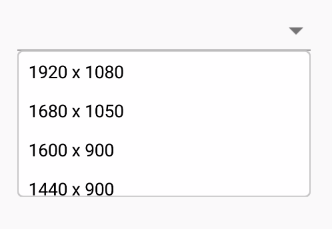
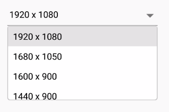
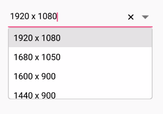
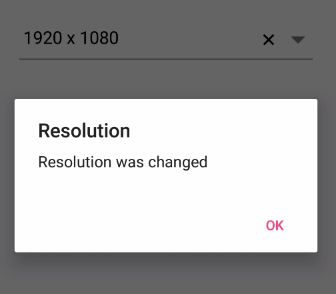

# Getting Started

This section explains the steps required to create the combo box control, populate it with data and filter the suggestions. This section covers only the minimal features that are needed to get started with the control.

## Adding ComboBox references

Refer [this](https://help.syncfusion.com/xamarin/introduction/download-and-installation) section to know the steps for obtaining Essential Studio components in your solution; then refer this [link](https://help.syncfusion.com/xamarin/introduction/control-dependencies#sfcombobox) to know the dependency assembly details for adding ComboBox to your project.
After adding the assembly reference, an additional step is required for iOS and UWP projects.

### Additional Step for iOS

Create an instance of the `SfComboBoxRenderer` in FinishedLaunching overridden method of an AppDelegate class in iOS project as shown in the following codes:



public override bool FinishedLaunching(UIApplication app, NSDictionary options)
{
new Syncfusion.XForms.iOS.ComboBox.SfComboBoxRenderer();

global::Xamarin.Forms.Forms.Init();

LoadApplication(new App());

return base.FinishedLaunching(app, options);
}	



### Additional step for UWP

This step is required only if the application is deployed in release mode with .NET native tool chain enabled. This is for resolving the known Framework issue “Custom controls not rendering in Release mode” in UWP platform. Initializing the SfComboBox assembly at OnLaunched overridden method of the App class in UWP project is the suggested workaround. The following code example show to resolve this issue.



protected override void OnLaunched(LaunchActivatedEventArgs e)
{
#if DEBUG
if (System.Diagnostics.Debugger.IsAttached)
{
	this.DebugSettings.EnableFrameRateCounter = true;
}
#endif

Frame rootFrame = Window.Current.Content as Frame; 
if (rootFrame == null)
{
	rootFrame = new Frame();
	rootFrame.NavigationFailed += OnNavigationFailed;                
	List<System.Reflection.Assembly> assembliesToInclude = new List<System.Reflection.Assembly>();
	// Add all the renderer assemblies your app uses 
	assembliesToInclude.Add(typeof(Syncfusion.XForms.ComboBox.UWP.SfComboBoxRenderer).GetTypeInfo().Assembly);
	// Replace the Xamarin.Forms.Forms.Init(e);        
	Xamarin.Forms.Forms.Init(e, assembliesToInclude);
	if (e.PreviousExecutionState == ApplicationExecutionState.Terminated)
	{
		//TODO: Load state from previously suspended application
	}
	// Place the frame in the current Window
	Window.Current.Content = rootFrame;
}
if (rootFrame.Content == null)
{
	// When the navigation stack isn't restored navigate to the first page,
	// configuring the new page by passing required information as a navigation
	// parameter
	rootFrame.Navigate(typeof(MainPage), e.Arguments);
}
// Ensure the current window is active
Window.Current.Activate();
}



## Initializing ComboBox 

Import the SfComboBox namespace in respective page as shown in the following code.





xmlns:combobox="clr-namespace:Syncfusion.XForms.ComboBox;assembly=Syncfusion.SfComboBox.XForms"





using Syncfusion.XForms.ComboBox;





Then initialize an empty combobox as shown in the following code,





<ContentPage xmlns="http://xamarin.com/schemas/2014/forms" 
             xmlns:x="http://schemas.microsoft.com/winfx/2009/xaml" 
             xmlns:combobox="clr-namespace:Syncfusion.XForms.ComboBox;assembly=Syncfusion.SfComboBox.XForms"
             xmlns:local="clr-namespace:NamespaceName"            
             x:Class="NamespaceName.ClassName">
	<StackLayout VerticalOptions="Start" HorizontalOptions="Start" Padding="30">
		<combobox:SfComboBox HeightRequest="40" x:Name="comboBox"/>
	</StackLayout> 
</ContentPage>
	




StackLayout layout = new StackLayout()
{ 
	VerticalOptions = LayoutOptions.Start, 
	HorizontalOptions = LayoutOptions.Start,
	Padding = new Thickness(30) 
};
SfComboBox comboBox = new SfComboBox();
comboBox.HeightRequest = 40;

layout.Children.Add(comboBox);
Content = layout;





## Populating ComboBox with data

Now, a list of string with resolution list is created and added to the SfComboBox data source property. This list is populated as suggestion list by setting the 'DataSource' property based on text entry. You can customize the drop-down height using the MaximumDropDownHeight property. Add the DataSource for the SfComboBox as shown in the following code.





<ContentPage xmlns="http://xamarin.com/schemas/2014/forms" 
             xmlns:x="http://schemas.microsoft.com/winfx/2009/xaml" 
             xmlns:ListCollection="clr-namespace:System.Collections.Generic;assembly=mscorlib"
             xmlns:combobox="clr-namespace:Syncfusion.XForms.ComboBox;assembly=Syncfusion.SfComboBox.XForms"
             xmlns:local="clr-namespace:NamespaceName"            
             x:Class="NamespaceName.ClassName">
	<StackLayout VerticalOptions="Start" HorizontalOptions="Start" Padding="30">
		<combobox:SfComboBox HeightRequest="40" x:Name="comboBox">
			<combobox:SfComboBox.ComboBoxSource>
				<ListCollection:List x:TypeArguments="x:String">
                	<x:String> 1920 x 1080 </x:String>
                	<x:String> 1680 x 1050 </x:String>
                	<x:String> 1600 x 900 </x:String>
                	<x:String> 1440 x 900 </x:String>
                	<x:String> 1400 x 1050 </x:String>
					<x:String> 1366 x 768 </x:String>
                	<x:String> 1360 x 768 </x:String>
                	<x:String> 1280 x 1024 </x:String>
					<x:String> 1280 x 960 </x:String>
                	<x:String> 1280 x 720 </x:String>
                	<x:String> 854 x 480 </x:String>
					<x:String> 800 x 480 </x:String>
                	<x:String> 480 X 640 </x:String>
                	<x:String> 480 x 320 </x:String>
					<x:String> 432 x 240 </x:String>
					<x:String> 360 X 640 </x:String>
					<x:String> 320 x 240 </x:String>
            	</ListCollection:List>
        	</combobox:SfComboBox.ComboBoxSource>
	 	</combobox:SfComboBox>              
	</StackLayout> 
</ContentPage>
	




StackLayout layout = new StackLayout() 
{ 
	VerticalOptions = LayoutOptions.Start, 
	HorizontalOptions = LayoutOptions.Start, 
	Padding = new Thickness(30) 
};	    
List<String> resolutionList = new List<String>();
resolutionList.Add("1920 x 1080");
resolutionList.Add("1680 x 1050");
resolutionList.Add("1600 x 900");
resolutionList.Add("1440 x 900");
resolutionList.Add("1400 x 1050");
resolutionList.Add("1366 x 768");
resolutionList.Add("1360 x 768");
resolutionList.Add("1280 x 1024");
resolutionList.Add("1280 x 960");
resolutionList.Add("1280 x 720");
resolutionList.Add("854 x 480");
resolutionList.Add("800 x 480");
resolutionList.Add("480 X 640");
resolutionList.Add("480 x 320");
resolutionList.Add("432 x 240");
resolutionList.Add("360 X 640");
resolutionList.Add("320 x 240");

SfComboBox comboBox = new SfComboBox();
comboBox.HeightRequest = 40;
comboBox.ComboBoxSource = resolutionList;

layout.Children.Add(comboBox); 
Content = layout;





Refer [this](https://help.syncfusion.com/xamarin/sfcombobox/populating-data) link to learn more about the options available in SfComboBox to populate data.

## ComboBox modes

The combo box control supports both editable and non-editable text boxes to choose selected items in given data source. You can select an item from the suggestion list.

N > The default value of the IsEditableMode property is false. 

### Non-editable combo box

Non-editable mode prevents users from typing and allows them to select items from the drop-down list. In non-editable mode, the suggestion box can be displayed by clicking the control or drop-down button.





	<StackLayout VerticalOptions="Start" HorizontalOptions="Start" Padding="30">
		<combobox:SfComboBox HeightRequest="40" x:Name="comboBox" MaximumDropDownHeight="200" IsEditableMode="false">
			<combobox:SfComboBox.ComboBoxSource>
				<ListCollection:List x:TypeArguments="x:String">
                	<x:String> 1920 x 1080 </x:String>
                	<x:String> 1680 x 1050 </x:String>
                	<x:String> 1600 x 900 </x:String>
                	<x:String> 1440 x 900 </x:String>
                	<x:String> 1400 x 1050 </x:String>
					<x:String> 1366 x 768 </x:String>
                	<x:String> 1360 x 768 </x:String>
                	<x:String> 1280 x 1024 </x:String>
					<x:String> 1280 x 960 </x:String>
                	<x:String> 1280 x 720 </x:String>
                	<x:String> 854 x 480 </x:String>
					<x:String> 800 x 480 </x:String>
                	<x:String> 480 X 640 </x:String>
                	<x:String> 480 x 320 </x:String>
					<x:String> 432 x 240 </x:String>
					<x:String> 360 X 640 </x:String>
					<x:String> 320 x 240 </x:String>
            	</ListCollection:List>
        	</combobox:SfComboBox.ComboBoxSource>
	 	</combobox:SfComboBox>              
	</StackLayout> 
	




StackLayout layout = new StackLayout() 
{ 
	VerticalOptions = LayoutOptions.Start, 
	HorizontalOptions = LayoutOptions.Start, 
	Padding = new Thickness(30) 
};	    
List<String> resolutionList = new List<String>();
resolutionList.Add("1920 x 1080");
resolutionList.Add("1680 x 1050");
resolutionList.Add("1600 x 900");
resolutionList.Add("1440 x 900");
resolutionList.Add("1400 x 1050");
resolutionList.Add("1366 x 768");
resolutionList.Add("1360 x 768");
resolutionList.Add("1280 x 1024");
resolutionList.Add("1280 x 960");
resolutionList.Add("1280 x 720");
resolutionList.Add("854 x 480");
resolutionList.Add("800 x 480");
resolutionList.Add("480 X 640");
resolutionList.Add("480 x 320");
resolutionList.Add("432 x 240");
resolutionList.Add("360 X 640");
resolutionList.Add("320 x 240");

SfComboBox comboBox = new SfComboBox();
comboBox.HeightRequest = 40;
comboBox.MaximumDropDownHeight = 200;
comboBox.IsEditableMode = false;
comboBox.ComboBoxSource = resolutionList;

layout.Children.Add(comboBox); 
Content = layout;





### Editable combo box

In editable mode, the combo box allows users to edit in the text box that shows suggestions in drop-down list based on the input. With the previous codes, the ‘IsEditableMode’ property can be set to true. This helps users to edit the combo box control.





	<StackLayout VerticalOptions="Start" HorizontalOptions="Start" Padding="30">
		<combobox:SfComboBox HeightRequest="40" x:Name="comboBox" MaximumDropDownHeight="200" IsEditableMode="true">
			<combobox:SfComboBox.ComboBoxSource>
				<ListCollection:List x:TypeArguments="x:String">
                	<x:String> 1920 x 1080 </x:String>
                	<x:String> 1680 x 1050 </x:String>
                	<x:String> 1600 x 900 </x:String>
                	<x:String> 1440 x 900 </x:String>
                	<x:String> 1400 x 1050 </x:String>
					<x:String> 1366 x 768 </x:String>
                	<x:String> 1360 x 768 </x:String>
                	<x:String> 1280 x 1024 </x:String>
					<x:String> 1280 x 960 </x:String>
                	<x:String> 1280 x 720 </x:String>
                	<x:String> 854 x 480 </x:String>
					<x:String> 800 x 480 </x:String>
                	<x:String> 480 X 640 </x:String>
                	<x:String> 480 x 320 </x:String>
					<x:String> 432 x 240 </x:String>
					<x:String> 360 X 640 </x:String>
					<x:String> 320 x 240 </x:String>
            	</ListCollection:List>
        	</combobox:SfComboBox.ComboBoxSource>
	 	</combobox:SfComboBox>              
	</StackLayout> 
	




StackLayout layout = new StackLayout() 
{ 
	VerticalOptions = LayoutOptions.Start, 
	HorizontalOptions = LayoutOptions.Start, 
	Padding = new Thickness(30) 
};	    
List<String> resolutionList = new List<String>();
resolutionList.Add("1920 x 1080");
resolutionList.Add("1680 x 1050");
resolutionList.Add("1600 x 900");
resolutionList.Add("1440 x 900");
resolutionList.Add("1400 x 1050");
resolutionList.Add("1366 x 768");
resolutionList.Add("1360 x 768");
resolutionList.Add("1280 x 1024");
resolutionList.Add("1280 x 960");
resolutionList.Add("1280 x 720");
resolutionList.Add("854 x 480");
resolutionList.Add("800 x 480");
resolutionList.Add("480 X 640");
resolutionList.Add("480 x 320");
resolutionList.Add("432 x 240");
resolutionList.Add("360 X 640");
resolutionList.Add("320 x 240");

SfComboBox comboBox = new SfComboBox();
comboBox.HeightRequest = 40;
comboBox.MaximumDropDownHeight = 200;
comboBox.IsEditableMode = true;
comboBox.ComboBoxSource = resolutionList;

layout.Children.Add(comboBox); 
Content = layout;





## Retrieving selected values

When selecting an item from the drop-down list, the selection changed event will be called. Using the following code snippet, a dialogue box will be displayed when a new item is selected from the suggestion box.





	<StackLayout VerticalOptions="Start" HorizontalOptions="Start" Padding="30">
		<combobox:SfComboBox HeightRequest="40" x:Name="comboBox" MaximumDropDownHeight="200" IsEditableMode="true" SelectionChanged="Handle_SelectionChanged">
			<combobox:SfComboBox.ComboBoxSource>
				<ListCollection:List x:TypeArguments="x:String">
                	<x:String> 1920 x 1080 </x:String>
                	<x:String> 1680 x 1050 </x:String>
                	<x:String> 1600 x 900 </x:String>
                	<x:String> 1440 x 900 </x:String>
                	<x:String> 1400 x 1050 </x:String>
					<x:String> 1366 x 768 </x:String>
                	<x:String> 1360 x 768 </x:String>
                	<x:String> 1280 x 1024 </x:String>
					<x:String> 1280 x 960 </x:String>
                	<x:String> 1280 x 720 </x:String>
                	<x:String> 854 x 480 </x:String>
					<x:String> 800 x 480 </x:String>
                	<x:String> 480 X 640 </x:String>
                	<x:String> 480 x 320 </x:String>
					<x:String> 432 x 240 </x:String>
					<x:String> 360 X 640 </x:String>
					<x:String> 320 x 240 </x:String>
            	</ListCollection:List>
        	</combobox:SfComboBox.ComboBoxSource>
	 	</combobox:SfComboBox>              
	</StackLayout> 
	




StackLayout layout = new StackLayout() 
{ 
	VerticalOptions = LayoutOptions.Start, 
	HorizontalOptions = LayoutOptions.Start, 
	Padding = new Thickness(30) 
};	    

List<String> resolutionList = new List<String>();
resolutionList.Add("1920 x 1080");
resolutionList.Add("1680 x 1050");
resolutionList.Add("1600 x 900");
resolutionList.Add("1440 x 900");
resolutionList.Add("1400 x 1050");
resolutionList.Add("1366 x 768");
resolutionList.Add("1360 x 768");
resolutionList.Add("1280 x 1024");
resolutionList.Add("1280 x 960");
resolutionList.Add("1280 x 720");
resolutionList.Add("854 x 480");
resolutionList.Add("800 x 480");
resolutionList.Add("480 X 640");
resolutionList.Add("480 x 320");
resolutionList.Add("432 x 240");
resolutionList.Add("360 X 640");
resolutionList.Add("320 x 240");

SfComboBox comboBox = new SfComboBox();
comboBox.HeightRequest = 40;
comboBox.MaximumDropDownHeight = 200;
comboBox.IsEditableMode = true;
comboBox.ComboBoxSource = resolutionList;
comboBox.SelectionChanged += (object sender, Syncfusion.XForms.ComboBox.SelectionChangedEventArgs e) => 
{
	Xamarin.Forms.Application.Current.MainPage.DisplayAlert("Resolution", "Resolution was changed", "OK");                
};

layout.Children.Add(comboBox); 
Content = layout;





The complete Getting Started sample is available in [this](http://www.syncfusion.com/downloads/support/directtrac/general/ze/ComboBoxSample10986657571610417339.zip) link.