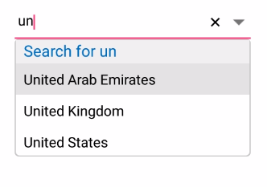
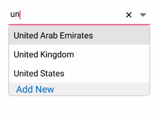

# Header and Footer

We can provide Header and Footer view in the suggestion list in SfComboBox by enabling `ShowDropDownHeaderView` and `ShowDropDownFooterView`. 

## Header Content

We can provide Header Content at the top of the ComboBox's Suggestion box. `DropDownHeaderView` property is used to set the content of the header. The height of the Header in the SfComboBox can be adjusted by the property `DropDownHeaderViewHeight`.





<StackLayout VerticalOptions="Start" HorizontalOptions="Start" Padding="30">
<combobox:SfComboBox HeightRequest="40" x:Name="comboBox" IsEditableMode="true" AllowFiltering="true"> 
<combobox:SfComboBox.DropDownHeaderView>
<StackLayout BackgroundColor="#f0f0f0" >
<Label  x:Name="label2" FontSize="20" VerticalTextAlignment="Center" HorizontalOptions="Center" VerticalOptions="Center" TextColor="#006bcd"   />
</StackLayout>
</combobox:SfComboBox.DropDownHeaderView>
</combobox:SfComboBox>
</StackLayout>                  





List<String> countryNames = new List<String>();
countryNames.Add("Uganda");
countryNames.Add("Ukraine");
countryNames.Add("United Arab Emirates");
countryNames.Add("United Kingdom");
countryNames.Add("United States");
comboBox.DataSource = countryNames;
comboBox.IsEditableMode = true;
comboBox.AllowFiltering = true;
comboBox.ShowDropDownHeaderView = true;
//Set the height of the Header View
comboBox.DropDownHeaderViewHeight = 50;
comboBox.ValueChanged += (object sender, Syncfusion.XForms.ComboBox.ValueChangedEventArgs e) =>
{
label2.Text = "Search for " + e.Value;
}





## Footer Content

We can provide Footer Content at the bottom of the ComboBox's Suggestion box. `DropDownFooterView` property is used to set the content of the footer.The height of the Header in the SfComboBox can be adjusted by the property `DropDownFooterViewHeight`.

The following code example illustrate how to set Footer content in SfComboBox.





<StackLayout VerticalOptions="Start" HorizontalOptions="Start" Padding="30">
<combobox:SfComboBox HeightRequest="40" x:Name="comboBox" IsEditableMode="true" AllowFiltering="true"> 
<combobox:SfComboBox.DropDownFooterView>
<StackLayout BackgroundColor="#f0f0f0" >
<Label Text="Add New" BackgroundColor="#f0f0f0" TextColor="#006bcd" VerticalTextAlignment="Center" VerticalOptions="Center" HorizontalTextAlignment="Center"
FontSize="20"/>
</StackLayout>
</combobox:SfComboBox.DropDownFooterView>
</combobox:SfComboBox>
</StackLayout>                  





List<String> countryNames = new List<String>();
countryNames.Add("Uganda");
countryNames.Add("Ukraine");
countryNames.Add("United Arab Emirates");
countryNames.Add("United Kingdom");
countryNames.Add("United States");
comboBox.DataSource = countryNames;
comboBox.IsEditableMode = true;
comboBox.AllowFiltering = true;
comboBox.ShowDropDownFooterView = true;
//Set the height of the Footer View
comboBox.DropDownFooterViewHeight = 50;





