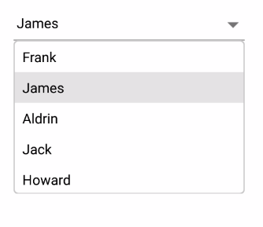
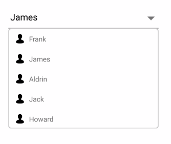

# Populating Data

SfComboBox control can be populated with a list of string or business objects, which assists the user while typing. Users can choose one item from the filtered suggestion list.

[`DataSource`] property is used to populate data in SfComboBox control. This section explains populating ComboBox with list of string and list of Employee details separately.

## Populating String Data

Create an instance of string list and populate items as shown below: 





<StackLayout VerticalOptions="Start" HorizontalOptions="Start" Padding="30">
	<combobox:SfComboBox HeightRequest="40" x:Name="comboBox" />
</StackLayout>
	




List<String> countryNames = new List<String>();
countryNames.Add("Great Britain");
countryNames.Add("Uganda");
countryNames.Add("Ukraine");
countryNames.Add("Canada");
countryNames.Add("United Arab Emirates");
countryNames.Add("France");
countryNames.Add("Italy");
countryNames.Add("United Kingdom");
countryNames.Add("China");
countryNames.Add("United States");
countryNames.Add("Japan");
comboBox.DataSource = countryNames;





## Populating Business Objects

Apart from string data, SfComboBox can deal with business object data also. Now let us create Model and ViewModel classes to populate ComboBox with Employee details.

### Create and Initialize Business Models 

Define a simple model class Employee with fields ID, Name and populate employee data in ViewModel.





public class Employee
{
private int id;
public int ID
{
	get { return id; }
	set { id = value; }
}
private string name;
public string Name
{
	get { return name; }
	set { name = value; }
}
}

public class EmployeeViewModel
{
private ObservableCollection<Employee> employeeCollection;
public ObservableCollection<Employee> EmployeeCollection
{
	get { return employeeCollection; }
	set { employeeCollection = value; }
}
public EmployeeViewModel()
{
	employeeCollection = new ObservableCollection<Employee>();
	employeeCollection.Add(new Employee() { ID = 1, Name = "Frank" }); 
	employeeCollection.Add(new Employee() { ID = 2, Name = "James" }); 
	employeeCollection.Add(new Employee() { ID = 3, Name = "Steve" }); 
	employeeCollection.Add(new Employee() { ID = 4, Name = "Lucas" }); 
	employeeCollection.Add(new Employee() { ID = 5, Name = "Mark" }); 
	employeeCollection.Add(new Employee() { ID = 6, Name = "Michael" }); 
	employeeCollection.Add(new Employee() { ID = 7, Name = "Aldrin" }); 
	employeeCollection.Add(new Employee() { ID = 8, Name = "Jack" }); 
	employeeCollection.Add(new Employee() { ID = 9, Name = "Howard" }); 
}
}





### Populate data in ComboBox

Now populate this EmployeeViewModel data in SfComboBox control by binding with [`DataSource`] property. 





<StackLayout VerticalOptions="Start" HorizontalOptions="Start" Padding="30">
	<combobox:SfComboBox HeightRequest="40" x:Name="comboBox" DataSource="{Binding EmployeeCollection}"/>
</StackLayout> 





comboBox.BindingContext = new EmployeeViewModel();





N> Set the EmployeeViewModel instance as the BindingContext of your control; this is done to bind properties of EmployeeViewModel to SfComboBox.

### Setting DisplayMemberPath

At this point, the control is populated with the list of employees. But the Employee model contains two properties ID and Name so it is necessary to intimate by which property it should filter suggestions. [`DisplayMemberPath`] property specifies the property path with which filtering is done on business objects.


	
comboBox.DisplayMemberPath = "Name";
	


### Setting ItemTemplate

[`ItemTemplate`] property helps to decorate suggestion items with custom templates. The following code explains the steps to add an image to the suggestion list item.



<StackLayout VerticalOptions="Start" HorizontalOptions="Start" Padding="30">
	<combobox:SfComboBox HeightRequest="40" x:Name="comboBox" DisplayMemberPath="Name" DataSource="{Binding EmployeeCollection}">
	<combobox:SfComboBox.ItemTemplate>
		<DataTemplate>
			<StackLayout Orientation="Horizontal">
				<Image Source="User.png" WidthRequest="12"/>
				<Label Text="{Binding Name}" />
			</StackLayout>
		</DataTemplate>
	</combobox:SfComboBox.ItemTemplate>
	</combobox:SfComboBox>
</StackLayout>



The ItemTemplate in above XAML code is translated to C# and given below:



DataTemplate itemTemplate = new DataTemplate(() =>
{
StackLayout stack;
Image image;
Label label;
stack = new StackLayout();
stack.Orientation = StackOrientation.Horizontal;
image = new Image();
image.Source = (FileImageSource)ImageSource.FromFile("User.png");
label = new Label();
label.SetBinding(Label.TextProperty, "Name");
stack.Children.Add(image);
stack.Children.Add(label);
return new ViewCell { View = stack };
});
comboBox.ItemTemplate = itemTemplate;



Refer [this](https://help.syncfusion.com/xamarin/sfcombobox/customizing-combobox) link to learn more about the customizing options available in SfComboBox control.

N> Add the required image in drawable folder(Android), Resources folder(iOS) and at project location for UWP.

