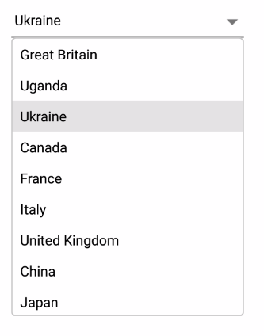

# Populating data

SfComboBox control can be populated with a list of string or business objects, which assists the users when typing. Users can choose one item from the filtered suggestion list.

The [`DataSource`] property is used to populate data in the combo box control. This section explains how to populate the combo box control with list of string and list of employee details separately.

## Populating string data

Create an instance of string list and populate items as shown in the following codes. 





<StackLayout VerticalOptions="Start" HorizontalOptions="Start" Padding="30"> 
       <combobox:SfComboBox HeightRequest="40" x:Name="comboBox"> 
            <combobox:SfComboBox.DataSource>
					<ListCollection:List x:TypeArguments="x:String">
                          <x:String> Great Britain </x:String>
                          <x:String> Uganda </x:String>
                          <x:String> Ukraine </x:String>
                          <x:String> Canada </x:String>
                          <x:String> France </x:String>
                          <x:String> Italy </x:String>
                          <x:String> United Kingdom </x:String>
                          <x:String> China </x:String>
                          <x:String> Japan </x:String>
                    </ListCollection:List>
        	</combobox:SfComboBox.DataSource>
	    </combobox:SfComboBox>
</StackLayout>

	




StackLayout layout = new StackLayout() 
{ 
	VerticalOptions = LayoutOptions.Start, 
	HorizontalOptions = LayoutOptions.Start, 
	Padding = new Thickness(30) 
}; 

List<String> countryNames = new List<String>(); 
countryNames.Add("Great Britain"); 
countryNames.Add("Uganda"); 
countryNames.Add("Ukraine"); 
countryNames.Add("Canada"); 
countryNames.Add("France"); 
countryNames.Add("Italy"); 
countryNames.Add("United Kingdom"); 
countryNames.Add("China"); 
countryNames.Add("Japan"); 

SfComboBox comboBox = new SfComboBox();
comboBox.HeightRequest = 40;
comboBox.DataSource = countryNames;
layout.Children.Add(comboBox); 
Content = layout;





## Populating business objects

Apart from string data, SfComboBox can deal business object data also. Now create Model and ViewModel classes to populate the combo box control with employee details. 

### Create and Initialize business models 

Define a simple model class employee with fields ID and name, and then populate employee data in ViewModel. 



public class Employee
{
private int id;
public int ID
{
	get { return id; }
	set { id = value; }
}
private string name;
public string Name
{
	get { return name; }
	set { name = value; }
}
}

public class EmployeeViewModel
{
private ObservableCollection<Employee> employeeCollection;
public ObservableCollection<Employee> EmployeeCollection
{
	get { return employeeCollection; }
	set { employeeCollection = value; }
}
public EmployeeViewModel()
{
	employeeCollection = new ObservableCollection<Employee>();
	employeeCollection.Add(new Employee() { ID = 1, Name = "Frank" }); 
	employeeCollection.Add(new Employee() { ID = 2, Name = "James" }); 
	employeeCollection.Add(new Employee() { ID = 3, Name = "Steve" }); 
	employeeCollection.Add(new Employee() { ID = 4, Name = "Lucas" }); 
	employeeCollection.Add(new Employee() { ID = 5, Name = "Mark" }); 
	employeeCollection.Add(new Employee() { ID = 6, Name = "Michael" }); 
	employeeCollection.Add(new Employee() { ID = 7, Name = "Aldrin" }); 
	employeeCollection.Add(new Employee() { ID = 8, Name = "Jack" }); 
	employeeCollection.Add(new Employee() { ID = 9, Name = "Howard" }); 
}
}



### Populate data in ComboBox

Now populate this EmployeeViewModel data in SfComboBox control by binding with [`DataSource`] property. 





<ContentPage xmlns="http://xamarin.com/schemas/2014/forms" 
             xmlns:x="http://schemas.microsoft.com/winfx/2009/xaml" 
             xmlns:combobox="clr-namespace:Syncfusion.XForms.ComboBox;assembly=Syncfusion.SfComboBox.XForms"
             xmlns:local="clr-namespace:NamespaceName"            
             x:Class="NamespaceName.ClassName">
<ContentPage.BindingContext>
    <local:EmployeeViewModel/>
 </ContentPage.BindingContext>
<StackLayout VerticalOptions="Start" HorizontalOptions="Start" Padding="30">
	<combobox:SfComboBox HeightRequest="40" x:Name="comboBox" DataSource="{Binding EmployeeCollection}" DisplayMemberPath-"Name" />
</StackLayout> 
</ContentPage>





StackLayout layout = new StackLayout()
{
	VerticalOptions = LayoutOptions.Start,
	HorizontalOptions = LayoutOptions.Start,
	Padding = new Thickness(30)
};

EmployeeViewModel employee = new EmployeeViewModel();
SfComboBox comboBox = new SfComboBox();
comboBox.HeightRequest = 40;
comboBox.BindingContext = employee;
comboBox.DataSource = employee.EmployeeCollection;
comboBox.DisplayMemberPath = "Name";

layout.Children.Add(comboBox);
Content = layout;





N> Set the EmployeeViewModel instance as the BindingContext of your control; this is done to bind properties of EmployeeViewModel to SfComboBox.

### Setting DisplayMemberPath

The combo box control is populated with a list of employees. But the employee model contains two properties ID and Name, So it is necessary to intimate by which property it should filter suggestions. The [`DisplayMemberPath`] property specifies the property path with type of filtering is done on business objects.


	
comboBox.DisplayMemberPath = "Name";
	


### Setting ItemTemplate

The [`ItemTemplate`] property helps to decorate suggestion items with custom templates. The following code explains the steps to add an image to the suggestion list item.




<StackLayout VerticalOptions="Start" HorizontalOptions="Start" Padding="30">
	<combobox:SfComboBox HeightRequest="40" x:Name="comboBox" DisplayMemberPath="Name" DataSource="{Binding EmployeeCollection}">
	<combobox:SfComboBox.ItemTemplate>
		<DataTemplate>
			<StackLayout Orientation="Horizontal">
				<Image Source="User.png" WidthRequest="12"/>
				<Label Text="{Binding Name}" />
			</StackLayout>
		</DataTemplate>
	</combobox:SfComboBox.ItemTemplate>
	</combobox:SfComboBox>
</StackLayout>



The ItemTemplate in the previous XAML code is translated to C# which is shown in the following code.



DataTemplate itemTemplate = new DataTemplate(() =>
{
	StackLayout stack;
	Image image;
	Label label;
	stack = new StackLayout();
	stack.Orientation = StackOrientation.Horizontal;
	image = new Image();
	image.Source = (FileImageSource)ImageSource.FromFile("User.png");
	label = new Label();
	label.SetBinding(Label.TextProperty, "Name");
	stack.Children.Add(image);
	stack.Children.Add(label);
	return new ViewCell { View = stack };
});

StackLayout layout = new StackLayout() 
{ 
	VerticalOptions = LayoutOptions.Start, 
	HorizontalOptions = LayoutOptions.Start, 
	Padding = new Thickness(30) 
}; 

SfComboBox comboBox = new ComboBox();
comboBox.HeightRequest = 40;
comboBox.BindingContext = new EmployeeViewModel();
Binding binding = new Binding("EmployeeCollection");
binding.Source = this;
binding.Mode = BindingMode.TwoWay;
comboBox.SetBinding(Label.DataSourceProperty,binding);
comboBox.ItemTemplate = itemTemplate;

layout.Children.Add(comboBox); 
Content = layout;




Refer to [this](https://help.syncfusion.com/xamarin/sfcombobox/customizing-combobox) link to learn more about the customizing options available in the combo box control.

N> Add the required image in drawable folder(Android), Resources folder(iOS) and at project location for UWP.

