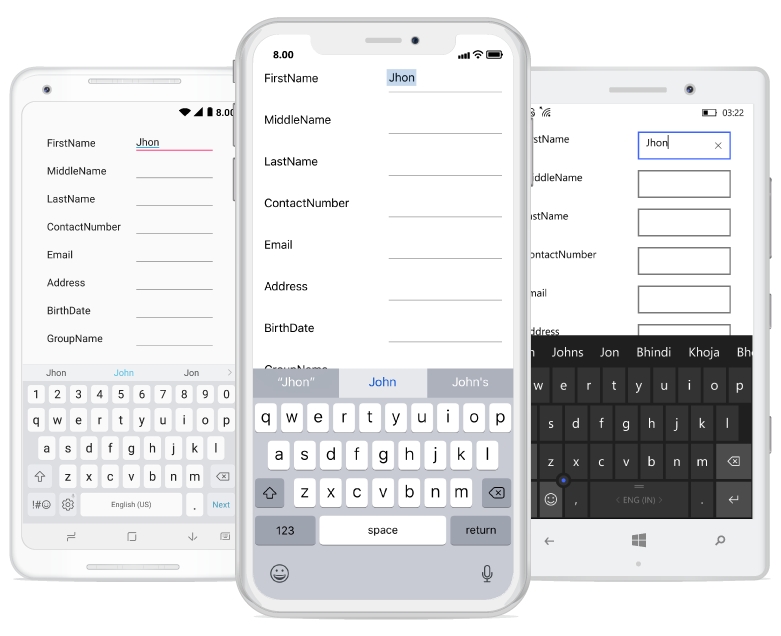
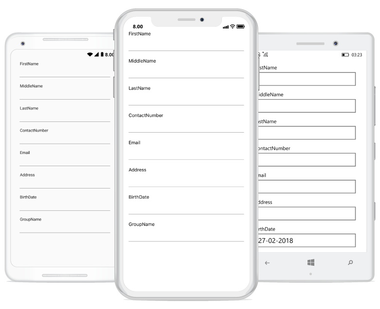
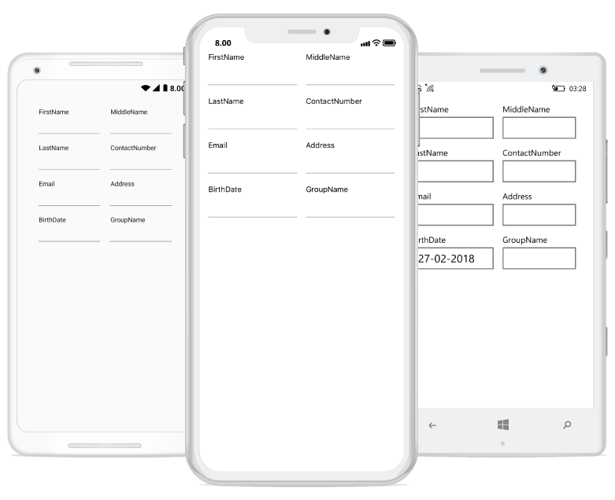

# SfDataForm

The SfDataForm control helps editing the data fields of any data object. It can be used to develop various forms such as login, reservation, data entry, etc. Key features includes the following:

* Layout and grouping: Supports to linear and grid layout with grouping support. Supports customizing the layout with different heights for each item.
* Caption customization: Supports loading the image as caption for the editor.
* Editors: Built-in support for text, numeric, numeric up-down, picker, date picker, time picker, switch, and checkbox editors. 
* Custom editor: Supports loading the custom editors.
* Validation: Built-in support to validate the data based on the [INotifyDataErrorInfo](https://msdn.microsoft.com/en-us/library/system.componentmodel.inotifydataerrorinfo.aspx) and data annotations. It also programmatically supports validation handling.

# Getting started

This section explains the quick overview to use the [SfDataForm](https://help.syncfusion.com/cr/cref_files/xamarin/Syncfusion.SfDataForm.XForms~Syncfusion.XForms.DataForm.SfDataForm.html) for Xamarin.Forms in your application.

## Assembly deployment

After installing Essential Studio for Xamarin, you can find all the required assemblies in the installation folders, {Syncfusion Essential Studio Installed location} \Essential Studio\16.x.x.x\Xamarin\lib

Eg: C:\Program Files (x86) \Syncfusion\Essential Studio\16.1.0.24\Xamarin\lib

N> Assemblies can be found in unzipped package location in Mac.

### Adding SfDataForm Reference

Syncfusion Xamarin components are available in [nuget.org](https://www.nuget.org/). To add SfDataForm to your project, open the NuGet package manager in Visual Studio, and search for [Syncfusion.Xamarin.SfDataForm](https://www.nuget.org/packages/Syncfusion.Xamarin.SfDataForm/), and then install it.

To know more about obtaining our components, refer to these links: [Mac](https://help.syncfusion.com/xamarin/introduction/download-and-installation/mac) and [Windows](https://help.syncfusion.com/xamarin/introduction/download-and-installation/windows). Also, if you prefer to manually refer the assemblies instead of NuGet, refer to this [link](https://help.syncfusion.com/xamarin/introduction/control-dependencies#sfdataform) to know about the dependent assemblies for SfDataForm.

## Launching the data form on each platform

To use the data form inside an application, each platform application must initialize the data form renderer. This initialization step varies from platform to platform and is discussed in the following sections:

### Android

The Android launches the data form without any initialization and is enough to only initialize the Xamarin.Forms Framework to launch the application.

### iOS

To launch the data form in iOS, call the `SfDataFormRenderer.Init()` in the `FinishedLaunching` overridden method of the AppDelegate class after the Xamarin.Forms Framework initialization and before the LoadApplication is called, as demonstrated in the following code example:



public override bool FinishedLaunching(UIApplication app, NSDictionary options)
{
    …
    global::Xamarin.Forms.Forms.Init ();
    SfDataFormRenderer.Init();
    LoadApplication (new App ());
    …
}
 


### Universal Windows Platform (UWP)

The UWP launches the data form without any initialization and is enough to only initialize the Xamarin.Forms Framework to launch the application.

### ReleaseMode issue in UWP platform

The known Framework issue in UWP platform is that the custom controls will not render when deployed the application in `Release Mode`.

The above problem can be resolved by initializing the data form assemblies in `App.xaml.cs` file in UWP project as in the following code snippet:



// In App.xaml.cs

protected override void OnLaunched(LaunchActivatedEventArgs e)
{
    …

    rootFrame.NavigationFailed += OnNavigationFailed;
        
    // you'll need to add `using System.Reflection;`
    List<Assembly> assembliesToInclude = new List<Assembly>();

    //Now, add all the assemblies your app uses
    assembliesToInclude.Add(typeof(SfDataFormRenderer).GetTypeInfo().Assembly);

    // replaces Xamarin.Forms.Forms.Init(e);        
    Xamarin.Forms.Forms.Init(e, assembliesToInclude);
        
    …     
}



## Creating the data form

In this section, you will create Xamarin.Forms application with `SfDataForm`. The control should be configured entirely in C# code.

* Creating the project.
* Adding data form in Xamarin.Forms.
* Creating data object.
* Setting data object.

### Creating the project

Create a new BlankApp (Xamarin.Forms.Portable) application in Xamarin Studio or Visual Studio for Xamarin.Forms.

### Adding data form in Xamarin.Forms

To add the data form to your application, follow the steps:

1. Add required assemblies as discussed in assembly deployment section.
2. Import the control namespace as `xmlns:dataForm="clr-namespace:Syncfusion.XForms.DataForm;assembly=Syncfusion.SfDataForm.XForms` in XAML Page.
3. Create an instance of data form control and add as a view to the linear layout.




<?xml version="1.0" encoding="utf-8" ?>
<ContentPage xmlns="http://xamarin.com/schemas/2014/forms"
             xmlns:x="http://schemas.microsoft.com/winfx/2009/xaml"
             xmlns:local="clr-namespace:GettingStarted"
             xmlns:dataForm="clr-namespace:Syncfusion.XForms.DataForm;assembly=Syncfusion.SfDataForm.XForms"
             x:Class="GettingStarted.MainPage">
        <dataForm:SfDataForm x:Name="dataForm"/>    
</ContentPage>




using Syncfusion.XForms.DataForm;
using Xamarin.Forms;

namespace GettingStarted
{
    public partial class MainPage : ContentPage
    {
        SfDataForm dataForm;
        public MainPage()
        {            
            InitializeComponent();
            dataForm = new SfDataForm();
        }
    }
}




### Creating data object

The `SfDataForm` is a data edit control so, create a data object to edit the data object.

Here, the data object named **ContactsInfo** created with some properties.




public class ContactsInfo
{
    private string firstName;
    private string middleName;
    private string lastName;
    private string contactNo;
    private string email;
    private string address;
    private DateTime? birthDate;
    private string groupName;

    public ContactsInfo()
    {

    }

    public string FirstName
    {
        get { return this.firstName; }
        set
        {
            this.firstName = value;
        }
    }

    public string MiddleName
    {
        get { return this.middleName; }
        set
        {
            this.middleName = value;
        }
    }
    public string LastName
    {
        get { return this.lastName; }
        set
        {
            this.lastName = value;
        }
    }

    public string ContactNumber
    {
        get { return contactNo; }
        set
        {
            this.contactNo = value;
        }
    }

    public string Email
    {
        get { return email; }
        set
        {
            email = value;
        }
    }

    public string Address
    {
        get { return address; }
        set
        {
            address = value;
        }
    }

    public DateTime? BirthDate
    {
        get { return birthDate; }
        set
        {
            birthDate = value;
        }
    }

    public string GroupName
    {
        get { return groupName; }
        set
        {
            groupName = value;
        }
    }
}




N> If you want your data model to respond to property changes, then implement `INotifyPropertyChanged` interface in your model class.

Create a model repository class with ContactsInfo property initialized with required data in a new class file as shown in the following code example and save it ViewModel.cs file:




public class ViewModel
{
    private ContactsInfo contactsInfo;
    public ContactsInfo ContactsInfo
    {
        get { return this.contactsInfo; }
        set { this.contactsInfo = value; }
    }
    public ViewModel()
    {
        this.contactsInfo = new ContactsInfo();
    }
}




## Setting data object

To populate the labels and editors in the data form, set the [DataObject](https://help.syncfusion.com/cr/cref_files/xamarin/Syncfusion.SfDataForm.XForms~Syncfusion.XForms.DataForm.SfDataForm~DataObject.html) property.




<?xml version="1.0" encoding="utf-8" ?>
<ContentPage xmlns="http://xamarin.com/schemas/2014/forms"
             xmlns:x="http://schemas.microsoft.com/winfx/2009/xaml"
             xmlns:local="clr-namespace:GettingStarted"
             xmlns:dataForm="clr-namespace:Syncfusion.XForms.DataForm;assembly=Syncfusion.SfDataForm.XForms"
             x:Class="GettingStarted.MainPage">
    <ContentPage.BindingContext>
        <local:ViewModel/>
    </ContentPage.BindingContext>    
	<dataForm:SfDataForm x:Name="dataForm" 
						 DataObject="{Binding ContactsInfo}"/>    
</ContentPage>




dataForm.DataObject = new ContactsInfo();




Now, run the application to render the `data form` to edit the data object as in the following screenshot:

You can download the entire source code of this demo for Xamarin.Forms from here [DataFormGettingStarted](http://www.syncfusion.com/downloads/support/directtrac/general/ze/DataFormGettingStarted-125084677.zip).

## Defining editors

The data form control automatically generates [DataFormItems](https://help.syncfusion.com/cr/cref_files/xamarin/Syncfusion.SfDataForm.XForms~Syncfusion.XForms.DataForm.DataFormItemManager~DataFormItems.html) (which has UI settings of data field) when the data object set to the `SfDataForm.DataObject` property. The [DataFormItem](https://help.syncfusion.com/cr/cref_files/xamarin/Syncfusion.SfDataForm.XForms~Syncfusion.XForms.DataForm.DataFormItem.html) encapsulates the layout and editor setting for the data field appearing in the data form. When the `DataFormItems` are generated, you can handle the SfDataForm.AutoGeneratingDataFormItem event to customize or cancel the `DataFormItem`. 

The type of input editor generated for the data field depends on the type and attribute settings of the property. The following table lists the `DataFormItem` and its constraints for generation:

<table>
<tr>
<th>Generated DataFormItem Type</th>
<th>Data Type / Attribute</th>
</tr>
<tr>
<td>
{{'[DataFormTextItem](https://help.syncfusion.com/cr/cref_files/xamarin/Syncfusion.SfDataForm.XForms~Syncfusion.XForms.DataForm.DataFormTextItem.html)'| markdownify }}
</td>
<td>
Default DataFormItem generated for the String type and the properties with [DataType(DataType.Text)], [DataType(DataType.MultilineText)] and [DataType(DataType.Password)] attributes.
</td>
</tr>
<tr>
<td>
{{'[DataFormNumericItem](https://help.syncfusion.com/cr/cref_files/xamarin/Syncfusion.SfDataForm.XForms~Syncfusion.XForms.DataForm.DataFormNumericItem.html)'| markdownify }}
</td>
<td>
Generated for the Int or Double type property.
[DataType(DataType.Currency)].
[DataType("Percent")]
</td>
</tr>
<tr>
<td>
{{'[DataFormDateItem](https://help.syncfusion.com/cr/cref_files/xamarin/Syncfusion.SfDataForm.XForms~Syncfusion.XForms.DataForm.DataFormDateItem.html)'| markdownify }}
</td>
<td>
Generated for the DateTime type property.
[DataType(DataType.Date)].
[DataType(DataType.DateTime)].
</td>
</tr>
<tr>
<td>
{{'[DataFormTimeItem](https://help.syncfusion.com/cr/cref_files/xamarin/Syncfusion.SfDataForm.XForms~Syncfusion.XForms.DataForm.DataFormTimeItem.html)'| markdownify }}
</td>
<td>
Generated for the DataTime type property.
[DataType(DataType.Time)].
</td>
</tr>
<tr>
<td>
{{'[DataFormPickerItem](https://help.syncfusion.com/cr/cref_files/xamarin/Syncfusion.SfDataForm.XForms~Syncfusion.XForms.DataForm.DataFormPickerItem.html)'| markdownify }}
</td>
<td>
Generated for the Enum type property.
[EnumDataTypeAttribute]
</td>
</tr>
</table>
The following list of editors are supported:
<table>
<tr>
<th>Editor</th>
<th>Data Type/Attribute</th>
<th>Input control loaded</th>
</tr>
<tr>
<td>
Text
</td>
<td>
The String type property and any other type apart from the following specified cases.
</td>
<td>
Entry
</td>
</tr>
<tr>
<td>
MultilineText
</td>
<td>
The String type property with multi line text.
[DataType(DataType.Multiline)] 
</td>
<td>
Editor
</td>
</tr>
<tr>
<td>
Numeric
</td>
<td>
Int or Double type property.
</td>
<td>
SfNumericTextBox
</td>
</tr>
<tr>
<td>
Percent
</td>
<td>
The Int or Double type Property with percent value.
[DataType("Percent")]].
</td>
<td>
SfNumericTextBox
</td>
</tr>
<tr>
<td>
Currency
</td>
<td>
The Int or Double type property with currency value.
[DataType(DataType.Currency)].
</td>
<td>
SfNumericTextBox
</td>
</tr>
<tr>
<td>
Date
</td>
<td>
The DateTime type property with date value.
[DataType(DataType.Date)]
[DataType(DataType.DateTime)]
</td>
<td>
DatePicker
</td>
</tr>
<tr>
<td>
Time
</td>
<td>
Property with [DataType(DataType.Time)] attribute.
</td>
<td>
TimePicker
</td>
</tr>
<tr>
<td>
NumericUpDown
</td>
<td>
Int or Double type property.
</td>
<td>
SfNumericUpDown
</td>
</tr>
<tr>
<td>
Segment
</td>
<td>
Enum type property.
</td>
<td>
SegmentControl
</td>
</tr>
<tr>
<td>
Bool
</td>
<td>
Bool type property.
</td>
<td>
CheckBox
</td>
</tr>
<tr>
<td>
Switch
</td>
<td>
Bool type property.
</td>
<td>
Switch
</td>
</tr>
<tr>
<td>
Picker
</td>
<td>
Enum and List type property. 
[EnumDataTypeAttribute]
</td>
<td>
Picker
</td>
</tr>
<tr>
<td>
DropDown
</td>
<td>
Enum and List type property.
[EnumDataTypeAttribute]
</td>
<td>
DropDownControl
</td>
</tr>
<tr>
<td>
Password
</td>
<td>
The String type property with [DataType(DataType.Password)] attribute.
</td>
<td>
Entry
</td>
</tr>
</table>

## Layout options

### Label position

By default, the data form arranges the label at left side and input control at the right side. You can change the label position by setting the [SfDataForm.LabelPosition](https://help.syncfusion.com/cr/cref_files/xamarin/Syncfusion.SfDataForm.XForms~Syncfusion.XForms.DataForm.SfDataForm~LabelPosition.html) property. You can position the label from left to top of the input control by setting the `LabelPosition` as Top.




<dataForm:SfDataForm LabelPosition="Top"/>




dataForm.LabelPosition = LabelPosition.Top;




### Grid layout

By default, the data form arranges one data field per row. It is possible to have more than one date field per row by setting the [ColumnCount](https://help.syncfusion.com/cr/cref_files/xamarin/Syncfusion.SfDataForm.XForms~Syncfusion.XForms.DataForm.SfDataForm~ColumnCount.html) property which provides grid like layout for the data form.




<dataForm:SfDataForm ColumnCount="2"/>




dataForm.ColumnCount = 2;




## Editing

By default, the data form enables editing of the data field. You can disable editing by setting the [IsReadOnly](https://help.syncfusion.com/cr/cref_files/xamarin/Syncfusion.SfDataForm.XForms~Syncfusion.XForms.DataForm.SfDataForm~IsReadOnly.html) property of the data form. You can enable or disable editing for a particular data field by setting the [IsReadOnly](https://help.syncfusion.com/cr/cref_files/xamarin/Syncfusion.SfDataForm.XForms~Syncfusion.XForms.DataForm.DataFormItem~IsReadOnly.html) property of [DataFormItem](https://help.syncfusion.com/cr/cref_files/xamarin/Syncfusion.SfDataForm.XForms~Syncfusion.XForms.DataForm.DataFormItem.html) in the `AutoGeneratingDataFormItem` event. The data field editing behavior can also be defined by using [EditableAttribute](https://help.syncfusion.com/cr/cref_files/xamarin/Syncfusion.SfDataForm.XForms~Syncfusion.XForms.DataForm.EditableAttribute.html).
