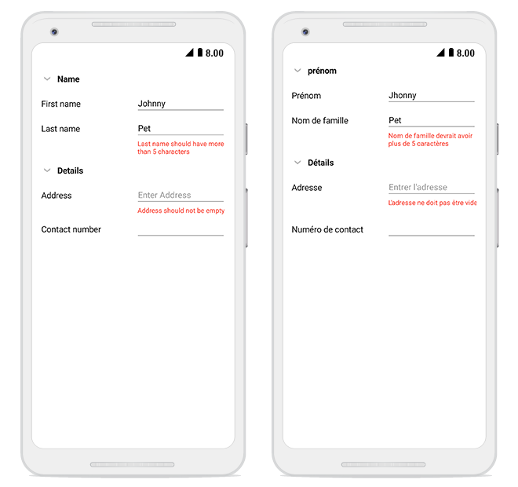

# Localization 

You can localize the DataFormItem [Display](https://apisof.net/catalog/System.ComponentModel.DataAnnotations.DisplayAttribute) attribute values and validation ([Required](http://help.syncfusion.com/cr/xamarin/Syncfusion.SfDataForm.XForms~Syncfusion.XForms.DataForm.RequiredAttribute.html),[StringLength](http://help.syncfusion.com/cr/xamarin/Syncfusion.SfDataForm.XForms~Syncfusion.XForms.DataForm.StringLengthAttribute.html) ) attributes values by using ResourceType display
attribute or using the `AutoGeneratingDataFormItem` event.
 
Please refer the [Localization]( https://docs.microsoft.com/en-us/xamarin/xamarin-forms/app-fundamentals/localization/text?tabs=vswin) document  to localize the application.
 
Based on the culture specifies the corresponding culture string value of display attribute in Resource (.Resx) file as mentioned in document.

## Localizing data form item display values

Here, the display attributes or data form item display values get localized based on culture from Localization Resource File (.Resx).

### Using attribute

ResourceType [Display](https://apisof.net/catalog/System.ComponentModel.DataAnnotations.DisplayAttribute ) attribute specifies the Resources File (.Resx) which is used to localize the Display attribute of Name, ShortName, GroupName and Prompt values.




[Display(Name ="FirstName", Prompt = "EnterFirstName", GroupName ="Name", ResourceType = typeof(Localization))]
public String FirstName { get; set; } 




### Using event

You can also localize the DataFormItem LabelText, PlaceHolderText, GroupName in the `AutoGeneratingDataFormItem` event of SfDataForm by using the Resources (.Resx) file.

Here, string member of .resx file will be accessed through the class (in resxFilename.Designer.cs) which was auto-generated when .resx file created and static string members get localized using [ResourceManager]https://msdn.microsoft.com/en-us/library/d17ax2xk(v=vs.110).aspx based on culture.




[Display(GroupName ="Name")]
public String FirstName { get; set; }

dataForm.AutoGeneratingDataFormItem += DataForm_AutoGeneratingDataFormItem;
private void DataForm_AutoGeneratingDataFormItem(object sender, AutoGeneratingDataFormItemEventArgs e)
{
    if (e.DataFormItem != null)
    {
        if (e.DataFormItem.LabelText == "FirstName")
        {
            e.DataFormItem.LabelText = Localization.FirstName;
            e.DataFormItem.PlaceHolderText = Localization.EnterFirstName;
        }
        if (e.DataFormItem.GroupName == "Name")
        {
            e.DataFormItem.GroupName = Localization.Name;
        }
    }
}




## Localizing validation error messages

Here, the validation (Required,StringLength) attributes or data form error messages get localized based on culture from Localization Resource File (.Resx).

### Using attribute

The `Required` and `StringLength` attributes error message can be localized using [ErrorMessageResourceType](https://msdn.microsoft.com/en-us/library/system.componentmodel.dataannotations.validationattribute.errormessageresourcetype.aspx ) and [ErrorMessageResourceName](https://msdn.microsoft.com/en-us/library/system.componentmodel.dataannotations.validationattribute.errormessageresourcename.aspx ) properties which are used to get a localized error messages from Localization Resource File (.Resx) based on culture.




[Required(AllowEmptyStrings =false,ErrorMessageResourceType = typeof(Localization), ErrorMessageResourceName = "FirstNameEmpty")]
[StringLength(25,MinimumLength =5,ErrorMessageResourceType = typeof(Localization), ErrorMessageResourceName = "FirstNameLength")]
public String FirstName { get; set; } 




### Using event

You can also localize the data form error message in the ` Validating` event of SfDataForm by using the Resources (.Resx) file.

Here, string member of .resx file will be accessed through the class (in resxFilename.Designer.cs) which was auto-generated when .resx file created and static string members get localized using [ResourceManager]https://msdn.microsoft.com/en-us/library/d17ax2xk(v=vs.110).aspx based on culture.




dataForm.Validating += DataForm_Validating;
private void DataForm_Validating(object sender, ValidatingEventArgs e)
{
    if (e.PropertyName == "FirstName")
    {
        if (e.Value.ToString().Length == 0)
        {
            e.IsValid = false;
            e.ErrorMessage = Localization.FirstNameEmpty;
        }
        else if (e.Value != null && e.Value.ToString().Length > 0 && !(e.Value.ToString().Length >= 5))
        {
            e.IsValid = false;
            e.ErrorMessage = Localization.FirstNameLength;
        }
    }
}



You can download the entire source code of this demo for Xamarin.Forms using attributes from here [LocalizationThroughAttribute](http://www.syncfusion.com/downloads/support/directtrac/general/ze/DataFormLocalizationAttribute-1609800763.zip) and using event from here [LocalizationThroughEvent](http://www.syncfusion.com/downloads/support/directtrac/general/ze/DataFormLocalizationEvent-933806775.zip).