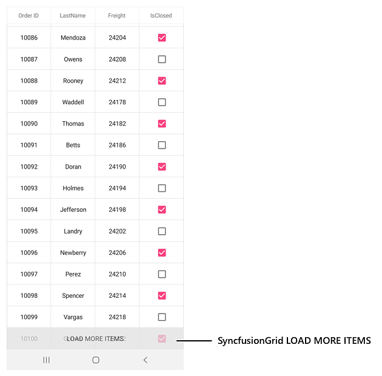
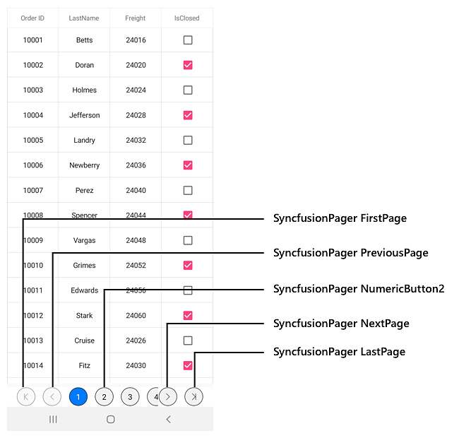

# Automation Id

SfDataGrid and SfDataPager support built-in [AutomationId](https://docs.microsoft.com/en-gb/dotnet/api/xamarin.forms.element.automationid?view=xamarin-forms#Xamarin_Forms_Element_AutomationId) for all their inner elements. These `AutomationId` values allow the automation framework to find and interact with the inner elements when the test scripts are run. A unique `AutomationId` is maintained for each inner element by prefixing the control's `AutomationId` with the inner element's Id.

## DataGrid

The below table illustrates the predefined automation values set internally which can be used to identify the SfDataGrid elements.

<table>
<tr>
<th>Elements</th>
<th>Values</th>
</tr>
<tr>
<td>Header</td>
<td>"Row" + HeaderCellIndex</td>
</tr>
<tr>
<td>Cell</td>
<td>"R" + CellRowIndex + "C" + CellColumnIndex</td>
</tr>
<tr>
<td>Row</td>
<td>"Row" + RowIndex</td>
</tr>
<tr>
<td>GroupHeader</td>
<td>"Row" + GroupHeaderCellIndex</td>
</tr>
<tr>
<td>LoadMoreView</td>
<td>"LOAD MORE ITEMS"</td>
</tr>
</table>

The following screenshots illustrate the `AutomationId` values of grid cells, rows, and other inner elements of SfDataGrid.

The following code snippet demonstrates how to set the `AutomationId` to data grid.




<syncfusion:SfDataGrid x:Name="dataGrid"
                        ItemsSource="{Binding OrdersInfo,Mode=TwoWay}"
                        AutomationId="SyncfusionGrid"
                        AllowGroupExpandCollapse="True">

                <sfgrid:SfDataGrid.GroupColumnDescriptions>
                    <sfgrid:GroupColumnDescription ColumnName="OrderID" />
                </sfgrid:SfDataGrid.GroupColumnDescriptions>
                
                <sfgrid:SfDataGrid.CaptionSummaryRow>
                    <sfgrid:GridGroupSummaryRow Title="Total Count of OrderId:{OrderID}"
                           ShowSummaryInRow="True">
                        <sfgrid:GridGroupSummaryRow.SummaryColumns>
                            <sfgrid:GridSummaryColumn Name="OrderID"
                                      MappingName="OrderID"
                                      Format="{}{Count}"
                                      SummaryType="CountAggregate" />
                        </sfgrid:GridGroupSummaryRow.SummaryColumns>
                    </sfgrid:GridGroupSummaryRow>
                </sfgrid:SfDataGrid.CaptionSummaryRow>
                          
    </syncfusion:SfDataGrid>





ViewModel viewModel = new ViewModel();
SfDataGrid dataGrid = new SfDataGrid();
dataGrid.ItemsSource = viewModel.OrderInfoCollection;
dataGrid.AutomationId = "SyncfusionGrid";
dataGrid.AllowGroupExpandCollapse = true;

this.sfGrid.GroupColumnDescriptions.Add(new GroupColumnDescription()
            {
                ColumnName = "OrderID",
            });

GridGroupSummaryRow summaryRow = new GridGroupSummaryRow();
summaryRow.Title = "Total Count of OrderId:{OrderID}";
summaryRow.ShowSummaryInRow = true;
summaryRow.SummaryColumns.Add(new GridSummaryColumn()
            {
                Name = "OrderID",
                MappingName = "OrderID",
                Format = "{Count}",
                SummaryType = SummaryType.CountAggregate
            });
sfGrid.CaptionSummaryRow = summaryRow;




Refer to the following code snippet to access the inner elements of data grid from the automation script.




[Test]
[Description("SfDataGrid Automation Id")]
public void SfDataGrid_AutomationId()
{
   // To enter edit mode for the grid cell at fourth row and second column.
   App.DoubleTap("SyncfusionGrid R4C1");

   // To tap group expand and collapse icon
   App.Tap("SyncfusionGrid Row5");

   // To apply sorting 
   App.Tap("SyncfusionGrid R2C1");

   // To click LoadMoreView for loading more items
   App.Tap("SyncfusionGrid LOAD MORE ITEMS");
}




## DataPager

The below table illustrates the predefined automation values set internally which can be used to identify the SfDataPager elements.

<table>
<tr>
<th>Elements</th>
<th>Values</th>
</tr>
<tr>
<td>First page button</td>
<td>"FirstPage"</td>
</tr>
<tr>
<td>Previous page button</td>
<td>"PreviousPage"</td>
</tr>
<tr>
<td>Numeric buttons</td>
<td>"NumericButton" + NumericButtonIndex</td>
</tr>
<tr>
<td>Next page button</td>
<td>"NextPage"</td>
</tr>
<tr>
<td>Last page button</td>
<td>"LastPage"</td>
</tr>
</table>

The following screenshot illustrates the `AutomationId` values of the pager buttons in SfDataPager.

The following code snippet demonstrates how to set `AutomationId` to dataPager.




<Grid> 
      <Grid.RowDefinitions>
        <RowDefinition Height="*" />
        <RowDefinition Height="Auto" />
      </Grid.RowDefinitions>
      <sfPager:SfDataPager x:Name ="dataPager"
                           Grid.Row="1"           
                           PageSize="10" 
                           HeightRequest ="50"
                           NumericButtonCount="20"
                           Source="{Binding OrdersInfo}"
                           AutomationId="SyncfusionPager">
      </sfPager:SfDataPager>
       
      <sfgrid:SfDataGrid x:Name="dataGrid"
                         Grid.Row="0"
                         ItemsSource="{Binding PagedSource, Source={x:Reference dataPager}}" >                   
      </sfgrid:SfDataGrid>
</Grid> 
                      




SfDataGrid sfGrid = new SfDataGrid();
SfDataPager sfPager = new SfDataPager();
ViewModel viewModel = new ViewModel();
sfPager.PageSize = 15; 
sfPager.Source = viewModel.Info; 
sfGrid.ItemsSource = sfPager.PagedSource;  
sfPager.AutomationId = "SyncfusionPager";

Grid gridLayout = new Grid();
gridLayout.HorizontalOptions = LayoutOptions.FillAndExpand;
gridLayout.RowDefinitions = new RowDefinitionCollection
        {
          new RowDefinition { },
          new RowDefinition { Height = 50 },    
        };
gridLayout.Children.Add(sfGrid, 0, 0);
gridLayout.Children.Add(sfPager, 0, 1);

this.Content = gridLayout;




Refer to the following code snippet to access the inner elements of data pager from automation script.




[Test]
[Description("SfDataPager Automation Id")]
public void SfDataPager_AutomationId()
{
   // To tap the first page numeric button
   App.Tap("SyncfusionPager FirstPage");

   // To tap the previous page numeric button
   App.Tap("SyncfusionPager PreviousPage");

   // To tap the next page numeric button
   App.Tap("SyncfusionPager NextPage");

   // To tap the next last page numeric button
   App.Tap("SyncfusionPager LastPage");

   // To tap the second numeric button
   App.Tap("SyncfusionPager NumericButton2");
}



