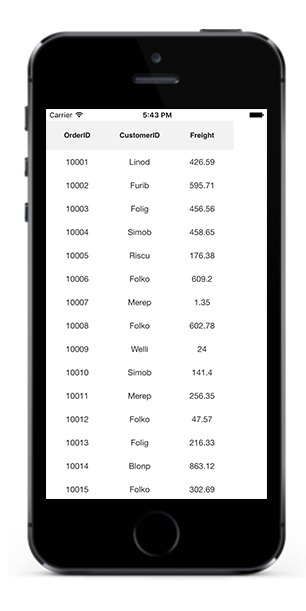

# Column Sizer

SfDataGrid allows you to apply `ColumnSizer` for the `GridColumns` by setting the [SfDataGrid.ColumnSizer](http://help.syncfusion.com/cr/cref_files/xamarin/sfdatagrid/Syncfusion.SfDataGrid.XForms~Syncfusion.SfDataGrid.XForms.SfDataGrid~ColumnSizer.html) property. 

The following code example illustrates how to apply `ColumnSizer` in SfDataGrid.



<sfgrid:SfDataGrid x:Name="dataGrid"
                   AutoGenerateColumns="True"
                   ColumnSizer="None">


dataGrid.ColumnSizer = ColumnSizer.None;



SfDataGrid applies width for all the `GridColumns` in the [SfDataGrid.Columns](http://help.syncfusion.com/cr/cref_files/xamarin/sfdatagrid/Syncfusion.SfDataGrid.XForms~Syncfusion.SfDataGrid.XForms.SfDataGrid~Columns.html) collection based on the `SfDataGrid.ColumnSizer` property. Following are the lists of options available to set width of the columns.

* None
* LastColumnFill
* Star
* Auto

## ColumnSizer.None

No column sizing is applied when the [SfDataGrid.ColumnSizer](http://help.syncfusion.com/cr/cref_files/xamarin/sfdatagrid/Syncfusion.SfDataGrid.XForms~Syncfusion.SfDataGrid.XForms.SfDataGrid~ColumnSizer.html) is set to [None](http://help.syncfusion.com/cr/cref_files/xamarin/sfdatagrid/Syncfusion.SfDataGrid.XForms~Syncfusion.SfDataGrid.XForms.ColumnSizer.html). Columns are arranged in view based on the [SfDataGrid.DefaultColumnWidth](http://help.syncfusion.com/cr/cref_files/xamarin/sfdatagrid/Syncfusion.SfDataGrid.XForms~Syncfusion.SfDataGrid.XForms.SfDataGrid~DefaultColumnWidth.html) property. This is the default value of the `SfDataGrid.ColumnSizer` property.

## ColumnSizer.LastColumnFill

When the [SfDataGrid.ColumnSizer](http://help.syncfusion.com/cr/cref_files/xamarin/sfdatagrid/Syncfusion.SfDataGrid.XForms~Syncfusion.SfDataGrid.XForms.SfDataGrid~ColumnSizer.html) is [LastColumnFill](http://help.syncfusion.com/cr/cref_files/xamarin/sfdatagrid/Syncfusion.SfDataGrid.XForms~Syncfusion.SfDataGrid.XForms.ColumnSizer.html), the column width of the `GridColumns` are adjusted with respect to `SfDataGrid.DefaultColumnWidth` property. In case if the columns does not fill the entire view space, then the last column’s width fills the unoccupied space in the view.



<sfgrid:SfDataGrid x:Name="dataGrid"
                   AutoGenerateColumns="True"
                   ColumnSizer="LastColumnFill">


dataGrid.ColumnSizer = ColumnSizer.LastColumnFill;



## ColumnSizer.Star

When the [SfDataGrid.ColumnSizer](http://help.syncfusion.com/cr/cref_files/xamarin/sfdatagrid/Syncfusion.SfDataGrid.XForms~Syncfusion.SfDataGrid.XForms.SfDataGrid~ColumnSizer.html) is [Star](http://help.syncfusion.com/cr/cref_files/xamarin/sfdatagrid/Syncfusion.SfDataGrid.XForms~Syncfusion.SfDataGrid.XForms.ColumnSizer.html), all the `GridColumns` are adjusted an equal column width to fit within the view. Setting `ColumnSizer` to `Star` will disable the `HorizontalScrolling` in SfDataGrid.



<sfgrid:SfDataGrid x:Name="dataGrid"
                   AutoGenerateColumns="True"
                   ColumnSizer="Star">


dataGrid.ColumnSizer = ColumnSizer.Star;



## ColumnSizer.Auto

When the [SfDataGrid.ColumnSizer](http://help.syncfusion.com/cr/cref_files/xamarin/sfdatagrid/Syncfusion.SfDataGrid.XForms~Syncfusion.SfDataGrid.XForms.SfDataGrid~ColumnSizer.html) is [Auto](http://help.syncfusion.com/cr/cref_files/xamarin/sfdatagrid/Syncfusion.SfDataGrid.XForms~Syncfusion.SfDataGrid.XForms.ColumnSizer.html), the width of the `GridColumns` are adjusted based on the header text or cell contents.



<sfgrid:SfDataGrid x:Name="dataGrid"
                   AutoGenerateColumns="True"
                   ColumnSizer="Auto">


dataGrid.ColumnSizer = ColumnSizer.Auto;



N> If any column is specified a width explicitly using the [GridColumn.Width](http://help.syncfusion.com/cr/cref_files/xamarin/sfdatagrid/Syncfusion.SfDataGrid.XForms~Syncfusion.SfDataGrid.XForms.GridColumn~Width.html) property then that column is not considered ColumnSizing width and skipped while applying the ColumnSizer for grid columns.

## How to 

### Apply ColumnSizer for a particular column

You can apply column sizing to individual columns by using the [GridColumn.ColumnSizer](http://help.syncfusion.com/cr/cref_files/xamarin/sfdatagrid/Syncfusion.SfDataGrid.XForms~Syncfusion.SfDataGrid.XForms.GridColumn~ColumnSizer.html) property. The `GridColumn.ColumnSizer` property is also type of [ColumnSizer](http://help.syncfusion.com/cr/cref_files/xamarin/sfdatagrid/Syncfusion.SfDataGrid.XForms~Syncfusion.SfDataGrid.XForms.ColumnSizer.html). If the `GridColumn.ColumnSizer` is not explicitly set to a value, then it takes the value of the [SfDataGrid.ColumnSizer](http://help.syncfusion.com/cr/cref_files/xamarin/sfdatagrid/Syncfusion.SfDataGrid.XForms~Syncfusion.SfDataGrid.XForms.SfDataGrid~ColumnSizer.html) and applies the width to the columns accordingly.

The following code example illustrates how to apply `ColumnSizer` for a particular column.



<sfgrid:SfDataGrid x:Name="dataGrid"
                   AutoGenerateColumns="True"
                   ColumnSizer="None">

<syncfusion:GridTextColumn MappingName="OrderID"
                           ColumnSizer = "Auto" />


GridTextColumn textColumn = new GridTextColumn();
textColumn.MappingName = "CustomerID";
textColumn.HeaderText = "Full Name";
textColumn.ColumnSizer = ColumnSizer.Auto;  


