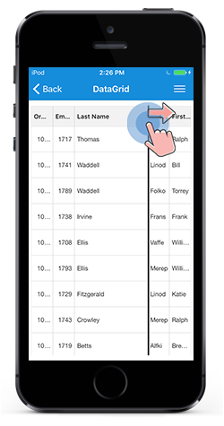

# Columns 

SfDatagrid allows you to create and add Columns in two ways:

* Automatic Columns generation based on the underlying collection.
* Manually defining columns in XAML or C#.

## Automatic Columns Generation

The SfDatagrid creates columns automatically based on the property [SfDataGrid.AutoGenerateColumns](http://help.syncfusion.com/cr/cref_files/xamarin/sfdatagrid/Syncfusion.SfDataGrid.XForms~Syncfusion.SfDataGrid.XForms.SfDataGrid~AutoGenerateColumns.html). It is a bindable property and it decides columns generation for SfDatagrid based on the [SfDataGrid.AutoGenerateColumnsMode](http://help.syncfusion.com/cr/cref_files/xamarin/sfdatagrid/Syncfusion.SfDataGrid.XForms~Syncfusion.SfDataGrid.XForms.SfDataGrid~AutoGenerateColumnsMode.html) property. 

`SfDatagrid.AutoGenerateColumnsMode` decides a way to create columns when `SfDatagrid.AutoGenerateColumns` is set to `true`. This enum type has the following four options.

* None: Stores only the columns that are defined in [SfDataGrid.Columns](http://help.syncfusion.com/cr/cref_files/xamarin/sfdatagrid/Syncfusion.SfDataGrid.XForms~Syncfusion.SfDataGrid.XForms.SfDataGrid~Columns.html) collection.
* Reset: Retains the columns defined explicitly in application level and creates columns newly for all the other properties in a data source.
* ResetAll: When changing the [ItemsSource](http://help.syncfusion.com/cr/cref_files/xamarin/sfdatagrid/Syncfusion.SfDataGrid.XForms~Syncfusion.SfDataGrid.XForms.SfDataGrid~ItemsSource.html), the columns for previous data are cleared and it creates new columns. Even when columns are explicitly defined it does not consider the defined columns and creates column based on the underlying collection.
* RetainOld: Creates columns for all fields in a data source when the Grid does not have any explicit definition for columns. When columns are defined explicitly, then the defined columns alone are retained and new columns are not created.
* SmartReset: Retains the columns defined explicitly in application level and the columns with `MappingName` identical to properties in a data source. Creates columns newly for all the other properties in the data source.

The default value of `SfDatagrid.AutoGenerateColumns` property is `true` and `SfDatagrid.AutoGenerateColumnsMode` is `Reset`. Hence by default SfDatagrid creates columns automatically for every non-explicitly defined public property in the underlying collection bound to its `ItemsSource` property.

N> When you change items source for SfDatagrid during run time, then the columns are generated on the basis of option set for `SfDataGrid.AutoGenerateColumnsMode`.

### Customize Automatically Generated Columns

When `SfDatagrid.AutoGenerateColumns` is `true`, then [SfDataGrid.AutoGeneratingColumn](http://help.syncfusion.com/cr/cref_files/xamarin/sfdatagrid/Syncfusion.SfDataGrid.XForms~Syncfusion.SfDataGrid.XForms.SfDataGrid~AutoGeneratingColumn_EV.html) event is raised for each GridColumn. This event receives two arguments namely sender which is the SfDatagrid and [AutoGeneratingColumnArgs](http://help.syncfusion.com/cr/cref_files/xamarin/sfdatagrid/Syncfusion.SfDataGrid.XForms~Syncfusion.SfDataGrid.XForms.AutoGeneratingColumnArgs.html).
The `AutoGeneratingColumnArgs` object contains the following property:

* Column: This property returns the created column using which you can customize the column.
* Cancel: This property cancels the column creation.

You can skip generating a column by handling the `SfDataGrid.AutoGeneratingColumn` event as shown below.


dataGrid.AutoGeneratingColumn += GridAutoGeneratingColumns; 

void GridAutoGeneratingColumns(object sender, AutoGeneratingColumnArgs e)
{
    if (e.Column.MappingName == "EmployeeID")
        e.Cancel = true;
}


You can also apply formatting for auto generated columns as shown below.


void GridAutoGeneratingColumns(object sender, AutoGeneratingColumnArgs e)
{
    if (e.Column.MappingName == "Freight") {
        e.Column.Format = "C";
        e.Column.CultureInfo = new CultureInfo ("en-US");
    } else if (e.Column.MappingName == "ShippingDate")
        e.Column.Format = "dd/MM/yyyy";
} 


You can also customize a column’s header text, sorting, alignment, padding, etc. by handling the `SfDataGrid.AutoGeneratingEvent`.

## Manually generate Columns

SfDatagrid also allows you to define the columns manually by adding the GridColumn objects to the `SfDatagrid.Columns` collection. In case if you want only the manually defined columns to be in view, then you can achieve it by setting the `SfDatagrid.AutoGenerateColumns` property to `false`. There are different types of columns available in SfDatagrid and you can create any column based on your requirements from both XAML and code.
 
The following code example illustrates about creating columns manually in SfDatagrid



<syncfusion:SfDataGrid x:Name="dataGrid"
            ColumnSizer="Star"
            AutoGenerateColumns="False"
            ItemsSource="{Binding OrderInfoCollection}">

    <syncfusion:SfDataGrid.Columns x:TypeArguments="syncfusion:Columns">
        <syncfusion:GridTextColumn HeaderText="Order ID" 
                                   MappingName="OrderID" />
        <syncfusion:GridTextColumn HeaderText="Customer ID"
                                   MappingName="CustomerID" />
        <syncfusion:GridTextColumn MappingName="Customer" />
        <syncfusion:GridTextColumn HeaderText="Ship Country"
                                   MappingName="ShipCountry" />
    </syncfusion:SfDataGrid.Columns>
</syncfusion:SfDataGrid>



dataGrid.AutoGenerateColumns = false;

GridTextColumn orderIdColumn = new GridTextColumn ();
orderIdColumn.MappingName = "OrderID";
orderIdColumn.HeaderText = "Order ID";

GridTextColumn customerIdColumn = new GridTextColumn ();
customerIdColumn.MappingName = "CustomerID";
customerIdColumn.HeaderText = "Customer ID";

GridTextColumn customerColumn = new GridTextColumn ();
customerColumn.MappingName = "Customer";

GridTextColumn countryColumn = new GridTextColumn ();
countryColumn.MappingName = "ShipCountry";
countryColumn.HeaderText = "Ship Country";

dataGrid.Columns.Add (orderIdColumn);
dataGrid.Columns.Add (customerIdColumn);
dataGrid.Columns.Add (customerColumn);
dataGrid.Columns.Add (countryColumn); 




## Resizing Columns
SfDataGrid allows to resize the columns by tapping and dragging the right border of the column headers. Resizing can be enabled or disabled by setting [SfDataGrid.AllowResizingColumn](https://help.syncfusion.com/cr/cref_files/xamarin/sfdatagrid/Syncfusion.SfDataGrid.XForms~Syncfusion.SfDataGrid.XForms.SfDataGrid~AllowResizingColumn.html) property. A resizing indicator is displayed while resizing a column.

N> Resizing considers [GridColumn.MinimumWidth](https://help.syncfusion.com/cr/cref_files/xamarin/sfdatagrid/Syncfusion.SfDataGrid.XForms~Syncfusion.SfDataGrid.XForms.GridColumn~MinimumWidth.html) and [GridColumn.MaximumWidth](https://help.syncfusion.com/cr/cref_files/xamarin/sfdatagrid/Syncfusion.SfDataGrid.XForms~Syncfusion.SfDataGrid.XForms.GridColumn~MaximumWidth.html) of the column and will not resize past the mininum and maximum width constraints.



<syncfusion:SfDataGrid  x:Name="dataGrid"
                        AllowResizingColumns="True"
                        AutoGenerateColumns="True"
                        ItemsSource="{Binding Orders}" />


dataGrid.AllowResizingColumn = true;



You can change the column width by tapping and dragging the resizing indicator.

N> The resizing indicator appears when you tap the right corner of the column header.

You can interactively hide a column by setting the `GridColumn.MinimumWidth` property to zero and resizing the column to a wdith less than 0.

### Resizing Events

The resizing operation can be handled based on the requirement using [SfDataGrid.ColumnResizing](https://help.syncfusion.com/cr/cref_files/xamarin/sfdatagrid/Syncfusion.SfDataGrid.XForms~Syncfusion.SfDataGrid.XForms.SfDataGrid~ColumnResizing_EV.html) event. The `SfDataGrid.ColumnResizing` event is fired upon starting to resize a column and will be continuously fired till the reisizing operation ends.
By handling the `SfDataGrid.ColumnResizing` event you can also cancel the resizing of a particular column.
The `SfDataGrid.ColumnResizing` event provides the following properties through [GridResizingEventArgs](https://help.syncfusion.com/cr/cref_files/xamarin/sfdatagrid/Syncfusion.SfDataGrid.XForms~Syncfusion.SfDataGrid.XForms.GridResizingEventArgs.html).

* Index - Returns the index of the column currently being resized.
* NewValue - Returns the current width of the column being resized.
* ResizingState - Returns the current state of the user-interaction through a value from the ProgressStates enum.
* [Cancel](https://msdn.microsoft.com/query/dev10.query?appId=Dev10IDEF1&l=EN-US&k=k(System.ComponentModel.CancelEventArgs.Cancel)&rd=true) - A Boolean property to cancel the event and the resizing operation. 

### How To

#### Cancel resizing for a column

You can cancel resizing for a particular column using the `SfDataGrid.ColumnResizing` event. The below code example shows how to cancel resizing for a column using the `SfDataGrid.ColumnResizing` event. 


    this.dataGrid.ResizingColumns += dataGrid_ResizingColumns;
    private void DataGrid_ColumnResizing(object sender, GridResizingEventArgs e)
        {
            //Code to end resizing if ColumnIndex is 2 or Column's Width is >= 100 or if interaction state is Progressing
            if (e.Index == 2 || e.NewValue >= 100 || e.ResizingState = ProgressStates.Progressing)
                e.Cancel = true;
        }

