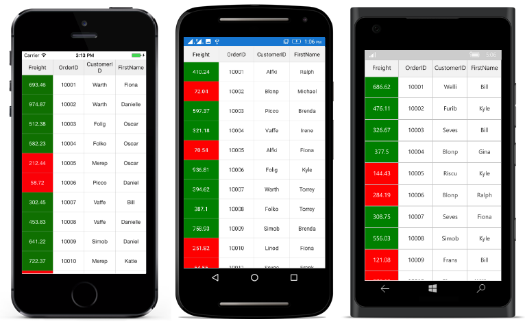

# Conditional Styles

SfDatagrid allows you to apply cell styles for a [GridColumn](http://help.syncfusion.com/cr/cref_files/xamarin/sfdatagrid/Syncfusion.SfDataGrid.XForms~Syncfusion.SfDataGrid.XForms.GridColumn.html) that is used to render the cells in that column. When applied cell style the [GridCell](http://help.syncfusion.com/cr/cref_files/xamarin/sfdatagrid/Syncfusion.SfDataGrid.XForms~Syncfusion.SfDataGrid.XForms.GridCell.html) appears in the custom style rather than the default one. The following code example shows you how to apply cell style for a GridColumn.


<syncfusion:SfDataGrid x:Name="dataGrid"
                       ItemsSource="{Binding OrdersInfo}">
    <syncfusion:SfDataGrid.Columns>
        <syncfusion:GridTextColumn MappingName="Freight" Format="C">
            <syncfusion:GridTextColumn.CellStyle>
                
            </syncfusion:GridTextColumn.CellStyle>
        </syncfusion:GridTextColumn>
    </syncfusion:SfDataGrid.Columns>
</syncfusion:SfDataGrid> 


SfDataGrid also allows you to apply styles for the `GridCell` in a column based on conditions by writing a converter for the property in `GridCell` for which conditional styles need to be applied.

The following code example shows you how to apply conditional styling for a column by writing converter in SfDataGrid.


<ContentPage xmlns="http://xamarin.com/schemas/2014/forms"
             xmlns:x="http://schemas.microsoft.com/winfx/2009/xaml"
             xmlns:syncfusion="clr-namespace:Syncfusion.SfDataGrid.XForms;assembly=Syncfusion.SfDataGrid.XForms"
             xmlns:local ="clr-namespace:DataGridSample;assembly=DataGridSample"
             x:Class="DataGridSample.Sample">

    <ContentPage.Resources>
        <ResourceDictionary>
            <local:CellStyleConverter x:Key="cellStyleConverter" />
        </ResourceDictionary>
    </ContentPage.Resources>

    <ContentPage.BindingContext>
        <local:ViewModel x:Name="viewModel" />
    </ContentPage.BindingContext>

    <syncfusion:SfDataGrid x:Name="dataGrid"
                           ItemsSource="{Binding OrdersInfo}">
        <syncfusion:SfDataGrid.Columns>
            <syncfusion:GridTextColumn MappingName="Freight" Format="C">
                <syncfusion:GridTextColumn.CellStyle>
                    
                </syncfusion:GridTextColumn.CellStyle>
            </syncfusion:GridTextColumn>
        </syncfusion:SfDataGrid.Columns>
    </syncfusion:SfDataGrid>
</ContentPage>  



public class CellStyleConverter : IValueConverter
{
    public object Convert(object value, Type targetType, object parameter, CultureInfo culture)
    {
        if (System.Convert.ToDouble(value) < 300)
            return Color.White;
        return Color.Green;
    }

    public object ConvertBack(object value, Type targetType, object parameter, CultureInfo culture)
    {
        return null;
    }
}


