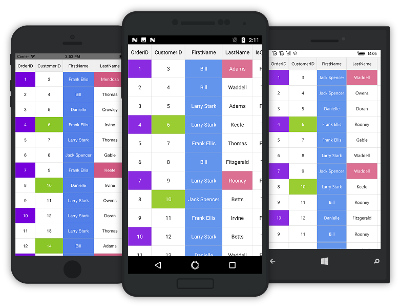
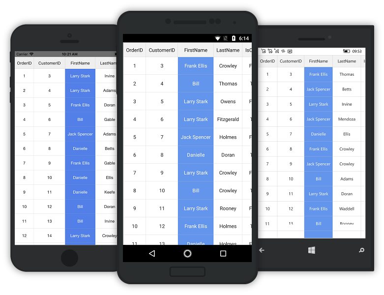
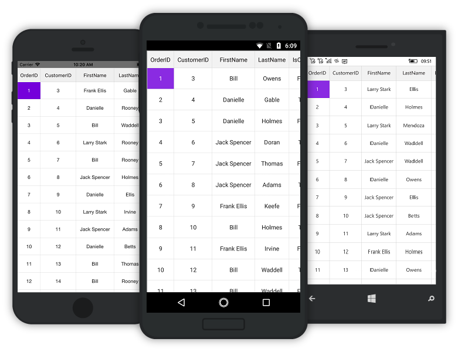
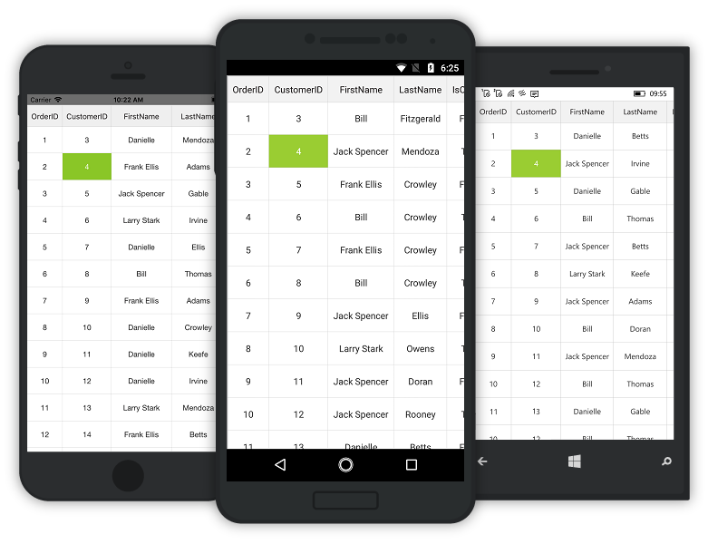
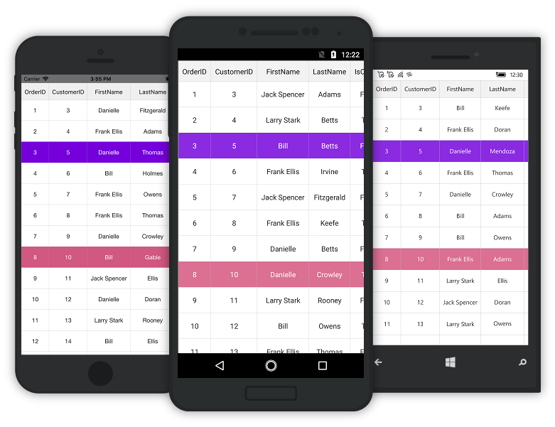
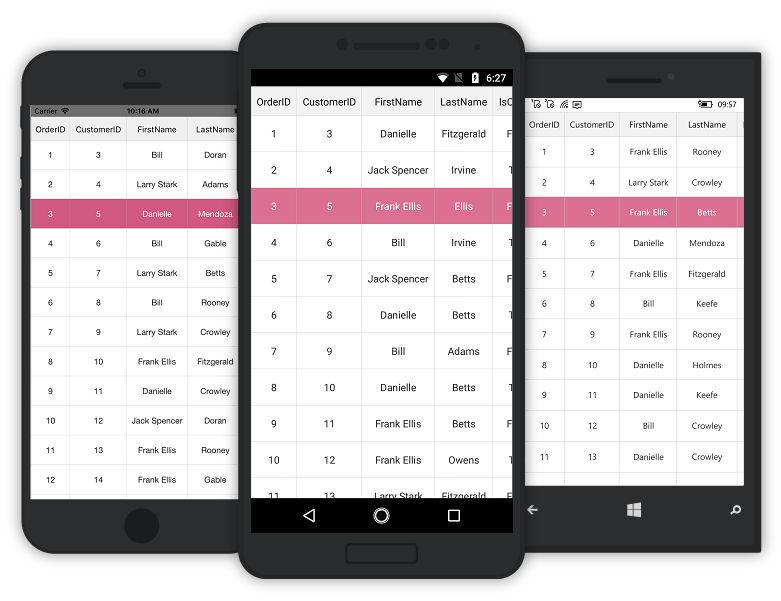
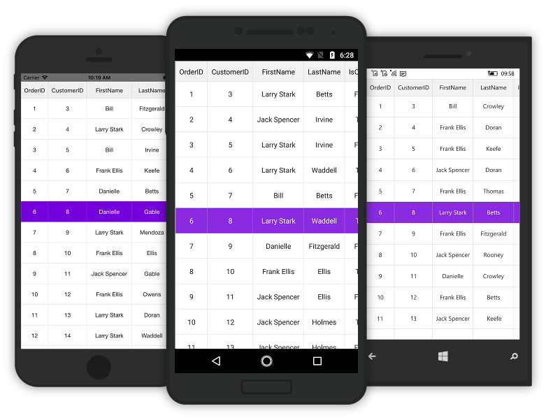
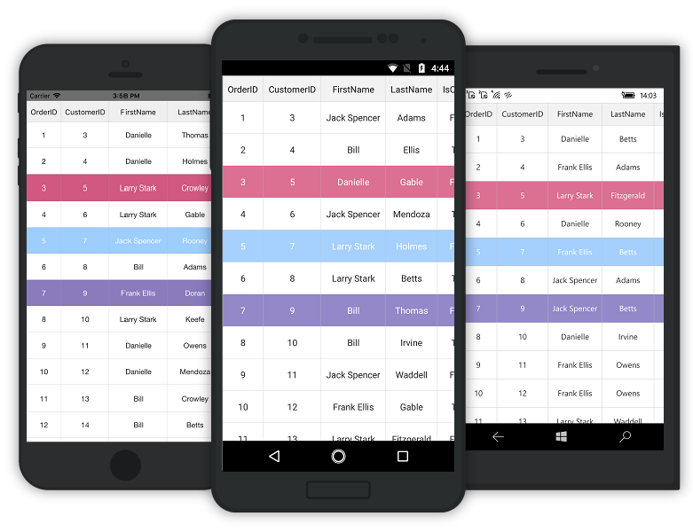

# Conditional Styles

SfDataGrid allows you to customize style of the individual cells and text of the SfDataGrid based on your requirement in the following ways. 

* Using Column CellStyle
* Using QueryCellStyle Event
* Using QueryRowStyle Event

## Styling Cells using Column CellStyle

SfDatagrid allows you to apply cell styles for a [GridColumn](http://help.syncfusion.com/cr/cref_files/xamarin/sfdatagrid/Syncfusion.SfDataGrid.XForms~Syncfusion.SfDataGrid.XForms.GridColumn.html) that is used to render the cells in that column. When applied cell style the [GridCell](http://help.syncfusion.com/cr/cref_files/xamarin/sfdatagrid/Syncfusion.SfDataGrid.XForms~Syncfusion.SfDataGrid.XForms.GridCell.html) appears in the custom style rather than the default one. The following code example shows you how to apply cell style for a GridColumn using [CellStyle](http://help.syncfusion.com/cr/cref_files/xamarin/sfdatagrid/Syncfusion.SfDataGrid.XForms~Syncfusion.SfDataGrid.XForms.GridColumn~CellStyle.html).


<syncfusion:SfDataGrid x:Name="dataGrid"
                       ItemsSource="{Binding OrdersInfo}">
    <syncfusion:SfDataGrid.Columns>
        <syncfusion:GridTextColumn MappingName="Freight" Format="C">
            <syncfusion:GridTextColumn.CellStyle>
                
            </syncfusion:GridTextColumn.CellStyle>
        </syncfusion:GridTextColumn>
    </syncfusion:SfDataGrid.Columns>
</syncfusion:SfDataGrid> 


## Styling Cells using Converter

SfDataGrid also allows you to apply styles for the `GridCell` in a column based on conditions by writing a converter for the property in `GridCell` for which conditional styles need to be applied.

The following code example shows you how to apply conditional styling for a column by writing converter in SfDataGrid.


<ContentPage xmlns="http://xamarin.com/schemas/2014/forms"
             xmlns:x="http://schemas.microsoft.com/winfx/2009/xaml"
             xmlns:syncfusion="clr-namespace:Syncfusion.SfDataGrid.XForms;assembly=Syncfusion.SfDataGrid.XForms"
             xmlns:local ="clr-namespace:DataGridSample;assembly=DataGridSample"
             x:Class="DataGridSample.Sample">

    <ContentPage.Resources>
        <ResourceDictionary>
            <local:CellStyleConverter x:Key="cellStyleConverter" />
        </ResourceDictionary>
    </ContentPage.Resources>

    <ContentPage.BindingContext>
        <local:ViewModel x:Name="viewModel" />
    </ContentPage.BindingContext>

    <syncfusion:SfDataGrid x:Name="dataGrid"
                           ItemsSource="{Binding OrdersInfo}">
        <syncfusion:SfDataGrid.Columns>
            <syncfusion:GridTextColumn MappingName="Freight" Format="C">
                <syncfusion:GridTextColumn.CellStyle>
                    
                </syncfusion:GridTextColumn.CellStyle>
            </syncfusion:GridTextColumn>
        </syncfusion:SfDataGrid.Columns>
    </syncfusion:SfDataGrid>
</ContentPage>  



public class CellStyleConverter : IValueConverter
{
    public object Convert(object value, Type targetType, object parameter, CultureInfo culture)
    {
        if (System.Convert.ToDouble(value) < 300)
            return Color.White;
        return Color.Green;
    }

    public object ConvertBack(object value, Type targetType, object parameter, CultureInfo culture)
    {
        return null;
    }
}


## Styling Cells using CellStyle Event

The Conditional style can be applied for any cell based on any condition by using the [QueryCellStyle](https://help.syncfusion.com/cr/cref_files/xamarin/sfdatagrid/Syncfusion.SfDataGrid.XForms~Syncfusion.SfDataGrid.XForms.SfDataGrid~QueryCellStyle_EV.html) event.This event will be fired for each row initially and provides the following properties through the [QueryCellStyleEventArgs](https://help.syncfusion.com/cr/cref_files/xamarin/sfdatagrid/Syncfusion.SfDataGrid.XForms~Syncfusion.SfDataGrid.XForms.QueryCellStyleEventArgs.html) in its EventHandler.
  
* [RowIndex](https://help.syncfusion.com/cr/cref_files/xamarin/sfdatagrid/Syncfusion.SfDataGrid.XForms~Syncfusion.SfDataGrid.XForms.QueryConditionalStyleEventArgs~RowIndex.html) - Provides the row index of current cell in iteration 
* [ColumnIndex](https://help.syncfusion.com/cr/cref_files/xamarin/sfdatagrid/Syncfusion.SfDataGrid.XForms~Syncfusion.SfDataGrid.XForms.QueryCellStyleEventArgs~ColumnIndex.html) - Provides the column index of current cell in iteration 
* [CellValue](https://help.syncfusion.com/cr/cref_files/xamarin/sfdatagrid/Syncfusion.SfDataGrid.XForms~Syncfusion.SfDataGrid.XForms.QueryCellStyleEventArgs~CellValue.html) - Provides the cell value of current cell in iteration
* [Column](https://help.syncfusion.com/cr/cref_files/xamarin/sfdatagrid/Syncfusion.SfDataGrid.XForms~Syncfusion.SfDataGrid.XForms.QueryCellStyleEventArgs~Column.html) - Provides the column which belogs to current cell in iteration 
* [e.Handled](https://help.syncfusion.com/cr/cref_files/xamarin/sfdatagrid/Syncfusion.SfDataGrid.XForms~Syncfusion.SfDataGrid.XForms.GridHandledEventArgs~Handled.html) - Should be set to true to apply the changes
* [Style](https://help.syncfusion.com/cr/cref_files/xamarin/sfdatagrid/Syncfusion.SfDataGrid.XForms~Syncfusion.SfDataGrid.XForms.QueryCellStyleEventArgs~Style.html) - Sets style to the current cell in iteration
 

this.dataGrid.QueryCellStyle += DataGrid_QueryCellStyle;
private void DataGrid_QueryCellStyle(object sender, QueryCellStyleEventArgs e)
{
    if (e.ColumnIndex == 0 && e.RowIndex % 3 == 1)
    {
        e.Style.BackgroundColor = Color.BlueViolet;
        e.Style.ForegroundColor = Color.White;

    }
    else if (e.Column.MappingName == "FirstName")
    {
        e.Style.BackgroundColor = Color.CornflowerBlue;
        e.Style.ForegroundColor = Color.White;
    }
    else if (e.ColumnIndex == 1 && e.RowIndex % 4 == 0)
    {
        e.Style.BackgroundColor = Color.YellowGreen;
        e.Style.ForegroundColor = Color.White;
    }
    else if (e.ColumnIndex == 3 && e.RowIndex % 6 == 1)
    {
        e.Style.BackgroundColor = Color.PaleVioletRed;
        e.Style.ForegroundColor = Color.White;
    }
    e.Handled = true;
}


## How to style a particular column

User can apply style to a paticular column based on the properties of the `Column` provided in the `QueryCellStyleEventArgs` of the `QueryCellStyle` event



private void DataGrid_QueryCellStyle(object sender, QueryCellStyleEventArgs e)
{
    if (e.Column.MappingName == "FirstName")
    {
        e.Style.BackgroundColor = Color.CornflowerBlue;
        e.Style.ForegroundColor = Color.White;
    }
    e.Handled = true;
}



## How to style a particular cell based on RowIndex and ColumnIndex
 
Styling can be applied to a particular cell based on the property `RowIndex` and `ColumnIndex` in `QueryCellStyleEventArgs` of the `QueryCellStyle` event



private void DataGrid_QueryCellStyle(object sender, QueryCellStyleEventArgs e)
{
    if (e.ColumnIndex == 0 && e.RowIndex == 1)
    {
        e.Style.BackgroundColor = Color.BlueViolet;
        e.Style.ForegroundColor = Color.White;
    }
    e.Handled = true;
}



## How to style a particular cell based on CellValue

Styling can be applied to a particular cell based on the property `CellValue` in `QueryCellStyleEventArgs` of the `QueryCellStyle` event



private void DataGrid_QueryCellStyle(object sender, QueryCellStyleEventArgs e)
{
    if (e.ColumnIndex == 1 && e.CellValue.ToString() == "4")
    {
        e.Style.BackgroundColor = Color.YellowGreen;
        e.Style.ForegroundColor = Color.White;
    }
    e.Handled = true;
}


## Styling Cells using RowStyle Event

The Conditional style can be applied for an entire row based on any condition by using [QueryRowStyle](https://help.syncfusion.com/cr/cref_files/xamarin/sfdatagrid/Syncfusion.SfDataGrid.XForms~Syncfusion.SfDataGrid.XForms.SfDataGrid~QueryRowStyle_EV.html) event,this event will be fired for each row initaially and provides the following properties through the [QueryRowStyleEventArgs](https://help.syncfusion.com/cr/cref_files/xamarin/sfdatagrid/Syncfusion.SfDataGrid.XForms~Syncfusion.SfDataGrid.XForms.QueryRowStyleEventArgs.html) in its EventHandler.

* `RowData` - Provides the row data of current row in iteration
* `RowIndex` - Provides the row index of current row in iteration
* `e.Handled` - Should be set to true to apply the changes
* `Style` - Sets style to the current row in iteration


this.dataGrid.QueryCellStyle += DataGrid_QueryCellStyle;
private void DataGrid_QueryRowStyle(object sender, QueryRowStyleEventArgs e)
{
    if (e.RowIndex == 3)
    {
        e.Style.ForegroundColor = Color.White;
        e.Style.BackgroundColor = Color.BlueViolet;
    }
    else if (e.RowData  == viewModel.OrdersInfo[7])
    {
        e.Style.ForegroundColor = Color.White;
        e.Style.BackgroundColor = Color.PaleVioletRed;
    }
    e.Handled = true;
}


## How to style a particular row based on RowIndex

Styling can be applied to a particular row Based on the property `RowIndex` in `QueryRowStyleEventArgs` of the `QueryRowStyle` event


private void DataGrid_QueryRowStyle(object sender, QueryRowStyleEventArgs e)
{
    if (e.RowIndex == 3)
    {
        e.Style.ForegroundColor = Color.White;
        e.Style.BackgroundColor = Color.PaleVioletRed;
    }
    e.Handled = true;
}



## How to style a particular row based on RowData

Styling can be applied to a particular row based on the property `RowData` in `QueryRowStyleEventArgs` of the `QueryRowStyle` event



private void DataGrid_QueryRowStyle(object sender, QueryRowStyleEventArgs e)
{
    if (e.RowData == viewModel.OrdersInfo[5])
    {
        e.Style.ForegroundColor = Color.White;
        e.Style.BackgroundColor = Color.BlueViolet;
    }
    e.Handled = true;
}



N> By default only the selection backgroud color will be applied for the selected row even if row style is applied for that row. if in case you might want to apply the selection color over the row style upon selection, set the Conditional stylingpreference property to StylePreference.RowStyleAndSelection


private void DataGrid_QueryRowStyle(object sender, QueryRowStyleEventArgs e)
{
    if (e.RowIndex == 3 || e.RowIndex == 7)
    {
        e.Style.ForegroundColor = Color.White;
        e.Style.BackgroundColor = Color.PaleVioletRed;
    }
    // Set the below code to display only selection
    //e.Style.ConditionalStylingPreference = StylePreference.Selection;
    e.Style.ConditionalStylingPreference = StylePreference.RowStyleAndSelection;
    e.Handled = true;
}


