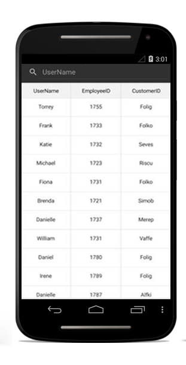
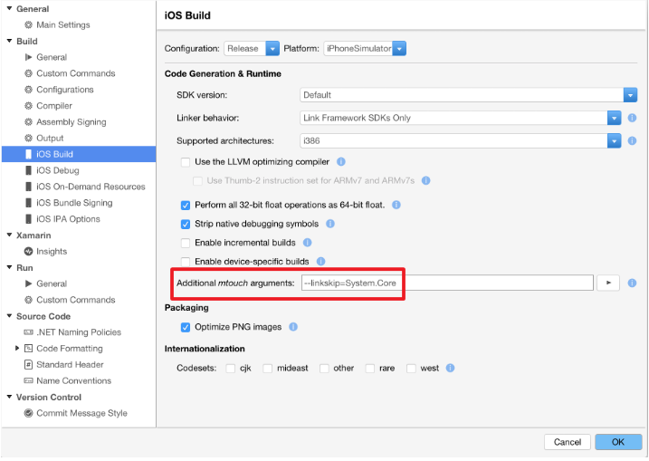

# Getting Started

This section provides a quick overview for working with SfDataGrid for Xamarin.Forms. You will walk through the entire process of creating a real world SfDataGrid.

## Assembly deployment

After installing Essential Studio for Xamarin, you can find all the required assemblies in the installation folders,

{Syncfusion Essential Studio Installed location}\Essential Studio\{{ site.releaseversion }}\Xamarin\lib

Eg: C:\Program Files (x86)\Syncfusion\Essential Studio\{{ site.releaseversion }}\Xamarin\lib

N> Assemblies can be found in unzipped package location in Mac

### SfDataGrid for Xamarin.Forms

The following list of assemblies need to be added as reference from the lib folder to use SfDataGrid in your application.

<table>
<tr>
<th>Project</th>
<th>Required assemblies</th>
</tr>
<tr>
<td>PCL</td>
<td>pcl\Syncfusion.Core.XForms.dll pcl\Syncfusion.Data.Portable.dll pcl\Syncfusion.GridCommon.Portable.dll pcl\Syncfusion.SfDataGrid.XForms.dll Syncfusion.SfNumericTextBox.XForms.dll </td>
</tr>
<tr>
<td>Android Renderer</td>
<td>pcl\Syncfusion.Data.Portable.dll pcl\Syncfusion.GridCommon.Portable.dll pcl\Syncfusion.SfDataGrid.XForms.dll android\Syncfusion.SfDataGrid.XForms.Android.dll Syncfusion.SfNumericTextBox.Android.dll Syncfusion.SfNumericTextBox.XForms.Android.dll Syncfusion.SfNumericTextBox.XForms.dll </td>
</tr>
<tr>
<td>iOS Renderer</td>
<td>pcl\Syncfusion.Data.Portable.dll pcl\Syncfusion.GridCommon.Portable.dll pcl\Syncfusion.SfDataGrid.XForms.dll ios-unified\Syncfusion.SfDataGrid.XForms.iOS.dll Syncfusion.SfNumericTextBox.iOS.dll Syncfusion.SfNumericTextBox.XForms.iOS.dll Syncfusion.SfNumericTextBox.XForms.dll </td>
</tr>
<tr>
<td>UWP Renderer</td>
<td>pcl\Syncfusion.Data.Portable.dll pcl\Syncfusion.GridCommon.Portable.dll pcl\Syncfusion.SfDataGrid.XForms.dll uwp\Syncfusion.SfDataGrid.XForms.UWP.dll Syncfusion.SfInput.UWP.dll Syncfusion.SfShared.UWP.dll Syncfusion.SfNumericTextBox.XForms.UWP.dll Syncfusion.SfNumericTextBox.XForms.dll </td>
</tr>
</table>

In order to use export to excel and export to PDF functionalities of SfDataGrid, add the below assembly to your pcl project.

<table>
<tr>
<th>Project</th>
<th>Required assemblies</th>
</tr>
<tr>
<td>PCL</td>
<td>pcl\Syncfusion.SfGridConverter.XForms.dll pcl\Syncfusion.Compression.Portable.dll pcl\Syncfusion.Pdf.Portable.dll pcl\Syncfusion.XlsIO.Portable.dll </td>
</tr>
</table>

N> When there is a mismatch of Xamarin NuGet packages between your sample and SfDataGrid assemblies, an error `Could not load type Xamarin.Forms.ElementTemplate` will occur. Please refer the `ReadMe` to know the software requirements of Syncfusion controls.

N> When there is a mismatch between Syncfusion NuGet packages among your projects, `System.IO.FileLoadException` will occur. To overcome this exception, install the same version of SfDataGrid assemblies in all your projects. 

## Launching the SfDataGrid on each platform

To use SfDataGrid inside an application, each platform application must initialize the SfDataGrid renderer. This initialization step varies from platform to platform and is discussed in the following sections.

### Android

The Android launches the SfDataGrid without any initialization and is enough to only initialize the Xamarin.Forms Framework to launch the application.

### iOS

To launch the SfDataGrid in iOS, you need to call the `SfDataGridRenderer.Init()` in the `FinishedLaunching` overridden method of the AppDelegate class after the Xamarin.Forms Framework initialization and before the LoadApplication is called, as demonstrated in the following code example:


public override bool FinishedLaunching(UIApplication app, NSDictionary options)
{
    …
    global::Xamarin.Forms.Forms.Init ();
    SfDataGridRenderer.Init();
    LoadApplication (new App ());
    …
}
 

### Universal Windows Platform (UWP)

To launch the SfDataGrid in UWP, you need to call the `SfDataGridRenderer.Init()` in the `MainPage` constructor before the LoadApplication is called, as demonstrated in the following code example:


public MainPage()
{
    …
    SfDataGridRenderer.Init();
    LoadApplication (new App ());
    …
}


### ReleaseMode issue in UWP platform

There is a known Framework issue in UWP platform. The custom controls will not render when deployed the application in `Release Mode`.

The above problem can be resolved by initializing the SfDataGrid assemblies in `App.xaml.cs` in UWP project as like in below code snippet.


// In App.xaml.cs

protected override void OnLaunched(LaunchActivatedEventArgs e)
{
    …

    rootFrame.NavigationFailed += OnNavigationFailed;
        
    // you'll need to add `using System.Reflection;`
    List<Assembly> assembliesToInclude = new List<Assembly>();

    //Now, add all the assemblies your app uses
    assembliesToInclude.Add(typeof(SfDataGridRenderer).GetTypeInfo().Assembly);

    // replaces Xamarin.Forms.Forms.Init(e);        
    Xamarin.Forms.Forms.Init(e, assembliesToInclude);
        
    …     
}


## Create a simple SfDataGrid 

This section explains how to create a SfDataGrid and configure it. The SfDataGrid control can be configured entirely in C# code or by using XAML markup. This is how the final output will look like on iOS, Android and Windows Phone devices.
 

You can download the entire source code of this demo for Xamarin.Forms from [here](http://www.syncfusion.com/downloads/support/directtrac/general/ze/GettingStarted-1703822847).

In this walk through, you will create a new application that contains the SfDataGrid which includes the below topics.

* [Creating the project](#creating-the-project) 
* [Adding SfDataGrid in Xamarin.Forms](#adding-sfdatagrid-in-xamarinforms)     
* [Create data model](#create-datamodel-for-the-sfdatagrid)  
* [Binding data](#binding-data-to-sfdatagrid) 
* [Defining columns](#defining-columns) 
* [Sorting](#sorting) 
* [Grouping](#grouping) 
* [Selection](#selection)

## Creating the project

Create a new BlankApp (Xamarin.Forms.Portable) application in Xamarin Studio or Visual Studio for Xamarin.Forms.

## Adding SfDataGrid in Xamarin.Forms 

1. Add the required assembly references to the pcl and renderer projects as discussed in the [Assembly deployment](#assembly-deployment) section.

2. Import SfDataGrid control namespace as `xmlns:syncfusion="clr-namespace:Syncfusion.SfDataGrid.XForms;assembly=Syncfusion.SfDataGrid.XForms` in XAML Page.

3. Set the SfDataGrid control as content to the ContentPage.



<?xml version="1.0" encoding="utf-8" ?>
<ContentPage xmlns="http://xamarin.com/schemas/2014/forms"
             xmlns:x="http://schemas.microsoft.com/winfx/2009/xaml"
             xmlns:local="clr-namespace:GettingStarted;assembly=GettingStarted"
             xmlns:syncfusion="clr-namespace:Syncfusion.SfDataGrid.XForms;assembly=Syncfusion.SfDataGrid.XForms" 
             x:Class="GettingStarted.Sample">

    <ContentPage.Content>
        <syncfusion:SfDataGrid x:Name="dataGrid" />
    </ContentPage.Content>
</ContentPage> 


using Syncfusion.SfDataGrid.XForms;
using Xamarin.Forms;

namespace GettingStarted
{
    public class App : Application
    {
        SfDataGrid dataGrid;
        public App()
        {
            dataGrid = new SfDataGrid();
            MainPage = new ContentPage { Content = dataGrid };
        }
    }
} 



## Create DataModel for the SfDataGrid

SfDataGrid is a data-bound control. Hence you must create a data model to bind it to the control. 

Create a simple data source as shown in the following code example in a new class file and save it as OrderInfo.cs file. 


public class OrderInfo
{
    private int orderID;
    private string customerID;
    private string customer;
    private string shipCity;
    private string shipCountry;

    public int OrderID {
        get { return orderID; }
        set { this.orderID = value; }
    }

    public string CustomerID {
        get { return customerID; }
        set { this.customerID = value; }
    }

    public string ShipCountry {
        get { return shipCountry; }
        set { this.shipCountry = value; }
    }

    public string Customer {
        get { return this.customer; }
        set { this.customer = value; }
    }

    public string ShipCity {
        get { return shipCity; }
        set { this.shipCity = value; }
    }

    public OrderInfo (int orderId, string customerId, string country, string customer, string shipCity)
    {
        this.OrderID = orderId;
        this.CustomerID = customerId;
        this.Customer = customer;
        this.ShipCountry = country;
        this.ShipCity = shipCity;
    }
} 


N> If you want your data model to respond to property changes, then implement `INotifyPropertyChanged` interface in your model class

Create a model repository class with OrderInfo collection property initialized with required number of data objects in a new class file as shown in the following code example and save it as OrderInfoRepository.cs file.


public class OrderInfoRepository
{
    private ObservableCollection<OrderInfo> orderInfo;
    public ObservableCollection<OrderInfo> OrderInfoCollection {
        get { return orderInfo; }
        set { this.orderInfo = value; }
    }

    public OrderInfoRepository ()
    {
        orderInfo = new ObservableCollection<OrderInfo> ();
        this.GenerateOrders ();
    }

    private void GenerateOrders ()
    {
        orderInfo.Add (new OrderInfo (1001, "Maria Anders", "Germany", "ALFKI", "Berlin"));
        orderInfo.Add (new OrderInfo (1002, "Ana Trujillo", "Mexico", "ANATR", "Mexico D.F."));
        orderInfo.Add (new OrderInfo (1003, "Ant Fuller", "Mexico", "ANTON", "Mexico D.F."));
        orderInfo.Add (new OrderInfo (1004, "Thomas Hardy", "UK", "AROUT", "London"));
        orderInfo.Add (new OrderInfo (1005, "Tim Adams", "Sweden", "BERGS", "London"));
        orderInfo.Add (new OrderInfo (1006, "Hanna Moos", "Germany", "BLAUS", "Mannheim"));
        orderInfo.Add (new OrderInfo (1007, "Andrew Fuller", "France", "BLONP", "Strasbourg"));
        orderInfo.Add (new OrderInfo (1008, "Martin King", "Spain", "BOLID", "Madrid"));
        orderInfo.Add (new OrderInfo (1009, "Lenny Lin", "France", "BONAP", "Marsiella"));
        orderInfo.Add (new OrderInfo (1010, "John Carter", "Canada", "BOTTM", "Lenny Lin"));
        orderInfo.Add (new OrderInfo (1011, "Laura King", "UK", "AROUT", "London"));
        orderInfo.Add (new OrderInfo (1012, "Anne Wilson", "Germany", "BLAUS", "Mannheim"));
        orderInfo.Add (new OrderInfo (1013, "Martin King", "France", "BLONP", "Strasbourg"));
        orderInfo.Add (new OrderInfo (1014, "Gina Irene", "UK", "AROUT", "London"));
    }
}


## Binding data to SfDataGrid

In order to bind the data source of the SfDataGrid, set the [SfDataGrid.ItemsSource](http://help.syncfusion.com/cr/cref_files/xamarin/sfdatagrid/Syncfusion.SfDataGrid.XForms~Syncfusion.SfDataGrid.XForms.SfDataGrid~ItemsSource.html) property as shown below. You can bind the data source of the SfDataGrid either from XAML or in code. 

The following code example binds the collection created in previous step to `SfDataGrid.ItemsSource` property.



<?xml version="1.0" encoding="utf-8" ?>
<ContentPage xmlns="http://xamarin.com/schemas/2014/forms"
             xmlns:x="http://schemas.microsoft.com/winfx/2009/xaml"
             xmlns:local="clr-namespace:GettingStarted;assembly=GettingStarted"
             xmlns:syncfusion="clr-namespace:Syncfusion.SfDataGrid.XForms;assembly=Syncfusion.SfDataGrid.XForms" 
             x:Class="GettingStarted.Sample">

    <ContentPage.BindingContext>
        <local:OrderInfoRepository x:Name="viewModel" />
    </ContentPage.BindingContext>

    <ContentPage.Content>
        <syncfusion:SfDataGrid x:Name="dataGrid"
                               ItemsSource="{Binding OrderInfoCollection}">
        </syncfusion:SfDataGrid>
    </ContentPage.Content>
</ContentPage> 


OrderInfoRepository viewModel = new OrderInfoRepository ();
dataGrid.ItemsSource = viewModel.OrderInfoCollection; 



Now run the application to render the following output.

## Defining Columns

By default, the SfDataGrid automatically creates columns for all the properties in the data source. The type of the column generated depends on the type of data in the column. When the columns are auto-generated, you can handle the [SfDataGrid.AutoGeneratingColumn](http://help.syncfusion.com/cr/cref_files/xamarin/sfdatagrid/Syncfusion.SfDataGrid.XForms~Syncfusion.SfDataGrid.XForms.SfDataGrid~AutoGeneratingColumn_EV.html) event to customize or cancel the columns before they are added to the Columns collection in SfDataGrid.
 
You can also define the columns manually by setting the [SfDataGrid.AutoGenerateColumns](http://help.syncfusion.com/cr/cref_files/xamarin/sfdatagrid/Syncfusion.SfDataGrid.XForms~Syncfusion.SfDataGrid.XForms.SfDataGrid~AutoGenerateColumns.html) property to false and by adding the [GridColumn](http://help.syncfusion.com/cr/cref_files/xamarin/sfdatagrid/Syncfusion.SfDataGrid.XForms~Syncfusion.SfDataGrid.XForms.GridColumn.html) objects to the [SfDataGrid.Columns](http://help.syncfusion.com/cr/cref_files/xamarin/sfdatagrid/Syncfusion.SfDataGrid.XForms~Syncfusion.SfDataGrid.XForms.SfDataGrid~Columns.html) collection. It can be done from both XAML and code. The following code example illustrates this. 



<syncfusion:SfDataGrid x:Name="dataGrid"
            ColumnSizer="Star"
            AutoGenerateColumns="False"
            ItemsSource="{Binding OrderInfoCollection}">

    <syncfusion:SfDataGrid.Columns x:TypeArguments="syncfusion:Columns">
        <syncfusion:GridTextColumn HeaderText="Order ID" 
                                   MappingName="OrderID" />
        <syncfusion:GridTextColumn HeaderText="Customer ID"
                                   MappingName="CustomerID" />
        <syncfusion:GridTextColumn MappingName="Customer" />
        <syncfusion:GridTextColumn HeaderText="Ship Country"
                                   MappingName="ShipCountry" />
    </syncfusion:SfDataGrid.Columns>
</syncfusion:SfDataGrid>


dataGrid.AutoGenerateColumns = false;

GridTextColumn orderIdColumn = new GridTextColumn ();
orderIdColumn.MappingName = "OrderID";
orderIdColumn.HeaderText = "Order ID";

GridTextColumn customerIdColumn = new GridTextColumn ();
customerIdColumn.MappingName = "CustomerID";
customerIdColumn.HeaderText = "Customer ID";

GridTextColumn customerColumn = new GridTextColumn ();
customerColumn.MappingName = "Customer";
customerColumn.HeaderText = "Customer";

GridTextColumn countryColumn = new GridTextColumn ();
countryColumn.MappingName = "ShipCountry";
countryColumn.HeaderText = "Ship Country";

dataGrid.Columns.Add (orderIdColumn);
dataGrid.Columns.Add (customerIdColumn);
dataGrid.Columns.Add (customerColumn);
dataGrid.Columns.Add (countryColumn); 



## Sorting

SfDataGrid allows you to apply sorting on its data by setting the [SfDataGrid.AllowSorting](http://help.syncfusion.com/cr/cref_files/xamarin/sfdatagrid/Syncfusion.SfDataGrid.XForms~Syncfusion.SfDataGrid.XForms.SfDataGrid~AllowSorting.html) property to true.
 


<syncfusion:SfDataGrid AllowSorting="True" />


dataGrid.AllowSorting = true; 



Run the application and touch the header cell to sort the data and the following output will be displayed.
 

You can also configure sorting by adding the column to the [SfDataGrid.SortColumnDescriptions](http://help.syncfusion.com/cr/cref_files/xamarin/sfdatagrid/Syncfusion.SfDataGrid.XForms~Syncfusion.SfDataGrid.XForms.SfDataGrid~SortColumnDescriptions.html) collection as below.



<syncfusion:SfDataGrid.SortColumnDescriptions>
    <syncfusion:SortColumnDescription ColumnName="CustomerID" />
</syncfusion:SfDataGrid.SortColumnDescriptions> 


dataGrid.SortColumnDescriptions.Add (new SortColumnDescription () { ColumnName = "CustomerID" });



## Grouping

SfDataGrid allows you to group a column by adding the column to the [SfDataGrid.GroupColumnDescriptions](http://help.syncfusion.com/cr/cref_files/xamarin/sfdatagrid/Syncfusion.SfDataGrid.XForms~Syncfusion.SfDataGrid.XForms.SfDataGrid~GroupColumnDescriptions.html) collection as shown below.



<syncfusion:SfDataGrid.GroupColumnDescriptions>
    <syncfusion:GroupColumnDescription ColumnName="ShipCountry" />
</syncfusion:SfDataGrid.GroupColumnDescriptions> 


dataGrid.GroupColumnDescriptions.Add (new GroupColumnDescription () { ColumnName = "ShipCountry" });



Run the application to render the following output. 

## Selection

SfDataGrid allows you to select the row/rows by setting the [SfDataGrid.SelectionMode](http://help.syncfusion.com/cr/cref_files/xamarin/sfdatagrid/Syncfusion.SfDataGrid.XForms~Syncfusion.SfDataGrid.XForms.SfDataGrid~SelectionMode.html) property. You can set the `SfDataGrid.SelectionMode` property to single, multiple, single deselect or none based on your requirements. Information about the row/rows selected can be tracked using [SfDataGrid.SelectedItem](http://help.syncfusion.com/cr/cref_files/xamarin/sfdatagrid/Syncfusion.SfDataGrid.XForms~Syncfusion.SfDataGrid.XForms.SfDataGrid~SelectedItem.html) and [SfDataGrid.SelectedItems](http://help.syncfusion.com/cr/cref_files/xamarin/sfdatagrid/Syncfusion.SfDataGrid.XForms~Syncfusion.SfDataGrid.XForms.SfDataGrid~SelectedItems.html) properties.

You can handle the selection operations with the help of [SelectionChanging](http://help.syncfusion.com/cr/cref_files/xamarin/sfdatagrid/Syncfusion.SfDataGrid.XForms~Syncfusion.SfDataGrid.XForms.SfDataGrid~SelectionChanging_EV.html) and [SelectionChanged](http://help.syncfusion.com/cr/cref_files/xamarin/sfdatagrid/Syncfusion.SfDataGrid.XForms~Syncfusion.SfDataGrid.XForms.SfDataGrid~SelectionChanged_EV.html) events of the SfDataGrid.

## Launching the SfDataGrid inside a StackLayout

The StackLayout positions the child element one after the other, either horizontally or vertically in the order they were added. How much space the [StackLayout](https://developer.xamarin.com/api/type/Xamarin.Forms.StackLayout/) will use depends on how the HorizontalOptions and VerticalOptions properties are set, but by default the `StackLayout` will try to use the entire screen.

SfDataGrid control can be loaded inside any layout such as [Grid](https://developer.xamarin.com/api/type/Xamarin.Forms.Grid/), `StackLayout` etc. When you load SfDataGrid inside a `StackLayout`, you have to set the Horizontal and/or VerticalOptions of the SfDataGrid and its parent to “LayoutOptions.FillAndExpand” based on the orientation of the container in which SfDataGrid is loaded.

Refer the following code example to load the SfDataGrid control inside a `StackLayout`. The VerticalOptions of the `StackLayout` and SfDataGrid alone is set as “FillAndExpand” as the default orientation of the `StackLayout` is vertical.



<ContentPage xmlns="http://xamarin.com/schemas/2014/forms"
             xmlns:x="http://schemas.microsoft.com/winfx/2009/xaml"
             xmlns:local="clr-namespace:GridInForms"
             xmlns:sfgrid="clr-namespace:Syncfusion.SfDataGrid.XForms;assembly=Syncfusion.SfDataGrid.XForms"
             x:Class="GridInForms.MainPage">
  <ContentPage.BindingContext>
    <local:ViewModel x:Name="viewModel"/>
  </ContentPage.BindingContext>
  <ContentPage.Content>
    <StackLayout VerticalOptions="FillAndExpand">
        <SearchBar Placeholder="UserName" TextChanged="searchBar_TextChanged" />
        <sfgrid:SfDataGrid x:Name="dataGrid"
                       ColumnSizer="Star"
                       ItemsSource="{Binding OrderInfoCollection}"
                       VerticalOptions="FillAndExpand" />
    </StackLayout>
  </ContentPage.Content>
</ContentPage>


namespace GettingStarted
{
    public partial class MainPage : ContentPage
    {
        private StackLayout stackLayout;
        private SfDataGrid dataGrid;
        private ViewModel viewModel;
        private SearchBar searchBar;
        public MainPage()
        {
            InitializeComponent();
            stackLayout = new StackLayout();
            dataGrid = new SfDataGrid();
            viewModel = new ViewModel();
            searchBar = new SearchBar();
            searchBar.Placeholder = "UserName";
            dataGrid.ItemsSource = viewModel.OrdersInfo;
            dataGrid.ColumnSizer = ColumnSizer.Star;
            stackLayout.VerticalOptions = LayoutOptions.FillAndExpand;
            stackLayout.HorizontalOptions = LayoutOptions.FillAndExpand;
            stackLayout.Children.Add(searchBar);
            stackLayout.Children.Add(dataGrid);
            this.Content = stackLayout;
        }
    }
}



Refer the following screenshot for the final outcome 

N> In case, if the orientation of the `StackLayout` is horizontal, then you have to set the HorizontalOptions instead. In some case, you may have to set both the “VerticalOptions” and “HorizontalOptions” of the SfDataGrid based on its parent.

## Loading SfDataGrid with customized height and width

SfDataGrid can be load with specific height and width inside different layouts using [SfDataGrid.HeightRequest](http://help.syncfusion.com/cr/cref_files/xamarin/sfdatagrid/Syncfusion.SfDataGrid.XForms~Syncfusion.SfDataGrid.XForms.SfDataGrid~HeightRequest.html) and [SfDataGrid.WidthRequest](http://help.syncfusion.com/cr/cref_files/xamarin/sfdatagrid/Syncfusion.SfDataGrid.XForms~Syncfusion.SfDataGrid.XForms.SfDataGrid~WidthRequest.html) property. 

The following code example illustrates how this can be done:



<ContentPage xmlns="http://xamarin.com/schemas/2014/forms"
             xmlns:x="http://schemas.microsoft.com/winfx/2009/xaml"
             xmlns:local="clr-namespace:GridInForms"
             x:Class="GridInForms.MainPage"
             xmlns:sfgrid="clr-namespace:Syncfusion.SfDataGrid.XForms;assembly=Syncfusion.SfDataGrid.XForms" >

    <ContentPage.BindingContext>
        <local:ViewModel x:Name="viewModel"/>
    </ContentPage.BindingContext>
    
        <sfgrid:SfDataGrid x:Name="dataGrid"
                           ItemsSource="{Binding OrdersInfo}"
                           HeightRequest="290"
                           WidthRequest="200"
                           VerticalOptions="CenterAndExpand"
                           HorizontalOptions="Center"/>
    
</ContentPage>


public MainPage()
{
    InitializeComponent();
    viewModel = new ViewModel();
    dataGrid = new SfDataGrid();
    dataGrid.ItemsSource = viewModel.OrdersInfo;
    dataGrid.HeightRequest = 290;
    dataGrid.WidthRequest = 200;
    dataGrid.VerticalOptions = LayoutOptions.CenterAndExpand;
    dataGrid.HorizontalOptions = LayoutOptions.Center;
    this.Content = dataGrid;
}



The following screenshot shows how the SfDataGrid is loaded with specific height and width with VerticalOptions and HorizontalOptions:

N> Set the [HorizontalOptions](http://help.syncfusion.com/cr/cref_files/xamarin/sfdatagrid/Syncfusion.SfDataGrid.XForms~Syncfusion.SfDataGrid.XForms.SfDataGrid~HorizontalOptions.html) and [VerticalOptions](http://help.syncfusion.com/cr/cref_files/xamarin/sfdatagrid/Syncfusion.SfDataGrid.XForms~Syncfusion.SfDataGrid.XForms.SfDataGrid~VerticalOptions.html) for the grid accordingly.

## Linker issue in Xamarin.Forms.iOS

There are some known Framework issues in Xamarin.Forms.iOS platform.

When creating SfDataGrid in `Xamarin.Forms` with `Linker behavior` in iOS renderer project as “Link Framework SDKs only”, sometimes `System.MethodMissingException` or `No method Count exists on type System.Linq.Queryable` exception will be thrown.

The above exceptions can be resolved by using the below workaround.

**Workaround:**

The above exceptions can be resolved in two ways.
 
1.	By setting LinkerBehavior as “Don’t Link” 
2.	By setting custom linker argument in iOS renderer project as like in below screenshot,

## Loading the SfDataGrid inside a SfPullToRefresh

SfPullToRefresh is a refresh control that allows you to interact and refresh the view loaded in it. When the SfDataGrid is hosted inside the SfPullToRefresh, it is used to refresh the item while performing the pull to refresh action. The steps to be followed to host the SfDataGrid inside SfPullToRefresh is explained in SfPullToRefresh Property Customization tab.

The final output will look like on iOS, Android and Windows Phone devices as shown below.

