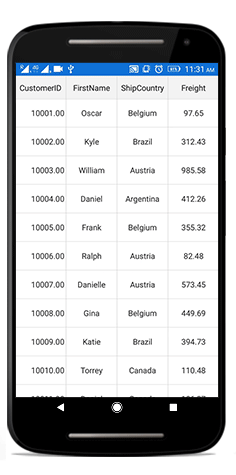
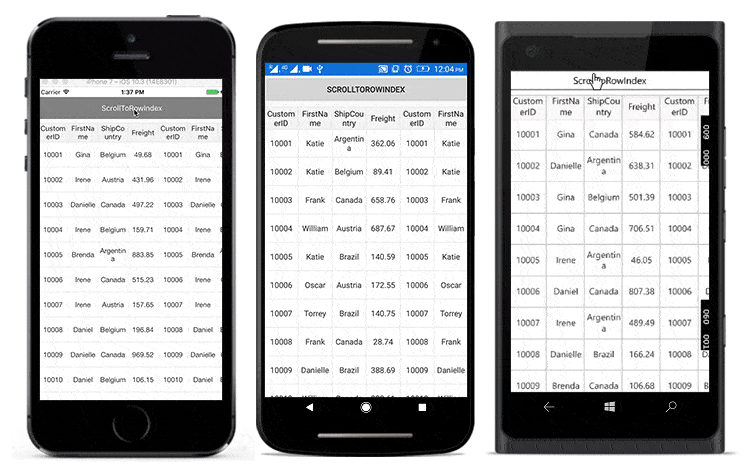
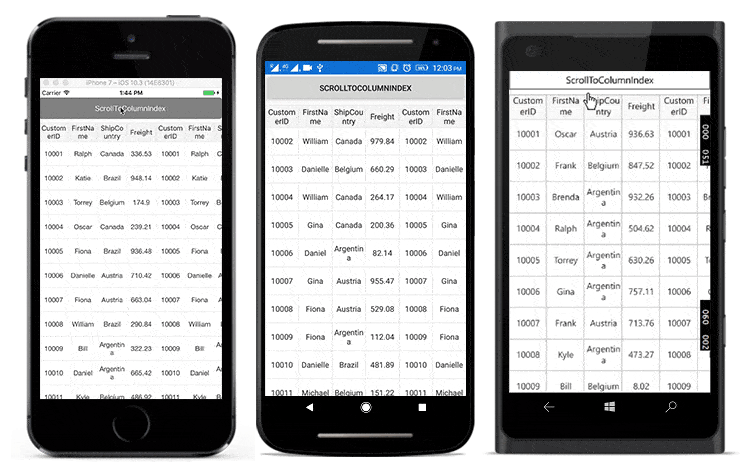
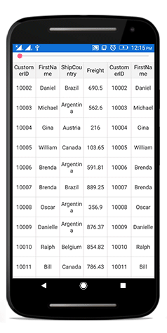

# Scrolling 

## ScrollingMode

The SfDataGrid provide three types of scrolling modes customized using the [SfDataGrid.ScrollingMode](http://help.syncfusion.com/cr/cref_files/xamarin/sfdatagrid/Syncfusion.SfDataGrid.XForms~Syncfusion.SfDataGrid.XForms.SfDataGrid~ScrollingMode.html) property. By default, the control will scroll its content based on pixel values. The scrolling modes are as follows: 

 * PixelLine
 * Line
 * Pixel

N> The SfDataGrid supports for the vertical and horizontal scrollbar in UWP. In addition to that, mouse scrolling is also supporting in UWP desktop application.

### PixelLine

The `ScrollingMode.PixelLine` will allow to scroll its contents like an excel sheet. i.e whenever a row or a column is clipped on the top, the particular row or column will be auto scrolled to display fully in view.


dataGrid.ScrollingMode = ScrollingMode.PixelLine; 


### Line

The `ScrollingMode.Line` will allow to scroll its contents based on lines. i.e the view will be updated only when the offset values reaches the origin of a row or column in the bound collection.


dataGrid.ScrollingMode = ScrollingMode.Line; 


### Pixel

The `ScrollingMode.Pixel` will allow to scroll its contents based on pixel values. i.e the view will update each pixel change of the offsets, and rows or columns will appear clipped when offset exceeds the origin of the row or column.


dataGrid.ScrollingMode = ScrollingMode.Pixel; 


## Programmatic Scrolling

The SfDataGrid allows scrolling to a particular row and column index programmatically.

### Scroll to row and column index

Scroll programmatically to a particular row and column using the [SfDataGrid.ScrollToRowColumnIndex](http://help.syncfusion.com/cr/cref_files/xamarin/sfdatagrid/Syncfusion.SfDataGrid.XForms~Syncfusion.SfDataGrid.XForms.SfDataGrid~ScrollToRowColumnIndex.html) method by passing row and column index.



dataGrid.ScrollToRowColumnIndex(int rowIndex, int columnIndex);

//For example, 
dataGrid.ScrollToRowColumnIndex(20, 6);



### Scroll to row index

Scroll programmatically to a particular row using the [SfDataGrid.ScrollToRowIndex](http://help.syncfusion.com/cr/cref_files/xamarin/sfdatagrid/Syncfusion.SfDataGrid.XForms~Syncfusion.SfDataGrid.XForms.SfDataGrid~ScrollToRowIndex.html) method by passing row index.



dataGrid.ScrollToRowIndex(int rowIndex);

//For example, 
dataGrid.ScrollToRowIndex(20);



### Scroll to column index

Scroll programmatically to a particular column using the [SfDataGrid.ScrollToColumnIndex](http://help.syncfusion.com/cr/cref_files/xamarin/sfdatagrid/Syncfusion.SfDataGrid.XForms~Syncfusion.SfDataGrid.XForms.SfDataGrid~ScrollToColumnIndex.html) method by passing column index.



dataGrid.ScrollToColumnIndex(int columnIndex);

//For example,
dataGrid.ScrollToColumnIndex(7);



## Vertical Over Scroll Mode
[SfDataGrid.VerticalOverScrollMode](http://help.syncfusion.com/cr/cref_files/xamarin/sfdatagrid/Syncfusion.SfDataGrid.XForms~Syncfusion.SfDataGrid.XForms.SfDataGrid~VerticalOverScrollMode.html) property allows you to customize the bouncing behavior of the SfDataGrid.

The [SfDataGrid.VerticalOverScrollMode](http://help.syncfusion.com/cr/cref_files/xamarin/sfdatagrid/Syncfusion.SfDataGrid.XForms~Syncfusion.SfDataGrid.XForms.SfDataGrid~VerticalOverScrollMode.html) property allows customizing the bouncing behavior of the SfDataGrid.

The `SfDataGrid.VerticalOverScrollMode` is of [VerticalScrollMode](http://help.syncfusion.com/cr/cref_files/xamarin/sfdatagrid/Syncfusion.SfDataGrid.XForms~Syncfusion.SfDataGrid.XForms.SfDataGrid~VerticalOverScrollMode.html) type having the following two modes: 

 * Bounce
 * None

### Bounce
 
Bounce allows the SfDataGrid to have bouncing effect. The default value of `SfDataGrid.VerticalOverScrollMode` is `Bounce` .

To customize the bouncing effect in the SfDataGrid, follow the code example:




dataGrid.VerticalOverScrollMode = VerticalOverScrollMode.Bounce;




  <sfgrid:SfDataGrid x:Name="dataGrid"
                     ColumnSizer="Star"
                     VerticalOverScrollMode="Bounce"
                     ItemsSource="{Binding OrdersInfo}">  
  </sfgrid:SfDataGrid>




### None

None disables the bouncing effect in the SfDataGrid.

To customize the bouncing effect in the SfDataGrid, follow the code example:




dataGrid.VerticalOverScrollMode = VerticalOverScrollMode.None;




  <sfgrid:SfDataGrid x:Name="dataGrid"
                     ColumnSizer="Star"
                     VerticalOverScrollMode="None"
                     ItemsSource="{Binding OrdersInfo}">  
  </sfgrid:SfDataGrid>




## Scrolling customization using Slider

The SfDataGrid allows scrolling to a particular row by passing the row index to the `ScrollToRowIndex` method. To scroll the control when interacting on a `Slider`, pass the `Slider.Value` as row index to the `ScrollToRowIndex` method.

To customize the SfDataGrid scrolling programmatically using a `Slider`, follow the code example:



Slider slider = new Slider();

slider.ValueChanged += Slider_ValueChanged;
private void Slider_ValueChanged(object sender, ValueChangedEventArgs e)
{
    dataGrid.ScrollToRowIndex((int)(e.NewValue));
}


