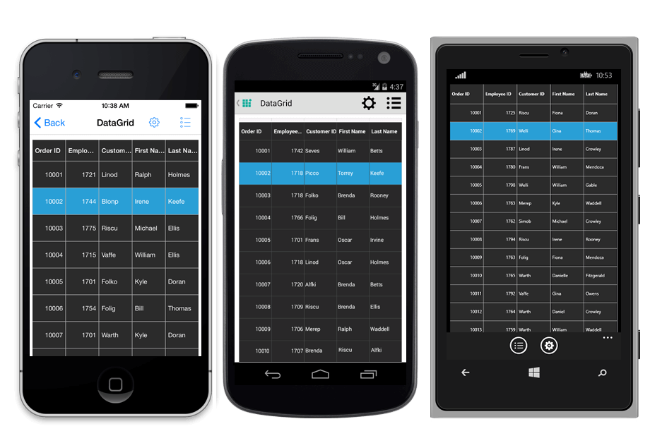
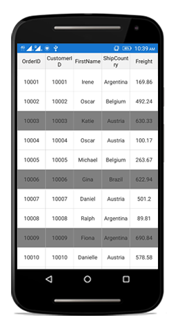
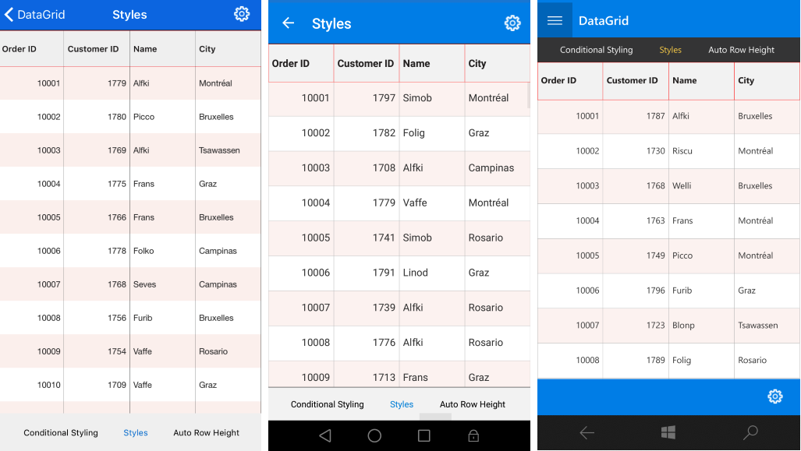

# Styles

The data grid applies style for all of its elements by writing a Style class overriding from [DataGridStyle](http://help.syncfusion.com/cr/cref_files/xamarin/Syncfusion.SfDataGrid.XForms~Syncfusion.SfDataGrid.XForms.DataGridStyle.html), and assigning it to the [SfDataGrid.GridStyle](http://help.syncfusion.com/cr/cref_files/xamarin/Syncfusion.SfDataGrid.XForms~Syncfusion.SfDataGrid.XForms.SfDataGrid~GridStyle.html) property.
  
To apply custom style, follow the code example:



<ContentPage xmlns="http://xamarin.com/schemas/2014/forms"
             xmlns:x="http://schemas.microsoft.com/winfx/2009/xaml"
             xmlns:syncfusion="clr-namespace:Syncfusion.SfDataGrid.XForms;assembly=Syncfusion.SfDataGrid.XForms"
             xmlns:local ="clr-namespace:DataGridSample;assembly=DataGridSample"
             x:Class="DataGridSample.Sample">

    <ContentPage.Resources>
        <ResourceDictionary>
            <local:Dark x:Key="dark" />
        </ResourceDictionary>
    </ContentPage.Resources>

    <syncfusion:SfDataGrid x:Name="dataGrid"
                GridStyle="{StaticResource dark}"
                ItemsSource="{Binding OrdersInfo}" />
</ContentPage> 


//Apply custom style to SfDataGrid from code
SfDataGrid dataGrid = new SfDataGrid();
dataGrid.GridStyle = new Dark ();




//Custom style class
public class Dark : DataGridStyle
{
    public Dark ()
    {
    }

    public override Color GetHeaderBackgroundColor()
    {
        return Color.FromRgb (15, 15, 15);
    }

    public override Color GetHeaderForegroundColor()
    {
        return Color.FromRgb (255, 255, 255);
    }

    public override Color GetRecordBackgroundColor ()
    {
        return Color.FromRgb (43, 43, 43);
    }

    public override Color GetRecordForegroundColor ()
    {
        return Color.FromRgb (255, 255, 255);
    }

    public override Color GetSelectionBackgroundColor ()
    {
        return Color.FromRgb (42, 159, 214);
    }

    public override Color GetSelectionForegroundColor ()
    {
        return Color.FromRgb (255, 255, 255);
    }

    public override Color GetCaptionSummaryRowBackgroundColor ()
    {
        return Color.FromRgb (02, 02, 02);
    }

    public override Color GetCaptionSummaryRowForeGroundColor ()
    {
        return Color.FromRgb (255, 255, 255);
    }

    public override Color GetBorderColor ()
    {
        return Color.FromRgb (81, 83, 82);
    }

    public override Color GetLoadMoreViewBackgroundColor ()
    {
        return Color.FromRgb(242, 242, 242);
    }

    public override Color GetLoadMoreViewForegroundColor ()
    {
        return Color.FromRgb(34, 31, 31);
    }
    
    public override Color GetAlternatingRowBackgroundColor()
    {
        return Color.Yellow;
    }
} 


The following picture shows the grid loaded in a different style:

N> Xamarin.Forms.Style which has specified target type, that will not be applied to the internal components used in the SfDataGrid.

## Applying alternate row style

The SfDataGrid applies the alternative row style by writing a Style class deriving from `DataGridStyle`, and assigning it to the [SfDataGrid.GridStyle](http://help.syncfusion.com/cr/cref_files/xamarin/Syncfusion.SfDataGrid.XForms~Syncfusion.SfDataGrid.XForms.SfDataGrid~GridStyle.html) property.

To apply alternate row style, follow the code example:


//Apply alternative row style
dataGrid.GridStyle = new CustomStyle ();

// Custom style class
public class CustomGridStyle : DataGridStyle
{
    public CustomGridStyle()
    {   
    }

    public override Color GetAlternatingRowBackgroundColor()
    {
        return Color.Gray;
    }   
}


## Customizing the alternation count

The data grid customizes the alternate row count for applying the alternate row style using the [SfDataGrid.AlternationCount](http://help.syncfusion.com/cr/cref_files/xamarin/Syncfusion.SfDataGrid.XForms~Syncfusion.SfDataGrid.XForms.SfDataGrid~AlternationCountProperty.html) property.

To set the alternate row count, follow the code example:



//Apply alternative row count
dataGrid.AlternationCount = 3;



## Border customization

The data grid customizes the grid borders to vertical, horizontal, both, or none. Override the [DataGridStyle.GetGridLinesVisibility](http://help.syncfusion.com/cr/cref_files/xamarin/Syncfusion.SfDataGrid.XForms~Syncfusion.SfDataGrid.XForms.DataGridStyle~GetGridLinesVisibility.html) method to customize borders in the data grid.


//Apply custom style to SfDataGrid from code
dataGrid.GridStyle = new CustomStyle ();



//Custom Style class
public class CustomStyle : DataGridStyle
{
    public CustomStyle ()
    {
    }
    public override GridLinesVisibility GetGridLinesVisibility()
    {
       return base.GetGridLinesVisibility();
    }
}


Following are the list of options available to customize the grid borders:

 * Both
 * Horizontal
 * Vertical
 * None

### Both

The [GridLinesVisibility.Both](http://help.syncfusion.com/cr/cref_files/xamarin/Syncfusion.SfDataGrid.XForms~Syncfusion.SfDataGrid.XForms.GridLinesVisibility.html) displays the data grid with both horizontal and vertical borders.


public override GridLinesVisibility GetGridLinesVisibility()
{
    return GridLinesVisibility.Both;
} 


The following screenshot shows the outcome upon execution of the above code:

### Horizontal

The [GridLinesVisibility.Horizontal](http://help.syncfusion.com/cr/cref_files/xamarin/Syncfusion.SfDataGrid.XForms~Syncfusion.SfDataGrid.XForms.GridLinesVisibility.html) allows displays the data grid with horizontal border only.


public override GridLinesVisibility GetGridLinesVisibility()
{
    return GridLinesVisibility.Horizontal;
} 


The following screenshot shows the outcome upon execution of the above code:

### Vertical

The [GridLinesVisibility.Vertical](http://help.syncfusion.com/cr/cref_files/xamarin/Syncfusion.SfDataGrid.XForms~Syncfusion.SfDataGrid.XForms.GridLinesVisibility.html) displays the data grid with vertical border only.


public override GridLinesVisibility GetGridLinesVisibility()
{
    return GridLinesVisibility.Vertical;
} 


The following screenshot shows the outcome upon execution of the above code:

### None

[GridLinesVisibility.None](http://help.syncfusion.com/cr/cref_files/xamarin/Syncfusion.SfDataGrid.XForms~Syncfusion.SfDataGrid.XForms.GridLinesVisibility.html) allows you to display the data grid without borders.


public override GridLinesVisibility GetGridLinesVisibility()
{
    return GridLinesVisibility.None;
} 


The following screenshot shows the outcome upon execution of the above code:

## Header border color customization

The data grid customizes the header border color for different `DataGridStyle.GridLinesVisibility` by writing a custom style class deriving from `DataGridStyle`, and assigning it to the [SfDataGrid.GridStyle](http://help.syncfusion.com/cr/cref_files/xamarin/Syncfusion.SfDataGrid.XForms~Syncfusion.SfDataGrid.XForms.SfDataGrid~GridStyle.html) property. Override the `GetHeaderBorderColor` method in the custom style to customize color of the column header and row header.

To customize the header border color by writing a custom style, follow the code example:



<ContentPage xmlns="http://xamarin.com/schemas/2014/forms"
             xmlns:x="http://schemas.microsoft.com/winfx/2009/xaml"
             xmlns:syncfusion="clr-namespace:Syncfusion.SfDataGrid.XForms;assembly=Syncfusion.SfDataGrid.XForms"
             xmlns:local ="clr-namespace:DataGridSample;assembly=DataGridSample"
             x:Class="DataGridSample.Sample">

    <ContentPage.Resources>
        <ResourceDictionary>
            <local:CustomStyle x:Key="customStyle" />
        </ResourceDictionary>
    </ContentPage. mResources>

    <syncfusion:SfDataGrid x:Name="dataGrid"
                GridStyle="{StaticResource customStyle}"
                ItemsSource="{Binding OrdersInfo}" />
</ContentPage> 


//Applying custom style to SfDataGrid from code to customize header border color
SfDataGrid dataGrid = new SfDataGrid();
dataGrid.GridStyle = new customStyle ();



 
//Custom style class
public class CustomStyle : DataGridStyle
{
    Public CustomStyle()
    {
        
    }
    
    Public override color GetHeaderBorderColor()
    {
        return Color.Red;
    } 
}


The following screenshot shows the final outcome upon execution of the above code:

## Customizing sort icons in the header

Any desired image can be loaded as the sort indicator using the [GetHeaderSortIndicatorDown](http://help.syncfusion.com/cr/cref_files/xamarin/Syncfusion.SfDataGrid.XForms~Syncfusion.SfDataGrid.XForms.DataGridStyle~GetHeaderSortIndicatorDown.html) and [GetHeaderSortIndicatorUp](http://help.syncfusion.com/cr/cref_files/xamarin/Syncfusion.SfDataGrid.XForms~Syncfusion.SfDataGrid.XForms.DataGridStyle~GetHeaderSortIndicatorUp.html) overriding from the [DataGridStyle](http://help.syncfusion.com/cr/cref_files/xamarin/Syncfusion.SfDataGrid.XForms~Syncfusion.SfDataGrid.XForms.DataGridStyle.html) class. To change the sort indicators, follow the code example:



//Apply custom style to SfDataGrid from code
dataGrid.GridStyle = new Custom();

public class Custom : DataGridStyle
{

    public override ImageSource GetHeaderSortIndicatorDown()
    {
        return ImageSource.FromResource("SfDataGrid_Sample.SortDown.png");
    }

    public override ImageSource GetHeaderSortIndicatorUp()
    {
        return ImageSource.FromResource("SfDataGrid_Sample.SortUp.png");
    }

}


The following screenshots shows the final outcome of the above code:

N> The BuildAction image must be set to EmbeddedResource in order to access the image as resource as shown in above code.

## Customizing resizing indicator

The color of the resizing indicator can be changed using the [GetResizingIndicatorColor](http://help.syncfusion.com/cr/cref_files/xamarin/Syncfusion.SfDataGrid.XForms~Syncfusion.SfDataGrid.XForms.DataGridStyle~GetResizingIndicatorColor.html) overriding from the [DataGridStyle](http://help.syncfusion.com/cr/cref_files/xamarin/Syncfusion.SfDataGrid.XForms~Syncfusion.SfDataGrid.XForms.DataGridStyle.html) class. To change the color of the resizing indicator, follow the code example:



//Apply custom style to SfDataGrid from code
dataGrid.GridStyle = new Custom();

public class Custom : DataGridStyle
{
    public override Color GetResizingIndicatorColor()
    {
        return Color.Blue;
    }
}


## Border width customization
SfDataGrid allows you to customize the border width of the grid cells and the header cells. 
The default border width of the grid cell and the header cell for Forms.iOS and Forms.UWP is 0.5f and 1f for Forms.Android.

Refer the below code snippet to customize the width of the grid cells and header cells.



     //Apply custom style to SfDataGrid from code
      dataGrid.GridStyle = new CustomStyle();

    public class CustomStyle : DataGridStyle
    {
        public CustomStyle()
        {

        }

        // Customize border width for grid cells
        public override float GetBorderWidth()
        {
            return 5;
        }

        // Customize border width for header cells
        public override float GetHeaderBorderWidth()
        {
            return 5;
        }

    }

{endhighlight}

