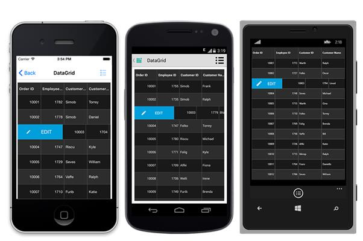
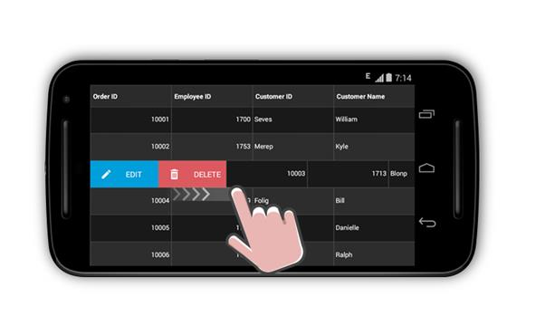
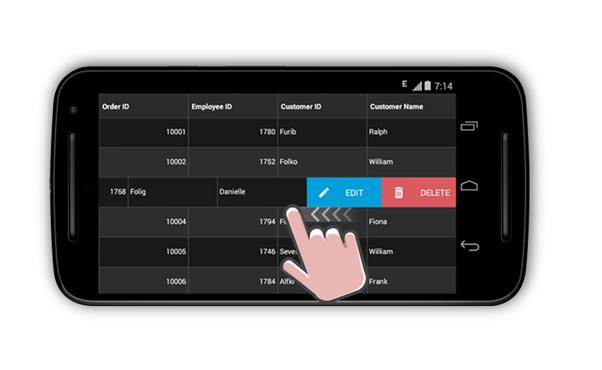
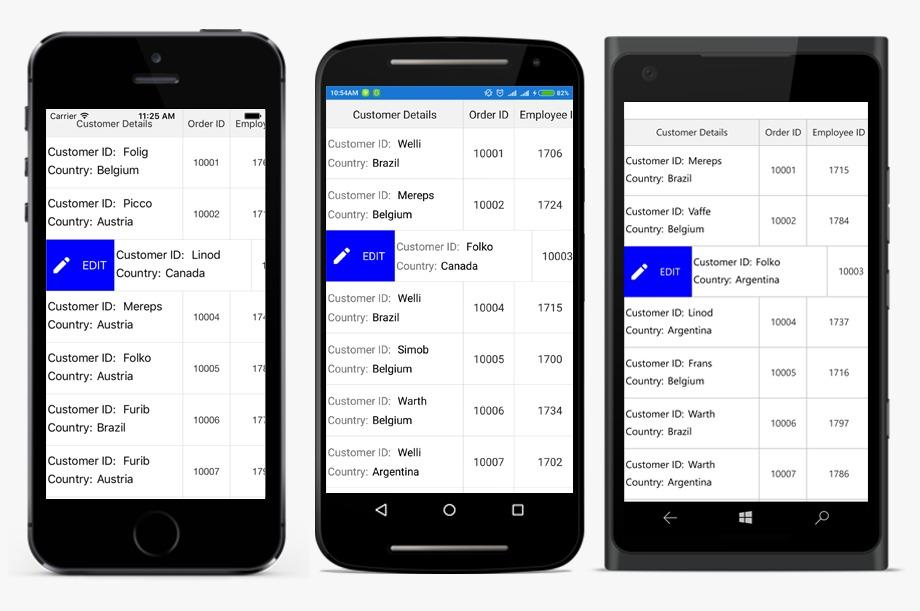

# Swiping

[SfDataGrid](http://help.syncfusion.com/cr/cref_files/xamarin/sfdatagrid/Syncfusion.SfDataGrid.XForms~Syncfusion.SfDataGrid.XForms.SfDataGrid.html# “”) lets you enable the Swiping option by setting the [SfDataGrid.AllowSwiping](http://help.syncfusion.com/cr/cref_files/xamarin/sfdatagrid/Syncfusion.SfDataGrid.XForms~Syncfusion.SfDataGrid.XForms.SfDataGrid~AllowSwiping.html# “”) property to `true`. Swipe views are displayed when swiping from ‘left to right’ or ‘right to left’ on a data row. SfDataGrid provides customizable swipe templates for swiping on the left and right side. The swipe gesture can be restricted up to a certain point on the row by setting the [SfDataGrid.MaxSwipeOffset](http://help.syncfusion.com/cr/cref_files/xamarin/sfdatagrid/Syncfusion.SfDataGrid.XForms~Syncfusion.SfDataGrid.XForms.SfDataGrid~MaxSwipeOffset.html# “”) property.

## SwipeTemplate

SfDataGrid enables you to load a desired content using the [SfDataGrid.LeftSwipeTemplate](http://help.syncfusion.com/cr/cref_files/xamarin/sfdatagrid/Syncfusion.SfDataGrid.XForms~Syncfusion.SfDataGrid.XForms.SfDataGrid~LeftSwipeTemplate.html# “”) when swiping towards right. The template can be defined either in code or XAML. The contents inside the swipe template are arranged based on the offset values when you swipe a data row. 
Refer the following code example that shows how to load a template when swiping towards right.




//Defining left swipe template
<sfgrid:SfDataGrid.LeftSwipeTemplate>
  <DataTemplate>
      <Grid  BackgroundColor="#009EDA">
        <Grid.ColumnDefinitions>
          <ColumnDefinition/>
          <ColumnDefinition/>
        </Grid.ColumnDefinitions>
        
        <Image Grid.Column="0"  
               BackgroundColor="Transparent" 
               HorizontalOptions="CenterAndExpand" 
               Source="EditIcon.png"         
               BindingContextChanged=”rightImage_BindingContextChanged"  />
        
        <Label Grid.Column="1" 
               Text ="EDIT" 
               HorizontalTextAlignment="Start" 
               VerticalTextAlignment="Center"  
               LineBreakMode ="NoWrap" 
               BackgroundColor="Transparent" 
               TextColor ="White" />
      </Grid>
  </DataTemplate>
</sfgrid:SfDataGrid.LeftSwipeTemplate>



//Defining left swipe template
dataGrid.LeftSwipeTemplate = new DataTemplate(() =>
{
    Grid myGrid = new Grid();
    myGrid.HorizontalOptions = LayoutOptions.FillAndExpand;

    myGrid.ColumnDefinitions = new ColumnDefinitionCollection
    {
      new ColumnDefinition {},
      new ColumnDefinition {}           
    };

    myGrid.Children.Add(new Image()
    {
      BackgroundColor="Transparent",
      HorizontalOptions=LayoutOptions. CenterAndExpand,
      Source="EditIcon.png",
      BindingContextChanged+= MainPage_BindingContextChanged
    },0,0);

    myGrid.Children.Add(new Label()
    {
      Text = "EDIT",
      HorizontalTextAlignment = TextAlignment.Start,
      VerticalTextAlignment = TextAlignment.Center,
      LineBreakMode = LineBreakMode.NoWrap,
      BackgroundColor = Color.Transparent,
      TextColor = Color.White,
    }, 0, 1);

    return myGrid;
});



The following screenshot shows the final outcome upon execution of the above code where swiping towards right loads an image and a label in the template.

N> Similarly you can load a desired content using the [SfDataGrid.RightSwipeTemplate](http://help.syncfusion.com/cr/cref_files/xamarin/sfdatagrid/Syncfusion.SfDataGrid.XForms~Syncfusion.SfDataGrid.XForms.SfDataGrid~RightSwipeTemplate.html# “”) when swiping towards left.

## Swipe Events

[SwipeStarted](http://help.syncfusion.com/cr/cref_files/xamarin/sfdatagrid/Syncfusion.SfDataGrid.XForms~Syncfusion.SfDataGrid.XForms.SfDataGrid~SwipeStarted_EV.html# “”) - This event is fired when the swipe offset changes from its initial value. You can cancel the swipe action by setting the [Cancel](https://msdn.microsoft.com/query/dev10.query?appId=Dev10IDEF1&l=EN-US&k=k(System.ComponentModel.CancelEventArgs.Cancel)&rd=true# “”) property of the [SwipeStartedEventArgs](http://help.syncfusion.com/cr/cref_files/xamarin/sfdatagrid/Syncfusion.SfDataGrid.XForms~Syncfusion.SfDataGrid.XForms.SwipeStartedEventArgs.html# “”) to `true`. 
[SwipeEnded](http://help.syncfusion.com/cr/cref_files/xamarin/sfdatagrid/Syncfusion.SfDataGrid.XForms~Syncfusion.SfDataGrid.XForms.SfDataGrid~SwipeEnded_EV.html# “”) - This event is fired when the swipe offset value reaches the `SfDataGrid.MaxSwipeOffset` indicating that the swipe action is completed. This event is triggered with [SwipeEndedEventArgs](http://help.syncfusion.com/cr/cref_files/xamarin/sfdatagrid/Syncfusion.SfDataGrid.XForms~Syncfusion.SfDataGrid.XForms.SwipeEndedEventArgs.html# “”).
[Swiping](http://help.syncfusion.com/cr/cref_files/xamarin/sfdatagrid/Syncfusion.SfDataGrid.XForms~Syncfusion.SfDataGrid.XForms.SfDataGrid~Swiping_EV.html# “”) - This event is raised while swiping a row is in progress. This event is triggered with [SwipingEventArgs](http://help.syncfusion.com/cr/cref_files/xamarin/sfdatagrid/Syncfusion.SfDataGrid.XForms~Syncfusion.SfDataGrid.XForms.SwipingEventArgs.html# “”) . 

All the swipe events provides the following properties in their arguments: 

* [RowIndex](http://help.syncfusion.com/cr/cref_files/xamarin/sfdatagrid/Syncfusion.SfDataGrid.XForms~Syncfusion.SfDataGrid.XForms.SwipingEventArgs~RowIndex.html# “”) - the swiping row index 
* [RowData](http://help.syncfusion.com/cr/cref_files/xamarin/sfdatagrid/Syncfusion.SfDataGrid.XForms~Syncfusion.SfDataGrid.XForms.SwipingEventArgs~RowData.html# “”) - the underlying data associated with the swiped row as its arguments. 
* [SwipeDirection](http://help.syncfusion.com/cr/cref_files/xamarin/sfdatagrid/Syncfusion.SfDataGrid.XForms~Syncfusion.SfDataGrid.XForms.SwipingEventArgs~SwipeDirection.html# “”)- the swipe direction of the swiped row
* [SwipeOffset](http://help.syncfusion.com/cr/cref_files/xamarin/sfdatagrid/Syncfusion.SfDataGrid.XForms~Syncfusion.SfDataGrid.XForms.SwipingEventArgs~SwipeOffSet.html# “”)- the current swipe offset of the row being swiped

By handling the swipe events, you can make use of these property values from the arguments to perform any desired action such as deleting the row, editing the data, etc. 

## Swipe Customizations

The following customizations should give you an idea on how to use the swiping event in the grid.

### Multiple Views

You can use the swipe templates to customize your application by loading any view in the templates and assigning custom actions to them such as deleting a row, adding a row, editing the underlying data associated, etc. You can also display multiple views in a template like in the following example where two views are loaded for editing the cell values in the row and deleting the row respectively.
Refer the following code example that shows how to load multiple views in template when swiping towards right.

**Swiping.xaml**



//Defining left swipe template
<sfgrid:SfDataGrid.LeftSwipeTemplate>
   <DataTemplate>
       <Grid BackgroundColor="#009EDA">
           <Grid.ColumnDefinitions>
               <ColumnDefinition Width="50"/>                              
               <ColumnDefinition Width="100"/>                                                     
               <ColumnDefinition Width="150"/>                                                     
           </Grid.ColumnDefinitions>

           <Image Grid.Column="0"
                  BackgroundColor="Transparent"
                  BindingContextChanged="leftImage_BindingContextChanged"
                  HorizontalOptions="CenterAndExpand"
                  Source="EditIcon.png" />

           <Label Grid.Column="1"
                  BackgroundColor="Transparent"
                  LineBreakMode="NoWrap"
                  Text="EDIT"
                  TextColor="White"
                  HorizontalTextAlignment ="Start"
                  VerticalTextAlignment="Center" />
                          
           <Grid Grid.Column="2" BackgroundColor="#DC595F"> 
               <Grid.ColumnDefinitions>
                   <ColumnDefinition Width="50" />                              
                   <ColumnDefinition Width="100" />                                                     
               </Grid.ColumnDefinitions>

               <Image Grid.Column="0"
                      BackgroundColor="Transparent"
                      BindingContextChanged="rightImage_BindingContextChanged"
                      HorizontalOptions="CenterAndExpand"
                      Source="TrashImage.png" />

               <Label Grid.Column="1"
                      BackgroundColor="Transparent"
                      LineBreakMode="NoWrap"
                      Text="DELETE"
                      TextColor="White"
                      HorizontalTextAlignment ="Start"
                      VerticalTextAlignment ="Center" />
           </Grid>                                           
      </Grid>                    
   </DataTemplate>
</sfgrid:SfDataGrid.LeftSwipeTemplate>


**Swiping.xaml.cs**



public partial class Swiping : SamplePage
{
    private Image leftImage;
    private Image rightImage;
    private int swipedRowIndex;
    private SubView subView;

    public Swiping()
    {
        InitializeComponent();
        this.dataGrid.ItemsSource = viewModel.OrdersInfo;
        this.PropertyChanged += Swiping_PropertyChanged;
        subView = new SubView(dataGrid);
        MainView.Children.Add(subView);
    }

    private void Swiping_PropertyChanged(object sender, PropertyChangedEventArgs e)
    {
        if (e.PropertyName == "Width" && this.formView != null)
        {
            formView.IsVisible = false;
            dataGrid.Opacity = 1.0;
        }
    }

    private void dataGrid_GridTapped(object sender, GridTappedEventsArgs e)
    {
        this.formView.IsVisible = false;
        dataGrid.Opacity = 1.0;
        dataGrid.IsEnabled = true;
    }

    private void dataGrid_GridViewCreated(object sender, GridViewCreatedEventArgs e)
    {
        dataGrid.GridStyle = new SwipeStyle();
    }

    //Gesture listener to perform edit
    private void leftImage_BindingContextChanged(object sender, EventArgs e)
    {
        if (leftImage == null)
        {
            leftImage = sender as Image;
            (leftImage.Parent as View).GestureRecognizers.Add(new TapGestureRecognizer() { Command = new Command (Edit)});
            leftImage.Source = ImageSource.FromResource("SampleBrowser.Icons.DataGrid.Edit.png");
        }
    }

    //Code to edit row
    private void Edit()
    {
        this.dataGrid.Opacity = 0.25;
        this.dataGrid.IsEnabled = false;
        if (Device.OS != TargetPlatform.Windows)
            formView.LayoutTo(new Rectangle(10, (this.Height / 2) - (350 / 2), this.dataGrid.Width - 20, 350), 250, null);
        else
            formView.LayoutTo(new Rectangle(10, (this.dataGrid.Height / 2) - (350 / 2), this.dataGrid.Width - 20, 350), 250, null);
        formView.IsVisible = true;
    }

    //Code to delete row
    private void Delete()
    {
        this.viewModel.OrdersInfo.RemoveAt(swipedRowIndex - 1);
        (MainView.Children[1] as View).IsVisible = false;
    }

    //Gesture listener to perform delete
    private void rightImage_BindingContextChanged(object sender, EventArgs e)
    {
        if (rightImage == null)
        {
            rightImage = sender as Image;
            (rightImage.Parent as View).GestureRecognizers.Add(new TapGestureRecognizer() { Command = new Command(Delete) });
            rightImage.Source = ImageSource.FromResource("SampleBrowser.Icons.DataGrid.Delete.png");
        }
    }

    private void dataGrid_SwipeEnded(object sender, SwipeEndedEventArgs e)
    {
        formView.BindingContext = e.RowData;
        swipedRowIndex = e.RowIndex;
    }

}



The following screenshot shows the final outcome upon execution of the above code where swiping towards right loads two views in the template to edit and delete a row respectively.

N> Similarly you can load the two views using the `SfDataGrid.RightSwipeTemplate` which when swiping towards left will result in the below outcome.

### Swipe Delete

You can perform operations such as deleting a row when swiping a data row from one extent to other in the view. 
Refer the below code example which illustrates how to delete a data row when swiping it from one extreme to other in the view. 

**Swiping.Xaml**



//Creating view for left swipe
<sfgrid:SfDataGrid.LeftSwipeTemplate>
  <DataTemplate>
    <ContentView BindingContextChanged="leftTemplate_BindingContextChanged"
                 BackgroundColor="#1AAA87">

        <Label FontSize="15"                     
               Text ="Deleted" 
               TextColor ="White"
               HorizontalTextAlignment ="Start"
               VerticalTextAlignment ="Center"  
               LineBreakMode ="NoWrap" />
    </ContentView>
  </DataTemplate>
</sfgrid:SfDataGrid.LeftSwipeTemplate>

//Creating view for right swipe
<sfgrid:SfDataGrid.RightSwipeTemplate>
  <DataTemplate>
    <ContentView BindingContextChanged="rightTemplate_BindingContextChanged" 
                 BackgroundColor="#1AAA87">

        <Label FontSize="15" 
               HorizontalTextAlignment ="Center" 
               Text ="Deleted" 
               TextColor ="White"                  
               VerticalTextAlignment ="Center"  
               LineBreakMode ="NoWrap" />
    </ContentView>
  </DataTemplate>
</sfgrid:SfDataGrid.RightSwipeTemplate>


Swiping.Xaml.cs



//Call to delete() when swipe is ended
private void dataGrid_SwipeEnded(object sender, SwipeEndedEventArgs e)
{
    swipedRowIndex = e.RowIndex;
    if (Math.Abs(e.SwipeOffset) >= dataGrid.Width)
    {
        if (e.SwipeOffset > 0)
            leftTemplateView.Content.IsVisible = true;
        else
            rightTemplateView.Content.IsVisible = true;
        doDeleting();
    }
}

//Code to delete row
private async void doDeleting()
{
    isSuspend = true;
    await Task.Delay(2000);
    if (leftTemplateView.Content.IsVisible)
        leftTemplateView.Content.IsVisible = false;
    else if (rightTemplateView.Content.IsVisible)
        rightTemplateView.Content.IsVisible = false;
    if (!IsUndoClicked)
        viewModel.OrdersInfo.RemoveAt(swipedRowIndex - 1);
    else
    {
        var removedData = viewModel.OrdersInfo[swipedRowIndex - 1];
        var isSelected = dataGrid.SelectedItems.Contains(removedData);
        viewModel.OrdersInfo.Remove(removedData);
        viewModel.OrdersInfo.Insert(swipedRowIndex - 1, removedData);
        if (isSelected)
            dataGrid.SelectedItems.Add(removedData);
        IsUndoClicked = false;
    }
    isSuspend = false;
}

The following screenshot shows the final outcome upon execution of the above code.

### Swiping when using complex template in SfDataGrid

When a complex layout is loaded in the GridTemplateColumn, swiping may not occur or may not be smooth at times since the touches will be intercepted by the views loaded in the template. As a result the SfDataGrid may not recognize the touches which might restrict swiping operation. In-order to resolve this issue, we need to set the `InputTransparent` property of the views loaded in the `DataTemplate` of the `GridTemplateColumn` as `True`.

Refer the below code example in which the `InputTransparent` property of the views loaded in the `GridTemplateColumn.CellTemplate` is set as `True` to resolve the swiping not working issue when a complex layout is loaded in the GridTemplateColumn.



<sfgrid:GridTemplateColumn MappingName="" HeaderText="Customer Details" Width="200">
    <sfgrid:GridTemplateColumn.CellTemplate>
        <DataTemplate>
           <Grid InputTransparent="True" 
                  ColumnSpacing="0" 
                  RowSpacing="0" 
                  HorizontalOptions="FillAndExpand" 
                  Margin="0" >
              <Grid.ColumnDefinitions>
                <ColumnDefinition />
                <ColumnDefinition />
                <ColumnDefinition />
              </Grid.ColumnDefinitions>
              <Grid.RowDefinitions>
                <RowDefinition Height="10" />
                <RowDefinition Height="*" />
                <RowDefinition Height="10"/>
              </Grid.RowDefinitions>
              <StackLayout InputTransparent="True"
                           Margin="2" 
                           BackgroundColor="White" 
                           Orientation="Vertical" 
                           HorizontalOptions="FillAndExpand"
                           VerticalOptions="FillAndExpand"
                           Grid.Column="0"
                           Grid.ColumnSpan="3"
                           Grid.Row="1"
                           >
                <StackLayout Orientation="Horizontal" HorizontalOptions="FillAndExpand" >
                    <Label Text="Customer ID: " />
                    <Label Text="{Binding CustomerID}"  TextColor="Black" />
                </StackLayout>
                <StackLayout Orientation="Horizontal" HorizontalOptions="FillAndExpand">
                    <Label Text="Country:" />
                    <Label Text="{Binding ShipCountry}" TextColor="Black" />
                </StackLayout>
              </StackLayout>
           </Grid>
        </DataTemplate>
    </sfgrid:GridTemplateColumn.CellTemplate>
</sfgrid:GridTemplateColumn>



