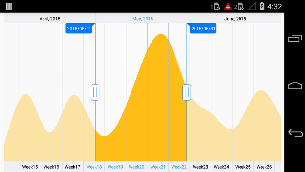

# Content

`SfDateTimeRangeNavigator` allows you to set `SfChart` as its content, explicitly, using `Content` property. However, if you provide data source using `ItemsSource` property, the Chart with line series will be created for the provided ItemsSource and will be set as the content of range navigator internally, by default. But, if you configure the range navigator using `Minimum` and `Maximum` properties, you have to manually configure the Chart with data source.

N> Though the `Content` property’s data type is View and it can accept any View as its value, but currently `SfDateTimeRangeNavigator` can accept only SfChart as its content.

The following code snippet shows how to configure the range navigator using `ItemsSource` property.



<rangenavigator:SfDateTimeRangeNavigator ItemsSource="{Binding DateTimeRangeData}" XBindingPath="XValue" YBindingPath="YValue"/>



SfDateTimeRangeNavigator rangeNavigator = new SfDateTimeRangeNavigator(); 

ViewModel viewModel = new ViewModel(); 

rangeNavigator.ItemsSource = viewModel.DateTimeRangeData;

rangeNavigator.XBindingPath = "XValue"; 

rangeNavigator.YBindingPath = "YValue";






[C#]

public class ViewModel

{

	public ObservableCollection<ChartDataPoint> DateTimeRangeData { get; set; }

	public ViewModel()

	{

		DateTimeRangeData = new ObservableCollection<ChartDataPoint>

		{

			new ChartDataPoint(new DateTime(2015, 01, 1), 14),

			new ChartDataPoint(new DateTime(2015, 02, 1), 54),

			new ChartDataPoint(new DateTime(2015, 03, 1), 23),

			new ChartDataPoint(new DateTime(2015, 04, 1), 53),

			new ChartDataPoint(new DateTime(2015, 05, 1), 25),

			new ChartDataPoint(new DateTime(2015, 06, 1), 32),

			new ChartDataPoint(new DateTime(2015, 07, 1), 78),

			new ChartDataPoint(new DateTime(2015, 08, 1), 100),

			new ChartDataPoint(new DateTime(2015, 09, 1), 55),

			new ChartDataPoint(new DateTime(2015, 10, 1), 38),

			new ChartDataPoint(new DateTime(2015, 11, 1), 27),

			new ChartDataPoint(new DateTime(2015, 12, 1), 56),

			new ChartDataPoint(new DateTime(2015, 12, 31), 35),

		};

	}

}



The following code snippet shows how to configure the range navigator using `Minimum` and `Maximum` properties.



<rangenavigator:SfDateTimeRangeNavigator ViewRangeStart="5/1/2015" 

	ViewRangeEnd="5/30/2015" Minimum="4/1/2015" Maximum="6/30/2015">

<rangenavigator:SfDateTimeRangeNavigator.Content>

<chart:SfChart>

. . .

</chart:SfChart>

</rangenavigator:SfDateTimeRangeNavigator.Content>



SfDateTimeRangeNavigator rangeNavigator = new SfDateTimeRangeNavigator();

rangeNavigator.Minimum = new DateTime(2015, 4, 1);

rangeNavigator.Maximum = new DateTime(2015, 6, 30);

rangeNavigator.ViewRangeStart = new DateTime(2015, 5, 1);

rangeNavigator.ViewRangeEnd = new DateTime(2015, 5, 31);

SfChart chart = new SfChart();

...

rangeNavigator.Content = chart;



