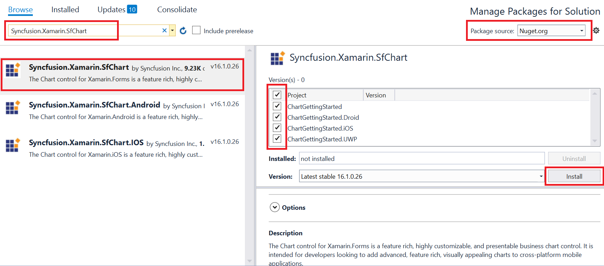

# Getting started

This section walks you through the steps required to add `SfDateTimeRangeNavigator` and populate it with data, and also explains how to respond to range selection performed in the control. 

## Add RangeNavigator Reference

Syncfusion Xamarin components are available in [nuget.org](https://www.nuget.org/). To add range navigator to your project, open the NuGet package manager in Visual Studio, and search for [syncfusion.xamarin.sfchart](https://www.nuget.org/packages/Syncfusion.Xamarin.SfChart/), and then install it. 

To know more about obtaining our components, refer to these links: [Mac](https://help.syncfusion.com/xamarin/introduction/download-and-installation/mac) and [Windows](https://help.syncfusion.com/xamarin/introduction/download-and-installation/windows). Also, if you prefer to manually refer the assemblies instead of NuGet, refer to this [link](https://help.syncfusion.com/xamarin/introduction/control-dependencies#sfdatetimerangenavigator) to know about the dependent assemblies for range navigator. 

N>Install the same version of the chart NUGET in all the projects.

## Launching the application on each platform with range navigator 

To use the range navigator inside an application, each platform application requires some additional configurations. The configurations vary from platform to platform and is discussed in the following sections:

### iOS

To launch the range navigator in iOS, call the SfRangeNavigatorRenderer.Init() in the FinishedLaunching overridden method of the AppDelegate class after the Xamarin.Forms framework initialization and before the LoadApplication is called as demonstrated in the following code sample:

 

public override bool FinishedLaunching(UIApplication app, NSDictionary options) 
{ 
    … 
    global::Xamarin.Forms.Forms.Init();

    Syncfusion.RangeNavigator.XForms.iOS.SfRangeNavigatorRenderer.Init();     

    LoadApplication(new App()); 
    …
}



### Universal Windows Platform (UWP)

To launch the range navigator  in UWP, call the  SfRangeNavigatorRenderer.Init()  in the MainPage constructor before the LoadApplication is called as demonstrated in the following code sample.

 

public MainPage() 
{ 
    … 

  Syncfusion.RangeNavigator.XForms.UWP.SfRangeNavigatorRenderer.Init(); 

  LoadApplication (new App ()); 
  … 
}



In addition to the above configurations, you need to initialize the control assemblies in App.xaml.cs in UWP project as shown in the below code snippets. This is required to deploy application with range navigator in `Release` mode in UWP platform.

 

// In App.xaml.cs 
protected override void OnLaunched(LaunchActivatedEventArgs e)
{ 
   … 
   if (rootFrame == null) 
   { 
      List<Assembly> assembliesToInclude = new List<Assembly>();

      assembliesToInclude.Add(typeof(Syncfusion.RangeNavigator.XForms.UWP. SfRangeNavigatorRenderer).GetTypeInfo().Assembly);

      Xamarin.Forms.Forms.Init(e, assembliesToInclude); 
   } 
… 
}



### Android

The Android platform does not require any additional configuration to render the range navigator.

## Adding and configuring SfDateTimeRangeNavigator 

First, let us initialize the control with major and minor date time scales by specifying the minimum and maximum date to be visualized in the control using [`Minimum`](https://help.syncfusion.com/cr/cref_files/xamarin/sfchart/Syncfusion.SfChart.XForms~Syncfusion.RangeNavigator.XForms.SfDateTimeRangeNavigator~Minimum.html) and [`Maximum`](https://help.syncfusion.com/cr/cref_files/xamarin/sfchart/Syncfusion.SfChart.XForms~Syncfusion.RangeNavigator.XForms.SfDateTimeRangeNavigator~Maximum.html) properties.

Following code example illustrates this,


[C#]

SfDateTimeRangeNavigator rangeNavigator = new SfDateTimeRangeNavigator();

rangeNavigator.Minimum = new DateTime(2015, 01, 01);

rangeNavigator.Maximum = new DateTime(2016, 01, 01);



N> If you don’t specify [`Minimum`](https://help.syncfusion.com/cr/cref_files/xamarin/sfchart/Syncfusion.SfChart.XForms~Syncfusion.RangeNavigator.XForms.SfDateTimeRangeNavigator~Minimum.html) and [`Maximum`](https://help.syncfusion.com/cr/cref_files/xamarin/sfchart/Syncfusion.SfChart.XForms~Syncfusion.RangeNavigator.XForms.SfDateTimeRangeNavigator~Maximum.html) properties, minimum and maximum dates will be chosen automatically based on the provided data using [`ItemsSource`](https://help.syncfusion.com/cr/cref_files/xamarin/sfchart/Syncfusion.SfChart.XForms~Syncfusion.RangeNavigator.XForms.SfDateTimeRangeNavigator~ItemsSource.html) property, which is explained in the next step in this section.

Next, create a data model representing the list of sample data.


[C#]

public class DataModel
{
	public ObservableCollection<Model> DateTimeData;
	
	DataModel()
	{ 		
		DateTimeData = new ObservableCollection<Model>()
		{ 
			
			new Model (new DateTime(2015, 01, 01), 14), 
			new Model (new DateTime(2015, 02, 01), 54), 
			new Model (new DateTime(2015, 03, 01), 23), 
			new Model (new DateTime(2015, 04, 01), 53), 
			new Model (new DateTime(2015, 05, 01), 25), 
			new Model (new DateTime(2015, 06, 01), 32), 
			new Model (new DateTime(2015, 07, 01), 78), 
			new Model (new DateTime(2015, 08, 01), 100), 
			new Model (new DateTime(2015, 09, 01), 55), 
			new Model (new DateTime(2015, 10, 01), 38), 
			new Model (new DateTime(2015, 11, 01), 27), 
			new Model (new DateTime(2015, 12, 01), 56), 
			new Model (new DateTime(2016, 01, 01), 33) 
			
		}; 
	} 
} 

public class Model 
{ 
	public DateTime Date { get; set; } 
	
	public double Value { get; set; } 
	
	public Model(DateTime dateTime, double value) 
	{ 
		Date = dateTime;
		Value = value; 
	} 
} 



Then, let us populate the chart, which is displayed inside the `SfDateTimeRangeNavigator`, by setting the above data using [`ItemsSource`](https://help.syncfusion.com/cr/cref_files/xamarin/sfchart/Syncfusion.SfChart.XForms~Syncfusion.RangeNavigator.XForms.SfDateTimeRangeNavigator~ItemsSource.html) property. And then specify the property names which contain the x and y values in the model using [`XBindingPath`](https://help.syncfusion.com/cr/cref_files/xamarin/sfchart/Syncfusion.SfChart.XForms~Syncfusion.RangeNavigator.XForms.SfDateTimeRangeNavigator~XBindingPath.html) and [`YBindingPath`](https://help.syncfusion.com/cr/cref_files/xamarin/sfchart/Syncfusion.SfChart.XForms~Syncfusion.RangeNavigator.XForms.SfDateTimeRangeNavigator~YBindingPath.html) properties.

N> By default, data is visualized using line series. You can change the chart type or add more series by accessing the SfChart instance using [`SfDateTimeRangeNavigator.Content`](https://help.syncfusion.com/cr/cref_files/xamarin/sfchart/Syncfusion.SfChart.XForms~Syncfusion.RangeNavigator.XForms.SfDateTimeRangeNavigator~Content.html) property. 


[C#]

SfDateTimeRangeNavigator rangeNavigator = new SfDateTimeRangeNavigator() 
{ 
	rangeNavigator.ItemsSource = dataModel.DateTimeData, 
	rangeNavigator.XBindingPath = "Date", 
	rangeNavigator.YBindingPath = "Value" 
};  



## Handle range selection

In real time, other controls like chart, grid etc., are updated in response to the range selection performed in SfDateTimeRangeNavigator. You can handle the selection using [`RangeChanged`](https://help.syncfusion.com/cr/cref_files/xamarin/sfchart/Syncfusion.SfChart.XForms~Syncfusion.RangeNavigator.XForms.SfDateTimeRangeNavigator~RangeChanged_EV.html) event and update other controls based on the selected date time or perform some other tasks using the selected data.

N> You can get the selected start and end date using [`ViewRangeStart`](https://help.syncfusion.com/cr/cref_files/xamarin/sfchart/Syncfusion.SfChart.XForms~Syncfusion.RangeNavigator.XForms.SfDateTimeRangeNavigator~ViewRangeStart.html) and [`ViewRangeEnd`](https://help.syncfusion.com/cr/cref_files/xamarin/sfchart/Syncfusion.SfChart.XForms~Syncfusion.RangeNavigator.XForms.SfDateTimeRangeNavigator~ViewRangeEnd.html) properties or get the collection of selected data using [`SelectedData`](https://help.syncfusion.com/cr/cref_files/xamarin/sfchart/Syncfusion.SfChart.XForms~Syncfusion.RangeNavigator.XForms.SfDateTimeRangeNavigator~SelectedData.html) property.

Following code example illustrates how to handle range selection and update chart's date time axis range,


[C#]

rangeNavigator.RangeChanged += rangeNavigator_RangeChanged;  

private void rangeNavigator_RangeChanged(object sender, RangeChangedEventArgs e) 
{ 
	//Updating chart's date time range 
	dateTimeAxis.Minimum = e.ViewRangeStartDate; 
	dateTimeAxis.Maximum = e.ViewRangeEndDate; 
}  



